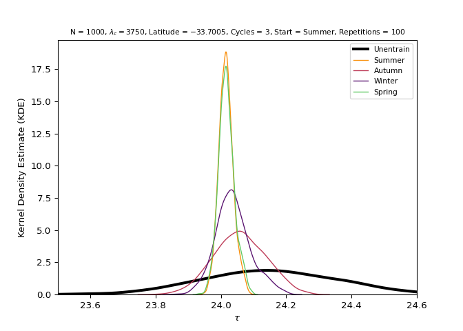

<!-- README.md is generated from README.Rmd. Please edit that file -->

# entrainment

<!-- badges: start -->

[](https://www.repostatus.org/#wip)
[](https://entrainment.readthedocs.io/en/latest/?badge=latest)
[](https://choosealicense.com/licenses/mit/)
[](https://www.contributor-covenant.org/version/2/1/code_of_conduct/)
<!-- badges: end -->

<!-- TODO: Add Code Coverage, Build check, fair-software.eu, and CII Best Practices -->

## Overview

`entrainment` is a rule-based model created on Python to test and to
demonstrate the 24h light/dark cycle [entrainment
phenomenon](https://en.wikipedia.org/wiki/Entrainment_(chronobiology)).

## Prerequisites

You need to have some familiarity with the [Python programming
language](https://www.python.org/) to use `entrainment` main functions.

In case you don’t feel comfortable with Python, we strongly recommend
checking Jake VanderPlas free and online book [Python Data Science
Handbook](https://jakevdp.github.io/PythonDataScienceHandbook/) and the
Coursera course from Google [Crash Course on
Python](https://www.coursera.org/learn/python-crash-course) (free for
audit students).

## Installation

You can install `entrainment` from GitHub with:

``` bash
pip install git+https://github.com/danielvartan/entrainment.git#egg=entrainment
```

We don’t intend to publish this package to [PyPI](https://pypi.org/).

## Usage

`entrainment` comes with 5 subpackages:

- `model`: The entrainment model.
- `labren`: Tools for accessing [LABREN’s global horizontal solar
  irradiation model](http://labren.ccst.inpe.br/atlas_2017.html).
- `hypothesis`: Tools for hypothesis testing.
- `demo`: Tools to plot the entrainment dynamics.
- `utils`: Utility tools.

You can learn more about each subpackage and its functions on the
[package documentation website](https://entrainment.readthedocs.io).

The following example illustrates how to run the model.

Please note that in this example all of the model arguments are
assigned. You don’t need to assign values to all arguments, you can just
use the default values. Check `run_model()` documentation to learn more.

``` python
import entrainment.model as model

turtles = model.run_model(
    n = 10**3, # Number of turtles/subjects to create
    tau_range = (23.5, 24.6), # Limits for assigning Tau values
    tau_mean = 24.15, # Mean value for the Tau distribution
    tau_sd = 0.2, # Standard deviation value for the Tau distribution
    k_range = (0.001, 0.01), # Limits for assigning the k values
    k_mean = 0.001, # Mean value for the k distribution
    k_sd = 0.005, # Standard deviation value for the k distribution
    lam_c = 4727.833, # Critical lambda value
    lam_c_tol = 1000, # Critical lambda tolerance
    labren_id = 1, # LABREN id of the global horizontal irradiation means
    by = "season", # Series resolution (choices: "month", "season", "year")
    n_cycles = 2, # Number of cycles to run
    start_at = 0, # Index number indicating the start of the series
    repetitions = 100, # Number of repetitions
    plot = True # Boolean value indicating if the function must plot the results
    )
```



## Citation

If you use `entrainment` in your research, please consider citing it. We
put a lot of work to build and maintain a free and open-source Python
package. You can find the `entrainment` citation below.

    Vartanian, D. (2023). {entrainment}: A rule-based model of the 24h light/dark cycle entrainment phenomenon. (v. 0.0.0.9000). https://github.com/danielvartan/entrainment

A BibTeX entry for LaTeX users is

    @Unpublished{,
        title = {{entrainment}: A rule-based model of the 24h light/dark cycle entrainment phenomenon},
        author = {Daniel Vartanian},
        year = {2023},
        url = {https://github.com/danielvartan/entrainment},
        note = {(v. 0.0.0.9000). Lifecycle: experimental},
    }

## Contributing

We welcome contributions, including bug reports.

Take a moment to review our [Guidelines for
Contributing](https://entrainment.readthedocs.io/en/latest/contributing.html).

## Acknowledgments

The initial development of `entrainment` was supported by a scholarship
provided by the [University of Sao Paulo (USP)](http://usp.br/) (❤️).

This model was initially created for the [SCX5002 - Complex System
I](https://uspdigital.usp.br/janus/Disciplina?tipo=D&sgldis=SCX5002&nomdis=&origem=C)
class of the [Graduate Program in Modeling Complex Systems
(PPG-SCX)](https://www.prpg.usp.br/pt-br/faca-pos-na-usp/programas-de-pos-graduacao/621-modelagem-de-sistemas-complexos)
of the [University of Sao Paulo (USP)](https://www5.usp.br/), under the
guidance of [Prof. Dr. Camilo Rodrigues
Neto](https://orcid.org/0000-0001-6783-6695).
