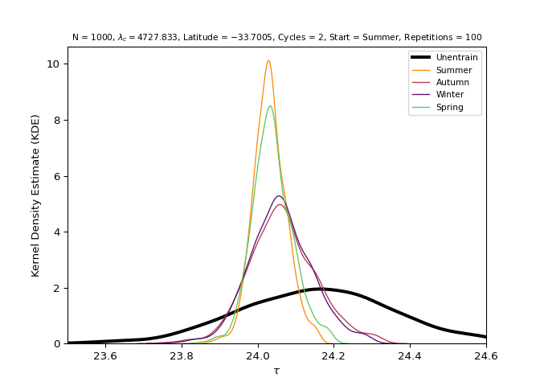

<!-- README.md is generated from README.Rmd. Please edit that file -->

# entrainment

<!-- badges: start -->

[](https://www.repostatus.org/#wip)
[](https://lifecycle.r-lib.org/articles/stages.html#experimental)
[](https://choosealicense.com/licenses/mit/)
[](https://www.contributor-covenant.org/version/2/1/code_of_conduct/)
<!-- badges: end -->

## Overview

`entrainment` is a rule-based model created on Python to test and to
demonstrate the 24h light/dark cycle [entrainment
phenomenon](https://en.wikipedia.org/wiki/Entrainment_(chronobiology)).

## Prerequisites

You need to have some familiarity with the [Python programming
language](https://www.python.org/) to use `entrainment` main functions.

In case you don’t feel comfortable with Python, we strongly recommend
checking Jake VanderPlas free and online book [Python Data Science
Handbook](https://jakevdp.github.io/PythonDataScienceHandbook/) and the
Coursera course from Google [Crash Course on
Python](https://www.coursera.org/learn/python-crash-course) (free for
audit students).

## Installation

You can install `entrainment` from GitHub with:

``` eval
py -m pip install -e git+https://github.com/danielvartan/entrainment.git
```

We don’t intend to publish this package to [PyPI](https://pypi.org/).

## Usage

The `entrainment` package comes with 5 subpackages:

- `demo`: A subpackage to plot the entrainment dynamics.
- `hypothesis`: A subpackage with tools for hypothesis testing.
- `labren`: A subpackage to access LABREN’s global horizontal solar
  irradiation model.
- `model`: A subpackage with the entrainment model.
- `utils`: A subpackage with some utility tools.

<!-- You can learn more about each subpackage and its functions on the package documentation website. -->

The following example illustrates how to run the model.

Please note in this example all of the model arguments are assigned. You
don’t need to assign values to all arguments, you can just use the
default values. Check `run()` documentation to learn more.

``` python
import entrainment.model as model

model.run(
    n = 10 ** 3, # Number of turtles/subjects to create
    tau_range = (23.5, 24.6), # Limits for assigning Tau values
    tau_mean = 24.15, # Mean value for the Tau distribution
    tau_sd = 0.2, # Standard deviation value for the Tau distribution
    k_range = (0.001, 0.01), # Limits for assigning the k values
    k_mean = 0.001, # Mean value for the k distribution
    k_sd = 0.005, # Standard deviation value for the k distribution
    lam_c = 4727.833, # Critical lambda value
    lam_c_tol = 1000, # Critical lambda tolerance
    labren_id = 1, # LABREN id of the global horizontal irradiation means
    by = "season", # Series resolution (choices: "month", "season")
    n_cycles = 2, # Number of cycles to run
    start_at = 0, # Index number indicating the start of the series
    repetitions = 100, # Number of repetitions
    plot = True # Boolean value indicating if the function must plot the results
    )
#> {'unentrain': [{'tau': 23.855864533047043, 'k': 0.0010000000000000007}, {'tau': 24.158311828631618, 'k': 0.0010000000000000007}, {'tau': 24.192301154584438, 'k': 0.0010000000000000007}, {'tau': 24.01554447964797, 'k': 0.010000000000000007}, {'tau': 23.92907455882779, 'k': 0.0010000000000000007}, {'tau': 24.022852704762546, 'k': 0.0010000000000000007}, {'tau': 24.52015841078675, 'k': 0.010000000000000007}, {'tau': 23.748328822740703, 'k': 0.006043593044768047}, {'tau': 23.962457497921307, 'k': 0.0010000000000000007}, {'tau': 24.240523418919516, 'k': 0.0044851890023425165}, {'tau': 23.950198872218333, 'k': 0.008975762712780557}, {'tau': 24.366527231345067, 'k': 0.0016670786577219286}, {'tau': 23.941361331120067, 'k': 0.007601532839059519}, {'tau': 24.44878797981422, 'k': 0.0010000000000000007}, {'tau': 24.424313859746196, 'k': 0.001807138518267082}, {'tau': 23.731520386786947, 'k': 0.0010000000000000007}, {'tau': 24.28276747183782, 'k': 0.005267842531693555}, {'tau': 24.333407231547437, 'k': 0.008611201300811173}, {'tau': 24.444900439576216, 'k': 0.0023968910061869246}, {'tau': 24.223691117854333, 'k': 0.006524399484405276}, {'tau': 24.194056624693516, 'k': 0.0010000000000000007}, {'tau': 24.34095192939245, 'k': 0.0010000000000000007}, {'tau': 24.27018729780635, 'k': 0.0010000000000000007}, {'tau': 24.228126633987404, 'k': 0.0036543959480068726}, {'tau': 24.43854883218593, 'k': 0.0022708507148857192}, {'tau': 24.076241073848266, 'k': 0.006178851166107834}, {'tau': 24.23573078908275, 'k': 0.006856659495912965}, {'tau': 23.938283302099126, 'k': 0.003229605107954875}, {'tau': 23.572360671832524, 'k': 0.0010000000000000007}, {'tau': 24.063949606149617, 'k': 0.009092784004069963}, {'tau': 24.332675993710787, 'k': 0.0010000000000000007}, {'tau': 24.187549199462264, 'k': 0.005077415355638757}, {'tau': 24.489567036720015, 'k': 0.0010000000000000007}, {'tau': 23.895341532287784, 'k': 0.0016494861526736035}, {'tau': 24.209844368433146, 'k': 0.010000000000000007}, {'tau': 24.47495399504674, 'k': 0.0010000000000000007}, {'tau': 24.245286351789066, 'k': 0.0068624900394768495}, {'tau': 24.035567853518238, 'k': 0.0010000000000000007}, {'tau': 24.164293159242792, 'k': 0.0010000000000000007}, {'tau': 24.096563635023312, 'k': 0.0010000000000000007}, {'tau': 23.885166763647096, 'k': 0.0010000000000000007}, {'tau': 24.22832344665431, 'k': 0.0010000000000000007}, {'tau': 24.147175535314236, 'k': 0.0010000000000000007}, {'tau': 24.17015170842782, 'k': 0.0010000000000000007}, {'tau': 24.069905113391847, 'k': 0.0010000000000000007}, {'tau': 23.915017936183585, 'k': 0.003446487179981568}, {'tau': 23.995112174712585, 'k': 0.0030558511900978416}, {'tau': 24.319537835772554, 'k': 0.006018784264898733}, {'tau': 23.995284957556574, 'k': 0.0016528627561545233}, {'tau': 24.398630664167925, 'k': 0.0010000000000000007}, {'tau': 24.2889409762026, 'k': 0.0010000000000000007}, {'tau': 24.357748497299323, 'k': 0.0010000000000000007}, {'tau': 24.141294240089383, 'k': 0.0010000000000000007}, {'tau': 24.011230201761023, 'k': 0.0010000000000000007}, {'tau': 23.827750042325523, 'k': 0.0010000000000000007}, {'tau': 24.296034369266586, 'k': 0.0010000000000000007}, {'tau': 24.310846043635184, 'k': 0.0010000000000000007}, {'tau': 24.077124791754155, 'k': 0.0010000000000000007}, {'tau': 24.092672739829176, 'k': 0.0010000000000000007}, {'tau': 24.001295474514347, 'k': 0.0010000000000000007}, {'tau': 24.147431101144047, 'k': 0.0010000000000000007}, {'tau': 24.156032809613404, 'k': 0.0022312695192021536}, {'tau': 24.4218574632243, 'k': 0.0010000000000000007}, {'tau': 23.97817136851155, 'k': 0.0014084682770592765}, {'tau': 24.092617090416027, 'k': 0.0010000000000000007}, {'tau': 23.93798903523493, 'k': 0.006673590239097517}, {'tau': 24.04253198765806, 'k': 0.0035802451556502675}, {'tau': 24.2334632966472, 'k': 0.0010000000000000007}, {'tau': 24.45249989711515, 'k': 0.0010000000000000007}, {'tau': 24.375690082567402, 'k': 0.0010000000000000007}, {'tau': 24.084865711340925, 'k': 0.0010000000000000007}, {'tau': 24.474417375412944, 'k': 0.0010000000000000007}, {'tau': 24.07314470352181, 'k': 0.0010000000000000007}, {'tau': 24.1907820309029, 'k': 0.0010000000000000007}, {'tau': 24.492547574787896, 'k': 0.00104102160032549}, {'tau': 24.47198503227493, 'k': 0.005872245706990013}, {'tau': 23.929697782502004, 'k': 0.004805639603229759}, {'tau': 24.24245595749672, 'k': 0.0010000000000000007}, {'tau': 24.110456422552524, 'k': 0.0010000000000000007}, {'tau': 24.196157004247162, 'k': 0.0039008707762689956}, {'tau': 24.21049658590091, 'k': 0.0010000000000000007}, {'tau': 24.18420328045826, 'k': 0.0010000000000000007}, {'tau': 24.225393328277697, 'k': 0.0010000000000000007}, {'tau': 24.123034994683803, 'k': 0.007342302037223633}, {'tau': 23.947797951800418, 'k': 0.008100766355350031}, {'tau': 23.992795476362076, 'k': 0.0010000000000000007}, {'tau': 23.880183033536927, 'k': 0.006776906553039348}, {'tau': 24.146352892436436, 'k': 0.0010000000000000007}, {'tau': 24.25736934329147, 'k': 0.006006171030659738}, {'tau': 24.085392273068734, 'k': 0.004524753832435336}, {'tau': 24.218698103184575, 'k': 0.003968255022776517}, {'tau': 24.411444567605216, 'k': 0.0010000000000000007}, {'tau': 23.917239200883195, 'k': 0.0010000000000000007}, {'tau': 24.07409903700288, 'k': 0.009122605188297416}, {'tau': 24.106821677500466, 'k': 0.0010000000000000007}, {'tau': 23.98574121430151, 'k': 0.004362096020829654}, {'tau': 23.900617928731965, 'k': 0.0010000000000000007}, {'tau': 24.35202392456768, 'k': 0.006580361586588256}, {'tau': 24.17195456256741, 'k': 0.005690309179376521}, {'tau': 24.452499349389385, 'k': 0.0010000000000000007}, {'tau': 24.435895331401444, 'k': 0.0031009203357006466}, {'tau': 24.306271265759747, 'k': 0.003480729570483435}, {'tau': 24.274295715517418, 'k': 0.0010000000000000007}, {'tau': 24.08277525309252, 'k': 0.0010000000000000007}, {'tau': 24.409268153560063, 'k': 0.009402603639731326}, {'tau': 23.852563218472355, 'k': 0.0010000000000000007}, {'tau': 23.802143489063685, 'k': 0.0010000000000000007}, {'tau': 24.093190286162557, 'k': 0.0010000000000000007}, {'tau': 24.112810754514882, 'k': 0.0034614162355135524}, {'tau': 24.19228790984794, 'k': 0.0025756813065025167}, {'tau': 24.35272401260046, 'k': 0.0020553267274206737}, {'tau': 24.521646067104303, 'k': 0.0010000000000000007}, {'tau': 23.899922652460795, 'k': 0.0010000000000000007}, {'tau': 24.0962252430415, 'k': 0.0010000000000000007}, {'tau': 23.952165190233654, 'k': 0.0010000000000000007}, {'tau': 24.268354746141814, 'k': 0.0010000000000000007}, {'tau': 23.811866591430785, 'k': 0.00693705196086133}, {'tau': 23.964597127286183, 'k': 0.006188455841178697}, {'tau': 24.232856444591288, 'k': 0.0010000000000000007}, {'tau': 24.150555995241266, 'k': 0.0010000000000000007}, {'tau': 24.203323631596813, 'k': 0.0010000000000000007}, {'tau': 23.60713297775193, 'k': 0.0010000000000000007}, {'tau': 24.352485080467478, 'k': 0.0010000000000000007}, {'tau': 24.00401951997158, 'k': 0.0010000000000000007}, {'tau': 24.09505037024037, 'k': 0.003859937976828612}, {'tau': 23.925105836009166, 'k': 0.0010000000000000007}, {'tau': 24.52264726913604, 'k': 0.004299745124972497}, {'tau': 24.427639404426422, 'k': 0.0021052113903485808}, {'tau': 23.88115110099474, 'k': 0.0010000000000000007}, {'tau': 24.33486392599498, 'k': 0.0010000000000000007}, {'tau': 24.599999999999955, 'k': 0.0010000000000000007}, {'tau': 24.401959829871924, 'k': 0.007428278041663091}, {'tau': 24.2783407244929, 'k': 0.0010000000000000007}, {'tau': 24.241271284957342, 'k': 0.0010000000000000007}, {'tau': 24.05122891438855, 'k': 0.004430315771692908}, {'tau': 24.18983201255269, 'k': 0.0010000000000000007}, {'tau': 23.98304194973161, 'k': 0.005626430251498905}, {'tau': 24.281922234613422, 'k': 0.0054586735123855305}, {'tau': 24.282035255072934, 'k': 0.003985240827001913}, {'tau': 24.344809947807775, 'k': 0.0010000000000000007}, {'tau': 24.01061156245441, 'k': 0.0010000000000000007}, {'tau': 23.69030944577393, 'k': 0.006111958639347948}, {'tau': 24.26409414070046, 'k': 0.003110974903907881}, {'tau': 24.05766413264219, 'k': 0.0010000000000000007}, {'tau': 24.277814870011152, 'k': 0.0010000000000000007}, {'tau': 24.35760661343784, 'k': 0.0010000000000000007}, {'tau': 24.285947729647937, 'k': 0.0037073428490406184}, {'tau': 24.25303191999093, 'k': 0.0010000000000000007}, {'tau': 23.933992341362533, 'k': 0.001010540108392136}, {'tau': 24.410159506555782, 'k': 0.0010000000000000007}, {'tau': 24.563162194196444, 'k': 0.00823578592764188}, {'tau': 24.09365670860989, 'k': 0.0013822232055750202}, {'tau': 23.76375458060344, 'k': 0.0010000000000000007}, {'tau': 24.28206027766328, 'k': 0.003171243804193907}, {'tau': 23.835725004455377, 'k': 0.004227838796482194}, {'tau': 24.2159734390843, 'k': 0.0010000000000000007}, {'tau': 24.246231504386238, 'k': 0.0013911424107531658}, {'tau': 23.927036840966746, 'k': 0.0010000000000000007}, {'tau': 24.32004826643874, 'k': 0.0010000000000000007}, {'tau': 24.002582089725056, 'k': 0.0010000000000000007}, {'tau': 24.136865748140433, 'k': 0.0010000000000000007}, {'tau': 24.335458816312165, 'k': 0.0014446791759217545}, {'tau': 24.39662274247648, 'k': 0.005983199959784766}, {'tau': 24.018248838265194, 'k': 0.007174323015903675}, {'tau': 24.342088959673944, 'k': 0.005728222840522549}, {'tau': 23.94511835880072, 'k': 0.005897510487157812}, {'tau': 23.877168903685593, 'k': 0.0010000000000000007}, {'tau': 24.096672495828624, 'k': 0.0010000000000000007}, {'tau': 24.39695097414751, 'k': 0.0010000000000000007}, {'tau': 24.265529210283294, 'k': 0.00411575413249375}, {'tau': 24.168623127155126, 'k': 0.0017224741368846417}, {'tau': 24.313930805640968, 'k': 0.0036118404957211033}, {'tau': 24.192676825699163, 'k': 0.0010000000000000007}, {'tau': 24.253050391948815, 'k': 0.005095319160130781}, {'tau': 24.599999999999955, 'k': 0.0021254413330525908}, {'tau': 24.013821857894513, 'k': 0.00477390080846113}, {'tau': 23.972679417040137, 'k': 0.00565576034960751}, {'tau': 24.210957371821948, 'k': 0.009068116905921804}, {'tau': 24.32455545438141, 'k': 0.0013207585297069883}, {'tau': 24.07947739450997, 'k': 0.0010000000000000007}, {'tau': 24.06137356896234, 'k': 0.0010000000000000007}, {'tau': 24.418207987896306, 'k': 0.003963346049855192}, {'tau': 24.487564769089218, 'k': 0.0010000000000000007}, {'tau': 24.14672458519014, 'k': 0.0026019071292875656}, {'tau': 24.05966472264799, 'k': 0.0010000000000000007}, {'tau': 24.21372487198433, 'k': 0.0068761082923199535}, {'tau': 24.03389087831234, 'k': 0.0022597441782331103}, {'tau': 24.446140131101416, 'k': 0.003170289113165582}, {'tau': 23.859341405020775, 'k': 0.0010000000000000007}, {'tau': 24.057122694573263, 'k': 0.0010000000000000007}, {'tau': 24.344638773952557, 'k': 0.0010000000000000007}, {'tau': 24.349608724785863, 'k': 0.0010000000000000007}, {'tau': 24.255047157570782, 'k': 0.0010000000000000007}, {'tau': 24.350472003684914, 'k': 0.0037372936521301585}, {'tau': 23.759302532300964, 'k': 0.002369491600975389}, {'tau': 24.592363568160028, 'k': 0.0010000000000000007}, {'tau': 24.034016683475794, 'k': 0.004340429294228386}, {'tau': 24.033574368065683, 'k': 0.010000000000000007}, {'tau': 24.57615405519454, 'k': 0.003523537717530885}, {'tau': 23.959245772152872, 'k': 0.00688566521785661}, {'tau': 24.055677588355405, 'k': 0.0010000000000000007}, {'tau': 24.22042281876675, 'k': 0.0010000000000000007}, {'tau': 24.4829903722769, 'k': 0.0010000000000000007}, {'tau': 24.287012607727174, 'k': 0.00640817576874697}, {'tau': 24.196757638999625, 'k': 0.0010000000000000007}, {'tau': 24.354040129775072, 'k': 0.0010000000000000007}, {'tau': 24.235918610850607, 'k': 0.0010000000000000007}, {'tau': 24.22463256431774, 'k': 0.005336470005631694}, {'tau': 24.181420747159805, 'k': 0.010000000000000007}, {'tau': 24.074936322089144, 'k': 0.0036248716283716078}, {'tau': 24.18559518416755, 'k': 0.004776756298746298}, {'tau': 24.32823605854492, 'k': 0.010000000000000007}, {'tau': 24.114127517859693, 'k': 0.0010000000000000007}, {'tau': 24.392143354212703, 'k': 0.0010000000000000007}, {'tau': 24.173683500719513, 'k': 0.0010000000000000007}, {'tau': 24.192803079364236, 'k': 0.0010000000000000007}, {'tau': 24.33477943540442, 'k': 0.0010000000000000007}, {'tau': 23.75880503406183, 'k': 0.0010000000000000007}, {'tau': 24.403753553005757, 'k': 0.0010000000000000007}, {'tau': 24.17553513842009, 'k': 0.005246047504582531}, {'tau': 24.399972274034567, 'k': 0.0010000000000000007}, {'tau': 23.963428721522643, 'k': 0.0023281119454923176}, {'tau': 24.289568063363458, 'k': 0.0010000000000000007}, {'tau': 23.997038079204952, 'k': 0.0010000000000000007}, {'tau': 23.96117505044894, 'k': 0.007639889941763453}, {'tau': 24.25123372158854, 'k': 0.0063791490416473815}, {'tau': 24.33331872196658, 'k': 0.0073074483141904924}, {'tau': 23.99942843029275, 'k': 0.0010000000000000007}, {'tau': 23.82638316904453, 'k': 0.0010000000000000007}, {'tau': 24.41990053807108, 'k': 0.0010000000000000007}, {'tau': 23.892530725089006, 'k': 0.003591607935760063}, {'tau': 23.967059154018177, 'k': 0.0010000000000000007}, {'tau': 24.371131206139175, 'k': 0.0010000000000000007}, {'tau': 23.89683154877851, 'k': 0.002065153108782774}, {'tau': 23.637846796857, 'k': 0.0010000000000000007}, {'tau': 24.29510463648698, 'k': 0.0010000000000000007}, {'tau': 24.252800763412782, 'k': 0.0010000000000000007}, {'tau': 24.268073659139038, 'k': 0.0010000000000000007}, {'tau': 24.166101306318243, 'k': 0.0010000000000000007}, {'tau': 24.290652166705783, 'k': 0.0050272506713662755}, {'tau': 24.24350811249409, 'k': 0.00411783251499319}, {'tau': 24.17445653798435, 'k': 0.0022940338018234436}, {'tau': 24.41058993650282, 'k': 0.008136808514736528}, {'tau': 24.173372830686464, 'k': 0.0010000000000000007}, {'tau': 24.172989943952604, 'k': 0.0010000000000000007}, {'tau': 24.029322955579424, 'k': 0.001442146294025808}, {'tau': 24.52012567402703, 'k': 0.0010000000000000007}, {'tau': 24.134457113511683, 'k': 0.0010000000000000007}, {'tau': 24.221347063444227, 'k': 0.004724158385040267}, {'tau': 24.306458966079386, 'k': 0.007420467641207703}, {'tau': 24.34533360617429, 'k': 0.004270150207816626}, {'tau': 23.828614275193573, 'k': 0.00402545137513945}, {'tau': 23.827384101831587, 'k': 0.004035447409171262}, {'tau': 23.876524983741735, 'k': 0.0010000000000000007}, {'tau': 24.19615144814811, 'k': 0.005464238668833054}, {'tau': 24.074531915618522, 'k': 0.010000000000000007}, {'tau': 24.090386976497044, 'k': 0.0010000000000000007}, {'tau': 23.909957517153558, 'k': 0.0019205098306131693}, {'tau': 23.9850030799815, 'k': 0.0010000000000000007}, {'tau': 24.14500993857079, 'k': 0.004845152598381811}, {'tau': 24.28470929574151, 'k': 0.0010000000000000007}, {'tau': 24.28299989484957, 'k': 0.0010000000000000007}, {'tau': 23.62706039590466, 'k': 0.005986258216104209}, {'tau': 23.960489055248942, 'k': 0.001650732309257005}, {'tau': 24.253213417449988, 'k': 0.0010000000000000007}, {'tau': 24.19597373986444, 'k': 0.0010000000000000007}, {'tau': 24.13019726575673, 'k': 0.0010000000000000007}, {'tau': 24.308750402060937, 'k': 0.0010000000000000007}, {'tau': 24.23060130362622, 'k': 0.0010000000000000007}, {'tau': 24.10927113055873, 'k': 0.0010000000000000007}, {'tau': 23.82485398867193, 'k': 0.00511970564391595}, {'tau': 23.98898735443168, 'k': 0.0010000000000000007}, {'tau': 24.290327835540165, 'k': 0.0010000000000000007}, {'tau': 24.129618383770318, 'k': 0.009839045110055261}, {'tau': 24.146147175721392, 'k': 0.004314464624350923}, {'tau': 23.71384215689068, 'k': 0.005808275250881447}, {'tau': 24.34843386488107, 'k': 0.0010000000000000007}, {'tau': 24.01641807282572, 'k': 0.0030524441396389563}, {'tau': 23.651679815966265, 'k': 0.0010000000000000007}, {'tau': 23.65342966132023, 'k': 0.010000000000000007}, {'tau': 24.361221811927848, 'k': 0.007004907462824643}, {'tau': 24.330823276390408, 'k': 0.0010000000000000007}, {'tau': 24.179077051696353, 'k': 0.0010000000000000007}, {'tau': 24.0424880355575, 'k': 0.00408197643632112}, {'tau': 24.508973051287736, 'k': 0.0023963113922749802}, {'tau': 23.780300633390606, 'k': 0.005068308979528855}, {'tau': 24.068978344644616, 'k': 0.004708554036568387}, {'tau': 24.060726137688558, 'k': 0.0010000000000000007}, {'tau': 24.125069685953335, 'k': 0.0010000000000000007}, {'tau': 24.2593054927717, 'k': 0.0010000000000000007}, {'tau': 24.2590151724653, 'k': 0.008758726664887109}, {'tau': 24.507183520833692, 'k': 0.005195334649315714}, {'tau': 24.070787480138012, 'k': 0.0010000000000000007}, {'tau': 23.979078568034762, 'k': 0.001990098193141062}, {'tau': 24.39894666500122, 'k': 0.0010000000000000007}, {'tau': 24.138587755426684, 'k': 0.009306538497563271}, {'tau': 24.161742617607924, 'k': 0.0033623412008797495}, {'tau': 24.196562730610836, 'k': 0.0010000000000000007}, {'tau': 23.998732716782527, 'k': 0.0010000000000000007}, {'tau': 24.425729675238202, 'k': 0.0031348853422847674}, {'tau': 24.337800957495816, 'k': 0.009551206232574877}, {'tau': 23.748666384495053, 'k': 0.003458726057482784}, {'tau': 23.983919169784404, 'k': 0.0050152335986235344}, {'tau': 24.265987354725624, 'k': 0.0010000000000000007}, {'tau': 24.25895569197124, 'k': 0.0010000000000000007}, {'tau': 24.1352585073649, 'k': 0.0010000000000000007}, {'tau': 24.234028328327426, 'k': 0.006418994012046223}, {'tau': 24.04154633843594, 'k': 0.004234541720082434}, {'tau': 24.284363905928604, 'k': 0.00892620955935519}, {'tau': 24.19907579316173, 'k': 0.0010000000000000007}, {'tau': 24.307848541568998, 'k': 0.006331444180997591}, {'tau': 23.97733542356328, 'k': 0.0046455994592228935}, {'tau': 23.998777545521378, 'k': 0.0010000000000000007}, {'tau': 24.599999999999955, 'k': 0.0010000000000000007}, {'tau': 24.231863107432066, 'k': 0.008420117100759626}, {'tau': 24.13973338786369, 'k': 0.007454543784036768}, {'tau': 24.408420302207706, 'k': 0.0010000000000000007}, {'tau': 24.068127123243762, 'k': 0.0010000000000000007}, {'tau': 24.247602043661104, 'k': 0.003709197786677373}, {'tau': 24.05332545359916, 'k': 0.0010000000000000007}, {'tau': 24.055392008263386, 'k': 0.0041350812385281275}, {'tau': 24.337989842136576, 'k': 0.0010000000000000007}, {'tau': 24.274452752793373, 'k': 0.003064059912829708}, {'tau': 24.15871603096757, 'k': 0.004764264994651668}, {'tau': 23.80845242570043, 'k': 0.0010000000000000007}, {'tau': 23.79862941916572, 'k': 0.0010000000000000007}, {'tau': 24.416500305163655, 'k': 0.0010000000000000007}, {'tau': 23.90395336329719, 'k': 0.0010000000000000007}, {'tau': 24.27572684939987, 'k': 0.0010000000000000007}, {'tau': 24.080271943226002, 'k': 0.004653758470913082}, {'tau': 23.973102466866028, 'k': 0.0030381551244385756}, {'tau': 24.028733924619058, 'k': 0.0010000000000000007}, {'tau': 23.637867912313894, 'k': 0.0010000000000000007}, {'tau': 24.20944252132149, 'k': 0.0026272705963996867}, {'tau': 24.28335999340789, 'k': 0.0010000000000000007}, {'tau': 24.16513352384951, 'k': 0.0010000000000000007}, {'tau': 24.14156955591231, 'k': 0.0054447420104163985}, {'tau': 24.391675413469972, 'k': 0.0010000000000000007}, {'tau': 24.25578031268286, 'k': 0.0023283679242961926}, {'tau': 24.25263733296625, 'k': 0.0010000000000000007}, {'tau': 24.189711355792763, 'k': 0.0010000000000000007}, {'tau': 23.93080409939103, 'k': 0.0010000000000000007}, {'tau': 23.936067845520977, 'k': 0.005652567167799717}, {'tau': 23.90916564713738, 'k': 0.0010000000000000007}, {'tau': 24.24956560090656, 'k': 0.0010000000000000007}, {'tau': 24.166371230268698, 'k': 0.005363502054915052}, {'tau': 24.197049629037757, 'k': 0.0029408543596508062}, {'tau': 23.776190246936533, 'k': 0.0051843174110963305}, {'tau': 24.37873688330804, 'k': 0.010000000000000007}, {'tau': 24.229434046105634, 'k': 0.005506855414122041}, {'tau': 24.170887158158163, 'k': 0.0010000000000000007}, {'tau': 24.273355642355014, 'k': 0.0010000000000000007}, {'tau': 24.244830027735087, 'k': 0.0010000000000000007}, {'tau': 24.21126900222571, 'k': 0.010000000000000007}, {'tau': 24.203068686480457, 'k': 0.0010000000000000007}, {'tau': 24.107606178302834, 'k': 0.0010000000000000007}, {'tau': 24.039515233929432, 'k': 0.0010000000000000007}, {'tau': 24.032523409606725, 'k': 0.00810129317779873}, {'tau': 24.132444375864186, 'k': 0.0010000000000000007}, {'tau': 24.32572604004535, 'k': 0.0010000000000000007}, {'tau': 24.238704688066715, 'k': 0.010000000000000007}, {'tau': 23.85543920158697, 'k': 0.0010000000000000007}, {'tau': 24.32734296579765, 'k': 0.005906200182599233}, {'tau': 24.14931427468168, 'k': 0.003508045580295554}, {'tau': 24.053868058014363, 'k': 0.0010000000000000007}, {'tau': 24.05047255463705, 'k': 0.0010502311327507642}, {'tau': 24.3866108214297, 'k': 0.010000000000000007}, {'tau': 23.865180306461486, 'k': 0.0010000000000000007}, {'tau': 23.780233533945697, 'k': 0.0010000000000000007}, {'tau': 24.278401938681373, 'k': 0.0010000000000000007}, {'tau': 24.05592209998956, 'k': 0.0010000000000000007}, {'tau': 24.37793390086612, 'k': 0.0010000000000000007}, {'tau': 24.40649358392799, 'k': 0.0010000000000000007}, {'tau': 23.973714227951554, 'k': 0.0010000000000000007}, {'tau': 24.51404260221744, 'k': 0.006388048547249137}, {'tau': 24.03523777935517, 'k': 0.0010000000000000007}, {'tau': 24.118680927734477, 'k': 0.006465873399268406}, {'tau': 23.881621692361072, 'k': 0.0010000000000000007}, {'tau': 24.197496027650246, 'k': 0.0016129608760016188}, {'tau': 24.10343164458781, 'k': 0.0010000000000000007}, {'tau': 24.10767130843063, 'k': 0.0026932269448549447}, {'tau': 23.950698187937228, 'k': 0.010000000000000007}, {'tau': 24.07234200692169, 'k': 0.0024453610582131375}, {'tau': 23.991697246996566, 'k': 0.0020249017312560704}, {'tau': 24.176458773160302, 'k': 0.0010000000000000007}, {'tau': 24.11189683870042, 'k': 0.0010000000000000007}, {'tau': 24.27960564252317, 'k': 0.0010000000000000007}, {'tau': 24.251004839822752, 'k': 0.0010000000000000007}, {'tau': 23.99729139193975, 'k': 0.003221584187588551}, {'tau': 24.27946454185207, 'k': 0.0010000000000000007}, {'tau': 24.229742816254653, 'k': 0.007080836031357903}, {'tau': 24.170838436944496, 'k': 0.0010232852016260894}, {'tau': 23.724280583278713, 'k': 0.0010735432378669038}, {'tau': 24.10756766785921, 'k': 0.004239131698151838}, {'tau': 23.9301262928678, 'k': 0.0010000000000000007}, {'tau': 24.114019838750398, 'k': 0.0010000000000000007}, {'tau': 23.991106164856788, 'k': 0.002762747047121867}, {'tau': 23.89130517910796, 'k': 0.0010000000000000007}, {'tau': 24.22665966415429, 'k': 0.009217103947553491}, {'tau': 23.90160231231285, 'k': 0.007377070039893332}, {'tau': 24.062295353963425, 'k': 0.0010000000000000007}, {'tau': 24.01771297602863, 'k': 0.0010000000000000007}, {'tau': 24.336480072723287, 'k': 0.0010000000000000007}, {'tau': 24.485981527667267, 'k': 0.0010000000000000007}, {'tau': 24.322082806407405, 'k': 0.0010000000000000007}, {'tau': 24.09232048154475, 'k': 0.0010000000000000007}, {'tau': 24.138439596731573, 'k': 0.0010000000000000007}, {'tau': 24.160252136079905, 'k': 0.0012782924812354821}, {'tau': 24.284988968502905, 'k': 0.0010000000000000007}, {'tau': 23.713373442682947, 'k': 0.0033724241841122057}, {'tau': 24.095464107440865, 'k': 0.0010000000000000007}, {'tau': 24.234829692639593, 'k': 0.00271314346060914}, {'tau': 23.817953131913935, 'k': 0.00961016584969688}, {'tau': 24.157022813394182, 'k': 0.0010000000000000007}, {'tau': 24.05066123338278, 'k': 0.0010000000000000007}, {'tau': 23.77608022978275, 'k': 0.0028712733710819136}, {'tau': 24.348954356674124, 'k': 0.0010000000000000007}, {'tau': 24.019372149653044, 'k': 0.0010000000000000007}, {'tau': 24.178177822205285, 'k': 0.008856630847535183}, {'tau': 24.08205020425385, 'k': 0.0010000000000000007}, {'tau': 24.029036194807713, 'k': 0.005649739118903023}, {'tau': 24.272146551612426, 'k': 0.0010000000000000007}, {'tau': 23.955535887874703, 'k': 0.0033551089591871345}, {'tau': 24.331125035805133, 'k': 0.0010000000000000007}, {'tau': 23.857787453344407, 'k': 0.0010000000000000007}, {'tau': 24.205743987559043, 'k': 0.0010000000000000007}, {'tau': 24.059272322891346, 'k': 0.0010000000000000007}, {'tau': 24.090555944075312, 'k': 0.009099076724135464}, {'tau': 24.027827725778444, 'k': 0.0010000000000000007}, {'tau': 23.972522763139562, 'k': 0.0010000000000000007}, {'tau': 24.508239966340316, 'k': 0.0010000000000000007}, {'tau': 24.18299446322799, 'k': 0.0073914272055808005}, {'tau': 24.23869704626517, 'k': 0.006772954421993548}, {'tau': 24.393272181159958, 'k': 0.0010000000000000007}, {'tau': 24.317030281051753, 'k': 0.0010000000000000007}, {'tau': 23.909300056866822, 'k': 0.0010000000000000007}, {'tau': 24.024581153676976, 'k': 0.0036896307429603414}, {'tau': 24.246722554989905, 'k': 0.003355283792954446}, {'tau': 23.94943651070845, 'k': 0.0037636487139870458}, {'tau': 23.98931414170288, 'k': 0.010000000000000007}, {'tau': 24.14338207842824, 'k': 0.006823523365515513}, {'tau': 23.88104003131021, 'k': 0.0010000000000000007}, {'tau': 23.92242301150281, 'k': 0.0010000000000000007}, {'tau': 24.05378951366701, 'k': 0.0010000000000000007}, {'tau': 24.4462503132052, 'k': 0.0010000000000000007}, {'tau': 24.221484158905255, 'k': 0.0010000000000000007}, {'tau': 24.061273798971154, 'k': 0.008921521439474674}, {'tau': 23.89040501069398, 'k': 0.0010000000000000007}, {'tau': 24.143675938298014, 'k': 0.005658041312786976}, {'tau': 24.159414477911323, 'k': 0.0010000000000000007}, {'tau': 24.18498166576892, 'k': 0.0010000000000000007}, {'tau': 24.206465333169085, 'k': 0.010000000000000007}, {'tau': 23.9952265887794, 'k': 0.0010000000000000007}, {'tau': 23.992852342062335, 'k': 0.0010000000000000007}, {'tau': 24.272528155521247, 'k': 0.0010000000000000007}, {'tau': 24.54129775316502, 'k': 0.0010000000000000007}, {'tau': 24.19376452342082, 'k': 0.0010000000000000007}, {'tau': 24.195507127512478, 'k': 0.0010000000000000007}, {'tau': 24.064353167630387, 'k': 0.0010000000000000007}, {'tau': 24.190734943906122, 'k': 0.010000000000000007}, {'tau': 24.025015034834773, 'k': 0.0010000000000000007}, {'tau': 24.14388742052274, 'k': 0.00901571925561085}, {'tau': 24.15259252566643, 'k': 0.0027663163139521824}, {'tau': 24.092184226934172, 'k': 0.0010000000000000007}, {'tau': 24.129662372484926, 'k': 0.006909345263606053}, {'tau': 24.022953151175944, 'k': 0.0010000000000000007}, {'tau': 24.092307012662175, 'k': 0.0010000000000000007}, {'tau': 24.12993179908184, 'k': 0.0013216997121393568}, {'tau': 24.174200015915616, 'k': 0.0041171210481117425}, {'tau': 24.166095373951926, 'k': 0.007868439441539811}, {'tau': 23.990007674976383, 'k': 0.0016731922903907301}, {'tau': 24.532786918385042, 'k': 0.0010000000000000007}, {'tau': 24.195944011873458, 'k': 0.0010000000000000007}, {'tau': 23.845700152187607, 'k': 0.0019044191711717433}, {'tau': 24.45795640630605, 'k': 0.0010000000000000007}, {'tau': 24.495477277815368, 'k': 0.004083248326087989}, {'tau': 24.073611531488986, 'k': 0.0010000000000000007}, {'tau': 24.126632340086875, 'k': 0.010000000000000007}, {'tau': 24.36381028286904, 'k': 0.004916607462309417}, {'tau': 24.195660221788746, 'k': 0.0010000000000000007}, {'tau': 24.19332424789882, 'k': 0.004724994977778562}, {'tau': 24.150769187561007, 'k': 0.004366135852619678}, {'tau': 24.496980764862347, 'k': 0.0010000000000000007}, {'tau': 24.189526860042402, 'k': 0.00267663649113423}, {'tau': 23.790520603746966, 'k': 0.0010000000000000007}, {'tau': 24.12544371262316, 'k': 0.0010000000000000007}, {'tau': 24.326399565245268, 'k': 0.001021698377818296}, {'tau': 24.370919362242102, 'k': 0.0010000000000000007}, {'tau': 23.943124141534504, 'k': 0.0010000000000000007}, {'tau': 23.975415488786172, 'k': 0.0010000000000000007}, {'tau': 23.851190923190916, 'k': 0.010000000000000007}, {'tau': 24.599999999999955, 'k': 0.0010000000000000007}, {'tau': 24.00240425588114, 'k': 0.00362407694440799}, {'tau': 24.25447150302715, 'k': 0.0055140037704585814}, {'tau': 23.96807157996459, 'k': 0.0010000000000000007}, {'tau': 24.45075188378436, 'k': 0.005817257188597307}, {'tau': 24.547549460370007, 'k': 0.004305217362019541}, {'tau': 24.09128305250685, 'k': 0.0010000000000000007}, {'tau': 24.074561002060666, 'k': 0.0010000000000000007}, {'tau': 24.351441304512992, 'k': 0.0010000000000000007}, {'tau': 24.204198707613468, 'k': 0.0010000000000000007}, {'tau': 24.11993108001429, 'k': 0.004114844393256544}, {'tau': 24.462219689132336, 'k': 0.0010000000000000007}, {'tau': 24.09093832751448, 'k': 0.0010000000000000007}, {'tau': 24.05482835677307, 'k': 0.0028981281314287236}, {'tau': 24.37438430719958, 'k': 0.004763737094506002}, {'tau': 24.425684424386564, 'k': 0.008100633602655305}, {'tau': 24.273077069437882, 'k': 0.001217727336533883}, {'tau': 23.966050163392048, 'k': 0.0010000000000000007}, {'tau': 24.29816932275886, 'k': 0.0010000000000000007}, {'tau': 24.291653853305924, 'k': 0.0010000000000000007}, {'tau': 23.914748218765013, 'k': 0.0010000000000000007}, {'tau': 24.27574270552562, 'k': 0.002879047659913499}, {'tau': 24.27662558464458, 'k': 0.0010000000000000007}, {'tau': 23.936495302468348, 'k': 0.0010000000000000007}, {'tau': 24.03088715703386, 'k': 0.00549093312393968}, {'tau': 24.021196725947174, 'k': 0.0010000000000000007}, {'tau': 24.355537425978547, 'k': 0.007276583782921172}, {'tau': 24.243913975529264, 'k': 0.004590852510250723}, {'tau': 24.130924004453693, 'k': 0.0010000000000000007}, {'tau': 24.230880874189406, 'k': 0.0010000000000000007}, {'tau': 23.83174975790708, 'k': 0.0010000000000000007}, {'tau': 24.087802388669537, 'k': 0.0010000000000000007}, {'tau': 24.083595419883896, 'k': 0.0010000000000000007}, {'tau': 24.219485334150743, 'k': 0.0060427632138671415}, {'tau': 24.110116908368767, 'k': 0.0010000000000000007}, {'tau': 23.848926337563924, 'k': 0.004041056428500987}, {'tau': 23.87855954888847, 'k': 0.004283140263799664}, {'tau': 24.56871159966264, 'k': 0.0010000000000000007}, {'tau': 23.840155729596788, 'k': 0.003651837016244792}, {'tau': 24.279619098802375, 'k': 0.010000000000000007}, {'tau': 24.04223889500027, 'k': 0.0010000000000000007}, {'tau': 24.185521027747956, 'k': 0.0010000000000000007}, {'tau': 24.157025964387635, 'k': 0.0010000000000000007}, {'tau': 24.078946988298906, 'k': 0.0010000000000000007}, {'tau': 24.23042839430882, 'k': 0.0010000000000000007}, {'tau': 24.086948686798713, 'k': 0.0010000000000000007}, {'tau': 24.217676039651405, 'k': 0.0010000000000000007}, {'tau': 24.196995010835497, 'k': 0.007643048327903965}, {'tau': 24.406921156434283, 'k': 0.0013870713633338434}, {'tau': 24.11151267120658, 'k': 0.0010000000000000007}, {'tau': 24.217771969176688, 'k': 0.0010000000000000007}, {'tau': 24.021730966811905, 'k': 0.0037668419563380282}, {'tau': 24.599999999999955, 'k': 0.0010000000000000007}, {'tau': 24.07813871649769, 'k': 0.0034220925688414464}, {'tau': 24.101768974135968, 'k': 0.0010000000000000007}, {'tau': 24.135661087223678, 'k': 0.005810800911544355}, {'tau': 24.27514562479923, 'k': 0.0010000000000000007}, {'tau': 24.043793621470552, 'k': 0.0022826546576780165}, {'tau': 24.543799881864008, 'k': 0.0066187340908358365}, {'tau': 24.01479525524933, 'k': 0.0010000000000000007}, {'tau': 24.49881670105289, 'k': 0.0010000000000000007}, {'tau': 24.05079063922809, 'k': 0.0023138981984773045}, {'tau': 24.050055857522874, 'k': 0.0010000000000000007}, {'tau': 23.945082183141313, 'k': 0.005585454738212305}, {'tau': 23.838193318885896, 'k': 0.0017535134619600082}, {'tau': 24.13559749293366, 'k': 0.0010000000000000007}, {'tau': 23.899450405025117, 'k': 0.0010000000000000007}, {'tau': 23.96818708884921, 'k': 0.0010000000000000007}, {'tau': 23.92432513387207, 'k': 0.0010000000000000007}, {'tau': 23.973282292542347, 'k': 0.0010000000000000007}, {'tau': 24.3641685025168, 'k': 0.010000000000000007}, {'tau': 24.2631761742884, 'k': 0.0010000000000000007}, {'tau': 23.93808923658394, 'k': 0.0010000000000000007}, {'tau': 24.21316675268626, 'k': 0.0010000000000000007}, {'tau': 24.048459008745613, 'k': 0.0010000000000000007}, {'tau': 24.271153005426626, 'k': 0.003938090853563243}, {'tau': 24.11632619470493, 'k': 0.0010000000000000007}, {'tau': 23.789655305250825, 'k': 0.002150597887167261}, {'tau': 24.11147075399168, 'k': 0.010000000000000007}, {'tau': 24.080193448014416, 'k': 0.005283526074651587}, {'tau': 24.223768965529835, 'k': 0.007766905377071706}, {'tau': 24.03056585245395, 'k': 0.0010000000000000007}, {'tau': 24.526525910327834, 'k': 0.0010000000000000007}, {'tau': 23.937465990064574, 'k': 0.010000000000000007}, {'tau': 23.96238398568794, 'k': 0.0010000000000000007}, {'tau': 24.385359187204532, 'k': 0.0010000000000000007}, {'tau': 24.436942385651946, 'k': 0.001375959323255155}, {'tau': 24.485146399591184, 'k': 0.003968655604717709}, {'tau': 24.122405171718885, 'k': 0.0012924466358746228}, {'tau': 24.45990282341354, 'k': 0.0010000000000000007}, {'tau': 23.9403890428357, 'k': 0.0010395749795931578}, {'tau': 24.164761101869757, 'k': 0.0010000000000000007}, {'tau': 24.137532902740716, 'k': 0.005121750490619179}, {'tau': 24.126597383380922, 'k': 0.004410021389680659}, {'tau': 24.29659984865093, 'k': 0.0010000000000000007}, {'tau': 23.85089568877903, 'k': 0.0010000000000000007}, {'tau': 24.47749828531714, 'k': 0.0017766330397178945}, {'tau': 24.293438548227368, 'k': 0.0010000000000000007}, {'tau': 24.05215489676566, 'k': 0.004217769774754674}, {'tau': 24.519702178952045, 'k': 0.0010000000000000007}, {'tau': 24.000795764230585, 'k': 0.006630716893313634}, {'tau': 24.24776795259486, 'k': 0.0010000000000000007}, {'tau': 23.643356240863074, 'k': 0.0013618269665646467}, {'tau': 24.073732178342386, 'k': 0.0010000000000000007}, {'tau': 24.23785444044553, 'k': 0.005484505931184374}, {'tau': 24.374188293760234, 'k': 0.0024285947737629145}, {'tau': 24.599999999999955, 'k': 0.006493873878991997}, {'tau': 24.096563019929544, 'k': 0.0021933135077704608}, {'tau': 24.277423787722416, 'k': 0.005440193483119308}, {'tau': 23.826406799160583, 'k': 0.005811640996769961}, {'tau': 24.264140233926046, 'k': 0.0010000000000000007}, {'tau': 24.27758578828585, 'k': 0.0010000000000000007}, {'tau': 23.813750276851366, 'k': 0.0010000000000000007}, {'tau': 24.28425949094738, 'k': 0.0010000000000000007}, {'tau': 23.81928166291645, 'k': 0.0010000000000000007}, {'tau': 23.85055047627944, 'k': 0.0010000000000000007}, {'tau': 23.878977482978225, 'k': 0.003987686317135642}, {'tau': 24.014087887574682, 'k': 0.0010000000000000007}, {'tau': 23.971618720736693, 'k': 0.0010000000000000007}, {'tau': 24.346390393637346, 'k': 0.010000000000000007}, {'tau': 23.904313383562528, 'k': 0.0010000000000000007}, {'tau': 24.008359227140048, 'k': 0.0010000000000000007}, {'tau': 24.028254399220256, 'k': 0.0076439124727217785}, {'tau': 24.18232631859568, 'k': 0.0010000000000000007}, {'tau': 24.599999999999955, 'k': 0.0010000000000000007}, {'tau': 23.842430781023314, 'k': 0.001966871437400513}, {'tau': 24.062663346179153, 'k': 0.0016963282035298846}, {'tau': 24.599067237425974, 'k': 0.003383407236163003}, {'tau': 24.2197487432331, 'k': 0.010000000000000007}, {'tau': 24.3797052531918, 'k': 0.0010000000000000007}, {'tau': 24.229425078917572, 'k': 0.0010000000000000007}, {'tau': 24.104102270054266, 'k': 0.0010000000000000007}, {'tau': 24.206353310354363, 'k': 0.0013541434394273401}, {'tau': 24.4237761936606, 'k': 0.0010000000000000007}, {'tau': 23.868411943470438, 'k': 0.0019140833882637077}, {'tau': 24.308611125880173, 'k': 0.0022319776997696892}, {'tau': 24.344607698306795, 'k': 0.0010000000000000007}, {'tau': 24.068754804420713, 'k': 0.0010000000000000007}, {'tau': 23.982465900490567, 'k': 0.0010000000000000007}, {'tau': 24.36925115506774, 'k': 0.0055719667126687255}, {'tau': 24.27611802044753, 'k': 0.008256878687045053}, {'tau': 24.257688604542036, 'k': 0.004302345493107873}, {'tau': 24.14390351746378, 'k': 0.0010000000000000007}, {'tau': 24.26949826176924, 'k': 0.005701349073399355}, {'tau': 23.846149998971168, 'k': 0.0032696295367897216}, {'tau': 24.599999999999955, 'k': 0.008277119525560088}, {'tau': 24.149166686748735, 'k': 0.0010000000000000007}, {'tau': 23.667725823467514, 'k': 0.0010000000000000007}, {'tau': 23.877580011482074, 'k': 0.005280556787487397}, {'tau': 24.282814180084173, 'k': 0.009392872311836803}, {'tau': 23.98412747270186, 'k': 0.0015987339575579602}, {'tau': 24.276051389724525, 'k': 0.0010000000000000007}, {'tau': 24.12446907604681, 'k': 0.0010000000000000007}, {'tau': 24.42322524684838, 'k': 0.002093535359811487}, {'tau': 24.25184487131146, 'k': 0.0010000000000000007}, {'tau': 24.02054476756119, 'k': 0.010000000000000007}, {'tau': 24.37283542785513, 'k': 0.005130491805842561}, {'tau': 23.979993452694544, 'k': 0.0010000000000000007}, {'tau': 24.306614776804235, 'k': 0.002580002154214747}, {'tau': 24.16321646367713, 'k': 0.0018988996506771865}, {'tau': 24.140797722837746, 'k': 0.0010000000000000007}, {'tau': 24.13628507566437, 'k': 0.0010000000000000007}, {'tau': 23.569731400358855, 'k': 0.0075138435494937015}, {'tau': 23.968390328450404, 'k': 0.0010000000000000007}, {'tau': 24.11057668128165, 'k': 0.004661802512346757}, {'tau': 24.107483990175115, 'k': 0.0010000000000000007}, {'tau': 24.52069069951217, 'k': 0.0033845565369307095}, {'tau': 24.20290694931388, 'k': 0.0010000000000000007}, {'tau': 23.946472912186735, 'k': 0.007387940264858231}, {'tau': 24.39662640324896, 'k': 0.009683483846370106}, {'tau': 24.267026474896436, 'k': 0.0010000000000000007}, {'tau': 24.564362159863823, 'k': 0.0010000000000000007}, {'tau': 24.246629321808232, 'k': 0.0030370856127289554}, {'tau': 23.80350276795702, 'k': 0.0010000000000000007}, {'tau': 24.272673402820107, 'k': 0.0010000000000000007}, {'tau': 24.23553411749304, 'k': 0.0010000000000000007}, {'tau': 24.376772092700495, 'k': 0.006834455564609185}, {'tau': 23.971572930197002, 'k': 0.0010000000000000007}, {'tau': 24.05473012855082, 'k': 0.0010000000000000007}, {'tau': 24.00039104789782, 'k': 0.001998704847042558}, {'tau': 24.350142886320096, 'k': 0.0010000000000000007}, {'tau': 24.17247871939982, 'k': 0.008086825573993789}, {'tau': 23.945709415790088, 'k': 0.0010000000000000007}, {'tau': 24.048851036440094, 'k': 0.0046094502184635365}, {'tau': 24.06069992793315, 'k': 0.0010000000000000007}, {'tau': 24.150998150064474, 'k': 0.0036512803032899646}, {'tau': 24.200633984999502, 'k': 0.0063997466181477955}, {'tau': 24.08761422283457, 'k': 0.0010000000000000007}, {'tau': 24.567831198275904, 'k': 0.0010000000000000007}, {'tau': 23.891475991482547, 'k': 0.0010000000000000007}, {'tau': 24.11479585768124, 'k': 0.0010000000000000007}, {'tau': 24.330200098466367, 'k': 0.005783690695934143}, {'tau': 23.993240503323655, 'k': 0.0010000000000000007}, {'tau': 24.18288525884368, 'k': 0.0010000000000000007}, {'tau': 24.12768140338373, 'k': 0.0010000000000000007}, {'tau': 24.39976640382265, 'k': 0.001969067498509178}, {'tau': 23.685502941127602, 'k': 0.0010000000000000007}, {'tau': 24.017537467117112, 'k': 0.004919878588431012}, {'tau': 24.518256638476537, 'k': 0.0010000000000000007}, {'tau': 23.89109334536106, 'k': 0.0010000000000000007}, {'tau': 23.950695747872473, 'k': 0.010000000000000007}, {'tau': 23.80142847039978, 'k': 0.0012439695346212302}, {'tau': 24.384853000384457, 'k': 0.008888888735546687}, {'tau': 24.593890300938664, 'k': 0.002171511207844033}, {'tau': 24.220420556395457, 'k': 0.0010000000000000007}, {'tau': 24.10476722638485, 'k': 0.0020081704298784784}, {'tau': 24.30522456102271, 'k': 0.004181970455339452}, {'tau': 23.966833610603118, 'k': 0.002093046366444715}, {'tau': 23.936745274733315, 'k': 0.0010000000000000007}, {'tau': 24.253964135205326, 'k': 0.0010000000000000007}, {'tau': 23.88012450913053, 'k': 0.0010000000000000007}, {'tau': 24.195348564400017, 'k': 0.004935240516281372}, {'tau': 23.99884348919446, 'k': 0.008294306322169438}, {'tau': 24.204298282449148, 'k': 0.0010000000000000007}, {'tau': 23.871759780072356, 'k': 0.002606332133239624}, {'tau': 23.983943577215527, 'k': 0.00957627401867456}, {'tau': 24.18549144498699, 'k': 0.0010000000000000007}, {'tau': 24.454533528427827, 'k': 0.0010000000000000007}, {'tau': 24.316652878004636, 'k': 0.005719785957721342}, {'tau': 24.248260779954812, 'k': 0.0038340807261592093}, {'tau': 24.265887494071205, 'k': 0.010000000000000007}, {'tau': 24.417607746979076, 'k': 0.0010000000000000007}, {'tau': 24.035466121216864, 'k': 0.0010000000000000007}, {'tau': 24.141184753660436, 'k': 0.0010000000000000007}, {'tau': 24.599999999999955, 'k': 0.004206397412590991}, {'tau': 24.51871106301043, 'k': 0.0069599368172235925}, {'tau': 24.14915893660005, 'k': 0.0028725917316571826}, {'tau': 24.0874811232746, 'k': 0.009353159772192312}, {'tau': 24.146160791489056, 'k': 0.0010000000000000007}, {'tau': 23.89849317998524, 'k': 0.005883237517745209}, {'tau': 24.234443407859963, 'k': 0.003014789134195278}, {'tau': 24.053717470062256, 'k': 0.0031468288096250592}, {'tau': 24.365176356340775, 'k': 0.0020240871600643385}, {'tau': 24.32165894764452, 'k': 0.0010000000000000007}, {'tau': 23.967506611916033, 'k': 0.0010000000000000007}, {'tau': 24.055003546708118, 'k': 0.0010000000000000007}, {'tau': 24.13450621395483, 'k': 0.0054941984207419374}, {'tau': 24.59577736445377, 'k': 0.0037410860004727237}, {'tau': 23.927233880932782, 'k': 0.0010000000000000007}, {'tau': 23.967739115292755, 'k': 0.0010035629780840677}, {'tau': 24.129444120689172, 'k': 0.0010000000000000007}, {'tau': 24.36013114265673, 'k': 0.0054729328344953485}, {'tau': 23.95391159594348, 'k': 0.0011604896438532632}, {'tau': 24.309761435555938, 'k': 0.0010000000000000007}, {'tau': 23.992467469907904, 'k': 0.0010000000000000007}, {'tau': 24.039979251514225, 'k': 0.0010000000000000007}, {'tau': 24.022204557234236, 'k': 0.0010000000000000007}, {'tau': 23.99204085379189, 'k': 0.0010000000000000007}, {'tau': 24.007446092575115, 'k': 0.0010000000000000007}, {'tau': 24.160051499352594, 'k': 0.007962437710356181}, {'tau': 23.85492653231162, 'k': 0.0038310085993952243}, {'tau': 23.904708487117624, 'k': 0.0031032246777528637}, {'tau': 24.15827437224183, 'k': 0.005900877026924813}, {'tau': 24.434702149429125, 'k': 0.002651845432234128}, {'tau': 24.074615590115478, 'k': 0.004193617773092185}, {'tau': 24.15633296036867, 'k': 0.0010000000000000007}, {'tau': 24.108704911584923, 'k': 0.010000000000000007}, {'tau': 24.172477804119207, 'k': 0.0010000000000000007}, {'tau': 23.87207130478039, 'k': 0.004414663368569046}, {'tau': 24.337696681498226, 'k': 0.0022115947842474637}, {'tau': 24.40409938197903, 'k': 0.0010000000000000007}, {'tau': 24.02419473461487, 'k': 0.0027975747198704087}, {'tau': 23.966330926682257, 'k': 0.008644384104076306}, {'tau': 24.407718206941507, 'k': 0.0010000000000000007}, {'tau': 23.892422864097174, 'k': 0.00793165426372158}, {'tau': 24.26568422845385, 'k': 0.008869305284774448}, {'tau': 24.19436123655986, 'k': 0.005851057165614183}, {'tau': 24.31969044385441, 'k': 0.0010000000000000007}, {'tau': 24.221813836419223, 'k': 0.0010000000000000007}, {'tau': 23.589769320196222, 'k': 0.0048990776799224265}, {'tau': 24.040752812996107, 'k': 0.0014451628765986151}, {'tau': 24.03632394851198, 'k': 0.008361016388142488}, {'tau': 24.246540470104705, 'k': 0.002136563819806862}, {'tau': 23.987266611328337, 'k': 0.0010000000000000007}, {'tau': 24.11191652099691, 'k': 0.0010000000000000007}, {'tau': 24.253645221377763, 'k': 0.005438796414273358}, {'tau': 24.397139787317574, 'k': 0.0010000000000000007}, {'tau': 24.147044590254794, 'k': 0.005515961110113385}, {'tau': 23.912937706503424, 'k': 0.0029419606870193294}, {'tau': 24.177495638872184, 'k': 0.0034034934987445765}, {'tau': 24.32031514956774, 'k': 0.004940486092874687}, {'tau': 23.97746965732587, 'k': 0.0010000000000000007}, {'tau': 24.2126536568879, 'k': 0.0010000000000000007}, {'tau': 23.757576886514965, 'k': 0.004249432737574848}, {'tau': 24.12176190979626, 'k': 0.0011810127555052499}, {'tau': 24.03959622250459, 'k': 0.001261627291370787}, {'tau': 24.326818514284394, 'k': 0.0037630950153366535}, {'tau': 24.118534612959774, 'k': 0.0012162101292157038}, {'tau': 24.240968620886175, 'k': 0.0010000000000000007}, {'tau': 24.10531157187397, 'k': 0.0037867391598638872}, {'tau': 23.820731551068697, 'k': 0.004507553501084226}, {'tau': 24.002046237871316, 'k': 0.0010000000000000007}, {'tau': 24.262064262128387, 'k': 0.0010000000000000007}, {'tau': 24.344306726772817, 'k': 0.0010000000000000007}, {'tau': 23.813205172185654, 'k': 0.0010000000000000007}, {'tau': 24.267817862941417, 'k': 0.0010000000000000007}, {'tau': 24.151977817332412, 'k': 0.002885146544637873}, {'tau': 24.201288138798375, 'k': 0.0010000000000000007}, {'tau': 24.066565067153075, 'k': 0.001694907238202342}, {'tau': 23.52196666328429, 'k': 0.0010000000000000007}, {'tau': 24.15432452784258, 'k': 0.007463610887646103}, {'tau': 24.23693763962136, 'k': 0.002556110233178942}, {'tau': 23.945217079564337, 'k': 0.0010000000000000007}, {'tau': 23.9273012509516, 'k': 0.0038309723520086702}, {'tau': 24.44507825673504, 'k': 0.003156460073337526}, {'tau': 24.290779891403876, 'k': 0.0010000000000000007}, {'tau': 24.118699654403674, 'k': 0.0010000000000000007}, {'tau': 23.92795922930965, 'k': 0.0026570442616596908}, {'tau': 24.109913589415086, 'k': 0.0010000000000000007}, {'tau': 24.18277842996467, 'k': 0.005017155716176443}, {'tau': 23.9965164225628, 'k': 0.0010000000000000007}, {'tau': 24.282390805302395, 'k': 0.001629610669054157}, {'tau': 24.508706869843355, 'k': 0.002564133284551659}, {'tau': 24.289002140437344, 'k': 0.0064844123290432555}, {'tau': 24.301357535426597, 'k': 0.005579222529033411}, {'tau': 24.158251449035294, 'k': 0.003785104229752995}, {'tau': 24.22315080011781, 'k': 0.0010000000000000007}, {'tau': 24.108678947563472, 'k': 0.0010000000000000007}, {'tau': 23.860219350126766, 'k': 0.00561753114229412}, {'tau': 24.04092006762512, 'k': 0.003963482292006603}, {'tau': 24.168005241341284, 'k': 0.0010000000000000007}, {'tau': 24.05833914982653, 'k': 0.0029782529231683285}, {'tau': 24.417527410946608, 'k': 0.0025122669865715323}, {'tau': 24.291032934265335, 'k': 0.0010000000000000007}, {'tau': 23.825948146863038, 'k': 0.006251311858237975}, {'tau': 24.18380407005479, 'k': 0.010000000000000007}, {'tau': 24.3545492168267, 'k': 0.0069044579473090855}, {'tau': 24.18326340080075, 'k': 0.0010000000000000007}, {'tau': 23.886560247103258, 'k': 0.004520557578442833}, {'tau': 24.379268424795367, 'k': 0.0010000000000000007}, {'tau': 24.299187402325966, 'k': 0.0010000000000000007}, {'tau': 24.138077014460574, 'k': 0.008422146245276126}, {'tau': 24.206815908684387, 'k': 0.0010611354233087675}, {'tau': 24.100131974689653, 'k': 0.0027418717332050955}, {'tau': 24.056154378170554, 'k': 0.0010000000000000007}, {'tau': 24.090643514835442, 'k': 0.0010000000000000007}, {'tau': 23.760006010665357, 'k': 0.003618245573411135}, {'tau': 24.11251858264726, 'k': 0.001396394740082472}, {'tau': 23.985619817183004, 'k': 0.0010000000000000007}, {'tau': 24.21884590483459, 'k': 0.0010000000000000007}, {'tau': 24.055274869024693, 'k': 0.0010000000000000007}, {'tau': 24.40458421505899, 'k': 0.002416595638373091}, {'tau': 24.43219517860557, 'k': 0.0036186728707138234}, {'tau': 24.16033863854246, 'k': 0.0057254156513947725}, {'tau': 24.40175181947775, 'k': 0.0010000000000000007}, {'tau': 24.146767858567724, 'k': 0.0012743357593152339}, {'tau': 23.751825687482135, 'k': 0.002297036538250674}, {'tau': 24.290841843615606, 'k': 0.0010000000000000007}, {'tau': 24.41210712785141, 'k': 0.0010000000000000007}, {'tau': 24.37136705676949, 'k': 0.00355465735909755}, {'tau': 24.190320952080572, 'k': 0.0030937853132360304}, {'tau': 23.847423114599867, 'k': 0.0010000000000000007}, {'tau': 23.74750644783562, 'k': 0.0010000000000000007}, {'tau': 24.339803095292883, 'k': 0.0010000000000000007}, {'tau': 24.555010565258712, 'k': 0.0010000000000000007}, {'tau': 24.13399260258515, 'k': 0.0010000000000000007}, {'tau': 24.153492624074442, 'k': 0.010000000000000007}, {'tau': 23.992435263862248, 'k': 0.004408521032600323}, {'tau': 24.139550412306576, 'k': 0.00643517822484053}, {'tau': 23.99477556400552, 'k': 0.002078726179881828}, {'tau': 24.266815749454356, 'k': 0.008865280600898195}, {'tau': 24.34021720517725, 'k': 0.0010000000000000007}, {'tau': 24.310365335351744, 'k': 0.009401542542591868}, {'tau': 24.004085374389394, 'k': 0.0010000000000000007}, {'tau': 24.14846355057081, 'k': 0.0012691774436130606}, {'tau': 24.026340007609033, 'k': 0.0010000000000000007}, {'tau': 24.065595536586592, 'k': 0.008066521860465558}, {'tau': 24.150303795631956, 'k': 0.0010000000000000007}, {'tau': 24.223770287605436, 'k': 0.0014778501397991843}, {'tau': 24.398066711390126, 'k': 0.009270643219869456}, {'tau': 24.599999999999955, 'k': 0.0010000000000000007}, {'tau': 24.323092984025163, 'k': 0.0010000000000000007}, {'tau': 24.107247301607963, 'k': 0.0010000000000000007}, {'tau': 23.97875579558058, 'k': 0.003954545480853943}, {'tau': 24.599999999999955, 'k': 0.004403858452235718}, {'tau': 24.312521100046677, 'k': 0.009922386658451332}, {'tau': 24.511592261306934, 'k': 0.002919633157554448}, {'tau': 24.154338497166197, 'k': 0.0010000000000000007}, {'tau': 24.599999999999955, 'k': 0.0010000000000000007}, {'tau': 24.31197294984944, 'k': 0.0010000000000000007}, {'tau': 24.19233667617113, 'k': 0.002499655871156352}, {'tau': 24.316893627857993, 'k': 0.0010000000000000007}, {'tau': 24.33789754732716, 'k': 0.0010000000000000007}, {'tau': 24.07086074324783, 'k': 0.0010000000000000007}, {'tau': 23.94226339325907, 'k': 0.0010000000000000007}, {'tau': 24.164331375469192, 'k': 0.0014140862619782695}, {'tau': 23.65587096290028, 'k': 0.0010000000000000007}, {'tau': 23.859331176479063, 'k': 0.002134720110130021}, {'tau': 24.42355755257818, 'k': 0.003123491488722302}, {'tau': 24.213994646132946, 'k': 0.008766657249777106}, {'tau': 24.093272691139155, 'k': 0.001057859997357209}, {'tau': 24.329696415878015, 'k': 0.0028882474427619816}, {'tau': 24.08399117031058, 'k': 0.0010000000000000007}, {'tau': 24.314172092359463, 'k': 0.008107865591422377}, {'tau': 24.387323842679542, 'k': 0.008263355012543964}, {'tau': 24.599999999999955, 'k': 0.003793837869245591}, {'tau': 24.107905704378748, 'k': 0.0010000000000000007}, {'tau': 23.902226940672975, 'k': 0.0010000000000000007}, {'tau': 24.105085562662683, 'k': 0.0010000000000000007}, {'tau': 23.906259379589606, 'k': 0.0010000000000000007}, {'tau': 23.982230033545015, 'k': 0.0010000000000000007}, {'tau': 24.292326440527486, 'k': 0.0010000000000000007}, {'tau': 24.215744986359194, 'k': 0.0010000000000000007}, {'tau': 24.241568020450774, 'k': 0.006180695578188302}, {'tau': 24.265038047967973, 'k': 0.0010000000000000007}, {'tau': 24.137386396982027, 'k': 0.0010000000000000007}, {'tau': 24.125830210196636, 'k': 0.0010000000000000007}, {'tau': 24.27453656891935, 'k': 0.003849944622023875}, {'tau': 24.103729914988886, 'k': 0.0010000000000000007}, {'tau': 24.26934687568977, 'k': 0.007641487105311315}, {'tau': 24.177471401464167, 'k': 0.0010000000000000007}, {'tau': 24.406842420227303, 'k': 0.0028007719570151365}, {'tau': 24.41544093637412, 'k': 0.0010000000000000007}, {'tau': 24.265895130547204, 'k': 0.0010000000000000007}, {'tau': 24.133848142272214, 'k': 0.0012953419680630108}, {'tau': 24.35203825137382, 'k': 0.0010000000000000007}, {'tau': 24.129348662192974, 'k': 0.0010000000000000007}, {'tau': 23.982613575203242, 'k': 0.0015225003118141214}, {'tau': 24.455159714109918, 'k': 0.0010000000000000007}, {'tau': 24.25240651239316, 'k': 0.0024502066481101865}, {'tau': 24.065859609975647, 'k': 0.0010000000000000007}, {'tau': 23.890853830136635, 'k': 0.0059634623433138705}, {'tau': 23.992206360865108, 'k': 0.005308701167806577}, {'tau': 24.203385555857903, 'k': 0.0010000000000000007}, {'tau': 24.008336718125076, 'k': 0.0012160176750274502}, {'tau': 24.24507516101043, 'k': 0.004875505844530936}, {'tau': 24.059842775658616, 'k': 0.002768807618546641}, {'tau': 24.17380914383175, 'k': 0.003067691594469106}, {'tau': 24.171717536822584, 'k': 0.001136466042987407}, {'tau': 24.428592101170988, 'k': 0.0010000000000000007}, {'tau': 24.41841108235467, 'k': 0.0010000000000000007}, {'tau': 24.153530441034306, 'k': 0.0031048386125613003}, {'tau': 23.962851547227682, 'k': 0.005360789522273145}, {'tau': 23.931860886705486, 'k': 0.0010000000000000007}, {'tau': 24.119809573658767, 'k': 0.010000000000000007}, {'tau': 24.24720280521569, 'k': 0.0010000000000000007}, {'tau': 24.390411751396233, 'k': 0.0010000000000000007}, {'tau': 24.383123696690337, 'k': 0.0010000000000000007}, {'tau': 24.191964120352356, 'k': 0.0030200469825900586}, {'tau': 24.22760791275751, 'k': 0.0010000000000000007}, {'tau': 24.431971404582363, 'k': 0.003782403285147878}, {'tau': 24.169068320156338, 'k': 0.0018891487797300097}, {'tau': 24.275059887556885, 'k': 0.001536127040279131}, {'tau': 23.827425708315797, 'k': 0.010000000000000007}, {'tau': 24.274670973465582, 'k': 0.0010000000000000007}, {'tau': 23.999703557855355, 'k': 0.0010000000000000007}, {'tau': 24.140901675544992, 'k': 0.0010000000000000007}, {'tau': 24.192676108808694, 'k': 0.0010000000000000007}, {'tau': 24.224943020865336, 'k': 0.0010000000000000007}, {'tau': 24.33829236608759, 'k': 0.0010000000000000007}, {'tau': 24.141594528298622, 'k': 0.0010000000000000007}, {'tau': 24.55362927351204, 'k': 0.0010000000000000007}, {'tau': 24.13574091255082, 'k': 0.0010000000000000007}, {'tau': 24.186876540964462, 'k': 0.001520841179183135}, {'tau': 24.303307052593947, 'k': 0.005738266695791092}, {'tau': 24.27194767551991, 'k': 0.0038049103039397613}, {'tau': 24.34447060808615, 'k': 0.004448258741842166}, {'tau': 23.82777332767425, 'k': 0.006397605080648791}, {'tau': 24.31099575161552, 'k': 0.0018016814867199322}, {'tau': 23.89230159553048, 'k': 0.0013295186995915102}, {'tau': 24.3668620431035, 'k': 0.0010000000000000007}, {'tau': 24.07476329388778, 'k': 0.004303045346012906}, {'tau': 24.231485987937543, 'k': 0.0010000000000000007}, {'tau': 23.960290756983756, 'k': 0.003335357034261859}, {'tau': 24.04275258799818, 'k': 0.00237820887382894}, {'tau': 24.255012853675904, 'k': 0.0010000000000000007}, {'tau': 24.51910157603384, 'k': 0.001330035423558122}, {'tau': 24.10644807858897, 'k': 0.0010000000000000007}, {'tau': 24.06240820672333, 'k': 0.0010000000000000007}, {'tau': 23.930898020389527, 'k': 0.0010000000000000007}, {'tau': 24.30465218763884, 'k': 0.003550481605683447}, {'tau': 23.94956696565992, 'k': 0.010000000000000007}, {'tau': 24.34687624761956, 'k': 0.007709581804526486}, {'tau': 24.130317504695544, 'k': 0.0010000000000000007}, {'tau': 24.113295531041146, 'k': 0.0010000000000000007}, {'tau': 24.035002666203432, 'k': 0.004852340946832778}, {'tau': 24.156226844712062, 'k': 0.0010000000000000007}, {'tau': 24.013058480429937, 'k': 0.005967805893603905}, {'tau': 24.189338056864617, 'k': 0.007269303423789029}, {'tau': 24.166503435919328, 'k': 0.005986077678051083}, {'tau': 24.040737503281623, 'k': 0.003112978008038081}, {'tau': 24.136302731336098, 'k': 0.0040019950776182395}, {'tau': 24.38554984332136, 'k': 0.0019974154718364594}, {'tau': 24.155283102098846, 'k': 0.002036191434920564}, {'tau': 24.082447148929973, 'k': 0.0010000000000000007}, {'tau': 24.044168964364715, 'k': 0.0010000000000000007}, {'tau': 24.335758911452544, 'k': 0.004032063720690981}, {'tau': 23.988707360719406, 'k': 0.0030039051404869787}, {'tau': 24.021263376558622, 'k': 0.002822338569829242}, {'tau': 23.917728320573733, 'k': 0.0010000000000000007}, {'tau': 23.93246718598284, 'k': 0.0010000000000000007}, {'tau': 24.428878646506572, 'k': 0.0010000000000000007}, {'tau': 24.142424617107093, 'k': 0.0010000000000000007}, {'tau': 24.244968792747695, 'k': 0.0010000000000000007}, {'tau': 24.0656116479163, 'k': 0.0010000000000000007}, {'tau': 24.147680568861507, 'k': 0.010000000000000007}, {'tau': 24.26428126290936, 'k': 0.0010000000000000007}, {'tau': 23.970381607870912, 'k': 0.0010000000000000007}, {'tau': 24.030468896284678, 'k': 0.0010000000000000007}, {'tau': 24.12499380041326, 'k': 0.0012394775073187418}, {'tau': 24.33256837177232, 'k': 0.0010000000000000007}, {'tau': 24.21043555317788, 'k': 0.0010000000000000007}, {'tau': 24.181163271251044, 'k': 0.0027547589325702363}, {'tau': 23.799090052915933, 'k': 0.0010000000000000007}, {'tau': 24.109379917838815, 'k': 0.0010000000000000007}, {'tau': 24.165978269908916, 'k': 0.0036794708678539183}, {'tau': 24.4961337937102, 'k': 0.0010000000000000007}, {'tau': 24.128767092813785, 'k': 0.006002530834561439}, {'tau': 23.95838156995281, 'k': 0.003866445632749297}], 'summer': [{'tau': 23.966116901580666, 'k': 0.0010000000000000007}, {'tau': 24.039181318211103, 'k': 0.0010000000000000007}, {'tau': 24.049242945538918, 'k': 0.0010000000000000007}, {'tau': 24.001943388219015, 'k': 0.010000000000000007}, {'tau': 23.983046967890914, 'k': 0.0010000000000000007}, {'tau': 24.005741139495793, 'k': 0.0010000000000000007}, {'tau': 24.072089823321967, 'k': 0.010000000000000007}, {'tau': 23.96144624628495, 'k': 0.006043593044768047}, {'tau': 23.98972506804338, 'k': 0.0010000000000000007}, {'tau': 24.03470524125799, 'k': 0.0044851890023425165}, {'tau': 23.99454853575465, 'k': 0.008975762712780557}, {'tau': 24.069729369935715, 'k': 0.0016670786577219286}, {'tau': 23.99315694431119, 'k': 0.007601532839059519}, {'tau': 24.108986664223337, 'k': 0.0010000000000000007}, {'tau': 24.07453190441091, 'k': 0.001807138518267082}, {'tau': 23.93203243218394, 'k': 0.0010000000000000007}, {'tau': 24.048320875742355, 'k': 0.005267842531693555}, {'tau': 24.03814377689676, 'k': 0.008611201300811173}, {'tau': 24.080654483878416, 'k': 0.0023968910061869246}, {'tau': 24.024667948350956, 'k': 0.006524399484405276}, {'tau': 24.049420142528557, 'k': 0.0010000000000000007}, {'tau': 24.08746270188085, 'k': 0.0010000000000000007}, {'tau': 24.06921637502955, 'k': 0.0010000000000000007}, {'tau': 24.034287883575395, 'k': 0.0036543959480068726}, {'tau': 24.065009212695944, 'k': 0.0022708507148857192}, {'tau': 24.010360357130253, 'k': 0.006178851166107834}, {'tau': 24.030125288936155, 'k': 0.006856659495912965}, {'tau': 23.991133041084964, 'k': 0.003229605107954875}, {'tau': 23.877937055232113, 'k': 0.0010000000000000007}, {'tau': 24.008846853285917, 'k': 0.009092784004069963}, {'tau': 24.091340900652536, 'k': 0.0010000000000000007}, {'tau': 24.0273738947113, 'k': 0.005077415355638757}, {'tau': 24.131884980321338, 'k': 0.0010000000000000007}, {'tau': 23.976808739819884, 'k': 0.0016494861526736035}, {'tau': 24.024090029472642, 'k': 0.010000000000000007}, {'tau': 24.122843276825854, 'k': 0.0010000000000000007}, {'tau': 24.031514002997426, 'k': 0.0068624900394768495}, {'tau': 24.009000028703532, 'k': 0.0010000000000000007}, {'tau': 24.046235115926773, 'k': 0.0010000000000000007}, {'tau': 24.026247887196444, 'k': 0.0010000000000000007}, {'tau': 23.967611320422613, 'k': 0.0010000000000000007}, {'tau': 24.05937974936909, 'k': 0.0010000000000000007}, {'tau': 24.039964485966568, 'k': 0.0010000000000000007}, {'tau': 24.04538364782243, 'k': 0.0010000000000000007}, {'tau': 24.018310373419997, 'k': 0.0010000000000000007}, {'tau': 23.98845101234397, 'k': 0.003446487179981568}, {'tau': 23.99921614452836, 'k': 0.0030558511900978416}, {'tau': 24.04589802162358, 'k': 0.006018784264898733}, {'tau': 23.999042223798845, 'k': 0.0016528627561545233}, {'tau': 24.101750488923425, 'k': 0.0010000000000000007}, {'tau': 24.079976085376682, 'k': 0.0010000000000000007}, {'tau': 24.09428330367245, 'k': 0.0010000000000000007}, {'tau': 24.037666653110595, 'k': 0.0010000000000000007}, {'tau': 24.003016698214314, 'k': 0.0010000000000000007}, {'tau': 23.950510827513213, 'k': 0.0010000000000000007}, {'tau': 24.081591907271275, 'k': 0.0010000000000000007}, {'tau': 24.08416012158278, 'k': 0.0010000000000000007}, {'tau': 24.018559166739845, 'k': 0.0010000000000000007}, {'tau': 24.02460008498212, 'k': 0.0010000000000000007}, {'tau': 24.000368293692564, 'k': 0.0010000000000000007}, {'tau': 24.03745772202913, 'k': 0.0010000000000000007}, {'tau': 24.02624823254416, 'k': 0.0022312695192021536}, {'tau': 24.115681949632126, 'k': 0.0010000000000000007}, {'tau': 23.994969017067685, 'k': 0.0014084682770592765}, {'tau': 24.025497770425773, 'k': 0.0010000000000000007}, {'tau': 23.99110455224517, 'k': 0.006673590239097517}, {'tau': 24.007623188604917, 'k': 0.0035802451556502675}, {'tau': 24.05888090968787, 'k': 0.0010000000000000007}, {'tau': 24.109541457092398, 'k': 0.0010000000000000007}, {'tau': 24.08972569728656, 'k': 0.0010000000000000007}, {'tau': 24.021803946019695, 'k': 0.0010000000000000007}, {'tau': 24.121016863462636, 'k': 0.0010000000000000007}, {'tau': 24.0191073693917, 'k': 0.0010000000000000007}, {'tau': 24.050400285921953, 'k': 0.0010000000000000007}, {'tau': 24.128698121634407, 'k': 0.00104102160032549}, {'tau': 24.05744147397191, 'k': 0.005872245706990013}, {'tau': 23.991704646979574, 'k': 0.004805639603229759}, {'tau': 24.063294565382787, 'k': 0.0010000000000000007}, {'tau': 24.0280488607068, 'k': 0.0010000000000000007}, {'tau': 24.031740240156136, 'k': 0.0039008707762689956}, {'tau': 24.057280906622402, 'k': 0.0010000000000000007}, {'tau': 24.047907104147242, 'k': 0.0010000000000000007}, {'tau': 24.061046810919677, 'k': 0.0010000000000000007}, {'tau': 24.016109135061402, 'k': 0.007342302037223633}, {'tau': 23.993971006448263, 'k': 0.008100766355350031}, {'tau': 23.99796551982548, 'k': 0.0010000000000000007}, {'tau': 23.98368244938099, 'k': 0.006776906553039348}, {'tau': 24.03502876947988, 'k': 0.0010000000000000007}, {'tau': 24.03510545661518, 'k': 0.006006171030659738}, {'tau': 24.012588175580987, 'k': 0.004524753832435336}, {'tau': 24.02933312634642, 'k': 0.003968255022776517}, {'tau': 24.107954576428572, 'k': 0.0010000000000000007}, {'tau': 23.97622504771019, 'k': 0.0010000000000000007}, {'tau': 24.00905954695169, 'k': 0.009122605188297416}, {'tau': 24.02746100124374, 'k': 0.0010000000000000007}, {'tau': 23.99818823460136, 'k': 0.004362096020829654}, {'tau': 23.97189571366076, 'k': 0.0010000000000000007}, {'tau': 24.054674981113685, 'k': 0.006580361586588256}, {'tau': 24.02435497518376, 'k': 0.005690309179376521}, {'tau': 24.12270071212019, 'k': 0.0010000000000000007}, {'tau': 24.065722574130255, 'k': 0.0031009203357006466}, {'tau': 24.035410105014034, 'k': 0.003480729570483435}, {'tau': 24.076784976195288, 'k': 0.0010000000000000007}, {'tau': 24.02083584815125, 'k': 0.0010000000000000007}, {'tau': 24.061675376203528, 'k': 0.009402603639731326}, {'tau': 23.960125231153125, 'k': 0.0010000000000000007}, {'tau': 23.949224367462122, 'k': 0.0010000000000000007}, {'tau': 24.024770214138112, 'k': 0.0010000000000000007}, {'tau': 24.01688382080303, 'k': 0.0034614162355135524}, {'tau': 24.031422048391736, 'k': 0.0025756813065025167}, {'tau': 24.06573295897446, 'k': 0.0020553267274206737}, {'tau': 24.13381380440315, 'k': 0.0010000000000000007}, {'tau': 23.97308762120813, 'k': 0.0010000000000000007}, {'tau': 24.02619281454108, 'k': 0.0010000000000000007}, {'tau': 23.988073780689206, 'k': 0.0010000000000000007}, {'tau': 24.071358794381634, 'k': 0.0010000000000000007}, {'tau': 23.972221873141425, 'k': 0.00693705196086133}, {'tau': 23.996308712309776, 'k': 0.006188455841178697}, {'tau': 24.064779336123674, 'k': 0.0010000000000000007}, {'tau': 24.03733227975736, 'k': 0.0010000000000000007}, {'tau': 24.05515015921045, 'k': 0.0010000000000000007}, {'tau': 23.89799200465367, 'k': 0.0010000000000000007}, {'tau': 24.090154201869524, 'k': 0.0010000000000000007}, {'tau': 24.001021821979972, 'k': 0.0010000000000000007}, {'tau': 24.014589599446502, 'k': 0.003859937976828612}, {'tau': 23.980754695155706, 'k': 0.0010000000000000007}, {'tau': 24.079499761530652, 'k': 0.004299745124972497}, {'tau': 24.085684977299145, 'k': 0.0021052113903485808}, {'tau': 23.96769154380603, 'k': 0.0010000000000000007}, {'tau': 24.083367666745232, 'k': 0.0010000000000000007}, {'tau': 24.144507618821716, 'k': 0.0010000000000000007}, {'tau': 24.05484363776934, 'k': 0.007428278041663091}, {'tau': 24.07124674464138, 'k': 0.0010000000000000007}, {'tau': 24.059384815647398, 'k': 0.0010000000000000007}, {'tau': 24.007518214824447, 'k': 0.004430315771692908}, {'tau': 24.049496101944158, 'k': 0.0010000000000000007}, {'tau': 23.997802074718354, 'k': 0.005626430251498905}, {'tau': 24.036349924541344, 'k': 0.0054586735123855305}, {'tau': 24.03871863214294, 'k': 0.003985240827001913}, {'tau': 24.08396643127022, 'k': 0.0010000000000000007}, {'tau': 24.003179335420516, 'k': 0.0010000000000000007}, {'tau': 23.961173387021805, 'k': 0.006111958639347948}, {'tau': 24.04361263823097, 'k': 0.003110974903907881}, {'tau': 24.01528360477183, 'k': 0.0010000000000000007}, {'tau': 24.079408911956477, 'k': 0.0010000000000000007}, {'tau': 24.09984505225925, 'k': 0.0010000000000000007}, {'tau': 24.053438328100707, 'k': 0.0037073428490406184}, {'tau': 24.065901262644594, 'k': 0.0010000000000000007}, {'tau': 23.98207581409318, 'k': 0.001010540108392136}, {'tau': 24.104483349147305, 'k': 0.0010000000000000007}, {'tau': 24.074788279822933, 'k': 0.00823578592764188}, {'tau': 24.021166004207505, 'k': 0.0013822232055750202}, {'tau': 23.936746218993573, 'k': 0.0010000000000000007}, {'tau': 24.038999223126964, 'k': 0.003171243804193907}, {'tau': 23.979686400156595, 'k': 0.004227838796482194}, {'tau': 24.05488368086581, 'k': 0.0010000000000000007}, {'tau': 24.053523068646477, 'k': 0.0013911424107531658}, {'tau': 23.980435083342623, 'k': 0.0010000000000000007}, {'tau': 24.084983443489882, 'k': 0.0010000000000000007}, {'tau': 24.00068943458845, 'k': 0.0010000000000000007}, {'tau': 24.0350958230221, 'k': 0.0010000000000000007}, {'tau': 24.07259266004492, 'k': 0.0014446791759217545}, {'tau': 24.054968589866284, 'k': 0.005983199959784766}, {'tau': 24.002089094695872, 'k': 0.007174323015903675}, {'tau': 24.040545043763757, 'k': 0.005728222840522549}, {'tau': 23.991966815604933, 'k': 0.005897510487157812}, {'tau': 23.96267778364694, 'k': 0.0010000000000000007}, {'tau': 24.023963724059364, 'k': 0.0010000000000000007}, {'tau': 24.095920545848177, 'k': 0.0010000000000000007}, {'tau': 24.04089697171366, 'k': 0.00411575413249375}, {'tau': 24.03836126533182, 'k': 0.0017224741368846417}, {'tau': 24.049669856072413, 'k': 0.0036118404957211033}, {'tau': 24.049322713472197, 'k': 0.0010000000000000007}, {'tau': 24.036018360856882, 'k': 0.005095319160130781}, {'tau': 24.08566730575708, 'k': 0.0021254413330525908}, {'tau': 24.001876621317628, 'k': 0.00477390080846113}, {'tau': 23.99650197776841, 'k': 0.00565576034960751}, {'tau': 24.02241120830787, 'k': 0.009068116905921804}, {'tau': 24.07191405902207, 'k': 0.0013207585297069883}, {'tau': 24.018791901120238, 'k': 0.0010000000000000007}, {'tau': 24.016329457548192, 'k': 0.0010000000000000007}, {'tau': 24.065430009204704, 'k': 0.003963346049855192}, {'tau': 24.12717253351324, 'k': 0.0010000000000000007}, {'tau': 24.019487695595807, 'k': 0.0026019071292875656}, {'tau': 24.01505647364842, 'k': 0.0010000000000000007}, {'tau': 24.02318366119095, 'k': 0.0068761082923199535}, {'tau': 24.006013390582208, 'k': 0.0022597441782331103}, {'tau': 24.074931040302854, 'k': 0.003170289113165582}, {'tau': 23.963909922554983, 'k': 0.0010000000000000007}, {'tau': 24.014869900781928, 'k': 0.0010000000000000007}, {'tau': 24.090824250456688, 'k': 0.0010000000000000007}, {'tau': 24.092863426323408, 'k': 0.0010000000000000007}, {'tau': 24.069668514265818, 'k': 0.0010000000000000007}, {'tau': 24.055251544629268, 'k': 0.0037372936521301585}, {'tau': 23.957094393122667, 'k': 0.002369491600975389}, {'tau': 24.1602346367592, 'k': 0.0010000000000000007}, {'tau': 24.004124546907704, 'k': 0.004340429294228386}, {'tau': 24.004487139291882, 'k': 0.010000000000000007}, {'tau': 24.075377820764466, 'k': 0.003523537717530885}, {'tau': 23.99460483557637, 'k': 0.00688566521785661}, {'tau': 24.0139672464334, 'k': 0.0010000000000000007}, {'tau': 24.062326335133747, 'k': 0.0010000000000000007}, {'tau': 24.12312062079171, 'k': 0.0010000000000000007}, {'tau': 24.037169429954957, 'k': 0.00640817576874697}, {'tau': 24.051537350182706, 'k': 0.0010000000000000007}, {'tau': 24.091304672187484, 'k': 0.0010000000000000007}, {'tau': 24.064006732694246, 'k': 0.0010000000000000007}, {'tau': 24.028980958819208, 'k': 0.005336470005631694}, {'tau': 24.02375472235267, 'k': 0.010000000000000007}, {'tau': 24.00991439392509, 'k': 0.0036248716283716078}, {'tau': 24.027317803996116, 'k': 0.004776756298746298}, {'tau': 24.039760330210598, 'k': 0.010000000000000007}, {'tau': 24.029522002302542, 'k': 0.0010000000000000007}, {'tau': 24.109025677203284, 'k': 0.0010000000000000007}, {'tau': 24.04635976586535, 'k': 0.0010000000000000007}, {'tau': 24.051327021929175, 'k': 0.0010000000000000007}, {'tau': 24.088127626283338, 'k': 0.0010000000000000007}, {'tau': 23.940294575527414, 'k': 0.0010000000000000007}, {'tau': 24.098125917071652, 'k': 0.0010000000000000007}, {'tau': 24.021946680244838, 'k': 0.005246047504582531}, {'tau': 24.103214690270917, 'k': 0.0010000000000000007}, {'tau': 23.99399202840727, 'k': 0.0023281119454923176}, {'tau': 24.076902903212567, 'k': 0.0010000000000000007}, {'tau': 23.999209659402084, 'k': 0.0010000000000000007}, {'tau': 23.9953172847805, 'k': 0.007639889941763453}, {'tau': 24.036792352905316, 'k': 0.0063791490416473815}, {'tau': 24.037639145078277, 'k': 0.0073074483141904924}, {'tau': 23.999839606248237, 'k': 0.0010000000000000007}, {'tau': 23.953957090691784, 'k': 0.0010000000000000007}, {'tau': 24.113459203511546, 'k': 0.0010000000000000007}, {'tau': 23.983638705386, 'k': 0.003591607935760063}, {'tau': 23.992179328557107, 'k': 0.0010000000000000007}, {'tau': 24.09864299750522, 'k': 0.0010000000000000007}, {'tau': 23.980608087574772, 'k': 0.002065153108782774}, {'tau': 23.89784837813846, 'k': 0.0010000000000000007}, {'tau': 24.064495827701514, 'k': 0.0010000000000000007}, {'tau': 24.064988495352672, 'k': 0.0010000000000000007}, {'tau': 24.066011389330768, 'k': 0.0010000000000000007}, {'tau': 24.042378384764127, 'k': 0.0010000000000000007}, {'tau': 24.040111013484726, 'k': 0.0050272506713662755}, {'tau': 24.036534102717688, 'k': 0.00411783251499319}, {'tau': 24.03288373551331, 'k': 0.0022940338018234436}, {'tau': 24.05897188312598, 'k': 0.008136808514736528}, {'tau': 24.050745630284712, 'k': 0.0010000000000000007}, {'tau': 24.045818290064002, 'k': 0.0010000000000000007}, {'tau': 24.005310695636297, 'k': 0.001442146294025808}, {'tau': 24.134376484717276, 'k': 0.0010000000000000007}, {'tau': 24.03505363542588, 'k': 0.0010000000000000007}, {'tau': 24.037139665066952, 'k': 0.004724158385040267}, {'tau': 24.039750731257907, 'k': 0.007420467641207703}, {'tau': 24.043671053170755, 'k': 0.004270150207816626}, {'tau': 23.978917473126128, 'k': 0.00402545137513945}, {'tau': 23.972728412501567, 'k': 0.004035447409171262}, {'tau': 23.969138326042273, 'k': 0.0010000000000000007}, {'tau': 24.030506304148197, 'k': 0.005464238668833054}, {'tau': 24.010701874570444, 'k': 0.010000000000000007}, {'tau': 24.023525162506097, 'k': 0.0010000000000000007}, {'tau': 23.98228220702396, 'k': 0.0019205098306131693}, {'tau': 23.995776478695934, 'k': 0.0010000000000000007}, {'tau': 24.022307841170935, 'k': 0.004845152598381811}, {'tau': 24.07430982344139, 'k': 0.0010000000000000007}, {'tau': 24.078373656605642, 'k': 0.0010000000000000007}, {'tau': 23.949886681954972, 'k': 0.005986258216104209}, {'tau': 23.992239016263085, 'k': 0.001650732309257005}, {'tau': 24.068966924003877, 'k': 0.0010000000000000007}, {'tau': 24.05399599528076, 'k': 0.0010000000000000007}, {'tau': 24.032855500532165, 'k': 0.0010000000000000007}, {'tau': 24.077300876899187, 'k': 0.0010000000000000007}, {'tau': 24.05498460758562, 'k': 0.0010000000000000007}, {'tau': 24.02742560427717, 'k': 0.0010000000000000007}, {'tau': 23.974345225546095, 'k': 0.00511970564391595}, {'tau': 23.99716605031517, 'k': 0.0010000000000000007}, {'tau': 24.07498238415898, 'k': 0.0010000000000000007}, {'tau': 24.02001666357533, 'k': 0.009839045110055261}, {'tau': 24.018300981332136, 'k': 0.004314464624350923}, {'tau': 23.95307449667629, 'k': 0.005808275250881447}, {'tau': 24.082771332551538, 'k': 0.0010000000000000007}, {'tau': 24.002307782454313, 'k': 0.0030524441396389563}, {'tau': 23.912762079336236, 'k': 0.0010000000000000007}, {'tau': 23.95539061193175, 'k': 0.010000000000000007}, {'tau': 24.046019717767148, 'k': 0.007004907462824643}, {'tau': 24.089032012985335, 'k': 0.0010000000000000007}, {'tau': 24.04473981944532, 'k': 0.0010000000000000007}, {'tau': 24.005694730067273, 'k': 0.00408197643632112}, {'tau': 24.0922767687318, 'k': 0.0023963113922749802}, {'tau': 23.967882441492616, 'k': 0.005068308979528855}, {'tau': 24.008192678631364, 'k': 0.004708554036568387}, {'tau': 24.016710189615864, 'k': 0.0010000000000000007}, {'tau': 24.030915724686714, 'k': 0.0010000000000000007}, {'tau': 24.069458989355816, 'k': 0.0010000000000000007}, {'tau': 24.031586081830515, 'k': 0.008758726664887109}, {'tau': 24.076101061183312, 'k': 0.005195334649315714}, {'tau': 24.01857023305943, 'k': 0.0010000000000000007}, {'tau': 23.99600845476198, 'k': 0.001990098193141062}, {'tau': 24.11264062595018, 'k': 0.0010000000000000007}, {'tau': 24.0191643000478, 'k': 0.009306538497563271}, {'tau': 24.026159241238528, 'k': 0.0033623412008797495}, {'tau': 24.05822222615493, 'k': 0.0010000000000000007}, {'tau': 23.999670147499682, 'k': 0.0010000000000000007}, {'tau': 24.067364441964262, 'k': 0.0031348853422847674}, {'tau': 24.04447378814545, 'k': 0.009551206232574877}, {'tau': 23.965250169084175, 'k': 0.003458726057482784}, {'tau': 23.998011487861728, 'k': 0.0050152335986235344}, {'tau': 24.069690712338883, 'k': 0.0010000000000000007}, {'tau': 24.06874917304512, 'k': 0.0010000000000000007}, {'tau': 24.033474875729688, 'k': 0.0010000000000000007}, {'tau': 24.03061335750375, 'k': 0.006418994012046223}, {'tau': 24.00716733472606, 'k': 0.004234541720082434}, {'tau': 24.038798634692455, 'k': 0.00892620955935519}, {'tau': 24.049466429858843, 'k': 0.0010000000000000007}, {'tau': 24.045150275742127, 'k': 0.006331444180997591}, {'tau': 23.99671844312903, 'k': 0.0046455994592228935}, {'tau': 23.99969766530452, 'k': 0.0010000000000000007}, {'tau': 24.162583956373005, 'k': 0.0010000000000000007}, {'tau': 24.036639402708662, 'k': 0.008420117100759626}, {'tau': 24.016129850064928, 'k': 0.007454543784036768}, {'tau': 24.10654966147057, 'k': 0.0010000000000000007}, {'tau': 24.018192036350975, 'k': 0.0010000000000000007}, {'tau': 24.040095427231762, 'k': 0.003709197786677373}, {'tau': 24.011835403306307, 'k': 0.0010000000000000007}, {'tau': 24.008332417776632, 'k': 0.0041350812385281275}, {'tau': 24.082210131567667, 'k': 0.0010000000000000007}, {'tau': 24.044679231059256, 'k': 0.003064059912829708}, {'tau': 24.023446630012312, 'k': 0.004764264994651668}, {'tau': 23.952622400130473, 'k': 0.0010000000000000007}, {'tau': 23.949519524221127, 'k': 0.0010000000000000007}, {'tau': 24.10507080559615, 'k': 0.0010000000000000007}, {'tau': 23.972629904982664, 'k': 0.0010000000000000007}, {'tau': 24.07970852495233, 'k': 0.0010000000000000007}, {'tau': 24.010586699767458, 'k': 0.004653758470913082}, {'tau': 23.995593379477814, 'k': 0.0030381551244385756}, {'tau': 24.007610065977733, 'k': 0.0010000000000000007}, {'tau': 23.909404293414962, 'k': 0.0010000000000000007}, {'tau': 24.03537182740562, 'k': 0.0026272705963996867}, {'tau': 24.072383269060637, 'k': 0.0010000000000000007}, {'tau': 24.046683204559997, 'k': 0.0010000000000000007}, {'tau': 24.014044040455463, 'k': 0.0054447420104163985}, {'tau': 24.104399362508513, 'k': 0.0010000000000000007}, {'tau': 24.050064992485645, 'k': 0.0023283679242961926}, {'tau': 24.06921410821895, 'k': 0.0010000000000000007}, {'tau': 24.046786613776515, 'k': 0.0010000000000000007}, {'tau': 23.983039401381074, 'k': 0.0010000000000000007}, {'tau': 23.992354246698667, 'k': 0.005652567167799717}, {'tau': 23.976230960889286, 'k': 0.0010000000000000007}, {'tau': 24.062632424945743, 'k': 0.0010000000000000007}, {'tau': 24.023281086344507, 'k': 0.005363502054915052}, {'tau': 24.037321616666198, 'k': 0.0029408543596508062}, {'tau': 23.968202034550146, 'k': 0.0051843174110963305}, {'tau': 24.04877655934088, 'k': 0.010000000000000007}, {'tau': 24.032844308735356, 'k': 0.005506855414122041}, {'tau': 24.046388232781084, 'k': 0.0010000000000000007}, {'tau': 24.07120252558431, 'k': 0.0010000000000000007}, {'tau': 24.061529260887923, 'k': 0.0010000000000000007}, {'tau': 24.026455392717878, 'k': 0.010000000000000007}, {'tau': 24.05503434372135, 'k': 0.0010000000000000007}, {'tau': 24.030033694950784, 'k': 0.0010000000000000007}, {'tau': 24.011048564505035, 'k': 0.0010000000000000007}, {'tau': 24.005173451041156, 'k': 0.00810129317779873}, {'tau': 24.03665622898242, 'k': 0.0010000000000000007}, {'tau': 24.082989293294627, 'k': 0.0010000000000000007}, {'tau': 24.03243775033211, 'k': 0.010000000000000007}, {'tau': 23.962476903398763, 'k': 0.0010000000000000007}, {'tau': 24.039287002486986, 'k': 0.005906200182599233}, {'tau': 24.02067268834896, 'k': 0.003508045580295554}, {'tau': 24.01543743307454, 'k': 0.0010000000000000007}, {'tau': 24.013415262871465, 'k': 0.0010502311327507642}, {'tau': 24.04830123095147, 'k': 0.010000000000000007}, {'tau': 23.96662407132291, 'k': 0.0010000000000000007}, {'tau': 23.94316641489363, 'k': 0.0010000000000000007}, {'tau': 24.075594914010754, 'k': 0.0010000000000000007}, {'tau': 24.014192384167256, 'k': 0.0010000000000000007}, {'tau': 24.104553027812756, 'k': 0.0010000000000000007}, {'tau': 24.098960304929907, 'k': 0.0010000000000000007}, {'tau': 23.993606660758644, 'k': 0.0010000000000000007}, {'tau': 24.066542479285825, 'k': 0.006388048547249137}, {'tau': 24.008782020746185, 'k': 0.0010000000000000007}, {'tau': 24.013770750967552, 'k': 0.006465873399268406}, {'tau': 23.96819089050162, 'k': 0.0010000000000000007}, {'tau': 24.038163631029313, 'k': 0.0016129608760016188}, {'tau': 24.024729981332808, 'k': 0.0010000000000000007}, {'tau': 24.017273029686137, 'k': 0.0026932269448549447}, {'tau': 23.993843226222875, 'k': 0.010000000000000007}, {'tau': 24.013239434997015, 'k': 0.0024453610582131375}, {'tau': 23.99844260509255, 'k': 0.0020249017312560704}, {'tau': 24.049127102677414, 'k': 0.0010000000000000007}, {'tau': 24.027445428219526, 'k': 0.0010000000000000007}, {'tau': 24.074086312626456, 'k': 0.0010000000000000007}, {'tau': 24.065660585022552, 'k': 0.0010000000000000007}, {'tau': 23.99959685942304, 'k': 0.003221584187588551}, {'tau': 24.07135507916618, 'k': 0.0010000000000000007}, {'tau': 24.034366570575067, 'k': 0.007080836031357903}, {'tau': 24.040461071156976, 'k': 0.0010232852016260894}, {'tau': 23.930693303906338, 'k': 0.0010735432378669038}, {'tau': 24.016455995546853, 'k': 0.004239131698151838}, {'tau': 23.98161036370891, 'k': 0.0010000000000000007}, {'tau': 24.028447279610614, 'k': 0.0010000000000000007}, {'tau': 23.998713448985896, 'k': 0.002762747047121867}, {'tau': 23.97302378729735, 'k': 0.0010000000000000007}, {'tau': 24.02867027295722, 'k': 0.009217103947553491}, {'tau': 23.988353210618, 'k': 0.007377070039893332}, {'tau': 24.015416979235585, 'k': 0.0010000000000000007}, {'tau': 24.004921578765934, 'k': 0.0010000000000000007}, {'tau': 24.083161718853848, 'k': 0.0010000000000000007}, {'tau': 24.125649525439798, 'k': 0.0010000000000000007}, {'tau': 24.086275342420087, 'k': 0.0010000000000000007}, {'tau': 24.022948177998522, 'k': 0.0010000000000000007}, {'tau': 24.03658196777122, 'k': 0.0010000000000000007}, {'tau': 24.031332016234064, 'k': 0.0012782924812354821}, {'tau': 24.081543899216296, 'k': 0.0010000000000000007}, {'tau': 23.96037044251567, 'k': 0.0033724241841122057}, {'tau': 24.025329572214826, 'k': 0.0010000000000000007}, {'tau': 24.03902814063408, 'k': 0.00271314346060914}, {'tau': 23.972619355675153, 'k': 0.00961016584969688}, {'tau': 24.037213932598885, 'k': 0.0010000000000000007}, {'tau': 24.01246028200255, 'k': 0.0010000000000000007}, {'tau': 23.964952008995205, 'k': 0.0028712733710819136}, {'tau': 24.090830887747213, 'k': 0.0010000000000000007}, {'tau': 24.004786983961083, 'k': 0.0010000000000000007}, {'tau': 24.022583899051067, 'k': 0.008856630847535183}, {'tau': 24.021446141952698, 'k': 0.0010000000000000007}, {'tau': 24.00385374055212, 'k': 0.005649739118903023}, {'tau': 24.074827949264694, 'k': 0.0010000000000000007}, {'tau': 23.994367826362886, 'k': 0.0033551089591871345}, {'tau': 24.081857463416306, 'k': 0.0010000000000000007}, {'tau': 23.958861331801597, 'k': 0.0010000000000000007}, {'tau': 24.053684441507798, 'k': 0.0010000000000000007}, {'tau': 24.01464551841608, 'k': 0.0010000000000000007}, {'tau': 24.012854749598805, 'k': 0.009099076724135464}, {'tau': 24.007274069068966, 'k': 0.0010000000000000007}, {'tau': 23.993470420210826, 'k': 0.0010000000000000007}, {'tau': 24.12382138051006, 'k': 0.0010000000000000007}, {'tau': 24.019375742573786, 'k': 0.0073914272055808005}, {'tau': 24.02918667606948, 'k': 0.006772954421993548}, {'tau': 24.09765876413212, 'k': 0.0010000000000000007}, {'tau': 24.08240988935456, 'k': 0.0010000000000000007}, {'tau': 23.977631373242, 'k': 0.0010000000000000007}, {'tau': 24.00373482473209, 'k': 0.0036896307429603414}, {'tau': 24.038250343216315, 'k': 0.003355283792954446}, {'tau': 23.992210465263454, 'k': 0.0037636487139870458}, {'tau': 23.998503252372963, 'k': 0.010000000000000007}, {'tau': 24.019306654130514, 'k': 0.006823523365515513}, {'tau': 23.9642022235625, 'k': 0.0010000000000000007}, {'tau': 23.981004612247634, 'k': 0.0010000000000000007}, {'tau': 24.01385203636337, 'k': 0.0010000000000000007}, {'tau': 24.113931328019593, 'k': 0.0010000000000000007}, {'tau': 24.057889268881656, 'k': 0.0010000000000000007}, {'tau': 24.00703342637585, 'k': 0.008921521439474674}, {'tau': 23.972179514680047, 'k': 0.0010000000000000007}, {'tau': 24.017653764595522, 'k': 0.005658041312786976}, {'tau': 24.04236057395339, 'k': 0.0010000000000000007}, {'tau': 24.050247154152096, 'k': 0.0010000000000000007}, {'tau': 24.02567802729313, 'k': 0.010000000000000007}, {'tau': 23.998699764302557, 'k': 0.0010000000000000007}, {'tau': 23.99809486481312, 'k': 0.0010000000000000007}, {'tau': 24.070027429996237, 'k': 0.0010000000000000007}, {'tau': 24.151611240813477, 'k': 0.0010000000000000007}, {'tau': 24.049040111003507, 'k': 0.0010000000000000007}, {'tau': 24.049381117119808, 'k': 0.0010000000000000007}, {'tau': 24.018717216572764, 'k': 0.0010000000000000007}, {'tau': 24.023105555322, 'k': 0.010000000000000007}, {'tau': 24.006341652463718, 'k': 0.0010000000000000007}, {'tau': 24.020259799174827, 'k': 0.00901571925561085}, {'tau': 24.02288853921313, 'k': 0.0027663163139521824}, {'tau': 24.024299447773362, 'k': 0.0010000000000000007}, {'tau': 24.01670502819749, 'k': 0.006909345263606053}, {'tau': 24.005867765278275, 'k': 0.0010000000000000007}, {'tau': 24.024383640855007, 'k': 0.0010000000000000007}, {'tau': 24.0275067958962, 'k': 0.0013216997121393568}, {'tau': 24.021976525835722, 'k': 0.0041171210481117425}, {'tau': 24.01965552465301, 'k': 0.007868439441539811}, {'tau': 23.99811309212302, 'k': 0.0016731922903907301}, {'tau': 24.141986925710864, 'k': 0.0010000000000000007}, {'tau': 24.05052912538699, 'k': 0.0010000000000000007}, {'tau': 23.970271504361367, 'k': 0.0019044191711717433}, {'tau': 24.119703521749944, 'k': 0.0010000000000000007}, {'tau': 24.07491237031876, 'k': 0.004083248326087989}, {'tau': 24.018765490965823, 'k': 0.0010000000000000007}, {'tau': 24.016348654309677, 'k': 0.010000000000000007}, {'tau': 24.048965942468786, 'k': 0.004916607462309417}, {'tau': 24.051033795149035, 'k': 0.0010000000000000007}, {'tau': 24.026321774595253, 'k': 0.004724994977778562}, {'tau': 24.02280114045644, 'k': 0.004366135852619678}, {'tau': 24.135835919082567, 'k': 0.0010000000000000007}, {'tau': 24.031599227000896, 'k': 0.00267663649113423}, {'tau': 23.939702024022402, 'k': 0.0010000000000000007}, {'tau': 24.03376746770519, 'k': 0.0010000000000000007}, {'tau': 24.094704566067712, 'k': 0.001021698377818296}, {'tau': 24.097209427504268, 'k': 0.0010000000000000007}, {'tau': 23.98419659638596, 'k': 0.0010000000000000007}, {'tau': 23.99446043352549, 'k': 0.0010000000000000007}, {'tau': 23.98116479617155, 'k': 0.010000000000000007}, {'tau': 24.15417723085221, 'k': 0.0010000000000000007}, {'tau': 24.0004487769539, 'k': 0.00362407694440799}, {'tau': 24.035636706840975, 'k': 0.0055140037704585814}, {'tau': 23.99203942764384, 'k': 0.0010000000000000007}, {'tau': 24.066288631443836, 'k': 0.005817257188597307}, {'tau': 24.090594852915768, 'k': 0.004305217362019541}, {'tau': 24.022744566482956, 'k': 0.0010000000000000007}, {'tau': 24.019485865081702, 'k': 0.0010000000000000007}, {'tau': 24.089547911528072, 'k': 0.0010000000000000007}, {'tau': 24.05138667203366, 'k': 0.0010000000000000007}, {'tau': 24.014923388526014, 'k': 0.004114844393256544}, {'tau': 24.121611369032763, 'k': 0.0010000000000000007}, {'tau': 24.022942234438435, 'k': 0.0010000000000000007}, {'tau': 24.007659731986184, 'k': 0.0028981281314287236}, {'tau': 24.0501881303989, 'k': 0.004763737094506002}, {'tau': 24.04985539154881, 'k': 0.008100633602655305}, {'tau': 24.06383641477709, 'k': 0.001217727336533883}, {'tau': 23.991325947952983, 'k': 0.0010000000000000007}, {'tau': 24.07678425292253, 'k': 0.0010000000000000007}, {'tau': 24.07292397573636, 'k': 0.0010000000000000007}, {'tau': 23.97485757024009, 'k': 0.0010000000000000007}, {'tau': 24.036709957267487, 'k': 0.002879047659913499}, {'tau': 24.072685482934705, 'k': 0.0010000000000000007}, {'tau': 23.982636168826346, 'k': 0.0010000000000000007}, {'tau': 24.004172488287775, 'k': 0.00549093312393968}, {'tau': 24.00541106415593, 'k': 0.0010000000000000007}, {'tau': 24.042226496028125, 'k': 0.007276583782921172}, {'tau': 24.03205877148245, 'k': 0.004590852510250723}, {'tau': 24.032961582858725, 'k': 0.0010000000000000007}, {'tau': 24.05538250063918, 'k': 0.0010000000000000007}, {'tau': 23.95727496793479, 'k': 0.0010000000000000007}, {'tau': 24.023964132173962, 'k': 0.0010000000000000007}, {'tau': 24.021473164105437, 'k': 0.0010000000000000007}, {'tau': 24.030755521833065, 'k': 0.0060427632138671415}, {'tau': 24.025809170795004, 'k': 0.0010000000000000007}, {'tau': 23.976278840924525, 'k': 0.004041056428500987}, {'tau': 23.983166995852805, 'k': 0.004283140263799664}, {'tau': 24.146649984581735, 'k': 0.0010000000000000007}, {'tau': 23.980532141207107, 'k': 0.003651837016244792}, {'tau': 24.0384713667682, 'k': 0.010000000000000007}, {'tau': 24.010377671973835, 'k': 0.0010000000000000007}, {'tau': 24.043763644529292, 'k': 0.0010000000000000007}, {'tau': 24.041801980087886, 'k': 0.0010000000000000007}, {'tau': 24.02044824526197, 'k': 0.0010000000000000007}, {'tau': 24.062345085471424, 'k': 0.0010000000000000007}, {'tau': 24.021384445107493, 'k': 0.0010000000000000007}, {'tau': 24.05606849927717, 'k': 0.0010000000000000007}, {'tau': 24.024915975688835, 'k': 0.007643048327903965}, {'tau': 24.079883593934348, 'k': 0.0013870713633338434}, {'tau': 24.03109462894395, 'k': 0.0010000000000000007}, {'tau': 24.05801872863353, 'k': 0.0010000000000000007}, {'tau': 24.003383916613693, 'k': 0.0037668419563380282}, {'tau': 24.155236889740827, 'k': 0.0010000000000000007}, {'tau': 24.010140501110524, 'k': 0.0034220925688414464}, {'tau': 24.02447110103963, 'k': 0.0010000000000000007}, {'tau': 24.020509862383072, 'k': 0.005810800911544355}, {'tau': 24.08072161810006, 'k': 0.0010000000000000007}, {'tau': 24.006427205806432, 'k': 0.0022826546576780165}, {'tau': 24.0665117317622, 'k': 0.0066187340908358365}, {'tau': 24.004206819545587, 'k': 0.0010000000000000007}, {'tau': 24.119434676691373, 'k': 0.0010000000000000007}, {'tau': 24.009369422791302, 'k': 0.0023138981984773045}, {'tau': 24.01279470009118, 'k': 0.0010000000000000007}, {'tau': 23.992300023507696, 'k': 0.005585454738212305}, {'tau': 23.97216430246799, 'k': 0.0017535134619600082}, {'tau': 24.038944611182863, 'k': 0.0010000000000000007}, {'tau': 23.975174943251403, 'k': 0.0010000000000000007}, {'tau': 23.99189679366663, 'k': 0.0010000000000000007}, {'tau': 23.980362845050898, 'k': 0.0010000000000000007}, {'tau': 23.993290371517947, 'k': 0.0010000000000000007}, {'tau': 24.03644670613263, 'k': 0.010000000000000007}, {'tau': 24.064203559561214, 'k': 0.0010000000000000007}, {'tau': 23.98445413032166, 'k': 0.0010000000000000007}, {'tau': 24.05753239795349, 'k': 0.0010000000000000007}, {'tau': 24.01283833590843, 'k': 0.0010000000000000007}, {'tau': 24.037734826705602, 'k': 0.003938090853563243}, {'tau': 24.03167917523984, 'k': 0.0010000000000000007}, {'tau': 23.95727965439072, 'k': 0.002150597887167261}, {'tau': 24.01424668701225, 'k': 0.010000000000000007}, {'tau': 24.00936450260638, 'k': 0.005283526074651587}, {'tau': 24.02540721983323, 'k': 0.007766905377071706}, {'tau': 24.008363792382763, 'k': 0.0010000000000000007}, {'tau': 24.142723170065842, 'k': 0.0010000000000000007}, {'tau': 23.991775405257023, 'k': 0.010000000000000007}, {'tau': 23.990561390950194, 'k': 0.0010000000000000007}, {'tau': 24.116459614790152, 'k': 0.0010000000000000007}, {'tau': 24.095791276160035, 'k': 0.001375959323255155}, {'tau': 24.062410318532745, 'k': 0.003968655604717709}, {'tau': 24.029737415027217, 'k': 0.0012924466358746228}, {'tau': 24.119476142761922, 'k': 0.0010000000000000007}, {'tau': 23.984735227983222, 'k': 0.0010395749795931578}, {'tau': 24.046153892231565, 'k': 0.0010000000000000007}, {'tau': 24.018676498205547, 'k': 0.005121750490619179}, {'tau': 24.022216132281603, 'k': 0.004410021389680659}, {'tau': 24.068506472962557, 'k': 0.0010000000000000007}, {'tau': 23.958946555787218, 'k': 0.0010000000000000007}, {'tau': 24.09734714003815, 'k': 0.0017766330397178945}, {'tau': 24.082979813349983, 'k': 0.0010000000000000007}, {'tau': 24.006859666299043, 'k': 0.004217769774754674}, {'tau': 24.137244850048212, 'k': 0.0010000000000000007}, {'tau': 24.00010904359707, 'k': 0.006630716893313634}, {'tau': 24.071463262645395, 'k': 0.0010000000000000007}, {'tau': 23.921603443621667, 'k': 0.0013618269665646467}, {'tau': 24.02136120236059, 'k': 0.0010000000000000007}, {'tau': 24.030691290516007, 'k': 0.005484505931184374}, {'tau': 24.078883593092943, 'k': 0.0024285947737629145}, {'tau': 24.07121384073677, 'k': 0.006493873878991997}, {'tau': 24.015879297850645, 'k': 0.0021933135077704608}, {'tau': 24.042011010904677, 'k': 0.005440193483119308}, {'tau': 23.975945635505457, 'k': 0.005811640996769961}, {'tau': 24.064814095002077, 'k': 0.0010000000000000007}, {'tau': 24.06865293934794, 'k': 0.0010000000000000007}, {'tau': 23.95339182026842, 'k': 0.0010000000000000007}, {'tau': 24.071016477486783, 'k': 0.0010000000000000007}, {'tau': 23.95476079612093, 'k': 0.0010000000000000007}, {'tau': 23.96206033216469, 'k': 0.0010000000000000007}, {'tau': 23.9826436011806, 'k': 0.003987686317135642}, {'tau': 24.003484869158672, 'k': 0.0010000000000000007}, {'tau': 23.992313928765693, 'k': 0.0010000000000000007}, {'tau': 24.048715973427736, 'k': 0.010000000000000007}, {'tau': 23.976052245678453, 'k': 0.0010000000000000007}, {'tau': 24.002313955955216, 'k': 0.0010000000000000007}, {'tau': 24.00371749296038, 'k': 0.0076439124727217785}, {'tau': 24.047239843812648, 'k': 0.0010000000000000007}, {'tau': 24.146101716976105, 'k': 0.0010000000000000007}, {'tau': 23.967211717605522, 'k': 0.001966871437400513}, {'tau': 24.01399338410432, 'k': 0.0016963282035298846}, {'tau': 24.08253181912754, 'k': 0.003383407236163003}, {'tau': 24.02490242540817, 'k': 0.010000000000000007}, {'tau': 24.09536048048253, 'k': 0.0010000000000000007}, {'tau': 24.060991186727065, 'k': 0.0010000000000000007}, {'tau': 24.026948766268948, 'k': 0.0010000000000000007}, {'tau': 24.04204422624582, 'k': 0.0013541434394273401}, {'tau': 24.11172078523074, 'k': 0.0010000000000000007}, {'tau': 23.975693065494802, 'k': 0.0019140833882637077}, {'tau': 24.049867433829792, 'k': 0.0022319776997696892}, {'tau': 24.087706759290796, 'k': 0.0010000000000000007}, {'tau': 24.01923005567083, 'k': 0.0010000000000000007}, {'tau': 23.995502108038114, 'k': 0.0010000000000000007}, {'tau': 24.049645436461958, 'k': 0.0055719667126687255}, {'tau': 24.0349387166899, 'k': 0.008256878687045053}, {'tau': 24.041773130881257, 'k': 0.004302345493107873}, {'tau': 24.037152718428132, 'k': 0.0010000000000000007}, {'tau': 24.03487967796931, 'k': 0.005701349073399355}, {'tau': 23.97256473344985, 'k': 0.0032696295367897216}, {'tau': 24.082116387642046, 'k': 0.008277119525560088}, {'tau': 24.042406433328882, 'k': 0.0010000000000000007}, {'tau': 23.910016882412428, 'k': 0.0010000000000000007}, {'tau': 23.981587560056223, 'k': 0.005280556787487397}, {'tau': 24.04812852589297, 'k': 0.009392872311836803}, {'tau': 23.997010949548404, 'k': 0.0015987339575579602}, {'tau': 24.076048234317412, 'k': 0.0010000000000000007}, {'tau': 24.03158207304988, 'k': 0.0010000000000000007}, {'tau': 24.08387480908282, 'k': 0.002093535359811487}, {'tau': 24.06914798164622, 'k': 0.0010000000000000007}, {'tau': 24.00282986860163, 'k': 0.010000000000000007}, {'tau': 24.049356893762898, 'k': 0.005130491805842561}, {'tau': 23.995235085837603, 'k': 0.0010000000000000007}, {'tau': 24.048334136857154, 'k': 0.002580002154214747}, {'tau': 24.03153311677768, 'k': 0.0018988996506771865}, {'tau': 24.03456686365344, 'k': 0.0010000000000000007}, {'tau': 24.03572167925574, 'k': 0.0010000000000000007}, {'tau': 23.94301063023051, 'k': 0.0075138435494937015}, {'tau': 23.992539623145976, 'k': 0.0010000000000000007}, {'tau': 24.01852647676388, 'k': 0.004661802512346757}, {'tau': 24.02861638602912, 'k': 0.0010000000000000007}, {'tau': 24.0894583209925, 'k': 0.0033845565369307095}, {'tau': 24.051620350850634, 'k': 0.0010000000000000007}, {'tau': 23.99301379772275, 'k': 0.007387940264858231}, {'tau': 24.043384643627114, 'k': 0.009683483846370106}, {'tau': 24.067135087384926, 'k': 0.0010000000000000007}, {'tau': 24.145647143814674, 'k': 0.0010000000000000007}, {'tau': 24.038843433333668, 'k': 0.0030370856127289554}, {'tau': 23.951186890514435, 'k': 0.0010000000000000007}, {'tau': 24.067856892377947, 'k': 0.0010000000000000007}, {'tau': 24.062364804336216, 'k': 0.0010000000000000007}, {'tau': 24.050643662252273, 'k': 0.006834455564609185}, {'tau': 23.99208412837147, 'k': 0.0010000000000000007}, {'tau': 24.014557140679077, 'k': 0.0010000000000000007}, {'tau': 24.00007185212394, 'k': 0.001998704847042558}, {'tau': 24.088141331842294, 'k': 0.0010000000000000007}, {'tau': 24.021857506529592, 'k': 0.008086825573993789}, {'tau': 23.985398732822603, 'k': 0.0010000000000000007}, {'tau': 24.00754791267783, 'k': 0.0046094502184635365}, {'tau': 24.015705765887116, 'k': 0.0010000000000000007}, {'tau': 24.022246675133587, 'k': 0.0036512803032899646}, {'tau': 24.027334531737797, 'k': 0.0063997466181477955}, {'tau': 24.022460845637116, 'k': 0.0010000000000000007}, {'tau': 24.160864276889022, 'k': 0.0010000000000000007}, {'tau': 23.97276609566543, 'k': 0.0010000000000000007}, {'tau': 24.033419306782076, 'k': 0.0010000000000000007}, {'tau': 24.03708312644735, 'k': 0.005783690695934143}, {'tau': 23.99820779863526, 'k': 0.0010000000000000007}, {'tau': 24.050266383607738, 'k': 0.0010000000000000007}, {'tau': 24.030557521939176, 'k': 0.0010000000000000007}, {'tau': 24.07525938409337, 'k': 0.001969067498509178}, {'tau': 23.915470055930736, 'k': 0.0010000000000000007}, {'tau': 24.002534172638537, 'k': 0.004919878588431012}, {'tau': 24.14068019341996, 'k': 0.0010000000000000007}, {'tau': 23.971045349570606, 'k': 0.0010000000000000007}, {'tau': 23.99426161722093, 'k': 0.010000000000000007}, {'tau': 23.954230293621368, 'k': 0.0012439695346212302}, {'tau': 24.058003075952772, 'k': 0.008888888735546687}, {'tau': 24.09579289204204, 'k': 0.002171511207844033}, {'tau': 24.054426868921354, 'k': 0.0010000000000000007}, {'tau': 24.016554194166076, 'k': 0.0020081704298784784}, {'tau': 24.040338568021543, 'k': 0.004181970455339452}, {'tau': 23.994232773820112, 'k': 0.002093046366444715}, {'tau': 23.98435888920909, 'k': 0.0010000000000000007}, {'tau': 24.063908533508553, 'k': 0.0010000000000000007}, {'tau': 23.968966535020673, 'k': 0.0010000000000000007}, {'tau': 24.03088137422926, 'k': 0.004935240516281372}, {'tau': 23.999870462276892, 'k': 0.008294306322169438}, {'tau': 24.054418232363, 'k': 0.0010000000000000007}, {'tau': 23.979473980733136, 'k': 0.002606332133239624}, {'tau': 23.9982371613023, 'k': 0.00957627401867456}, {'tau': 24.04579637762536, 'k': 0.0010000000000000007}, {'tau': 24.10496476599076, 'k': 0.0010000000000000007}, {'tau': 24.051568212083623, 'k': 0.005719785957721342}, {'tau': 24.030183905190636, 'k': 0.0038340807261592093}, {'tau': 24.031385084414158, 'k': 0.010000000000000007}, {'tau': 24.1126380121595, 'k': 0.0010000000000000007}, {'tau': 24.009663608224265, 'k': 0.0010000000000000007}, {'tau': 24.037058003983276, 'k': 0.0010000000000000007}, {'tau': 24.076633535205985, 'k': 0.004206397412590991}, {'tau': 24.056020824426138, 'k': 0.0069599368172235925}, {'tau': 24.025066678693786, 'k': 0.0028725917316571826}, {'tau': 24.01349245388141, 'k': 0.009353159772192312}, {'tau': 24.035239131286463, 'k': 0.0010000000000000007}, {'tau': 23.9877021063421, 'k': 0.005883237517745209}, {'tau': 24.037491911940368, 'k': 0.003014789134195278}, {'tau': 24.008265887970953, 'k': 0.0031468288096250592}, {'tau': 24.073578053411197, 'k': 0.0020240871600643385}, {'tau': 24.07765476601457, 'k': 0.0010000000000000007}, {'tau': 23.990800269620177, 'k': 0.0010000000000000007}, {'tau': 24.014588042884753, 'k': 0.0010000000000000007}, {'tau': 24.018343368408527, 'k': 0.0054941984207419374}, {'tau': 24.084393610634596, 'k': 0.0037410860004727237}, {'tau': 23.9838896980337, 'k': 0.0010000000000000007}, {'tau': 23.990455958888763, 'k': 0.0010035629780840677}, {'tau': 24.034831279912616, 'k': 0.0010000000000000007}, {'tau': 24.050837261521064, 'k': 0.0054729328344953485}, {'tau': 23.988104623371626, 'k': 0.0011604896438532632}, {'tau': 24.08016255400743, 'k': 0.0010000000000000007}, {'tau': 23.998075873330254, 'k': 0.0010000000000000007}, {'tau': 24.010314895038, 'k': 0.0010000000000000007}, {'tau': 24.005913132665516, 'k': 0.0010000000000000007}, {'tau': 23.99808495660778, 'k': 0.0010000000000000007}, {'tau': 24.00185860980991, 'k': 0.0010000000000000007}, {'tau': 24.01695304346514, 'k': 0.007962437710356181}, {'tau': 23.979135852688845, 'k': 0.0038310085993952243}, {'tau': 23.982118310405248, 'k': 0.0031032246777528637}, {'tau': 24.02171802546459, 'k': 0.005900877026924813}, {'tau': 24.067608562515467, 'k': 0.002651845432234128}, {'tau': 24.01064315236811, 'k': 0.004193617773092185}, {'tau': 24.03872110334821, 'k': 0.0010000000000000007}, {'tau': 24.012916509374005, 'k': 0.010000000000000007}, {'tau': 24.046468708727772, 'k': 0.0010000000000000007}, {'tau': 23.97903829522738, 'k': 0.004414663368569046}, {'tau': 24.064099234572158, 'k': 0.0022115947842474637}, {'tau': 24.10054129101307, 'k': 0.0010000000000000007}, {'tau': 24.00477638410194, 'k': 0.0027975747198704087}, {'tau': 23.995807196043774, 'k': 0.008644384104076306}, {'tau': 24.108059832589902, 'k': 0.0010000000000000007}, {'tau': 23.98494990910597, 'k': 0.00793165426372158}, {'tau': 24.03769030665351, 'k': 0.008869305284774448}, {'tau': 24.024742672637636, 'k': 0.005851057165614183}, {'tau': 24.085425204674518, 'k': 0.0010000000000000007}, {'tau': 24.05497326965253, 'k': 0.0010000000000000007}, {'tau': 23.93537236127775, 'k': 0.0048990776799224265}, {'tau': 24.00845248260008, 'k': 0.0014451628765986151}, {'tau': 24.004438125317396, 'k': 0.008361016388142488}, {'tau': 24.052447873351703, 'k': 0.002136563819806862}, {'tau': 23.99661155397204, 'k': 0.0010000000000000007}, {'tau': 24.027716228175574, 'k': 0.0010000000000000007}, {'tau': 24.03316936515726, 'k': 0.005438796414273358}, {'tau': 24.109512380682315, 'k': 0.0010000000000000007}, {'tau': 24.017043800809667, 'k': 0.005515961110113385}, {'tau': 23.986870948413745, 'k': 0.0029419606870193294}, {'tau': 24.033321390408233, 'k': 0.0034034934987445765}, {'tau': 24.041082139664738, 'k': 0.004940486092874687}, {'tau': 23.99338371021593, 'k': 0.0010000000000000007}, {'tau': 24.05379803915829, 'k': 0.0010000000000000007}, {'tau': 23.97025499588541, 'k': 0.004249432737574848}, {'tau': 24.029772133499968, 'k': 0.0011810127555052499}, {'tau': 24.008945915909116, 'k': 0.001261627291370787}, {'tau': 24.041774295014438, 'k': 0.0037630950153366535}, {'tau': 24.029235067517217, 'k': 0.0012162101292157038}, {'tau': 24.060174709190097, 'k': 0.0010000000000000007}, {'tau': 24.01574987631481, 'k': 0.0037867391598638872}, {'tau': 23.968147440030023, 'k': 0.004507553501084226}, {'tau': 24.00052506841626, 'k': 0.0010000000000000007}, {'tau': 24.05883308255826, 'k': 0.0010000000000000007}, {'tau': 24.090978788848876, 'k': 0.0010000000000000007}, {'tau': 23.950007019045003, 'k': 0.0010000000000000007}, {'tau': 24.072673042346427, 'k': 0.0010000000000000007}, {'tau': 24.026978231025417, 'k': 0.002885146544637873}, {'tau': 24.057413727219778, 'k': 0.0010000000000000007}, {'tau': 24.013383974815795, 'k': 0.001694907238202342}, {'tau': 23.88401390968831, 'k': 0.0010000000000000007}, {'tau': 24.020750860593903, 'k': 0.007463610887646103}, {'tau': 24.041421989191157, 'k': 0.002556110233178942}, {'tau': 23.98500282911178, 'k': 0.0010000000000000007}, {'tau': 23.989209909507426, 'k': 0.0038309723520086702}, {'tau': 24.07243249458309, 'k': 0.003156460073337526}, {'tau': 24.070654586764736, 'k': 0.0010000000000000007}, {'tau': 24.03388931262678, 'k': 0.0010000000000000007}, {'tau': 23.989685996668985, 'k': 0.0026570442616596908}, {'tau': 24.03112377369661, 'k': 0.0010000000000000007}, {'tau': 24.023709569957415, 'k': 0.005017155716176443}, {'tau': 23.9990455592662, 'k': 0.0010000000000000007}, {'tau': 24.048808555225587, 'k': 0.001629610669054157}, {'tau': 24.086250327884336, 'k': 0.002564133284551659}, {'tau': 24.03627162675399, 'k': 0.0064844123290432555}, {'tau': 24.042207422068277, 'k': 0.005579222529033411}, {'tau': 24.025623475849255, 'k': 0.003785104229752995}, {'tau': 24.05576275553755, 'k': 0.0010000000000000007}, {'tau': 24.028549521631582, 'k': 0.0010000000000000007}, {'tau': 23.981148951331363, 'k': 0.00561753114229412}, {'tau': 24.00483388333189, 'k': 0.003963482292006603}, {'tau': 24.044045839401914, 'k': 0.0010000000000000007}, {'tau': 24.008920469185952, 'k': 0.0029782529231683285}, {'tau': 24.081537942426902, 'k': 0.0025122669865715323}, {'tau': 24.079352908806374, 'k': 0.0010000000000000007}, {'tau': 23.978234507847446, 'k': 0.006251311858237975}, {'tau': 24.021195855812696, 'k': 0.010000000000000007}, {'tau': 24.043437712119264, 'k': 0.0069044579473090855}, {'tau': 24.044914761838097, 'k': 0.0010000000000000007}, {'tau': 23.982749355684945, 'k': 0.004520557578442833}, {'tau': 24.089722867792638, 'k': 0.0010000000000000007}, {'tau': 24.072359413613274, 'k': 0.0010000000000000007}, {'tau': 24.020363733879275, 'k': 0.008422146245276126}, {'tau': 24.05533038816888, 'k': 0.0010611354233087675}, {'tau': 24.01719130500925, 'k': 0.0027418717332050955}, {'tau': 24.01378450528403, 'k': 0.0010000000000000007}, {'tau': 24.02285779647395, 'k': 0.0010000000000000007}, {'tau': 23.96409537623955, 'k': 0.003618245573411135}, {'tau': 24.02329558429392, 'k': 0.001396394740082472}, {'tau': 23.996552903543147, 'k': 0.0010000000000000007}, {'tau': 24.058775208911936, 'k': 0.0010000000000000007}, {'tau': 24.014429038421675, 'k': 0.0010000000000000007}, {'tau': 24.0691355396788, 'k': 0.002416595638373091}, {'tau': 24.065599531054854, 'k': 0.0036186728707138234}, {'tau': 24.019174924190654, 'k': 0.0057254156513947725}, {'tau': 24.110437908063368, 'k': 0.0010000000000000007}, {'tau': 24.02996926207746, 'k': 0.0012743357593152339}, {'tau': 23.95319500682364, 'k': 0.002297036538250674}, {'tau': 24.076400277902287, 'k': 0.0010000000000000007}, {'tau': 24.102940525332464, 'k': 0.0010000000000000007}, {'tau': 24.064573521127404, 'k': 0.00355465735909755}, {'tau': 24.028078914517433, 'k': 0.0030937853132360304}, {'tau': 23.96030422314337, 'k': 0.0010000000000000007}, {'tau': 23.929250384591363, 'k': 0.0010000000000000007}, {'tau': 24.09098255161696, 'k': 0.0010000000000000007}, {'tau': 24.145265873793846, 'k': 0.0010000000000000007}, {'tau': 24.035139862169046, 'k': 0.0010000000000000007}, {'tau': 24.017557565968502, 'k': 0.010000000000000007}, {'tau': 23.998846050974386, 'k': 0.004408521032600323}, {'tau': 24.016853013466704, 'k': 0.00643517822484053}, {'tau': 23.99900841948271, 'k': 0.002078726179881828}, {'tau': 24.041591372091958, 'k': 0.008865280600898195}, {'tau': 24.091051762005637, 'k': 0.0010000000000000007}, {'tau': 24.03498363958737, 'k': 0.009401542542591868}, {'tau': 24.000934175214333, 'k': 0.0010000000000000007}, {'tau': 24.039039618197442, 'k': 0.0012691774436130606}, {'tau': 24.00685122108349, 'k': 0.0010000000000000007}, {'tau': 24.008795343238372, 'k': 0.008066521860465558}, {'tau': 24.043932387848805, 'k': 0.0010000000000000007}, {'tau': 24.052118454041583, 'k': 0.0014778501397991843}, {'tau': 24.049047400934338, 'k': 0.009270643219869456}, {'tau': 24.153594039007036, 'k': 0.0010000000000000007}, {'tau': 24.081012995617872, 'k': 0.0010000000000000007}, {'tau': 24.02483305772564, 'k': 0.0010000000000000007}, {'tau': 23.99615611908754, 'k': 0.003954545480853943}, {'tau': 24.087375200473872, 'k': 0.004403858452235718}, {'tau': 24.034627235097158, 'k': 0.009922386658451332}, {'tau': 24.072751933507625, 'k': 0.002919633157554448}, {'tau': 24.042105154098486, 'k': 0.0010000000000000007}, {'tau': 24.15471360991804, 'k': 0.0010000000000000007}, {'tau': 24.080932980338492, 'k': 0.0010000000000000007}, {'tau': 24.033016301687418, 'k': 0.002499655871156352}, {'tau': 24.09032306632224, 'k': 0.0010000000000000007}, {'tau': 24.094174987822413, 'k': 0.0010000000000000007}, {'tau': 24.018279776522412, 'k': 0.0010000000000000007}, {'tau': 23.985706486306114, 'k': 0.0010000000000000007}, {'tau': 24.036130565835194, 'k': 0.0014140862619782695}, {'tau': 23.903030348378604, 'k': 0.0010000000000000007}, {'tau': 23.972741009576964, 'k': 0.002134720110130021}, {'tau': 24.065963561192465, 'k': 0.003123491488722302}, {'tau': 24.02838680933531, 'k': 0.008766657249777106}, {'tau': 24.02354283979225, 'k': 0.001057859997357209}, {'tau': 24.04692152767411, 'k': 0.0028882474427619816}, {'tau': 24.021309696327734, 'k': 0.0010000000000000007}, {'tau': 24.041364819188694, 'k': 0.008107865591422377}, {'tau': 24.045391231828983, 'k': 0.008263355012543964}, {'tau': 24.086229615571753, 'k': 0.003793837869245591}, {'tau': 24.02601047037763, 'k': 0.0010000000000000007}, {'tau': 23.975894006508465, 'k': 0.0010000000000000007}, {'tau': 24.028075965693382, 'k': 0.0010000000000000007}, {'tau': 23.97365708214845, 'k': 0.0010000000000000007}, {'tau': 23.995413787955904, 'k': 0.0010000000000000007}, {'tau': 24.07285814518732, 'k': 0.0010000000000000007}, {'tau': 24.053460113203293, 'k': 0.0010000000000000007}, {'tau': 24.03829593473753, 'k': 0.006180695578188302}, {'tau': 24.07025431468712, 'k': 0.0010000000000000007}, {'tau': 24.03598325933463, 'k': 0.0010000000000000007}, {'tau': 24.03361353888958, 'k': 0.0010000000000000007}, {'tau': 24.037957551453157, 'k': 0.003849944622023875}, {'tau': 24.02598356631116, 'k': 0.0010000000000000007}, {'tau': 24.03804799871193, 'k': 0.007641487105311315}, {'tau': 24.050355104137044, 'k': 0.0010000000000000007}, {'tau': 24.05551059228051, 'k': 0.0028007719570151365}, {'tau': 24.101090108868547, 'k': 0.0010000000000000007}, {'tau': 24.071320883081622, 'k': 0.0010000000000000007}, {'tau': 24.031733533977718, 'k': 0.0012953419680630108}, {'tau': 24.08715641018928, 'k': 0.0010000000000000007}, {'tau': 24.033816896300266, 'k': 0.0010000000000000007}, {'tau': 23.996038342048756, 'k': 0.0015225003118141214}, {'tau': 24.11516661399017, 'k': 0.0010000000000000007}, {'tau': 24.03910269081726, 'k': 0.0024502066481101865}, {'tau': 24.017000023859843, 'k': 0.0010000000000000007}, {'tau': 23.981247600542936, 'k': 0.0059634623433138705}, {'tau': 23.99888702288846, 'k': 0.005308701167806577}, {'tau': 24.0544317748206, 'k': 0.0010000000000000007}, {'tau': 24.001769104741914, 'k': 0.0012160176750274502}, {'tau': 24.03461297051673, 'k': 0.004875505844530936}, {'tau': 24.008312002670717, 'k': 0.002768807618546641}, {'tau': 24.027679024035912, 'k': 0.003067691594469106}, {'tau': 24.041996586492743, 'k': 0.001136466042987407}, {'tau': 24.108281839728484, 'k': 0.0010000000000000007}, {'tau': 24.102312738826992, 'k': 0.0010000000000000007}, {'tau': 24.02597084283185, 'k': 0.0031048386125613003}, {'tau': 23.994876923386006, 'k': 0.005360789522273145}, {'tau': 23.981247198656426, 'k': 0.0010000000000000007}, {'tau': 24.014249092710042, 'k': 0.010000000000000007}, {'tau': 24.061201000669623, 'k': 0.0010000000000000007}, {'tau': 24.105586180735287, 'k': 0.0010000000000000007}, {'tau': 24.103972667353567, 'k': 0.0010000000000000007}, {'tau': 24.029206969223342, 'k': 0.0030200469825900586}, {'tau': 24.057226708596737, 'k': 0.0010000000000000007}, {'tau': 24.062703352661256, 'k': 0.003782403285147878}, {'tau': 24.03058732115545, 'k': 0.0018891487797300097}, {'tau': 24.05552119354984, 'k': 0.001536127040279131}, {'tau': 23.98204873073315, 'k': 0.010000000000000007}, {'tau': 24.070356852227576, 'k': 0.0010000000000000007}, {'tau': 23.99992279446045, 'k': 0.0010000000000000007}, {'tau': 24.034737474800536, 'k': 0.0010000000000000007}, {'tau': 24.05209887756392, 'k': 0.0010000000000000007}, {'tau': 24.05816363574399, 'k': 0.0010000000000000007}, {'tau': 24.091442798258836, 'k': 0.0010000000000000007}, {'tau': 24.034926965293046, 'k': 0.0010000000000000007}, {'tau': 24.15678845946075, 'k': 0.0010000000000000007}, {'tau': 24.03566172766624, 'k': 0.0010000000000000007}, {'tau': 24.040464913743733, 'k': 0.001520841179183135}, {'tau': 24.038406215947646, 'k': 0.005738266695791092}, {'tau': 24.0445104710787, 'k': 0.0038049103039397613}, {'tau': 24.046667516176306, 'k': 0.004448258741842166}, {'tau': 23.975474384141886, 'k': 0.006397605080648791}, {'tau': 24.05719151361312, 'k': 0.0018016814867199322}, {'tau': 23.97505456833816, 'k': 0.0013295186995915102}, {'tau': 24.09200089265537, 'k': 0.0010000000000000007}, {'tau': 24.010477483072197, 'k': 0.004303045346012906}, {'tau': 24.061776856538003, 'k': 0.0010000000000000007}, {'tau': 23.99326180833975, 'k': 0.003335357034261859}, {'tau': 24.007366265492372, 'k': 0.00237820887382894}, {'tau': 24.06871923103501, 'k': 0.0010000000000000007}, {'tau': 24.10874157572706, 'k': 0.001330035423558122}, {'tau': 24.028115377580708, 'k': 0.0010000000000000007}, {'tau': 24.016877974821924, 'k': 0.0010000000000000007}, {'tau': 23.982656774006756, 'k': 0.0010000000000000007}, {'tau': 24.042686066242297, 'k': 0.003550481605683447}, {'tau': 23.99236942606079, 'k': 0.010000000000000007}, {'tau': 24.04164714525009, 'k': 0.007709581804526486}, {'tau': 24.037902184944933, 'k': 0.0010000000000000007}, {'tau': 24.029307004837925, 'k': 0.0010000000000000007}, {'tau': 24.004119270187616, 'k': 0.004852340946832778}, {'tau': 24.042916362403968, 'k': 0.0010000000000000007}, {'tau': 24.00196958270279, 'k': 0.005967805893603905}, {'tau': 24.026280918691903, 'k': 0.007269303423789029}, {'tau': 24.023544941547126, 'k': 0.005986077678051083}, {'tau': 24.004546588787413, 'k': 0.003112978008038081}, {'tau': 24.022462872950168, 'k': 0.0040019950776182395}, {'tau': 24.065861360303135, 'k': 0.0019974154718364594}, {'tau': 24.034470109158917, 'k': 0.002036191434920564}, {'tau': 24.022645420830145, 'k': 0.0010000000000000007}, {'tau': 24.010866875784256, 'k': 0.0010000000000000007}, {'tau': 24.046266480045833, 'k': 0.004032063720690981}, {'tau': 23.99837336809348, 'k': 0.0030039051404869787}, {'tau': 24.003185116177086, 'k': 0.002822338569829242}, {'tau': 23.97826434798186, 'k': 0.0010000000000000007}, {'tau': 23.982076055317247, 'k': 0.0010000000000000007}, {'tau': 24.117692715995126, 'k': 0.0010000000000000007}, {'tau': 24.035161283266866, 'k': 0.0010000000000000007}, {'tau': 24.058945209552814, 'k': 0.0010000000000000007}, {'tau': 24.017440795614412, 'k': 0.0010000000000000007}, {'tau': 24.019747698689045, 'k': 0.010000000000000007}, {'tau': 24.06873406220016, 'k': 0.0010000000000000007}, {'tau': 23.99178257028788, 'k': 0.0010000000000000007}, {'tau': 24.008256677474705, 'k': 0.0010000000000000007}, {'tau': 24.032008595094492, 'k': 0.0012394775073187418}, {'tau': 24.082550654050365, 'k': 0.0010000000000000007}, {'tau': 24.056426615750883, 'k': 0.0010000000000000007}, {'tau': 24.02822724795889, 'k': 0.0027547589325702363}, {'tau': 23.94391827060576, 'k': 0.0010000000000000007}, {'tau': 24.02873212413085, 'k': 0.0010000000000000007}, {'tau': 24.031064181396175, 'k': 0.0036794708678539183}, {'tau': 24.13357406111507, 'k': 0.0010000000000000007}, {'tau': 24.02011333978226, 'k': 0.006002530834561439}, {'tau': 23.994436248757594, 'k': 0.003866445632749297}], 'autumn': [{'tau': 23.924046765500705, 'k': 0.0010000000000000007}, {'tau': 24.080251017868115, 'k': 0.0010000000000000007}, {'tau': 24.103251240808476, 'k': 0.0010000000000000007}, {'tau': 24.003971528752018, 'k': 0.010000000000000007}, {'tau': 23.962776017472134, 'k': 0.0010000000000000007}, {'tau': 24.01172079916842, 'k': 0.0010000000000000007}, {'tau': 24.132913429781738, 'k': 0.010000000000000007}, {'tau': 23.926908294824244, 'k': 0.006043593044768047}, {'tau': 23.9788790356503, 'k': 0.0010000000000000007}, {'tau': 24.073916889196646, 'k': 0.0044851890023425165}, {'tau': 23.988841866328404, 'k': 0.008975762712780557}, {'tau': 24.15342580967196, 'k': 0.0016670786577219286}, {'tau': 23.985091887437882, 'k': 0.007601532839059519}, {'tau': 24.225614638798024, 'k': 0.0010000000000000007}, {'tau': 24.170864725992686, 'k': 0.001807138518267082}, {'tau': 23.861463139495786, 'k': 0.0010000000000000007}, {'tau': 24.091732379749427, 'k': 0.005267842531693555}, {'tau': 24.08649871819655, 'k': 0.008611201300811173}, {'tau': 24.17767416763699, 'k': 0.0023968910061869246}, {'tau': 24.056106790824, 'k': 0.006524399484405276}, {'tau': 24.102379248699997, 'k': 0.0010000000000000007}, {'tau': 24.173010173926325, 'k': 0.0010000000000000007}, {'tau': 24.136976868362492, 'k': 0.0010000000000000007}, {'tau': 24.072907092719976, 'k': 0.0036543959480068726}, {'tau': 24.151400013819643, 'k': 0.0022708507148857192}, {'tau': 24.020381680750734, 'k': 0.006178851166107834}, {'tau': 24.06868593987716, 'k': 0.006856659495912965}, {'tau': 23.98258901035967, 'k': 0.003229605107954875}, {'tau': 23.771027127941803, 'k': 0.0010000000000000007}, {'tau': 24.019274760564528, 'k': 0.009092784004069963}, {'tau': 24.178262526678655, 'k': 0.0010000000000000007}, {'tau': 24.054942098914935, 'k': 0.005077415355638757}, {'tau': 24.264065211338337, 'k': 0.0010000000000000007}, {'tau': 23.95382780130352, 'k': 0.0016494861526736035}, {'tau': 24.047785944716857, 'k': 0.010000000000000007}, {'tau': 24.24435208296543, 'k': 0.0010000000000000007}, {'tau': 24.066682037023263, 'k': 0.0068624900394768495}, {'tau': 24.018779240677567, 'k': 0.0010000000000000007}, {'tau': 24.08864014516051, 'k': 0.0010000000000000007}, {'tau': 24.050579775369762, 'k': 0.0010000000000000007}, {'tau': 23.939677055460916, 'k': 0.0010000000000000007}, {'tau': 24.126307691261744, 'k': 0.0010000000000000007}, {'tau': 24.080905860662238, 'k': 0.0010000000000000007}, {'tau': 24.08834559025335, 'k': 0.0010000000000000007}, {'tau': 24.037203846130218, 'k': 0.0010000000000000007}, {'tau': 23.974764162243392, 'k': 0.003446487179981568}, {'tau': 23.99829129037884, 'k': 0.0030558511900978416}, {'tau': 24.089048619895458, 'k': 0.006018784264898733}, {'tau': 23.998055478420348, 'k': 0.0016528627561545233}, {'tau': 24.211879143718424, 'k': 0.0010000000000000007}, {'tau': 24.15017525376317, 'k': 0.0010000000000000007}, {'tau': 24.182799017168023, 'k': 0.0010000000000000007}, {'tau': 24.07297758419573, 'k': 0.0010000000000000007}, {'tau': 24.005878018629737, 'k': 0.0010000000000000007}, {'tau': 23.908255868446386, 'k': 0.0010000000000000007}, {'tau': 24.158154504033178, 'k': 0.0010000000000000007}, {'tau': 24.156844841759973, 'k': 0.0010000000000000007}, {'tau': 24.039075557211262, 'k': 0.0010000000000000007}, {'tau': 24.051373030597063, 'k': 0.0010000000000000007}, {'tau': 24.000712403679476, 'k': 0.0010000000000000007}, {'tau': 24.07477038339686, 'k': 0.0010000000000000007}, {'tau': 24.057241837528775, 'k': 0.0022312695192021536}, {'tau': 24.231654617660123, 'k': 0.0010000000000000007}, {'tau': 23.98936619895154, 'k': 0.0014084682770592765}, {'tau': 24.048774941994523, 'k': 0.0010000000000000007}, {'tau': 23.983401009971963, 'k': 0.006673590239097517}, {'tau': 24.015408702244667, 'k': 0.0035802451556502675}, {'tau': 24.12254047932868, 'k': 0.0010000000000000007}, {'tau': 24.237914194876478, 'k': 0.0010000000000000007}, {'tau': 24.193517617534816, 'k': 0.0010000000000000007}, {'tau': 24.042343899804855, 'k': 0.0010000000000000007}, {'tau': 24.247934100927505, 'k': 0.0010000000000000007}, {'tau': 24.038080128280956, 'k': 0.0010000000000000007}, {'tau': 24.097564381059666, 'k': 0.0010000000000000007}, {'tau': 24.248200041199, 'k': 0.00104102160032549}, {'tau': 24.12914498316579, 'k': 0.005872245706990013}, {'tau': 23.979621035232363, 'k': 0.004805639603229759}, {'tau': 24.1253585744272, 'k': 0.0010000000000000007}, {'tau': 24.059122743017877, 'k': 0.0010000000000000007}, {'tau': 24.058954701288307, 'k': 0.0039008707762689956}, {'tau': 24.109761148666635, 'k': 0.0010000000000000007}, {'tau': 24.095243369350552, 'k': 0.0010000000000000007}, {'tau': 24.120442771115595, 'k': 0.0010000000000000007}, {'tau': 24.033575093854783, 'k': 0.007342302037223633}, {'tau': 23.987207947914463, 'k': 0.008100766355350031}, {'tau': 23.996116028197758, 'k': 0.0010000000000000007}, {'tau': 23.968505685907804, 'k': 0.006776906553039348}, {'tau': 24.079794665190377, 'k': 0.0010000000000000007}, {'tau': 24.067859918763315, 'k': 0.006006171030659738}, {'tau': 24.024574579350528, 'k': 0.004524753832435336}, {'tau': 24.058979004738138, 'k': 0.003968255022776517}, {'tau': 24.223324629314227, 'k': 0.0010000000000000007}, {'tau': 23.954595385334898, 'k': 0.0010000000000000007}, {'tau': 24.01841959571246, 'k': 0.009122605188297416}, {'tau': 24.05624656987257, 'k': 0.0010000000000000007}, {'tau': 23.995947461948024, 'k': 0.004362096020829654}, {'tau': 23.945010175243773, 'k': 0.0010000000000000007}, {'tau': 24.096829570641937, 'k': 0.006580361586588256}, {'tau': 24.048301828592265, 'k': 0.005690309179376521}, {'tau': 24.2393493936129, 'k': 0.0010000000000000007}, {'tau': 24.14000515476024, 'k': 0.0031009203357006466}, {'tau': 24.080348552191538, 'k': 0.003480729570483435}, {'tau': 24.151238301507583, 'k': 0.0010000000000000007}, {'tau': 24.04501036609551, 'k': 0.0010000000000000007}, {'tau': 24.105487787650624, 'k': 0.009402603639731326}, {'tau': 23.919835816446856, 'k': 0.0010000000000000007}, {'tau': 23.896311310173143, 'k': 0.0010000000000000007}, {'tau': 24.051517861291394, 'k': 0.0010000000000000007}, {'tau': 24.03579081088324, 'k': 0.0034614162355135524}, {'tau': 24.066989609565912, 'k': 0.0025756813065025167}, {'tau': 24.143579883235372, 'k': 0.0020553267274206737}, {'tau': 24.271693473513288, 'k': 0.0010000000000000007}, {'tau': 23.94516312101348, 'k': 0.0010000000000000007}, {'tau': 24.052475258073, 'k': 0.0010000000000000007}, {'tau': 23.973966257073194, 'k': 0.0010000000000000007}, {'tau': 24.141027837214658, 'k': 0.0010000000000000007}, {'tau': 23.950681190460916, 'k': 0.00693705196086133}, {'tau': 23.992189946641965, 'k': 0.006188455841178697}, {'tau': 24.12842444266409, 'k': 0.0010000000000000007}, {'tau': 24.07803352440521, 'k': 0.0010000000000000007}, {'tau': 24.108158763287353, 'k': 0.0010000000000000007}, {'tau': 23.809127368718848, 'k': 0.0010000000000000007}, {'tau': 24.18383811132415, 'k': 0.0010000000000000007}, {'tau': 24.002129881147233, 'k': 0.0010000000000000007}, {'tau': 24.026785739122097, 'k': 0.003859937976828612}, {'tau': 23.959464917404755, 'k': 0.0010000000000000007}, {'tau': 24.156963009199625, 'k': 0.004299745124972497}, {'tau': 24.182272736143545, 'k': 0.0021052113903485808}, {'tau': 23.932925641812997, 'k': 0.0010000000000000007}, {'tau': 24.169365019454844, 'k': 0.0010000000000000007}, {'tau': 24.317608638437175, 'k': 0.0010000000000000007}, {'tau': 24.102907423892294, 'k': 0.007428278041663091}, {'tau': 24.14623865265996, 'k': 0.0010000000000000007}, {'tau': 24.122205933676266, 'k': 0.0010000000000000007}, {'tau': 24.015314486424757, 'k': 0.004430315771692908}, {'tau': 24.098521137218167, 'k': 0.0010000000000000007}, {'tau': 23.995438509037367, 'k': 0.005626430251498905}, {'tau': 24.075724906273926, 'k': 0.0054586735123855305}, {'tau': 24.07948274832157, 'k': 0.003985240827001913}, {'tau': 24.179824105389315, 'k': 0.0010000000000000007}, {'tau': 24.005747828596487, 'k': 0.0010000000000000007}, {'tau': 23.914429919239698, 'k': 0.006111958639347948}, {'tau': 24.087550561237464, 'k': 0.003110974903907881}, {'tau': 24.030308161878644, 'k': 0.0010000000000000007}, {'tau': 24.150293715020606, 'k': 0.0010000000000000007}, {'tau': 24.19410488466127, 'k': 0.0010000000000000007}, {'tau': 24.09613777153733, 'k': 0.0037073428490406184}, {'tau': 24.1335491600079, 'k': 0.0010000000000000007}, {'tau': 23.964425508654102, 'k': 0.001010540108392136}, {'tau': 24.220048201251178, 'k': 0.0010000000000000007}, {'tau': 24.154816087916885, 'k': 0.00823578592764188}, {'tau': 24.04468020420246, 'k': 0.0013822232055750202}, {'tau': 23.87632543956603, 'k': 0.0010000000000000007}, {'tau': 24.084935583238487, 'k': 0.003171243804193907}, {'tau': 23.9600954083228, 'k': 0.004227838796482194}, {'tau': 24.115048150872457, 'k': 0.0010000000000000007}, {'tau': 24.118671761878666, 'k': 0.0013911424107531658}, {'tau': 23.959861550051063, 'k': 0.0010000000000000007}, {'tau': 24.167280383401906, 'k': 0.0010000000000000007}, {'tau': 24.00130617181761, 'k': 0.0010000000000000007}, {'tau': 24.072752777705457, 'k': 0.0010000000000000007}, {'tau': 24.155270309231117, 'k': 0.0014446791759217545}, {'tau': 24.10338906766246, 'k': 0.005983199959784766}, {'tau': 24.00469264565055, 'k': 0.007174323015903675}, {'tau': 24.08809455105237, 'k': 0.005728222840522549}, {'tau': 23.984441352652105, 'k': 0.005897510487157812}, {'tau': 23.931674436356975, 'k': 0.0010000000000000007}, {'tau': 24.050480878607395, 'k': 0.0010000000000000007}, {'tau': 24.202568629059545, 'k': 0.0010000000000000007}, {'tau': 24.07627009150197, 'k': 0.00411575413249375}, {'tau': 24.075292126878225, 'k': 0.0017224741368846417}, {'tau': 24.10805254067054, 'k': 0.0036118404957211033}, {'tau': 24.09854400680364, 'k': 0.0010000000000000007}, {'tau': 24.069976963175478, 'k': 0.005095319160130781}, {'tau': 24.210065320530646, 'k': 0.0021254413330525908}, {'tau': 24.004066109020417, 'k': 0.00477390080846113}, {'tau': 23.99267107761419, 'k': 0.00565576034960751}, {'tau': 24.045633494253746, 'k': 0.009068116905921804}, {'tau': 24.152706621828997, 'k': 0.0013207585297069883}, {'tau': 24.042136910455802, 'k': 0.0010000000000000007}, {'tau': 24.033935032607655, 'k': 0.0010000000000000007}, {'tau': 24.13497320121719, 'k': 0.003963346049855192}, {'tau': 24.255111710114743, 'k': 0.0010000000000000007}, {'tau': 24.048852825245373, 'k': 0.0026019071292875656}, {'tau': 24.030930138239015, 'k': 0.0010000000000000007}, {'tau': 24.045012836488343, 'k': 0.0068761082923199535}, {'tau': 24.013067142863456, 'k': 0.0022597441782331103}, {'tau': 24.148643823409454, 'k': 0.003170289113165582}, {'tau': 23.927665576224765, 'k': 0.0010000000000000007}, {'tau': 24.02957294181981, 'k': 0.0010000000000000007}, {'tau': 24.173383822375534, 'k': 0.0010000000000000007}, {'tau': 24.17898666615203, 'k': 0.0010000000000000007}, {'tau': 24.143885279452952, 'k': 0.0010000000000000007}, {'tau': 24.113886647902515, 'k': 0.0037372936521301585}, {'tau': 23.912441860226263, 'k': 0.002369491600975389}, {'tau': 24.32466981194783, 'k': 0.0010000000000000007}, {'tau': 24.00986122170295, 'k': 0.004340429294228386}, {'tau': 24.008820466355697, 'k': 0.010000000000000007}, {'tau': 24.164794842842827, 'k': 0.003523537717530885}, {'tau': 23.988390883482793, 'k': 0.00688566521785661}, {'tau': 24.027274388126642, 'k': 0.0010000000000000007}, {'tau': 24.11925350777444, 'k': 0.0010000000000000007}, {'tau': 24.248364020563248, 'k': 0.0010000000000000007}, {'tau': 24.07542667884854, 'k': 0.00640817576874697}, {'tau': 24.102308628183735, 'k': 0.0010000000000000007}, {'tau': 24.19252838412966, 'k': 0.0010000000000000007}, {'tau': 24.133529943792094, 'k': 0.0010000000000000007}, {'tau': 24.060285203370032, 'k': 0.005336470005631694}, {'tau': 24.04640354436095, 'k': 0.010000000000000007}, {'tau': 24.019620417643353, 'k': 0.0036248716283716078}, {'tau': 24.055430598048247, 'k': 0.004776756298746298}, {'tau': 24.0790857225055, 'k': 0.010000000000000007}, {'tau': 24.06083091297845, 'k': 0.0010000000000000007}, {'tau': 24.203596629274184, 'k': 0.0010000000000000007}, {'tau': 24.092424561551404, 'k': 0.0010000000000000007}, {'tau': 24.100747091097134, 'k': 0.0010000000000000007}, {'tau': 24.179203684241863, 'k': 0.0010000000000000007}, {'tau': 23.875556409596253, 'k': 0.0010000000000000007}, {'tau': 24.210384136416423, 'k': 0.0010000000000000007}, {'tau': 24.048815918852288, 'k': 0.005246047504582531}, {'tau': 24.21096435562386, 'k': 0.0010000000000000007}, {'tau': 23.986275283181474, 'k': 0.0023281119454923176}, {'tau': 24.14880809034855, 'k': 0.0010000000000000007}, {'tau': 23.998449574354552, 'k': 0.0010000000000000007}, {'tau': 23.990031863177258, 'k': 0.007639889941763453}, {'tau': 24.07256330523241, 'k': 0.0063791490416473815}, {'tau': 24.08278923918781, 'k': 0.0073074483141904924}, {'tau': 23.99968919537112, 'k': 0.0010000000000000007}, {'tau': 23.90727341771171, 'k': 0.0010000000000000007}, {'tau': 24.21550694155038, 'k': 0.0010000000000000007}, {'tau': 23.96613391805578, 'k': 0.003591607935760063}, {'tau': 23.98339210009005, 'k': 0.0010000000000000007}, {'tau': 24.203961630199885, 'k': 0.0010000000000000007}, {'tau': 23.961403708113792, 'k': 0.002065153108782774}, {'tau': 23.805043246789783, 'k': 0.0010000000000000007}, {'tau': 24.14326797495647, 'k': 0.0010000000000000007}, {'tau': 24.127919833354404, 'k': 0.0010000000000000007}, {'tau': 24.14342234665572, 'k': 0.0010000000000000007}, {'tau': 24.088804045917712, 'k': 0.0010000000000000007}, {'tau': 24.09068635180885, 'k': 0.0050272506713662755}, {'tau': 24.073912666611918, 'k': 0.00411783251499319}, {'tau': 24.068468010364107, 'k': 0.0022940338018234436}, {'tau': 24.10748655084903, 'k': 0.008136808514736528}, {'tau': 24.096768953810066, 'k': 0.0010000000000000007}, {'tau': 24.092073028427787, 'k': 0.0010000000000000007}, {'tau': 24.013358511476863, 'k': 0.001442146294025808}, {'tau': 24.272685684801473, 'k': 0.0010000000000000007}, {'tau': 24.070393536040918, 'k': 0.0010000000000000007}, {'tau': 24.072408910761226, 'k': 0.004724158385040267}, {'tau': 24.079263169618773, 'k': 0.007420467641207703}, {'tau': 24.094307369039765, 'k': 0.004270150207816626}, {'tau': 23.953253160693105, 'k': 0.00402545137513945}, {'tau': 23.946400594558785, 'k': 0.004035447409171262}, {'tau': 23.93572704384068, 'k': 0.0010000000000000007}, {'tau': 24.057700357258305, 'k': 0.005464238668833054}, {'tau': 24.019909991896117, 'k': 0.010000000000000007}, {'tau': 24.04489400209493, 'k': 0.0010000000000000007}, {'tau': 23.963088381467347, 'k': 0.0019205098306131693}, {'tau': 23.992064979147763, 'k': 0.0010000000000000007}, {'tau': 24.04331589315178, 'k': 0.004845152598381811}, {'tau': 24.143519871228584, 'k': 0.0010000000000000007}, {'tau': 24.15203352445471, 'k': 0.0010000000000000007}, {'tau': 23.903567160815314, 'k': 0.005986258216104209}, {'tau': 23.983453066262946, 'k': 0.001650732309257005}, {'tau': 24.13826896856979, 'k': 0.0010000000000000007}, {'tau': 24.108296928150605, 'k': 0.0010000000000000007}, {'tau': 24.06868131184236, 'k': 0.0010000000000000007}, {'tau': 24.164990856582435, 'k': 0.0010000000000000007}, {'tau': 24.11974536486302, 'k': 0.0010000000000000007}, {'tau': 24.055663126015958, 'k': 0.0010000000000000007}, {'tau': 23.950462007339834, 'k': 0.00511970564391595}, {'tau': 23.994124671506988, 'k': 0.0010000000000000007}, {'tau': 24.151568281390507, 'k': 0.0010000000000000007}, {'tau': 24.03599379808473, 'k': 0.009839045110055261}, {'tau': 24.044393714399604, 'k': 0.004314464624350923}, {'tau': 23.913789770372336, 'k': 0.005808275250881447}, {'tau': 24.186201766079666, 'k': 0.0010000000000000007}, {'tau': 24.00503825708303, 'k': 0.0030524441396389563}, {'tau': 23.817643231516215, 'k': 0.0010000000000000007}, {'tau': 23.906763055081445, 'k': 0.010000000000000007}, {'tau': 24.08825014416625, 'k': 0.007004907462824643}, {'tau': 24.18148303597282, 'k': 0.0010000000000000007}, {'tau': 24.091247110308338, 'k': 0.0010000000000000007}, {'tau': 24.01236744558796, 'k': 0.00408197643632112}, {'tau': 24.186495470691945, 'k': 0.0023963113922749802}, {'tau': 23.934477546332403, 'k': 0.005068308979528855}, {'tau': 24.0171669033428, 'k': 0.004708554036568387}, {'tau': 24.033568466335595, 'k': 0.0010000000000000007}, {'tau': 24.06602966599865, 'k': 0.0010000000000000007}, {'tau': 24.13499381365406, 'k': 0.0010000000000000007}, {'tau': 24.0636141396474, 'k': 0.008758726664887109}, {'tau': 24.13910564699091, 'k': 0.005195334649315714}, {'tau': 24.038340906651822, 'k': 0.0010000000000000007}, {'tau': 23.991642746165343, 'k': 0.001990098193141062}, {'tau': 24.217900459807755, 'k': 0.0010000000000000007}, {'tau': 24.042931478768537, 'k': 0.009306538497563271}, {'tau': 24.050779186861647, 'k': 0.0033623412008797495}, {'tau': 24.10898074348964, 'k': 0.0010000000000000007}, {'tau': 23.999322783426994, 'k': 0.0010000000000000007}, {'tau': 24.13452269508355, 'k': 0.0031348853422847674}, {'tau': 24.08348238732061, 'k': 0.009551206232574877}, {'tau': 23.93183536760888, 'k': 0.003458726057482784}, {'tau': 23.995930695024104, 'k': 0.0050152335986235344}, {'tau': 24.14019223056226, 'k': 0.0010000000000000007}, {'tau': 24.136562873692768, 'k': 0.0010000000000000007}, {'tau': 24.06841668703323, 'k': 0.0010000000000000007}, {'tau': 24.057899481151434, 'k': 0.006418994012046223}, {'tau': 24.013015724417286, 'k': 0.004234541720082434}, {'tau': 24.069436933771126, 'k': 0.00892620955935519}, {'tau': 24.100382232038896, 'k': 0.0010000000000000007}, {'tau': 24.08554040454776, 'k': 0.006331444180997591}, {'tau': 23.993316658157376, 'k': 0.0046455994592228935}, {'tau': 23.99935498406826, 'k': 0.0010000000000000007}, {'tau': 24.313658097617108, 'k': 0.0010000000000000007}, {'tau': 24.05992655044477, 'k': 0.008420117100759626}, {'tau': 24.034176379293086, 'k': 0.007454543784036768}, {'tau': 24.210956815338967, 'k': 0.0010000000000000007}, {'tau': 24.03750239921, 'k': 0.0010000000000000007}, {'tau': 24.07869941151515, 'k': 0.003709197786677373}, {'tau': 24.0257250570074, 'k': 0.0010000000000000007}, {'tau': 24.016582646613504, 'k': 0.0041350812385281275}, {'tau': 24.169029618978083, 'k': 0.0010000000000000007}, {'tau': 24.091883665326836, 'k': 0.003064059912829708}, {'tau': 24.04618975300178, 'k': 0.004764264994651668}, {'tau': 23.90099490687453, 'k': 0.0010000000000000007}, {'tau': 23.900182732139037, 'k': 0.0010000000000000007}, {'tau': 24.21949907751356, 'k': 0.0010000000000000007}, {'tau': 23.947855511188244, 'k': 0.0010000000000000007}, {'tau': 24.154692150955395, 'k': 0.0010000000000000007}, {'tau': 24.023468298452354, 'k': 0.004653758470913082}, {'tau': 23.99087439132472, 'k': 0.0030381551244385756}, {'tau': 24.015018758308376, 'k': 0.0010000000000000007}, {'tau': 23.8167835210583, 'k': 0.0010000000000000007}, {'tau': 24.071822370328274, 'k': 0.0026272705963996867}, {'tau': 24.145202147772412, 'k': 0.0010000000000000007}, {'tau': 24.08756958294538, 'k': 0.0010000000000000007}, {'tau': 24.032796380146365, 'k': 0.0054447420104163985}, {'tau': 24.22303465441177, 'k': 0.0010000000000000007}, {'tau': 24.105102446880867, 'k': 0.0023283679242961926}, {'tau': 24.135682615827825, 'k': 0.0010000000000000007}, {'tau': 24.09505212129791, 'k': 0.0010000000000000007}, {'tau': 23.963759186522278, 'k': 0.0010000000000000007}, {'tau': 23.984318836157524, 'k': 0.005652567167799717}, {'tau': 23.952259799964462, 'k': 0.0010000000000000007}, {'tau': 24.130891508718737, 'k': 0.0010000000000000007}, {'tau': 24.048982549153045, 'k': 0.005363502054915052}, {'tau': 24.07077813297071, 'k': 0.0029408543596508062}, {'tau': 23.931363851442345, 'k': 0.0051843174110963305}, {'tau': 24.104590911952247, 'k': 0.010000000000000007}, {'tau': 24.061470953999958, 'k': 0.005506855414122041}, {'tau': 24.08923891220674, 'k': 0.0010000000000000007}, {'tau': 24.144329444823025, 'k': 0.0010000000000000007}, {'tau': 24.129075442605377, 'k': 0.0010000000000000007}, {'tau': 24.055212926899646, 'k': 0.010000000000000007}, {'tau': 24.104432710669023, 'k': 0.0010000000000000007}, {'tau': 24.058217812273558, 'k': 0.0010000000000000007}, {'tau': 24.021290318257797, 'k': 0.0010000000000000007}, {'tau': 24.009127519928494, 'k': 0.00810129317779873}, {'tau': 24.070447674851327, 'k': 0.0010000000000000007}, {'tau': 24.174749554232427, 'k': 0.0010000000000000007}, {'tau': 24.059064419017282, 'k': 0.010000000000000007}, {'tau': 23.923990882794577, 'k': 0.0010000000000000007}, {'tau': 24.083442433371992, 'k': 0.005906200182599233}, {'tau': 24.03931768576108, 'k': 0.003508045580295554}, {'tau': 24.02830323063693, 'k': 0.0010000000000000007}, {'tau': 24.02531465650005, 'k': 0.0010502311327507642}, {'tau': 24.104400866582708, 'k': 0.010000000000000007}, {'tau': 23.92816212081157, 'k': 0.0010000000000000007}, {'tau': 23.886068050051378, 'k': 0.0010000000000000007}, {'tau': 24.143716515631777, 'k': 0.0010000000000000007}, {'tau': 24.02845429645716, 'k': 0.0010000000000000007}, {'tau': 24.19713723109809, 'k': 0.0010000000000000007}, {'tau': 24.210340950122042, 'k': 0.0010000000000000007}, {'tau': 23.98593369666964, 'k': 0.0010000000000000007}, {'tau': 24.15266079503422, 'k': 0.006388048547249137}, {'tau': 24.0176555043273, 'k': 0.0010000000000000007}, {'tau': 24.026495608177914, 'k': 0.006465873399268406}, {'tau': 23.936363767956475, 'k': 0.0010000000000000007}, {'tau': 24.0834607021882, 'k': 0.0016129608760016188}, {'tau': 24.051736029553656, 'k': 0.0010000000000000007}, {'tau': 24.037028905333806, 'k': 0.0026932269448549447}, {'tau': 23.987620311843596, 'k': 0.010000000000000007}, {'tau': 24.0269063960029, 'k': 0.0024453610582131375}, {'tau': 23.99668316197835, 'k': 0.0020249017312560704}, {'tau': 24.09358818571993, 'k': 0.0010000000000000007}, {'tau': 24.05881831666334, 'k': 0.0010000000000000007}, {'tau': 24.14570792157285, 'k': 0.0010000000000000007}, {'tau': 24.13285440320098, 'k': 0.0010000000000000007}, {'tau': 23.999194354849475, 'k': 0.003221584187588551}, {'tau': 24.14154977093536, 'k': 0.0010000000000000007}, {'tau': 24.061533606484566, 'k': 0.007080836031357903}, {'tau': 24.08542007905502, 'k': 0.0010232852016260894}, {'tau': 23.858877476189235, 'k': 0.0010735432378669038}, {'tau': 24.03119009769952, 'k': 0.004239131698151838}, {'tau': 23.963503393343704, 'k': 0.0010000000000000007}, {'tau': 24.057442691735275, 'k': 0.0010000000000000007}, {'tau': 23.997000917770258, 'k': 0.002762747047121867}, {'tau': 23.946021169351308, 'k': 0.0010000000000000007}, {'tau': 24.056750616284177, 'k': 0.009217103947553491}, {'tau': 23.973582113253173, 'k': 0.007377070039893332}, {'tau': 24.032603228907053, 'k': 0.0010000000000000007}, {'tau': 24.009565184827217, 'k': 0.0010000000000000007}, {'tau': 24.170810212503493, 'k': 0.0010000000000000007}, {'tau': 24.25156077961074, 'k': 0.0010000000000000007}, {'tau': 24.168655822308413, 'k': 0.0010000000000000007}, {'tau': 24.047732725152567, 'k': 0.0010000000000000007}, {'tau': 24.072701863924863, 'k': 0.0010000000000000007}, {'tau': 24.075169081151348, 'k': 0.0012782924812354821}, {'tau': 24.15734944274744, 'k': 0.0010000000000000007}, {'tau': 23.906384115852322, 'k': 0.0033724241841122057}, {'tau': 24.04953976907855, 'k': 0.0010000000000000007}, {'tau': 24.0795775521678, 'k': 0.00271314346060914}, {'tau': 23.948601648911872, 'k': 0.00961016584969688}, {'tau': 24.08045732096471, 'k': 0.0010000000000000007}, {'tau': 24.025924857495497, 'k': 0.0010000000000000007}, {'tau': 23.92457166967139, 'k': 0.0028712733710819136}, {'tau': 24.185686681987608, 'k': 0.0010000000000000007}, {'tau': 24.009672450364718, 'k': 0.0010000000000000007}, {'tau': 24.04463408549491, 'k': 0.008856630847535183}, {'tau': 24.04406249927474, 'k': 0.0010000000000000007}, {'tau': 24.00742231773227, 'k': 0.005649739118903023}, {'tau': 24.147453718532557, 'k': 0.0010000000000000007}, {'tau': 23.98624493915658, 'k': 0.0033551089591871345}, {'tau': 24.167622338043337, 'k': 0.0010000000000000007}, {'tau': 23.92609466553804, 'k': 0.0010000000000000007}, {'tau': 24.109364241151372, 'k': 0.0010000000000000007}, {'tau': 24.031421181971343, 'k': 0.0010000000000000007}, {'tau': 24.023080596005258, 'k': 0.009099076724135464}, {'tau': 24.01448388700089, 'k': 0.0010000000000000007}, {'tau': 23.985884015254587, 'k': 0.0010000000000000007}, {'tau': 24.26936229325339, 'k': 0.0010000000000000007}, {'tau': 24.041538657866184, 'k': 0.0073914272055808005}, {'tau': 24.065823937733292, 'k': 0.006772954421993548}, {'tau': 24.203613291330228, 'k': 0.0010000000000000007}, {'tau': 24.16463896809656, 'k': 0.0010000000000000007}, {'tau': 23.951968263277816, 'k': 0.0010000000000000007}, {'tau': 24.007204605712026, 'k': 0.0036896307429603414}, {'tau': 24.081525644505394, 'k': 0.003355283792954446}, {'tau': 23.984826062073928, 'k': 0.0037636487139870458}, {'tau': 23.996932454163414, 'k': 0.010000000000000007}, {'tau': 24.03949628830543, 'k': 0.006823523365515513}, {'tau': 23.935258473085685, 'k': 0.0010000000000000007}, {'tau': 23.958537854859618, 'k': 0.0010000000000000007}, {'tau': 24.02799416570104, 'k': 0.0010000000000000007}, {'tau': 24.227629507609667, 'k': 0.0010000000000000007}, {'tau': 24.11248690744451, 'k': 0.0010000000000000007}, {'tau': 24.01536319068699, 'k': 0.008921521439474674}, {'tau': 23.945397838331058, 'k': 0.0010000000000000007}, {'tau': 24.037389342587357, 'k': 0.005658041312786976}, {'tau': 24.087503400381117, 'k': 0.0010000000000000007}, {'tau': 24.098188035399165, 'k': 0.0010000000000000007}, {'tau': 24.055815809902228, 'k': 0.010000000000000007}, {'tau': 23.99746342993779, 'k': 0.0010000000000000007}, {'tau': 23.99622527928782, 'k': 0.0010000000000000007}, {'tau': 24.145548178227404, 'k': 0.0010000000000000007}, {'tau': 24.291904995736584, 'k': 0.0010000000000000007}, {'tau': 24.104238578104965, 'k': 0.0010000000000000007}, {'tau': 24.10070184277947, 'k': 0.0010000000000000007}, {'tau': 24.03432971336288, 'k': 0.0010000000000000007}, {'tau': 24.048922680554906, 'k': 0.010000000000000007}, {'tau': 24.013342270762276, 'k': 0.0010000000000000007}, {'tau': 24.039962964438605, 'k': 0.00901571925561085}, {'tau': 24.05226091761623, 'k': 0.0027663163139521824}, {'tau': 24.04937477332578, 'k': 0.0010000000000000007}, {'tau': 24.03639274641237, 'k': 0.006909345263606053}, {'tau': 24.012114650156587, 'k': 0.0010000000000000007}, {'tau': 24.045728168875428, 'k': 0.0010000000000000007}, {'tau': 24.059940201771845, 'k': 0.0013216997121393568}, {'tau': 24.045730792414698, 'k': 0.0041171210481117425}, {'tau': 24.042849304699725, 'k': 0.007868439441539811}, {'tau': 23.995745079735975, 'k': 0.0016731922903907301}, {'tau': 24.28884441046257, 'k': 0.0010000000000000007}, {'tau': 24.100773200072183, 'k': 0.0010000000000000007}, {'tau': 23.935807881984502, 'k': 0.0019044191711717433}, {'tau': 24.243975028175903, 'k': 0.0010000000000000007}, {'tau': 24.15482780537853, 'k': 0.004083248326087989}, {'tau': 24.03854797070948, 'k': 0.0010000000000000007}, {'tau': 24.029990889463942, 'k': 0.010000000000000007}, {'tau': 24.099585426841152, 'k': 0.004916607462309417}, {'tau': 24.10422083035952, 'k': 0.0010000000000000007}, {'tau': 24.053619415734357, 'k': 0.004724994977778562}, {'tau': 24.047306707396615, 'k': 0.004366135852619678}, {'tau': 24.261563322821864, 'k': 0.0010000000000000007}, {'tau': 24.064585392537232, 'k': 0.00267663649113423}, {'tau': 23.88575279349512, 'k': 0.0010000000000000007}, {'tau': 24.065189100203973, 'k': 0.0010000000000000007}, {'tau': 24.17388169935655, 'k': 0.001021698377818296}, {'tau': 24.19363077812715, 'k': 0.0010000000000000007}, {'tau': 23.96899329092626, 'k': 0.0010000000000000007}, {'tau': 23.987499781025477, 'k': 0.0010000000000000007}, {'tau': 23.961987094665215, 'k': 0.010000000000000007}, {'tau': 24.31259052266286, 'k': 0.0010000000000000007}, {'tau': 24.00075498310468, 'k': 0.00362407694440799}, {'tau': 24.073032951762865, 'k': 0.0055140037704585814}, {'tau': 23.983276183110963, 'k': 0.0010000000000000007}, {'tau': 24.137587235491054, 'k': 0.005817257188597307}, {'tau': 24.175721340553345, 'k': 0.004305217362019541}, {'tau': 24.045960952883735, 'k': 0.0010000000000000007}, {'tau': 24.039844854880354, 'k': 0.0010000000000000007}, {'tau': 24.179033454014967, 'k': 0.0010000000000000007}, {'tau': 24.104148665313744, 'k': 0.0010000000000000007}, {'tau': 24.0347196719972, 'k': 0.004114844393256544}, {'tau': 24.24194091599483, 'k': 0.0010000000000000007}, {'tau': 24.04730673494978, 'k': 0.0010000000000000007}, {'tau': 24.019522929944237, 'k': 0.0028981281314287236}, {'tau': 24.10888803805439, 'k': 0.004763737094506002}, {'tau': 24.10441871474882, 'k': 0.008100633602655305}, {'tau': 24.13539612271493, 'k': 0.001217727336533883}, {'tau': 23.98129549283447, 'k': 0.0010000000000000007}, {'tau': 24.16220479479509, 'k': 0.0010000000000000007}, {'tau': 24.149608039751467, 'k': 0.0010000000000000007}, {'tau': 23.95106390970969, 'k': 0.0010000000000000007}, {'tau': 24.094077505104554, 'k': 0.002879047659913499}, {'tau': 24.157790396041285, 'k': 0.0010000000000000007}, {'tau': 23.965362843036488, 'k': 0.0010000000000000007}, {'tau': 24.009067234622094, 'k': 0.00549093312393968}, {'tau': 24.01104393165285, 'k': 0.0010000000000000007}, {'tau': 24.098352983954474, 'k': 0.007276583782921172}, {'tau': 24.066842844683844, 'k': 0.004590852510250723}, {'tau': 24.067662907055148, 'k': 0.0010000000000000007}, {'tau': 24.11947630776693, 'k': 0.0010000000000000007}, {'tau': 23.911642087108866, 'k': 0.0010000000000000007}, {'tau': 24.044807549939957, 'k': 0.0010000000000000007}, {'tau': 24.043872071270133, 'k': 0.0010000000000000007}, {'tau': 24.059917271918803, 'k': 0.0060427632138671415}, {'tau': 24.056447156327998, 'k': 0.0010000000000000007}, {'tau': 23.952781355676894, 'k': 0.004041056428500987}, {'tau': 23.96234301614981, 'k': 0.004283140263799664}, {'tau': 24.300993704979835, 'k': 0.0010000000000000007}, {'tau': 23.953862794523666, 'k': 0.003651837016244792}, {'tau': 24.078784504119064, 'k': 0.010000000000000007}, {'tau': 24.020902873924232, 'k': 0.0010000000000000007}, {'tau': 24.095351199904716, 'k': 0.0010000000000000007}, {'tau': 24.08218462906256, 'k': 0.0010000000000000007}, {'tau': 24.04102962081705, 'k': 0.0010000000000000007}, {'tau': 24.12034659545206, 'k': 0.0010000000000000007}, {'tau': 24.045130454433753, 'k': 0.0010000000000000007}, {'tau': 24.11520489628868, 'k': 0.0010000000000000007}, {'tau': 24.0476834621846, 'k': 0.007643048327903965}, {'tau': 24.185839998260526, 'k': 0.0013870713633338434}, {'tau': 24.0600327789136, 'k': 0.0010000000000000007}, {'tau': 24.113685032272326, 'k': 0.0010000000000000007}, {'tau': 24.007047131015998, 'k': 0.0037668419563380282}, {'tau': 24.302505637491272, 'k': 0.0010000000000000007}, {'tau': 24.022680041010553, 'k': 0.0034220925688414464}, {'tau': 24.05302366638885, 'k': 0.0010000000000000007}, {'tau': 24.03659022936297, 'k': 0.005810800911544355}, {'tau': 24.151274885907192, 'k': 0.0010000000000000007}, {'tau': 24.014586753571212, 'k': 0.0022826546576780165}, {'tau': 24.130876024626502, 'k': 0.0066187340908358365}, {'tau': 24.008328591909187, 'k': 0.0010000000000000007}, {'tau': 24.2526004907296, 'k': 0.0010000000000000007}, {'tau': 24.01918499984052, 'k': 0.0023138981984773045}, {'tau': 24.026535680608173, 'k': 0.0010000000000000007}, {'tau': 23.983826088380138, 'k': 0.005585454738212305}, {'tau': 23.934991314026604, 'k': 0.0017535134619600082}, {'tau': 24.0739484226597, 'k': 0.0010000000000000007}, {'tau': 23.949028033245977, 'k': 0.0010000000000000007}, {'tau': 23.983452773432226, 'k': 0.0010000000000000007}, {'tau': 23.959487547219386, 'k': 0.0010000000000000007}, {'tau': 23.98635147776021, 'k': 0.0010000000000000007}, {'tau': 24.084511209773588, 'k': 0.010000000000000007}, {'tau': 24.139463529850183, 'k': 0.0010000000000000007}, {'tau': 23.96725517738172, 'k': 0.0010000000000000007}, {'tau': 24.113868758250522, 'k': 0.0010000000000000007}, {'tau': 24.02472463034883, 'k': 0.0010000000000000007}, {'tau': 24.088139752031562, 'k': 0.003938090853563243}, {'tau': 24.06332051258902, 'k': 0.0010000000000000007}, {'tau': 23.91978349025258, 'k': 0.002150597887167261}, {'tau': 24.02806426809803, 'k': 0.010000000000000007}, {'tau': 24.019678238907662, 'k': 0.005283526074651587}, {'tau': 24.05062741245463, 'k': 0.007766905377071706}, {'tau': 24.016576086414645, 'k': 0.0010000000000000007}, {'tau': 24.29518102998261, 'k': 0.0010000000000000007}, {'tau': 23.983757136179396, 'k': 0.010000000000000007}, {'tau': 23.981478264104283, 'k': 0.0010000000000000007}, {'tau': 24.217895351300854, 'k': 0.0010000000000000007}, {'tau': 24.20599864779789, 'k': 0.001375959323255155}, {'tau': 24.14042553330729, 'k': 0.003968655604717709}, {'tau': 24.06147160724143, 'k': 0.0012924466358746228}, {'tau': 24.243347803872137, 'k': 0.0010000000000000007}, {'tau': 23.969924739484007, 'k': 0.0010395749795931578}, {'tau': 24.090355087085214, 'k': 0.0010000000000000007}, {'tau': 24.03834935600777, 'k': 0.005121750490619179}, {'tau': 24.042631075377574, 'k': 0.004410021389680659}, {'tau': 24.152282957236665, 'k': 0.0010000000000000007}, {'tau': 23.922764868613974, 'k': 0.0010000000000000007}, {'tau': 24.21089717909621, 'k': 0.0017766330397178945}, {'tau': 24.16066660212775, 'k': 0.0010000000000000007}, {'tau': 24.014620635377717, 'k': 0.004217769774754674}, {'tau': 24.28377304335055, 'k': 0.0010000000000000007}, {'tau': 24.000200407368204, 'k': 0.006630716893313634}, {'tau': 24.140074915934846, 'k': 0.0010000000000000007}, {'tau': 23.834444781132284, 'k': 0.0013618269665646467}, {'tau': 24.038768691588206, 'k': 0.0010000000000000007}, {'tau': 24.061836419855947, 'k': 0.005484505931184374}, {'tau': 24.14563780125265, 'k': 0.0024285947737629145}, {'tau': 24.140157881864962, 'k': 0.006493873878991997}, {'tau': 24.03556409385062, 'k': 0.0021933135077704608}, {'tau': 24.076908860330295, 'k': 0.005440193483119308}, {'tau': 23.953034210069724, 'k': 0.005811640996769961}, {'tau': 24.133112065797356, 'k': 0.0010000000000000007}, {'tau': 24.144250635853027, 'k': 0.0010000000000000007}, {'tau': 23.904077213981548, 'k': 0.0010000000000000007}, {'tau': 24.1489525106575, 'k': 0.0010000000000000007}, {'tau': 23.912112748752037, 'k': 0.0010000000000000007}, {'tau': 23.919996666479925, 'k': 0.0010000000000000007}, {'tau': 23.965576445533312, 'k': 0.003987686317135642}, {'tau': 24.00725225455875, 'k': 0.0010000000000000007}, {'tau': 23.984728725156586, 'k': 0.0010000000000000007}, {'tau': 24.09409307604291, 'k': 0.010000000000000007}, {'tau': 23.951404026224484, 'k': 0.0010000000000000007}, {'tau': 24.004515473322968, 'k': 0.0010000000000000007}, {'tau': 24.00738212778641, 'k': 0.0076439124727217785}, {'tau': 24.09667120027374, 'k': 0.0010000000000000007}, {'tau': 24.30672309448068, 'k': 0.0010000000000000007}, {'tau': 23.93264812254116, 'k': 0.001966871437400513}, {'tau': 24.026158385989895, 'k': 0.0016963282035298846}, {'tau': 24.184562567884317, 'k': 0.003383407236163003}, {'tau': 24.056343130694344, 'k': 0.010000000000000007}, {'tau': 24.200096330322495, 'k': 0.0010000000000000007}, {'tau': 24.12447783196516, 'k': 0.0010000000000000007}, {'tau': 24.056479935397306, 'k': 0.0010000000000000007}, {'tau': 24.10036088700148, 'k': 0.0013541434394273401}, {'tau': 24.22593517751468, 'k': 0.0010000000000000007}, {'tau': 23.947650571592725, 'k': 0.0019140833882637077}, {'tau': 24.111655233321418, 'k': 0.0022319776997696892}, {'tau': 24.179819621724164, 'k': 0.0010000000000000007}, {'tau': 24.03632300310747, 'k': 0.0010000000000000007}, {'tau': 23.990971440687172, 'k': 0.0010000000000000007}, {'tau': 24.096856533379547, 'k': 0.0055719667126687255}, {'tau': 24.073096753360844, 'k': 0.008256878687045053}, {'tau': 24.082849463061674, 'k': 0.004302345493107873}, {'tau': 24.072193906747408, 'k': 0.0010000000000000007}, {'tau': 24.07841111575942, 'k': 0.005701349073399355}, {'tau': 23.94508640132854, 'k': 0.0032696295367897216}, {'tau': 24.15065937621502, 'k': 0.008277119525560088}, {'tau': 24.082817577476458, 'k': 0.0010000000000000007}, {'tau': 23.82410973581445, 'k': 0.0010000000000000007}, {'tau': 23.961688728178046, 'k': 0.005280556787487397}, {'tau': 24.085381811084517, 'k': 0.009392872311836803}, {'tau': 23.99366333805025, 'k': 0.0015987339575579602}, {'tau': 24.14660212640348, 'k': 0.0010000000000000007}, {'tau': 24.06459248255593, 'k': 0.0010000000000000007}, {'tau': 24.160943833778674, 'k': 0.002093535359811487}, {'tau': 24.1297688249449, 'k': 0.0010000000000000007}, {'tau': 24.005332080960027, 'k': 0.010000000000000007}, {'tau': 24.10250650312779, 'k': 0.005130491805842561}, {'tau': 23.989447195757947, 'k': 0.0010000000000000007}, {'tau': 24.111925656908237, 'k': 0.002580002154214747}, {'tau': 24.067574870902327, 'k': 0.0018988996506771865}, {'tau': 24.074612867180363, 'k': 0.0010000000000000007}, {'tau': 24.071668009584467, 'k': 0.0010000000000000007}, {'tau': 23.881515852150564, 'k': 0.0075138435494937015}, {'tau': 23.98421593758637, 'k': 0.0010000000000000007}, {'tau': 24.03415565153986, 'k': 0.004661802512346757}, {'tau': 24.057063707468508, 'k': 0.0010000000000000007}, {'tau': 24.167634503282795, 'k': 0.0033845565369307095}, {'tau': 24.108562227747473, 'k': 0.0010000000000000007}, {'tau': 23.986411315602016, 'k': 0.007387940264858231}, {'tau': 24.096534033106128, 'k': 0.009683483846370106}, {'tau': 24.136959291787612, 'k': 0.0010000000000000007}, {'tau': 24.30462210273963, 'k': 0.0010000000000000007}, {'tau': 24.080295259412843, 'k': 0.0030370856127289554}, {'tau': 23.89982358974941, 'k': 0.0010000000000000007}, {'tau': 24.147962114083043, 'k': 0.0010000000000000007}, {'tau': 24.12633588047928, 'k': 0.0010000000000000007}, {'tau': 24.100537938614888, 'k': 0.006834455564609185}, {'tau': 23.98490567498149, 'k': 0.0010000000000000007}, {'tau': 24.0306634442925, 'k': 0.0010000000000000007}, {'tau': 24.00015909568401, 'k': 0.001998704847042558}, {'tau': 24.1771453710887, 'k': 0.0010000000000000007}, {'tau': 24.044358347136377, 'k': 0.008086825573993789}, {'tau': 23.97184916244157, 'k': 0.0010000000000000007}, {'tau': 24.01401895741667, 'k': 0.0046094502184635365}, {'tau': 24.032653365891168, 'k': 0.0010000000000000007}, {'tau': 24.046565327146418, 'k': 0.0036512803032899646}, {'tau': 24.05878586071448, 'k': 0.0063997466181477955}, {'tau': 24.046456799818838, 'k': 0.0010000000000000007}, {'tau': 24.3053350166788, 'k': 0.0010000000000000007}, {'tau': 23.942626425495977, 'k': 0.0010000000000000007}, {'tau': 24.06184838563819, 'k': 0.0010000000000000007}, {'tau': 24.084163389114952, 'k': 0.005783690695934143}, {'tau': 23.996479785155017, 'k': 0.0010000000000000007}, {'tau': 24.09612041869246, 'k': 0.0010000000000000007}, {'tau': 24.06277301808243, 'k': 0.0010000000000000007}, {'tau': 24.160004412471036, 'k': 0.001969067498509178}, {'tau': 23.835814138926438, 'k': 0.0010000000000000007}, {'tau': 24.005227803342986, 'k': 0.004919878588431012}, {'tau': 24.288221344450818, 'k': 0.0010000000000000007}, {'tau': 23.942257957055595, 'k': 0.0010000000000000007}, {'tau': 23.987828537214497, 'k': 0.010000000000000007}, {'tau': 23.90350426471996, 'k': 0.0012439695346212302}, {'tau': 24.11111450931786, 'k': 0.008888888735546687}, {'tau': 24.222130161083747, 'k': 0.002171511207844033}, {'tau': 24.114687786063342, 'k': 0.0010000000000000007}, {'tau': 24.03631101217194, 'k': 0.0020081704298784784}, {'tau': 24.084492189620626, 'k': 0.004181970455339452}, {'tau': 23.98746609350375, 'k': 0.002093046366444715}, {'tau': 23.967792613651763, 'k': 0.0010000000000000007}, {'tau': 24.136260027409847, 'k': 0.0010000000000000007}, {'tau': 23.93641101787874, 'k': 0.0010000000000000007}, {'tau': 24.067784118104544, 'k': 0.004935240516281372}, {'tau': 23.999730735963304, 'k': 0.008294306322169438}, {'tau': 24.107096919393154, 'k': 0.0010000000000000007}, {'tau': 23.955830022631933, 'k': 0.002606332133239624}, {'tau': 23.996223736293278, 'k': 0.00957627401867456}, {'tau': 24.097781243974087, 'k': 0.0010000000000000007}, {'tau': 24.24336778400446, 'k': 0.0010000000000000007}, {'tau': 24.10622605670585, 'k': 0.005719785957721342}, {'tau': 24.068203594023075, 'k': 0.0038340807261592093}, {'tau': 24.06297166671483, 'k': 0.010000000000000007}, {'tau': 24.225305238166825, 'k': 0.0010000000000000007}, {'tau': 24.020066747015246, 'k': 0.0010000000000000007}, {'tau': 24.075340941646914, 'k': 0.0010000000000000007}, {'tau': 24.148557130661278, 'k': 0.004206397412590991}, {'tau': 24.128915526109438, 'k': 0.0069599368172235925}, {'tau': 24.053915590927186, 'k': 0.0028725917316571826}, {'tau': 24.028186844708888, 'k': 0.009353159772192312}, {'tau': 24.073552469202564, 'k': 0.0010000000000000007}, {'tau': 23.97414593154458, 'k': 0.005883237517745209}, {'tau': 24.08003168339196, 'k': 0.003014789134195278}, {'tau': 24.016506386965002, 'k': 0.0031468288096250592}, {'tau': 24.151323120767533, 'k': 0.0020240871600643385}, {'tau': 24.160849993606245, 'k': 0.0010000000000000007}, {'tau': 23.982894012801296, 'k': 0.0010000000000000007}, {'tau': 24.0288168900502, 'k': 0.0010000000000000007}, {'tau': 24.035719015938476, 'k': 0.0054941984207419374}, {'tau': 24.18742134289313, 'k': 0.0037410860004727237}, {'tau': 23.964303504952785, 'k': 0.0010000000000000007}, {'tau': 23.982187746548178, 'k': 0.0010035629780840677}, {'tau': 24.06958379230217, 'k': 0.0010000000000000007}, {'tau': 24.101678676375407, 'k': 0.0054729328344953485}, {'tau': 23.976335378476694, 'k': 0.0011604896438532632}, {'tau': 24.159774988769904, 'k': 0.0010000000000000007}, {'tau': 23.996182062561186, 'k': 0.0010000000000000007}, {'tau': 24.020559061071584, 'k': 0.0010000000000000007}, {'tau': 24.01208602963519, 'k': 0.0010000000000000007}, {'tau': 23.99599225998758, 'k': 0.0010000000000000007}, {'tau': 24.003793658146684, 'k': 0.0010000000000000007}, {'tau': 24.031670054483886, 'k': 0.007962437710356181}, {'tau': 23.957094180975506, 'k': 0.0038310085993952243}, {'tau': 23.969165316262323, 'k': 0.0031032246777528637}, {'tau': 24.041046582544237, 'k': 0.005900877026924813}, {'tau': 24.141214267891137, 'k': 0.002651845432234128}, {'tau': 24.019931114763832, 'k': 0.004193617773092185}, {'tau': 24.083325745389427, 'k': 0.0010000000000000007}, {'tau': 24.02331759448473, 'k': 0.010000000000000007}, {'tau': 24.0932916909246, 'k': 0.0010000000000000007}, {'tau': 23.95946836507028, 'k': 0.004414663368569046}, {'tau': 24.129958232106507, 'k': 0.0022115947842474637}, {'tau': 24.205758946207105, 'k': 0.0010000000000000007}, {'tau': 24.009641103895593, 'k': 0.0027975747198704087}, {'tau': 23.991923817322135, 'k': 0.008644384104076306}, {'tau': 24.21489811936779, 'k': 0.0010000000000000007}, {'tau': 23.969888694632974, 'k': 0.00793165426372158}, {'tau': 24.070881472095408, 'k': 0.008869305284774448}, {'tau': 24.050081023361603, 'k': 0.005851057165614183}, {'tau': 24.172613352929186, 'k': 0.0010000000000000007}, {'tau': 24.110931242265472, 'k': 0.0010000000000000007}, {'tau': 23.873868050595316, 'k': 0.0048990776799224265}, {'tau': 24.018568407818254, 'k': 0.0014451628765986151}, {'tau': 24.00836330794991, 'k': 0.008361016388142488}, {'tau': 24.09788838921356, 'k': 0.002136563819806862}, {'tau': 23.99300521727762, 'k': 0.0010000000000000007}, {'tau': 24.057879621476665, 'k': 0.0010000000000000007}, {'tau': 24.06704726370359, 'k': 0.005438796414273358}, {'tau': 24.210580851660986, 'k': 0.0010000000000000007}, {'tau': 24.039069125375338, 'k': 0.005515961110113385}, {'tau': 23.97254521037663, 'k': 0.0029419606870193294}, {'tau': 24.06074437467579, 'k': 0.0034034934987445765}, {'tau': 24.091663890323183, 'k': 0.004940486092874687}, {'tau': 23.98748818036073, 'k': 0.0010000000000000007}, {'tau': 24.106463994102374, 'k': 0.0010000000000000007}, {'tau': 23.93496624175382, 'k': 0.004249432737574848}, {'tau': 24.061427876526164, 'k': 0.0011810127555052499}, {'tau': 24.01852783433706, 'k': 0.001261627291370787}, {'tau': 24.08983179617112, 'k': 0.0037630950153366535}, {'tau': 24.05733080781627, 'k': 0.0012162101292157038}, {'tau': 24.12685831365895, 'k': 0.0010000000000000007}, {'tau': 24.031008291936473, 'k': 0.0037867391598638872}, {'tau': 23.938726853474183, 'k': 0.004507553501084226}, {'tau': 24.001082013357053, 'k': 0.0010000000000000007}, {'tau': 24.1303439321195, 'k': 0.0010000000000000007}, {'tau': 24.18121295613761, 'k': 0.0010000000000000007}, {'tau': 23.899080952080688, 'k': 0.0010000000000000007}, {'tau': 24.146789002971556, 'k': 0.0010000000000000007}, {'tau': 24.051446947827607, 'k': 0.002885146544637873}, {'tau': 24.10496881985186, 'k': 0.0010000000000000007}, {'tau': 24.02916415119289, 'k': 0.001694907238202342}, {'tau': 23.75086919154941, 'k': 0.0010000000000000007}, {'tau': 24.04521789087561, 'k': 0.007463610887646103}, {'tau': 24.09076752632194, 'k': 0.002556110233178942}, {'tau': 23.97050418211957, 'k': 0.0010000000000000007}, {'tau': 23.9780652328055, 'k': 0.0038309723520086702}, {'tau': 24.15486582082608, 'k': 0.003156460073337526}, {'tau': 24.153484438432688, 'k': 0.0010000000000000007}, {'tau': 24.0637541524807, 'k': 0.0010000000000000007}, {'tau': 23.975413371116208, 'k': 0.0026570442616596908}, {'tau': 24.058762366169184, 'k': 0.0010000000000000007}, {'tau': 24.048652721101732, 'k': 0.005017155716176443}, {'tau': 23.998151724313374, 'k': 0.0010000000000000007}, {'tau': 24.118255290416062, 'k': 0.001629610669054157}, {'tau': 24.174661625655006, 'k': 0.002564133284551659}, {'tau': 24.074657685030495, 'k': 0.0064844123290432555}, {'tau': 24.094060578968364, 'k': 0.005579222529033411}, {'tau': 24.04991509558003, 'k': 0.003785104229752995}, {'tau': 24.11389677787928, 'k': 0.0010000000000000007}, {'tau': 24.056397093944206, 'k': 0.0010000000000000007}, {'tau': 23.960448584630637, 'k': 0.00561753114229412}, {'tau': 24.010363211350995, 'k': 0.003963482292006603}, {'tau': 24.0865679410941, 'k': 0.0010000000000000007}, {'tau': 24.018120055558978, 'k': 0.0029782529231683285}, {'tau': 24.146362691960316, 'k': 0.0025122669865715323}, {'tau': 24.15864301998548, 'k': 0.0010000000000000007}, {'tau': 23.953104711921522, 'k': 0.006251311858237975}, {'tau': 24.043881281197386, 'k': 0.010000000000000007}, {'tau': 24.089588057598757, 'k': 0.0069044579473090855}, {'tau': 24.09421339439811, 'k': 0.0010000000000000007}, {'tau': 23.965990667109867, 'k': 0.004520557578442833}, {'tau': 24.19586432768828, 'k': 0.0010000000000000007}, {'tau': 24.152144867756363, 'k': 0.0010000000000000007}, {'tau': 24.03863311386071, 'k': 0.008422146245276126}, {'tau': 24.11064148992391, 'k': 0.0010611354233087675}, {'tau': 24.036607869762506, 'k': 0.0027418717332050955}, {'tau': 24.028663431982395, 'k': 0.0010000000000000007}, {'tau': 24.047544735848874, 'k': 0.0010000000000000007}, {'tau': 23.92623656590627, 'k': 0.003618245573411135}, {'tau': 24.050524188262457, 'k': 0.001396394740082472}, {'tau': 23.99284890416795, 'k': 0.0010000000000000007}, {'tau': 24.115957337256066, 'k': 0.0010000000000000007}, {'tau': 24.029080716934235, 'k': 0.0010000000000000007}, {'tau': 24.144272309970646, 'k': 0.002416595638373091}, {'tau': 24.134128295153573, 'k': 0.0036186728707138234}, {'tau': 24.043379581572346, 'k': 0.0057254156513947725}, {'tau': 24.208108661896382, 'k': 0.0010000000000000007}, {'tau': 24.067787052242075, 'k': 0.0012743357593152339}, {'tau': 23.896180843572573, 'k': 0.002297036538250674}, {'tau': 24.158347110268128, 'k': 0.0010000000000000007}, {'tau': 24.212154687471106, 'k': 0.0010000000000000007}, {'tau': 24.1283009942503, 'k': 0.00355465735909755}, {'tau': 24.062188620606964, 'k': 0.0030937853132360304}, {'tau': 23.923135570718383, 'k': 0.0010000000000000007}, {'tau': 23.861332958981723, 'k': 0.0010000000000000007}, {'tau': 24.17484444748719, 'k': 0.0010000000000000007}, {'tau': 24.293557411238385, 'k': 0.0010000000000000007}, {'tau': 24.072257584599377, 'k': 0.0010000000000000007}, {'tau': 24.033947857153315, 'k': 0.010000000000000007}, {'tau': 23.997686304581748, 'k': 0.004408521032600323}, {'tau': 24.035807715833453, 'k': 0.00643517822484053}, {'tau': 23.99785505408139, 'k': 0.002078726179881828}, {'tau': 24.076887872246402, 'k': 0.008865280600898195}, {'tau': 24.17462118885952, 'k': 0.0010000000000000007}, {'tau': 24.07246872282569, 'k': 0.009401542542591868}, {'tau': 24.002062000417208, 'k': 0.0010000000000000007}, {'tau': 24.07547091222464, 'k': 0.0012691774436130606}, {'tau': 24.01351642381235, 'k': 0.0010000000000000007}, {'tau': 24.017407520381273, 'k': 0.008066521860465558}, {'tau': 24.079249201309437, 'k': 0.0010000000000000007}, {'tau': 24.10326845596285, 'k': 0.0014778501397991843}, {'tau': 24.11072794705851, 'k': 0.009270643219869456}, {'tau': 24.30850437355223, 'k': 0.0010000000000000007}, {'tau': 24.173015330097595, 'k': 0.0010000000000000007}, {'tau': 24.055336297665498, 'k': 0.0010000000000000007}, {'tau': 23.992479981974576, 'k': 0.003954545480853943}, {'tau': 24.171979402532074, 'k': 0.004403858452235718}, {'tau': 24.08377038306366, 'k': 0.009922386658451332}, {'tau': 24.16788461854456, 'k': 0.002919633157554448}, {'tau': 24.082445390282682, 'k': 0.0010000000000000007}, {'tau': 24.31143056969008, 'k': 0.0010000000000000007}, {'tau': 24.16639841397893, 'k': 0.0010000000000000007}, {'tau': 24.06754190917663, 'k': 0.002499655871156352}, {'tau': 24.17252596644448, 'k': 0.0010000000000000007}, {'tau': 24.170523068156292, 'k': 0.0010000000000000007}, {'tau': 24.03625307694963, 'k': 0.0010000000000000007}, {'tau': 23.969641135545043, 'k': 0.0010000000000000007}, {'tau': 24.07531787639785, 'k': 0.0014140862619782695}, {'tau': 23.821531229761643, 'k': 0.0010000000000000007}, {'tau': 23.943230755493055, 'k': 0.002134720110130021}, {'tau': 24.132514594821743, 'k': 0.003123491488722302}, {'tau': 24.056854796681534, 'k': 0.008766657249777106}, {'tau': 24.04968533015498, 'k': 0.001057859997357209}, {'tau': 24.10852107969687, 'k': 0.0028882474427619816}, {'tau': 24.04414821991732, 'k': 0.0010000000000000007}, {'tau': 24.075827392206484, 'k': 0.008107865591422377}, {'tau': 24.101763860627592, 'k': 0.008263355012543964}, {'tau': 24.17325096382154, 'k': 0.003793837869245591}, {'tau': 24.057712115668874, 'k': 0.0010000000000000007}, {'tau': 23.949876890247904, 'k': 0.0010000000000000007}, {'tau': 24.05659019306833, 'k': 0.0010000000000000007}, {'tau': 23.95052675121247, 'k': 0.0010000000000000007}, {'tau': 23.99072820503743, 'k': 0.0010000000000000007}, {'tau': 24.154044739426837, 'k': 0.0010000000000000007}, {'tau': 24.113247672391328, 'k': 0.0010000000000000007}, {'tau': 24.06870174594099, 'k': 0.006180695578188302}, {'tau': 24.141608932573696, 'k': 0.0010000000000000007}, {'tau': 24.072175191864808, 'k': 0.0010000000000000007}, {'tau': 24.067274470049227, 'k': 0.0010000000000000007}, {'tau': 24.074379762227995, 'k': 0.003849944622023875}, {'tau': 24.05365388703191, 'k': 0.0010000000000000007}, {'tau': 24.071313288459958, 'k': 0.007641487105311315}, {'tau': 24.094857509228625, 'k': 0.0010000000000000007}, {'tau': 24.123615913680393, 'k': 0.0028007719570151365}, {'tau': 24.201884159507284, 'k': 0.0010000000000000007}, {'tau': 24.14502299771351, 'k': 0.0010000000000000007}, {'tau': 24.065332184817724, 'k': 0.0012953419680630108}, {'tau': 24.184208004960666, 'k': 0.0010000000000000007}, {'tau': 24.068326874131735, 'k': 0.0010000000000000007}, {'tau': 23.991885258150855, 'k': 0.0015225003118141214}, {'tau': 24.235547973344918, 'k': 0.0010000000000000007}, {'tau': 24.079372355066777, 'k': 0.0024502066481101865}, {'tau': 24.033906592855793, 'k': 0.0010000000000000007}, {'tau': 23.96475952706696, 'k': 0.0059634623433138705}, {'tau': 23.997693309850373, 'k': 0.005308701167806577}, {'tau': 24.107847300752606, 'k': 0.0010000000000000007}, {'tau': 24.00395258618792, 'k': 0.0012160176750274502}, {'tau': 24.064809312930095, 'k': 0.004875505844530936}, {'tau': 24.019455917485022, 'k': 0.002768807618546641}, {'tau': 24.05791148411174, 'k': 0.003067691594469106}, {'tau': 24.085564501320615, 'k': 0.001136466042987407}, {'tau': 24.230088343998577, 'k': 0.0010000000000000007}, {'tau': 24.214651475205095, 'k': 0.0010000000000000007}, {'tau': 24.054295836369306, 'k': 0.0031048386125613003}, {'tau': 23.98937077064039, 'k': 0.005360789522273145}, {'tau': 23.963213012900475, 'k': 0.0010000000000000007}, {'tau': 24.02937492288245, 'k': 0.010000000000000007}, {'tau': 24.13499220320418, 'k': 0.0010000000000000007}, {'tau': 24.20094592479204, 'k': 0.0010000000000000007}, {'tau': 24.214817796559664, 'k': 0.0010000000000000007}, {'tau': 24.06220282199072, 'k': 0.0030200469825900586}, {'tau': 24.113318927963064, 'k': 0.0010000000000000007}, {'tau': 24.122715708811867, 'k': 0.003782403285147878}, {'tau': 24.069577584516043, 'k': 0.0018891487797300097}, {'tau': 24.126252783307134, 'k': 0.001536127040279131}, {'tau': 23.95878403586073, 'k': 0.010000000000000007}, {'tau': 24.1484388328229, 'k': 0.0010000000000000007}, {'tau': 23.999839246543857, 'k': 0.0010000000000000007}, {'tau': 24.071201700155637, 'k': 0.0010000000000000007}, {'tau': 24.1025733548874, 'k': 0.0010000000000000007}, {'tau': 24.116389992894376, 'k': 0.0010000000000000007}, {'tau': 24.180270975848277, 'k': 0.0010000000000000007}, {'tau': 24.074331528888468, 'k': 0.0010000000000000007}, {'tau': 24.307623335275647, 'k': 0.0010000000000000007}, {'tau': 24.072149371811303, 'k': 0.0010000000000000007}, {'tau': 24.085195034023023, 'k': 0.001520841179183135}, {'tau': 24.077953458230372, 'k': 0.005738266695791092}, {'tau': 24.081759857303215, 'k': 0.0038049103039397613}, {'tau': 24.09127697403917, 'k': 0.004448258741842166}, {'tau': 23.958288733221586, 'k': 0.006397605080648791}, {'tau': 24.12766351350934, 'k': 0.0018016814867199322}, {'tau': 23.951307614048567, 'k': 0.0013295186995915102}, {'tau': 24.19264157052461, 'k': 0.0010000000000000007}, {'tau': 24.02176770008697, 'k': 0.004303045346012906}, {'tau': 24.127254724440142, 'k': 0.0010000000000000007}, {'tau': 23.986918413227517, 'k': 0.003335357034261859}, {'tau': 24.016020247625253, 'k': 0.00237820887382894}, {'tau': 24.13319112062135, 'k': 0.0010000000000000007}, {'tau': 24.243611574128515, 'k': 0.001330035423558122}, {'tau': 24.058047076629553, 'k': 0.0010000000000000007}, {'tau': 24.03314339289225, 'k': 0.0010000000000000007}, {'tau': 23.965095060077175, 'k': 0.0010000000000000007}, {'tau': 24.09159637158626, 'k': 0.003550481605683447}, {'tau': 23.985475584219667, 'k': 0.010000000000000007}, {'tau': 24.089483178576852, 'k': 0.007709581804526486}, {'tau': 24.069169426641807, 'k': 0.0010000000000000007}, {'tau': 24.05725293399658, 'k': 0.0010000000000000007}, {'tau': 24.009054715573825, 'k': 0.004852340946832778}, {'tau': 24.083491812263336, 'k': 0.0010000000000000007}, {'tau': 24.003960720257634, 'k': 0.005967805893603905}, {'tau': 24.048462409390776, 'k': 0.007269303423789029}, {'tau': 24.048277718031215, 'k': 0.005986077678051083}, {'tau': 24.01146638853748, 'k': 0.003112978008038081}, {'tau': 24.044292867296093, 'k': 0.0040019950776182395}, {'tau': 24.147677679793908, 'k': 0.0019974154718364594}, {'tau': 24.065660674913072, 'k': 0.002036191434920564}, {'tau': 24.044087025426176, 'k': 0.0010000000000000007}, {'tau': 24.023183801509152, 'k': 0.0010000000000000007}, {'tau': 24.098305954144983, 'k': 0.004032063720690981}, {'tau': 23.9965493811878, 'k': 0.0030039051404869787}, {'tau': 24.007256395171215, 'k': 0.002822338569829242}, {'tau': 23.957959038744065, 'k': 0.0010000000000000007}, {'tau': 23.964974117006392, 'k': 0.0010000000000000007}, {'tau': 24.229277697285436, 'k': 0.0010000000000000007}, {'tau': 24.074593257083652, 'k': 0.0010000000000000007}, {'tau': 24.129713263181603, 'k': 0.0010000000000000007}, {'tau': 24.035152845767882, 'k': 0.0010000000000000007}, {'tau': 24.03404364364975, 'k': 0.010000000000000007}, {'tau': 24.136948986999162, 'k': 0.0010000000000000007}, {'tau': 23.984065881258374, 'k': 0.0010000000000000007}, {'tau': 24.01565690472114, 'k': 0.0010000000000000007}, {'tau': 24.06355206662699, 'k': 0.0012394775073187418}, {'tau': 24.171546206892458, 'k': 0.0010000000000000007}, {'tau': 24.114527349392176, 'k': 0.0010000000000000007}, {'tau': 24.059153953626865, 'k': 0.0027547589325702363}, {'tau': 23.890213871274543, 'k': 0.0010000000000000007}, {'tau': 24.060234824741215, 'k': 0.0010000000000000007}, {'tau': 24.060883402520165, 'k': 0.0036794708678539183}, {'tau': 24.265055221641113, 'k': 0.0010000000000000007}, {'tau': 24.037557554412516, 'k': 0.006002530834561439}, {'tau': 23.988028628574288, 'k': 0.003866445632749297}], 'winter': [{'tau': 23.930848994056998, 'k': 0.0010000000000000007}, {'tau': 24.0715190830991, 'k': 0.0010000000000000007}, {'tau': 24.09291687280741, 'k': 0.0010000000000000007}, {'tau': 24.003971314631045, 'k': 0.010000000000000007}, {'tau': 23.966015115584103, 'k': 0.0010000000000000007}, {'tau': 24.0107102360734, 'k': 0.0010000000000000007}, {'tau': 24.13290715000762, 'k': 0.010000000000000007}, {'tau': 23.92708053057024, 'k': 0.006043593044768047}, {'tau': 23.980593487768814, 'k': 0.0010000000000000007}, {'tau': 24.073052466187775, 'k': 0.0044851890023425165}, {'tau': 23.988843826940045, 'k': 0.008975762712780557}, {'tau': 24.13737493587227, 'k': 0.0016670786577219286}, {'tau': 23.985101194295076, 'k': 0.007601532839059519}, {'tau': 24.205594316779095, 'k': 0.0010000000000000007}, {'tau': 24.155297453952244, 'k': 0.001807138518267082}, {'tau': 23.872434716703644, 'k': 0.0010000000000000007}, {'tau': 24.09128513137544, 'k': 0.005267842531693555}, {'tau': 24.08648048274855, 'k': 0.008611201300811173}, {'tau': 24.167560704923783, 'k': 0.0023968910061869246}, {'tau': 24.055997899374148, 'k': 0.006524399484405276}, {'tau': 24.09119024193357, 'k': 0.0010000000000000007}, {'tau': 24.15769440108283, 'k': 0.0010000000000000007}, {'tau': 24.123390077382272, 'k': 0.0010000000000000007}, {'tau': 24.071021645925658, 'k': 0.0036543959480068726}, {'tau': 24.138685830045507, 'k': 0.0022708507148857192}, {'tau': 24.020328231486896, 'k': 0.006178851166107834}, {'tau': 24.06859797183703, 'k': 0.006856659495912965}, {'tau': 23.98333665643658, 'k': 0.003229605107954875}, {'tau': 23.794723149246646, 'k': 0.0010000000000000007}, {'tau': 24.01927258380566, 'k': 0.009092784004069963}, {'tau': 24.160845459173707, 'k': 0.0010000000000000007}, {'tau': 24.054522028171924, 'k': 0.005077415355638757}, {'tau': 24.241335919640264, 'k': 0.0010000000000000007}, {'tau': 23.957788922522045, 'k': 0.0016494861526736035}, {'tau': 24.04778284741157, 'k': 0.010000000000000007}, {'tau': 24.222206662652333, 'k': 0.0010000000000000007}, {'tau': 24.06660108281132, 'k': 0.0068624900394768495}, {'tau': 24.017210896160556, 'k': 0.0010000000000000007}, {'tau': 24.08289185102401, 'k': 0.0010000000000000007}, {'tau': 24.046682690047287, 'k': 0.0010000000000000007}, {'tau': 23.944904916188467, 'k': 0.0010000000000000007}, {'tau': 24.11640861554338, 'k': 0.0010000000000000007}, {'tau': 24.074027988297633, 'k': 0.0010000000000000007}, {'tau': 24.080510043001105, 'k': 0.0010000000000000007}, {'tau': 24.033508780129644, 'k': 0.0010000000000000007}, {'tau': 23.975584360068822, 'k': 0.003446487179981568}, {'tau': 23.99835750415059, 'k': 0.0030558511900978416}, {'tau': 24.088800159797117, 'k': 0.006018784264898733}, {'tau': 23.998246655619795, 'k': 0.0016528627561545233}, {'tau': 24.189526028151583, 'k': 0.0010000000000000007}, {'tau': 24.136916624375473, 'k': 0.0010000000000000007}, {'tau': 24.16606569280984, 'k': 0.0010000000000000007}, {'tau': 24.065428986940432, 'k': 0.0010000000000000007}, {'tau': 24.005339758386285, 'k': 0.0010000000000000007}, {'tau': 23.916568389260767, 'k': 0.0010000000000000007}, {'tau': 24.144310783916982, 'k': 0.0010000000000000007}, {'tau': 24.139610522126887, 'k': 0.0010000000000000007}, {'tau': 24.035254338745325, 'k': 0.0010000000000000007}, {'tau': 24.047083277594762, 'k': 0.0010000000000000007}, {'tau': 24.000656471837, 'k': 0.0010000000000000007}, {'tau': 24.068542926243957, 'k': 0.0010000000000000007}, {'tau': 24.05264166685413, 'k': 0.0022312695192021536}, {'tau': 24.21424139828464, 'k': 0.0010000000000000007}, {'tau': 23.99032899692701, 'k': 0.0014084682770592765}, {'tau': 24.043968243336572, 'k': 0.0010000000000000007}, {'tau': 23.983428695742916, 'k': 0.006673590239097517}, {'tau': 24.01503662755154, 'k': 0.0035802451556502675}, {'tau': 24.112202177922615, 'k': 0.0010000000000000007}, {'tau': 24.217396399328084, 'k': 0.0010000000000000007}, {'tau': 24.176392921941616, 'k': 0.0010000000000000007}, {'tau': 24.038762388754517, 'k': 0.0010000000000000007}, {'tau': 24.22216627597453, 'k': 0.0010000000000000007}, {'tau': 24.034272298040797, 'k': 0.0010000000000000007}, {'tau': 24.087986434294884, 'k': 0.0010000000000000007}, {'tau': 24.227842136796706, 'k': 0.00104102160032549}, {'tau': 24.128689830194315, 'k': 0.005872245706990013}, {'tau': 23.979827133267037, 'k': 0.004805639603229759}, {'tau': 24.116305948850112, 'k': 0.0010000000000000007}, {'tau': 24.05417633231742, 'k': 0.0010000000000000007}, {'tau': 24.057633416732607, 'k': 0.0039008707762689956}, {'tau': 24.100728063189, 'k': 0.0010000000000000007}, {'tau': 24.08670684470865, 'k': 0.0010000000000000007}, {'tau': 24.108837337220194, 'k': 0.0010000000000000007}, {'tau': 24.033549676845524, 'k': 0.007342302037223633}, {'tau': 23.987213892593086, 'k': 0.008100766355350031}, {'tau': 23.996452482238052, 'k': 0.0010000000000000007}, {'tau': 23.968549579376678, 'k': 0.006776906553039348}, {'tau': 24.07176291447855, 'k': 0.0010000000000000007}, {'tau': 24.06767135248885, 'k': 0.006006171030659738}, {'tau': 24.02426910039592, 'k': 0.004524753832435336}, {'tau': 24.057637643977532, 'k': 0.003968255022776517}, {'tau': 24.20363914867304, 'k': 0.0010000000000000007}, {'tau': 23.958132507518137, 'k': 0.0010000000000000007}, {'tau': 24.018416962675076, 'k': 0.009122605188297416}, {'tau': 24.05101379103823, 'k': 0.0010000000000000007}, {'tau': 23.996007585748856, 'k': 0.004362096020829654}, {'tau': 23.950033775585073, 'k': 0.0010000000000000007}, {'tau': 24.096665899442783, 'k': 0.006580361586588256}, {'tau': 24.04811939740869, 'k': 0.005690309179376521}, {'tau': 24.219934580937494, 'k': 0.0010000000000000007}, {'tau': 24.133964822921403, 'k': 0.0031009203357006466}, {'tau': 24.076914785078063, 'k': 0.003480729570483435}, {'tau': 24.14044797725824, 'k': 0.0010000000000000007}, {'tau': 24.04083011794457, 'k': 0.0010000000000000007}, {'tau': 24.10547887077861, 'k': 0.009402603639731326}, {'tau': 23.925448009851202, 'k': 0.0010000000000000007}, {'tau': 23.905077950136842, 'k': 0.0010000000000000007}, {'tau': 24.04750885832222, 'k': 0.0010000000000000007}, {'tau': 24.034698600840485, 'k': 0.0034614162355135524}, {'tau': 24.06224394187927, 'k': 0.0025756813065025167}, {'tau': 24.131380598315005, 'k': 0.0020553267274206737}, {'tau': 24.24770760803407, 'k': 0.0010000000000000007}, {'tau': 23.949964073024113, 'k': 0.0010000000000000007}, {'tau': 24.047396477176896, 'k': 0.0010000000000000007}, {'tau': 23.975987148825777, 'k': 0.0010000000000000007}, {'tau': 24.12865403793175, 'k': 0.0010000000000000007}, {'tau': 23.95073565081737, 'k': 0.00693705196086133}, {'tau': 23.992216194111975, 'k': 0.006188455841178697}, {'tau': 24.11813974840894, 'k': 0.0010000000000000007}, {'tau': 24.071084594759665, 'k': 0.0010000000000000007}, {'tau': 24.097692246636345, 'k': 0.0010000000000000007}, {'tau': 23.825562765614684, 'k': 0.0010000000000000007}, {'tau': 24.1695768016979, 'k': 0.0010000000000000007}, {'tau': 24.001980253518255, 'k': 0.0010000000000000007}, {'tau': 24.02619143659445, 'k': 0.003859937976828612}, {'tau': 23.96282133837791, 'k': 0.0010000000000000007}, {'tau': 24.154714084797764, 'k': 0.004299745124972497}, {'tau': 24.168300717314377, 'k': 0.0021052113903485808}, {'tau': 23.93874550206211, 'k': 0.0010000000000000007}, {'tau': 24.154019255685668, 'k': 0.0010000000000000007}, {'tau': 24.28956575062591, 'k': 0.0010000000000000007}, {'tau': 24.102826658307492, 'k': 0.007428278041663091}, {'tau': 24.134348335623333, 'k': 0.0010000000000000007}, {'tau': 24.110668022098206, 'k': 0.0010000000000000007}, {'tau': 24.015113484695405, 'k': 0.004430315771692908}, {'tau': 24.089160136894947, 'k': 0.0010000000000000007}, {'tau': 23.99545812038307, 'k': 0.005626430251498905}, {'tau': 24.075315426508162, 'k': 0.0054586735123855305}, {'tau': 24.07775795330903, 'k': 0.003985240827001913}, {'tau': 24.16112818017955, 'k': 0.0010000000000000007}, {'tau': 24.005265085477266, 'k': 0.0010000000000000007}, {'tau': 23.914665026169917, 'k': 0.006111958639347948}, {'tau': 24.08380384608991, 'k': 0.003110974903907881}, {'tau': 24.027707823786844, 'k': 0.0010000000000000007}, {'tau': 24.13733709848468, 'k': 0.0010000000000000007}, {'tau': 24.177444500648242, 'k': 0.0010000000000000007}, {'tau': 24.093930932044614, 'k': 0.0037073428490406184}, {'tau': 24.12063291138113, 'k': 0.0010000000000000007}, {'tau': 23.966915798033334, 'k': 0.001010540108392136}, {'tau': 24.20186478650225, 'k': 0.0010000000000000007}, {'tau': 24.15476767772696, 'k': 0.00823578592764188}, {'tau': 24.040802531146763, 'k': 0.0013822232055750202}, {'tau': 23.889221793740962, 'k': 0.0010000000000000007}, {'tau': 24.081387788670106, 'k': 0.003171243804193907}, {'tau': 23.960926386443592, 'k': 0.004227838796482194}, {'tau': 24.10635125726913, 'k': 0.0010000000000000007}, {'tau': 24.108201037473915, 'k': 0.0013911424107531658}, {'tau': 23.963308370330303, 'k': 0.0010000000000000007}, {'tau': 24.151146127948895, 'k': 0.0010000000000000007}, {'tau': 24.0011787711323, 'k': 0.0010000000000000007}, {'tau': 24.065639727104315, 'k': 0.0010000000000000007}, {'tau': 24.138842588306932, 'k': 0.0014446791759217545}, {'tau': 24.10305212948871, 'k': 0.005983199959784766}, {'tau': 24.004688173412546, 'k': 0.007174323015903675}, {'tau': 24.08775297300975, 'k': 0.005728222840522549}, {'tau': 23.984489994669616, 'k': 0.005897510487157812}, {'tau': 23.937246334957376, 'k': 0.0010000000000000007}, {'tau': 24.046183558396457, 'k': 0.0010000000000000007}, {'tau': 24.180668638788973, 'k': 0.0010000000000000007}, {'tau': 24.07482904991209, 'k': 0.00411575413249375}, {'tau': 24.067768265178877, 'k': 0.0017224741368846417}, {'tau': 24.105586644925214, 'k': 0.0036118404957211033}, {'tau': 24.089695991320117, 'k': 0.0010000000000000007}, {'tau': 24.069408176197616, 'k': 0.005095319160130781}, {'tau': 24.19171870869145, 'k': 0.0021254413330525908}, {'tau': 24.004027751106403, 'k': 0.00477390080846113}, {'tau': 23.992700781607404, 'k': 0.00565576034960751}, {'tau': 24.04562539463879, 'k': 0.009068116905921804}, {'tau': 24.13911124647124, 'k': 0.0013207585297069883}, {'tau': 24.038255526054723, 'k': 0.0010000000000000007}, {'tau': 24.03139162255677, 'k': 0.0010000000000000007}, {'tau': 24.132570192109643, 'k': 0.003963346049855192}, {'tau': 24.229685110400204, 'k': 0.0010000000000000007}, {'tau': 24.045887687718164, 'k': 0.0026019071292875656}, {'tau': 24.027635776039627, 'k': 0.0010000000000000007}, {'tau': 24.04493978898396, 'k': 0.0068761082923199535}, {'tau': 24.012153172503442, 'k': 0.0022597441782331103}, {'tau': 24.142860496862404, 'k': 0.003170289113165582}, {'tau': 23.93382627548332, 'k': 0.0010000000000000007}, {'tau': 24.02713536566181, 'k': 0.0010000000000000007}, {'tau': 24.15909412386482, 'k': 0.0010000000000000007}, {'tau': 24.162889034035807, 'k': 0.0010000000000000007}, {'tau': 24.13332364923528, 'k': 0.0010000000000000007}, {'tau': 24.111374417348674, 'k': 0.0037372936521301585}, {'tau': 23.919084622764803, 'k': 0.002369491600975389}, {'tau': 24.298375467221938, 'k': 0.0010000000000000007}, {'tau': 24.009702281916258, 'k': 0.004340429294228386}, {'tau': 24.00881998845627, 'k': 0.010000000000000007}, {'tau': 24.158869673397497, 'k': 0.003523537717530885}, {'tau': 23.988405551244263, 'k': 0.00688566521785661}, {'tau': 24.024600706211757, 'k': 0.0010000000000000007}, {'tau': 24.10939474906337, 'k': 0.0010000000000000007}, {'tau': 24.229206337013704, 'k': 0.0010000000000000007}, {'tau': 24.075277796558666, 'k': 0.00640817576874697}, {'tau': 24.093229008214795, 'k': 0.0010000000000000007}, {'tau': 24.17572369670483, 'k': 0.0010000000000000007}, {'tau': 24.122817577846646, 'k': 0.0010000000000000007}, {'tau': 24.059906995271955, 'k': 0.005336470005631694}, {'tau': 24.04640085757753, 'k': 0.010000000000000007}, {'tau': 24.01891949174699, 'k': 0.0036248716283716078}, {'tau': 24.054998194413507, 'k': 0.004776756298746298}, {'tau': 24.079080415045613, 'k': 0.010000000000000007}, {'tau': 24.055537206661032, 'k': 0.0010000000000000007}, {'tau': 24.186777127982584, 'k': 0.0010000000000000007}, {'tau': 24.085035356755654, 'k': 0.0010000000000000007}, {'tau': 24.091032024161485, 'k': 0.0010000000000000007}, {'tau': 24.164231532572614, 'k': 0.0010000000000000007}, {'tau': 23.88696843909815, 'k': 0.0010000000000000007}, {'tau': 24.191621824595178, 'k': 0.0010000000000000007}, {'tau': 24.048486190562745, 'k': 0.005246047504582531}, {'tau': 24.19229032911808, 'k': 0.0010000000000000007}, {'tau': 23.987135193138503, 'k': 0.0023281119454923176}, {'tau': 24.134402294273784, 'k': 0.0010000000000000007}, {'tau': 23.998594898730445, 'k': 0.0010000000000000007}, {'tau': 23.990038058921545, 'k': 0.007639889941763453}, {'tau': 24.072442025847383, 'k': 0.0063791490416473815}, {'tau': 24.082715370950933, 'k': 0.0073074483141904924}, {'tau': 23.999716081258356, 'k': 0.0010000000000000007}, {'tau': 23.91548877295906, 'k': 0.0010000000000000007}, {'tau': 24.19586878454101, 'k': 0.0010000000000000007}, {'tau': 23.96698692786921, 'k': 0.003591607935760063}, {'tau': 23.9850278818015, 'k': 0.0010000000000000007}, {'tau': 24.18424842829493, 'k': 0.0010000000000000007}, {'tau': 23.964578431058488, 'k': 0.002065153108782774}, {'tau': 23.820025622588958, 'k': 0.0010000000000000007}, {'tau': 24.12767400740218, 'k': 0.0010000000000000007}, {'tau': 24.11632511156854, 'k': 0.0010000000000000007}, {'tau': 24.13140554133662, 'k': 0.0010000000000000007}, {'tau': 24.079758693174778, 'k': 0.0010000000000000007}, {'tau': 24.09007383848904, 'k': 0.0050272506713662755}, {'tau': 24.072660699122295, 'k': 0.00411783251499319}, {'tau': 24.063976811528224, 'k': 0.0022940338018234436}, {'tau': 24.107445543738574, 'k': 0.008136808514736528}, {'tau': 24.08908113021658, 'k': 0.0010000000000000007}, {'tau': 24.08395750243989, 'k': 0.0010000000000000007}, {'tau': 24.01201229848808, 'k': 0.001442146294025808}, {'tau': 24.24798699583247, 'k': 0.0010000000000000007}, {'tau': 24.065305570426915, 'k': 0.0010000000000000007}, {'tau': 24.07182662002905, 'k': 0.004724158385040267}, {'tau': 24.079202602454327, 'k': 0.007420467641207703}, {'tau': 24.092700444461926, 'k': 0.004270150207816626}, {'tau': 23.954297124645603, 'k': 0.00402545137513945}, {'tau': 23.94724438308906, 'k': 0.004035447409171262}, {'tau': 23.942421043600984, 'k': 0.0010000000000000007}, {'tau': 24.057425024191655, 'k': 0.005464238668833054}, {'tau': 24.019908921144022, 'k': 0.010000000000000007}, {'tau': 24.040147586955968, 'k': 0.0010000000000000007}, {'tau': 23.96614539904817, 'k': 0.0019205098306131693}, {'tau': 23.992762100078718, 'k': 0.0010000000000000007}, {'tau': 24.042981335529397, 'k': 0.004845152598381811}, {'tau': 24.131520594296322, 'k': 0.0010000000000000007}, {'tau': 24.140530361372647, 'k': 0.0010000000000000007}, {'tau': 23.903889469202234, 'k': 0.005986258216104209}, {'tau': 23.98500094997093, 'k': 0.001650732309257005}, {'tau': 24.128435734783213, 'k': 0.0010000000000000007}, {'tau': 24.09986020111806, 'k': 0.0010000000000000007}, {'tau': 24.061865284118888, 'k': 0.0010000000000000007}, {'tau': 24.15004542401637, 'k': 0.0010000000000000007}, {'tau': 24.10795154864794, 'k': 0.0010000000000000007}, {'tau': 24.050589949248696, 'k': 0.0010000000000000007}, {'tau': 23.950817666770863, 'k': 0.00511970564391595}, {'tau': 23.994613379084228, 'k': 0.0010000000000000007}, {'tau': 24.138874171421083, 'k': 0.0010000000000000007}, {'tau': 24.03599140708204, 'k': 0.009839045110055261}, {'tau': 24.04374624128374, 'k': 0.004314464624350923}, {'tau': 23.914091972505133, 'k': 0.005808275250881447}, {'tau': 24.17078898837589, 'k': 0.0010000000000000007}, {'tau': 24.00479080896216, 'k': 0.0030524441396389563}, {'tau': 23.83464087812739, 'k': 0.0010000000000000007}, {'tau': 23.906767609926188, 'k': 0.010000000000000007}, {'tau': 24.088140707971124, 'k': 0.007004907462824643}, {'tau': 24.1666016513299, 'k': 0.0010000000000000007}, {'tau': 24.08234755612095, 'k': 0.0010000000000000007}, {'tau': 24.01213596254657, 'k': 0.00408197643632112}, {'tau': 24.17219447724862, 'k': 0.0023963113922749802}, {'tau': 23.934959481242103, 'k': 0.005068308979528855}, {'tau': 24.016968277601286, 'k': 0.004708554036568387}, {'tau': 24.030864918273526, 'k': 0.0010000000000000007}, {'tau': 24.059060664407365, 'k': 0.0010000000000000007}, {'tau': 24.122194327930668, 'k': 0.0010000000000000007}, {'tau': 24.063600335427683, 'k': 0.008758726664887109}, {'tau': 24.138207347954385, 'k': 0.005195334649315714}, {'tau': 24.03446176386798, 'k': 0.0010000000000000007}, {'tau': 23.99235248714322, 'k': 0.001990098193141062}, {'tau': 24.20225609728577, 'k': 0.0010000000000000007}, {'tau': 24.042927504992416, 'k': 0.009306538497563271}, {'tau': 24.04923582362946, 'k': 0.0033623412008797495}, {'tau': 24.101537191977922, 'k': 0.0010000000000000007}, {'tau': 23.9993767674274, 'k': 0.0010000000000000007}, {'tau': 24.129035893445263, 'k': 0.0031348853422847674}, {'tau': 24.083474514587017, 'k': 0.009551206232574877}, {'tau': 23.934332129647512, 'k': 0.003458726057482784}, {'tau': 23.995967869030896, 'k': 0.0050152335986235344}, {'tau': 24.127948335626947, 'k': 0.0010000000000000007}, {'tau': 24.12760058734787, 'k': 0.0010000000000000007}, {'tau': 24.06178623714176, 'k': 0.0010000000000000007}, {'tau': 24.05776080675986, 'k': 0.006418994012046223}, {'tau': 24.012844866383926, 'k': 0.004234541720082434}, {'tau': 24.069424616390055, 'k': 0.00892620955935519}, {'tau': 24.090526637920114, 'k': 0.0010000000000000007}, {'tau': 24.085347836114995, 'k': 0.006331444180997591}, {'tau': 23.993392692344294, 'k': 0.0046455994592228935}, {'tau': 23.999414579515847, 'k': 0.0010000000000000007}, {'tau': 24.29000268664768, 'k': 0.0010000000000000007}, {'tau': 24.059908755303933, 'k': 0.008420117100759626}, {'tau': 24.03415209288904, 'k': 0.007454543784036768}, {'tau': 24.189473160901255, 'k': 0.0010000000000000007}, {'tau': 24.034156235374336, 'k': 0.0010000000000000007}, {'tau': 24.077058212516025, 'k': 0.003709197786677373}, {'tau': 24.023332732011944, 'k': 0.0010000000000000007}, {'tau': 24.016303112477658, 'k': 0.0041350812385281275}, {'tau': 24.152538405119753, 'k': 0.0010000000000000007}, {'tau': 24.088089591310577, 'k': 0.003064059912829708}, {'tau': 24.04573788222696, 'k': 0.004764264994651668}, {'tau': 23.910836271065577, 'k': 0.0010000000000000007}, {'tau': 23.90934760627732, 'k': 0.0010000000000000007}, {'tau': 24.199483359185624, 'k': 0.0010000000000000007}, {'tau': 23.952587884859234, 'k': 0.0010000000000000007}, {'tau': 24.143180272822583, 'k': 0.0010000000000000007}, {'tau': 24.023227444886984, 'k': 0.004653758470913082}, {'tau': 23.99126896762963, 'k': 0.0030381551244385756}, {'tau': 24.01354942545752, 'k': 0.0010000000000000007}, {'tau': 23.835113319264124, 'k': 0.0010000000000000007}, {'tau': 24.067415132185403, 'k': 0.0026272705963996867}, {'tau': 24.133516423926082, 'k': 0.0010000000000000007}, {'tau': 24.079337671810343, 'k': 0.0010000000000000007}, {'tau': 24.032579527941614, 'k': 0.0054447420104163985}, {'tau': 24.204745115657715, 'k': 0.0010000000000000007}, {'tau': 24.098494676952853, 'k': 0.0023283679242961926}, {'tau': 24.121978547409984, 'k': 0.0010000000000000007}, {'tau': 24.084102873325733, 'k': 0.0010000000000000007}, {'tau': 23.966696613653735, 'k': 0.0010000000000000007}, {'tau': 23.984398073778486, 'k': 0.005652567167799717}, {'tau': 23.956883855465584, 'k': 0.0010000000000000007}, {'tau': 24.119601759616774, 'k': 0.0010000000000000007}, {'tau': 24.048741738883106, 'k': 0.005363502054915052}, {'tau': 24.06749180242212, 'k': 0.0029408543596508062}, {'tau': 23.93171019879005, 'k': 0.0051843174110963305}, {'tau': 24.10458576869434, 'k': 0.010000000000000007}, {'tau': 24.061169221304283, 'k': 0.005506855414122041}, {'tau': 24.080968875553147, 'k': 0.0010000000000000007}, {'tau': 24.131293971677373, 'k': 0.0010000000000000007}, {'tau': 24.11822031262012, 'k': 0.0010000000000000007}, {'tau': 24.05520992871396, 'k': 0.010000000000000007}, {'tau': 24.096880229823004, 'k': 0.0010000000000000007}, {'tau': 24.05340859827543, 'k': 0.0010000000000000007}, {'tau': 24.019375392699924, 'k': 0.0010000000000000007}, {'tau': 24.009124674184697, 'k': 0.00810129317779873}, {'tau': 24.06483414349, 'k': 0.0010000000000000007}, {'tau': 24.158819169373615, 'k': 0.0010000000000000007}, {'tau': 24.059061138439652, 'k': 0.010000000000000007}, {'tau': 23.929675636420246, 'k': 0.0010000000000000007}, {'tau': 24.083140676789352, 'k': 0.005906200182599233}, {'tau': 24.037621938211323, 'k': 0.003508045580295554}, {'tau': 24.02589910097145, 'k': 0.0010000000000000007}, {'tau': 24.023209755784123, 'k': 0.0010502311327507642}, {'tau': 24.10439539968364, 'k': 0.010000000000000007}, {'tau': 23.935370958553047, 'k': 0.0010000000000000007}, {'tau': 23.895700279617152, 'k': 0.0010000000000000007}, {'tau': 24.130119140482844, 'k': 0.0010000000000000007}, {'tau': 24.025591931725064, 'k': 0.0010000000000000007}, {'tau': 24.180965327096136, 'k': 0.0010000000000000007}, {'tau': 24.189850313050187, 'k': 0.0010000000000000007}, {'tau': 23.987032709262333, 'k': 0.0010000000000000007}, {'tau': 24.152422387073614, 'k': 0.006388048547249137}, {'tau': 24.016080680889715, 'k': 0.0010000000000000007}, {'tau': 24.026435316844594, 'k': 0.006465873399268406}, {'tau': 23.94266572802392, 'k': 0.0010000000000000007}, {'tau': 24.075979331690654, 'k': 0.0016129608760016188}, {'tau': 24.046881381349266, 'k': 0.0010000000000000007}, {'tau': 24.03496081477543, 'k': 0.0026932269448549447}, {'tau': 23.987621055255847, 'k': 0.010000000000000007}, {'tau': 24.025431603149645, 'k': 0.0024453610582131375}, {'tau': 23.99696796423747, 'k': 0.0020249017312560704}, {'tau': 24.086536002288366, 'k': 0.0010000000000000007}, {'tau': 24.054135691632414, 'k': 0.0010000000000000007}, {'tau': 24.12933079243831, 'k': 0.0010000000000000007}, {'tau': 24.120840577119388, 'k': 0.0010000000000000007}, {'tau': 23.99922909952541, 'k': 0.003221584187588551}, {'tau': 24.129235105959907, 'k': 0.0010000000000000007}, {'tau': 24.061468238602977, 'k': 0.007080836031357903}, {'tau': 24.076434255731193, 'k': 0.0010232852016260894}, {'tau': 23.870767141043377, 'k': 0.0010735432378669038}, {'tau': 24.030697887033618, 'k': 0.004239131698151838}, {'tau': 23.96658454718962, 'k': 0.0010000000000000007}, {'tau': 24.05275259336075, 'k': 0.0010000000000000007}, {'tau': 23.997178682441955, 'k': 0.002762747047121867}, {'tau': 23.95004181730846, 'k': 0.0010000000000000007}, {'tau': 24.056743189195664, 'k': 0.009217103947553491}, {'tau': 23.97360183954153, 'k': 0.007377070039893332}, {'tau': 24.029389518579155, 'k': 0.0010000000000000007}, {'tau': 24.008702521362633, 'k': 0.0010000000000000007}, {'tau': 24.155262923535698, 'k': 0.0010000000000000007}, {'tau': 24.228528858368406, 'k': 0.0010000000000000007}, {'tau': 24.152358035036336, 'k': 0.0010000000000000007}, {'tau': 24.042446712183086, 'k': 0.0010000000000000007}, {'tau': 24.066823716373573, 'k': 0.0010000000000000007}, {'tau': 24.06706259166375, 'k': 0.0012782924812354821}, {'tau': 24.14537717525073, 'k': 0.0010000000000000007}, {'tau': 23.909334872219887, 'k': 0.0033724241841122057}, {'tau': 24.044793013540485, 'k': 0.0010000000000000007}, {'tau': 24.0747497042773, 'k': 0.00271314346060914}, {'tau': 23.948605103149674, 'k': 0.00961016584969688}, {'tau': 24.073138098581644, 'k': 0.0010000000000000007}, {'tau': 24.023600811324542, 'k': 0.0010000000000000007}, {'tau': 23.92817429372877, 'k': 0.0028712733710819136}, {'tau': 24.169303345946044, 'k': 0.0010000000000000007}, {'tau': 24.008819817834926, 'k': 0.0010000000000000007}, {'tau': 24.04462543856967, 'k': 0.008856630847535183}, {'tau': 24.03965976363937, 'k': 0.0010000000000000007}, {'tau': 24.007388868155754, 'k': 0.005649739118903023}, {'tau': 24.134671638075485, 'k': 0.0010000000000000007}, {'tau': 23.986728966466178, 'k': 0.0033551089591871345}, {'tau': 24.15183659740205, 'k': 0.0010000000000000007}, {'tau': 23.93164166858538, 'k': 0.0010000000000000007}, {'tau': 24.09825096815845, 'k': 0.0010000000000000007}, {'tau': 24.028563557015456, 'k': 0.0010000000000000007}, {'tau': 24.023077047651153, 'k': 0.009099076724135464}, {'tau': 24.013063720167985, 'k': 0.0010000000000000007}, {'tau': 23.98726003414596, 'k': 0.0010000000000000007}, {'tau': 24.24459199301706, 'k': 0.0010000000000000007}, {'tau': 24.041503718080094, 'k': 0.0073914272055808005}, {'tau': 24.065730554915024, 'k': 0.006772954421993548}, {'tau': 24.18551007059252, 'k': 0.0010000000000000007}, {'tau': 24.14822154914722, 'k': 0.0010000000000000007}, {'tau': 23.956047033442463, 'k': 0.0010000000000000007}, {'tau': 24.00701239683254, 'k': 0.0036896307429603414}, {'tau': 24.078800146575013, 'k': 0.003355283792954446}, {'tau': 23.98519097798428, 'k': 0.0037636487139870458}, {'tau': 23.99693261685321, 'k': 0.010000000000000007}, {'tau': 24.03944713205579, 'k': 0.006823523365515513}, {'tau': 23.940751381907372, 'k': 0.0010000000000000007}, {'tau': 23.96220831461716, 'k': 0.0010000000000000007}, {'tau': 24.025087790779367, 'k': 0.0010000000000000007}, {'tau': 24.20505898407278, 'k': 0.0010000000000000007}, {'tau': 24.101649450100467, 'k': 0.0010000000000000007}, {'tau': 24.015360562875287, 'k': 0.008921521439474674}, {'tau': 23.94999043842826, 'k': 0.0010000000000000007}, {'tau': 24.037216273715206, 'k': 0.005658041312786976}, {'tau': 24.080471840214948, 'k': 0.0010000000000000007}, {'tau': 24.089807566528044, 'k': 0.0010000000000000007}, {'tau': 24.055812804082592, 'k': 0.010000000000000007}, {'tau': 23.997663327928866, 'k': 0.0010000000000000007}, {'tau': 23.99651353484161, 'k': 0.0010000000000000007}, {'tau': 24.1316302871856, 'k': 0.0010000000000000007}, {'tau': 24.271678392151912, 'k': 0.0010000000000000007}, {'tau': 24.094433936120588, 'k': 0.0010000000000000007}, {'tau': 24.09212256304137, 'k': 0.0010000000000000007}, {'tau': 24.031521611043647, 'k': 0.0010000000000000007}, {'tau': 24.048920282682634, 'k': 0.010000000000000007}, {'tau': 24.01195907132843, 'k': 0.0010000000000000007}, {'tau': 24.039957611158112, 'k': 0.00901571925561085}, {'tau': 24.049568098050564, 'k': 0.0027663163139521824}, {'tau': 24.044836172852534, 'k': 0.0010000000000000007}, {'tau': 24.036349307692888, 'k': 0.006909345263606053}, {'tau': 24.01102116174862, 'k': 0.0010000000000000007}, {'tau': 24.041731995367478, 'k': 0.0010000000000000007}, {'tau': 24.053382456407334, 'k': 0.0013216997121393568}, {'tau': 24.04479804854728, 'k': 0.0041171210481117425}, {'tau': 24.042827343031703, 'k': 0.007868439441539811}, {'tau': 23.996148556895246, 'k': 0.0016731922903907301}, {'tau': 24.261433157416043, 'k': 0.0010000000000000007}, {'tau': 24.092744691557606, 'k': 0.0010000000000000007}, {'tau': 23.941148777324756, 'k': 0.0019044191711717433}, {'tau': 24.221833138765373, 'k': 0.0010000000000000007}, {'tau': 24.152285725014114, 'k': 0.004083248326087989}, {'tau': 24.035019580180634, 'k': 0.0010000000000000007}, {'tau': 24.029989067180157, 'k': 0.010000000000000007}, {'tau': 24.098683019752908, 'k': 0.004916607462309417}, {'tau': 24.096274435381474, 'k': 0.0010000000000000007}, {'tau': 24.05303166737184, 'k': 0.004724994977778562}, {'tau': 24.046632668631982, 'k': 0.004366135852619678}, {'tau': 24.240280462377317, 'k': 0.0010000000000000007}, {'tau': 24.06075236569831, 'k': 0.00267663649113423}, {'tau': 23.89413644344468, 'k': 0.0010000000000000007}, {'tau': 24.059040958288527, 'k': 0.0010000000000000007}, {'tau': 24.15726950598563, 'k': 0.001021698377818296}, {'tau': 24.177809365167153, 'k': 0.0010000000000000007}, {'tau': 23.971781315510917, 'k': 0.0010000000000000007}, {'tau': 23.988685676210885, 'k': 0.0010000000000000007}, {'tau': 23.961989252454373, 'k': 0.010000000000000007}, {'tau': 24.278133458550805, 'k': 0.0010000000000000007}, {'tau': 24.00073444626692, 'k': 0.00362407694440799}, {'tau': 24.072718763318424, 'k': 0.0055140037704585814}, {'tau': 23.984674935645305, 'k': 0.0010000000000000007}, {'tau': 24.137174485193885, 'k': 0.005817257188597307}, {'tau': 24.17353816404857, 'k': 0.004305217362019541}, {'tau': 24.042253949944406, 'k': 0.0010000000000000007}, {'tau': 24.036345613758414, 'k': 0.0010000000000000007}, {'tau': 24.162825867505624, 'k': 0.0010000000000000007}, {'tau': 24.09436044325163, 'k': 0.0010000000000000007}, {'tau': 24.033994242686475, 'k': 0.004114844393256544}, {'tau': 24.222284192985015, 'k': 0.0010000000000000007}, {'tau': 24.042911054663396, 'k': 0.0010000000000000007}, {'tau': 24.01855069363139, 'k': 0.0028981281314287236}, {'tau': 24.107932657266577, 'k': 0.004763737094506002}, {'tau': 24.104372418569724, 'k': 0.008100633602655305}, {'tau': 24.12291225108569, 'k': 0.001217727336533883}, {'tau': 23.983178004437406, 'k': 0.0010000000000000007}, {'tau': 24.151163303485355, 'k': 0.0010000000000000007}, {'tau': 24.134760991504592, 'k': 0.0010000000000000007}, {'tau': 23.954882473717035, 'k': 0.0010000000000000007}, {'tau': 24.08930220648501, 'k': 0.002879047659913499}, {'tau': 24.145206395390986, 'k': 0.0010000000000000007}, {'tau': 23.96844398629089, 'k': 0.0010000000000000007}, {'tau': 24.00902562716879, 'k': 0.00549093312393968}, {'tau': 24.009966906290497, 'k': 0.0010000000000000007}, {'tau': 24.098266142276202, 'k': 0.007276583782921172}, {'tau': 24.06600169257035, 'k': 0.004590852510250723}, {'tau': 24.060887346943375, 'k': 0.0010000000000000007}, {'tau': 24.10712753586689, 'k': 0.0010000000000000007}, {'tau': 23.919580746839113, 'k': 0.0010000000000000007}, {'tau': 24.040731640663136, 'k': 0.0010000000000000007}, {'tau': 24.03926290365698, 'k': 0.0010000000000000007}, {'tau': 24.059751484824037, 'k': 0.0060427632138671415}, {'tau': 24.051176609415183, 'k': 0.0010000000000000007}, {'tau': 23.95367301045136, 'k': 0.004041056428500987}, {'tau': 23.962870517788986, 'k': 0.004283140263799664}, {'tau': 24.275440990112365, 'k': 0.0010000000000000007}, {'tau': 23.95521579547256, 'k': 0.003651837016244792}, {'tau': 24.07878097836943, 'k': 0.010000000000000007}, {'tau': 24.018842286241913, 'k': 0.0010000000000000007}, {'tau': 24.085546742061183, 'k': 0.0010000000000000007}, {'tau': 24.074297290934908, 'k': 0.0010000000000000007}, {'tau': 24.03640253663576, 'k': 0.0010000000000000007}, {'tau': 24.10967127754507, 'k': 0.0010000000000000007}, {'tau': 24.04034500747128, 'k': 0.0010000000000000007}, {'tau': 24.105418410584555, 'k': 0.0010000000000000007}, {'tau': 24.047651455146237, 'k': 0.007643048327903965}, {'tau': 24.167601140858572, 'k': 0.0013870713633338434}, {'tau': 24.054723218951928, 'k': 0.0010000000000000007}, {'tau': 24.102786803982898, 'k': 0.0010000000000000007}, {'tau': 24.006893549580163, 'k': 0.0037668419563380282}, {'tau': 24.275026344040008, 'k': 0.0010000000000000007}, {'tau': 24.021947434383748, 'k': 0.0034220925688414464}, {'tau': 24.047857085878796, 'k': 0.0010000000000000007}, {'tau': 24.036455275465833, 'k': 0.005810800911544355}, {'tau': 24.139785157405555, 'k': 0.0010000000000000007}, {'tau': 24.0134463000685, 'k': 0.0022826546576780165}, {'tau': 24.130653339678275, 'k': 0.0066187340908358365}, {'tau': 24.007711606455743, 'k': 0.0010000000000000007}, {'tau': 24.234563395253154, 'k': 0.0010000000000000007}, {'tau': 24.01778394904335, 'k': 0.0023138981984773045}, {'tau': 24.024070151495188, 'k': 0.0010000000000000007}, {'tau': 23.983893964099313, 'k': 0.005585454738212305}, {'tau': 23.94133706753684, 'k': 0.0017535134619600082}, {'tau': 24.067818115340344, 'k': 0.0010000000000000007}, {'tau': 23.953000085007044, 'k': 0.0010000000000000007}, {'tau': 23.984733352142317, 'k': 0.0010000000000000007}, {'tau': 23.96295737908495, 'k': 0.0010000000000000007}, {'tau': 23.98760998603485, 'k': 0.0010000000000000007}, {'tau': 24.08450510634356, 'k': 0.010000000000000007}, {'tau': 24.127276273148958, 'k': 0.0010000000000000007}, {'tau': 23.970334376691177, 'k': 0.0010000000000000007}, {'tau': 24.10353799556454, 'k': 0.0010000000000000007}, {'tau': 24.022034419988657, 'k': 0.0010000000000000007}, {'tau': 24.086471496598133, 'k': 0.003938090853563243}, {'tau': 24.058364707017564, 'k': 0.0010000000000000007}, {'tau': 23.92611995545499, 'k': 0.002150597887167261}, {'tau': 24.02806263956703, 'k': 0.010000000000000007}, {'tau': 24.019547220298172, 'k': 0.005283526074651587}, {'tau': 24.050596225132825, 'k': 0.007766905377071706}, {'tau': 24.01518650386192, 'k': 0.0010000000000000007}, {'tau': 24.269588939935648, 'k': 0.0010000000000000007}, {'tau': 23.983757996625563, 'k': 0.010000000000000007}, {'tau': 23.98304165225463, 'k': 0.0010000000000000007}, {'tau': 24.199492764922628, 'k': 0.0010000000000000007}, {'tau': 24.1862895390552, 'k': 0.001375959323255155}, {'tau': 24.137376922603487, 'k': 0.003968655604717709}, {'tau': 24.056283161295433, 'k': 0.0012924466358746228}, {'tau': 24.22087235644834, 'k': 0.0010000000000000007}, {'tau': 23.97277980589753, 'k': 0.0010395749795931578}, {'tau': 24.083333848927577, 'k': 0.0010000000000000007}, {'tau': 24.038075149375608, 'k': 0.005121750490619179}, {'tau': 24.042179721261583, 'k': 0.004410021389680659}, {'tau': 24.13587974800449, 'k': 0.0010000000000000007}, {'tau': 23.92983104196317, 'k': 0.0010000000000000007}, {'tau': 24.194214872573543, 'k': 0.0017766330397178945}, {'tau': 24.146624951749857, 'k': 0.0010000000000000007}, {'tau': 24.014329625396787, 'k': 0.004217769774754674}, {'tau': 24.26207029416, 'k': 0.0010000000000000007}, {'tau': 24.00020005169981, 'k': 0.006630716893313634}, {'tau': 24.128706649076722, 'k': 0.0010000000000000007}, {'tau': 23.849570112710037, 'k': 0.0013618269665646467}, {'tau': 24.035634674407063, 'k': 0.0010000000000000007}, {'tau': 24.0614883210489, 'k': 0.005484505931184374}, {'tau': 24.136400716538777, 'k': 0.0024285947737629145}, {'tau': 24.139839185045208, 'k': 0.006493873878991997}, {'tau': 24.033209863546723, 'k': 0.0021933135077704608}, {'tau': 24.076483493156857, 'k': 0.005440193483119308}, {'tau': 23.953212533041835, 'k': 0.005811640996769961}, {'tau': 24.120709042274232, 'k': 0.0010000000000000007}, {'tau': 24.130046131893447, 'k': 0.0010000000000000007}, {'tau': 23.913487211331944, 'k': 0.0010000000000000007}, {'tau': 24.134212555371477, 'k': 0.0010000000000000007}, {'tau': 23.920757538331983, 'k': 0.0010000000000000007}, {'tau': 23.927575108096114, 'k': 0.0010000000000000007}, {'tau': 23.966330524236763, 'k': 0.003987686317135642}, {'tau': 24.006510280658336, 'k': 0.0010000000000000007}, {'tau': 23.986127364792534, 'k': 0.0010000000000000007}, {'tau': 24.094088605644675, 'k': 0.010000000000000007}, {'tau': 23.956248781427018, 'k': 0.0010000000000000007}, {'tau': 24.00411108800066, 'k': 0.0010000000000000007}, {'tau': 24.00737785576983, 'k': 0.0076439124727217785}, {'tau': 24.08792877250859, 'k': 0.0010000000000000007}, {'tau': 24.278318021478647, 'k': 0.0010000000000000007}, {'tau': 23.937852393893976, 'k': 0.001966871437400513}, {'tau': 24.023632416259026, 'k': 0.0016963282035298846}, {'tau': 24.17878448124429, 'k': 0.003383407236163003}, {'tau': 24.056339849574112, 'k': 0.010000000000000007}, {'tau': 24.181683369716307, 'k': 0.0010000000000000007}, {'tau': 24.113394067902693, 'k': 0.0010000000000000007}, {'tau': 24.051481543755894, 'k': 0.0010000000000000007}, {'tau': 24.089723232910107, 'k': 0.0013541434394273401}, {'tau': 24.207490092660468, 'k': 0.0010000000000000007}, {'tau': 23.952396523954132, 'k': 0.0019140833882637077}, {'tau': 24.102952066363724, 'k': 0.0022319776997696892}, {'tau': 24.160779646784153, 'k': 0.0010000000000000007}, {'tau': 24.033202962562005, 'k': 0.0010000000000000007}, {'tau': 23.99176439305997, 'k': 0.0010000000000000007}, {'tau': 24.096394405618003, 'k': 0.0055719667126687255}, {'tau': 24.073072589016444, 'k': 0.008256878687045053}, {'tau': 24.081652552022472, 'k': 0.004302345493107873}, {'tau': 24.066530729448758, 'k': 0.0010000000000000007}, {'tau': 24.078121730172878, 'k': 0.005701349073399355}, {'tau': 23.94686055886912, 'k': 0.0032696295367897216}, {'tau': 24.150608229920113, 'k': 0.008277119525560088}, {'tau': 24.07619758973257, 'k': 0.0010000000000000007}, {'tau': 23.840302574677743, 'k': 0.0010000000000000007}, {'tau': 23.961898047622245, 'k': 0.005280556787487397}, {'tau': 24.085374719837244, 'k': 0.009392872311836803}, {'tau': 23.994344066546027, 'k': 0.0015987339575579602}, {'tau': 24.13238616494264, 'k': 0.0010000000000000007}, {'tau': 24.058633690262067, 'k': 0.0010000000000000007}, {'tau': 24.14788780748487, 'k': 0.002093535359811487}, {'tau': 24.11947843362555, 'k': 0.0010000000000000007}, {'tau': 24.005331822608515, 'k': 0.010000000000000007}, {'tau': 24.10174202366332, 'k': 0.005130491805842561}, {'tau': 23.990443781523265, 'k': 0.0010000000000000007}, {'tau': 24.106023445946665, 'k': 0.002580002154214747}, {'tau': 24.061570606771777, 'k': 0.0018988996506771865}, {'tau': 24.068092413571797, 'k': 0.0010000000000000007}, {'tau': 24.06547933678739, 'k': 0.0010000000000000007}, {'tau': 23.881594765960983, 'k': 0.0075138435494937015}, {'tau': 23.98549758288301, 'k': 0.0010000000000000007}, {'tau': 24.03384467574146, 'k': 0.004661802512346757}, {'tau': 24.05142678974777, 'k': 0.0010000000000000007}, {'tau': 24.16212165657298, 'k': 0.0033845565369307095}, {'tau': 24.097912153653375, 'k': 0.0010000000000000007}, {'tau': 23.986422267069628, 'k': 0.007387940264858231}, {'tau': 24.096524975839756, 'k': 0.009683483846370106}, {'tau': 24.124500183766774, 'k': 0.0010000000000000007}, {'tau': 24.27508532891455, 'k': 0.0010000000000000007}, {'tau': 24.07680881855734, 'k': 0.0030370856127289554}, {'tau': 23.90845366324617, 'k': 0.0010000000000000007}, {'tau': 24.13299958614802, 'k': 0.0010000000000000007}, {'tau': 24.11583704654444, 'k': 0.0010000000000000007}, {'tau': 24.10040804825057, 'k': 0.006834455564609185}, {'tau': 23.98612255706687, 'k': 0.0010000000000000007}, {'tau': 24.027646707377595, 'k': 0.0010000000000000007}, {'tau': 24.000146309106096, 'k': 0.001998704847042558}, {'tau': 24.159070150209292, 'k': 0.0010000000000000007}, {'tau': 24.04434156562589, 'k': 0.008086825573993789}, {'tau': 23.974776197337846, 'k': 0.0010000000000000007}, {'tau': 24.01383752788356, 'k': 0.0046094502184635365}, {'tau': 24.02980736953945, 'k': 0.0010000000000000007}, {'tau': 24.04537394479835, 'k': 0.0036512803032899646}, {'tau': 24.058681477871968, 'k': 0.0063997466181477955}, {'tau': 24.042273559354147, 'k': 0.0010000000000000007}, {'tau': 24.278243578283732, 'k': 0.0010000000000000007}, {'tau': 23.947681849049427, 'k': 0.0010000000000000007}, {'tau': 24.057459696249147, 'k': 0.0010000000000000007}, {'tau': 24.083822796274454, 'k': 0.005783690695934143}, {'tau': 23.996726144376765, 'k': 0.0010000000000000007}, {'tau': 24.087365310844472, 'k': 0.0010000000000000007}, {'tau': 24.056440967403265, 'k': 0.0010000000000000007}, {'tau': 24.145323976105814, 'k': 0.001969067498509178}, {'tau': 23.849827742965978, 'k': 0.0010000000000000007}, {'tau': 24.005187020110395, 'k': 0.004919878588431012}, {'tau': 24.263169535966206, 'k': 0.0010000000000000007}, {'tau': 23.946670106457603, 'k': 0.0010000000000000007}, {'tau': 23.98782930010547, 'k': 0.010000000000000007}, {'tau': 23.91319150476712, 'k': 0.0012439695346212302}, {'tau': 24.111098680746768, 'k': 0.008888888735546687}, {'tau': 24.205118581974386, 'k': 0.002171511207844033}, {'tau': 24.104339147549037, 'k': 0.0010000000000000007}, {'tau': 24.032219171930233, 'k': 0.0020081704298784784}, {'tau': 24.082890040674265, 'k': 0.004181970455339452}, {'tau': 23.98860813927042, 'k': 0.002093046366444715}, {'tau': 23.970699285264804, 'k': 0.0010000000000000007}, {'tau': 24.123759669023478, 'k': 0.0010000000000000007}, {'tau': 23.94231289644363, 'k': 0.0010000000000000007}, {'tau': 24.06737201038774, 'k': 0.004935240516281372}, {'tau': 23.999730844207484, 'k': 0.008294306322169438}, {'tau': 24.099611114461077, 'k': 0.0010000000000000007}, {'tau': 23.958554360110398, 'k': 0.002606332133239624}, {'tau': 23.9962241265925, 'k': 0.00957627401867456}, {'tau': 24.089307232896466, 'k': 0.0010000000000000007}, {'tau': 24.221517193330886, 'k': 0.0010000000000000007}, {'tau': 24.105952007310524, 'k': 0.005719785957721342}, {'tau': 24.066432092659173, 'k': 0.0038340807261592093}, {'tau': 24.062967843490018, 'k': 0.010000000000000007}, {'tau': 24.206852816611416, 'k': 0.0010000000000000007}, {'tau': 24.01869402963559, 'k': 0.0010000000000000007}, {'tau': 24.06902564404562, 'k': 0.0010000000000000007}, {'tau': 24.145965715166188, 'k': 0.004206397412590991}, {'tau': 24.1287585831401, 'k': 0.0069599368172235925}, {'tau': 24.051421044176553, 'k': 0.0028725917316571826}, {'tau': 24.028184601160444, 'k': 0.009353159772192312}, {'tau': 24.06586149870857, 'k': 0.0010000000000000007}, {'tau': 23.97424378939076, 'k': 0.005883237517745209}, {'tau': 24.076614212749906, 'k': 0.003014789134195278}, {'tau': 24.015742238580412, 'k': 0.0031468288096250592}, {'tau': 24.13876147733168, 'k': 0.0020240871600643385}, {'tau': 24.14368254152183, 'k': 0.0010000000000000007}, {'tau': 23.984266719684825, 'k': 0.0010000000000000007}, {'tau': 24.026298050808098, 'k': 0.0010000000000000007}, {'tau': 24.035538925666195, 'k': 0.0054941984207419374}, {'tau': 24.183070380878576, 'k': 0.0037410860004727237}, {'tau': 23.96763997833365, 'k': 0.0010000000000000007}, {'tau': 23.983472111083447, 'k': 0.0010035629780840677}, {'tau': 24.06406461063416, 'k': 0.0010000000000000007}, {'tau': 24.101209173475578, 'k': 0.0054729328344953485}, {'tau': 23.978549365089968, 'k': 0.0011604896438532632}, {'tau': 24.147105751619954, 'k': 0.0010000000000000007}, {'tau': 23.99653086019038, 'k': 0.0010000000000000007}, {'tau': 24.01833589550302, 'k': 0.0010000000000000007}, {'tau': 24.011108041535593, 'k': 0.0010000000000000007}, {'tau': 23.996341417247063, 'k': 0.0010000000000000007}, {'tau': 24.003397972458544, 'k': 0.0010000000000000007}, {'tau': 24.03164993652374, 'k': 0.007962437710356181}, {'tau': 23.95813075886362, 'k': 0.0038310085993952243}, {'tau': 23.970482149786992, 'k': 0.0031032246777528637}, {'tau': 24.040896096500948, 'k': 0.005900877026924813}, {'tau': 24.132302175327112, 'k': 0.002651845432234128}, {'tau': 24.01953585114972, 'k': 0.004193617773092185}, {'tau': 24.075760802909542, 'k': 0.0010000000000000007}, {'tau': 24.023315918479557, 'k': 0.010000000000000007}, {'tau': 24.085208635801685, 'k': 0.0010000000000000007}, {'tau': 23.959927629746346, 'k': 0.004414663368569046}, {'tau': 24.120712729197244, 'k': 0.0022115947842474637}, {'tau': 24.186660574423215, 'k': 0.0010000000000000007}, {'tau': 24.009262535650887, 'k': 0.0027975747198704087}, {'tau': 23.991925606366948, 'k': 0.008644384104076306}, {'tau': 24.194316793135076, 'k': 0.0010000000000000007}, {'tau': 23.969899507979726, 'k': 0.00793165426372158}, {'tau': 24.07086901610891, 'k': 0.008869305284774448}, {'tau': 24.049914442366752, 'k': 0.005851057165614183}, {'tau': 24.156333136882548, 'k': 0.0010000000000000007}, {'tau': 24.098811040673468, 'k': 0.0010000000000000007}, {'tau': 23.874900178907218, 'k': 0.0048990776799224265}, {'tau': 24.016558448854802, 'k': 0.0014451628765986151}, {'tau': 24.008360315638864, 'k': 0.008361016388142488}, {'tau': 24.091090339562566, 'k': 0.002136563819806862}, {'tau': 23.99362526338914, 'k': 0.0010000000000000007}, {'tau': 24.051722981453437, 'k': 0.0010000000000000007}, {'tau': 24.066672063540242, 'k': 0.005438796414273358}, {'tau': 24.19355775627689, 'k': 0.0010000000000000007}, {'tau': 24.03885544990057, 'k': 0.005515961110113385}, {'tau': 23.97404875845162, 'k': 0.0029419606870193294}, {'tau': 24.058954677025586, 'k': 0.0034034934987445765}, {'tau': 24.090899600473932, 'k': 0.004940486092874687}, {'tau': 23.988482291679095, 'k': 0.0010000000000000007}, {'tau': 24.097175712949646, 'k': 0.0010000000000000007}, {'tau': 23.93611368165134, 'k': 0.004249432737574848}, {'tau': 24.05464108699499, 'k': 0.0011810127555052499}, {'tau': 24.016659837686042, 'k': 0.001261627291370787}, {'tau': 24.08732821958898, 'k': 0.0037630950153366535}, {'tau': 24.051706988382833, 'k': 0.0012162101292157038}, {'tau': 24.116655507829034, 'k': 0.0010000000000000007}, {'tau': 24.030227872175136, 'k': 0.0037867391598638872}, {'tau': 23.939300179457504, 'k': 0.004507553501084226}, {'tau': 24.00099033196071, 'k': 0.0010000000000000007}, {'tau': 24.117235926135017, 'k': 0.0010000000000000007}, {'tau': 24.16267596383024, 'k': 0.0010000000000000007}, {'tau': 23.90827797557744, 'k': 0.0010000000000000007}, {'tau': 24.134638781088864, 'k': 0.0010000000000000007}, {'tau': 24.049022569823133, 'k': 0.002885146544637873}, {'tau': 24.096726649261825, 'k': 0.0010000000000000007}, {'tau': 24.026786512852585, 'k': 0.001694907238202342}, {'tau': 23.770193361902248, 'k': 0.0010000000000000007}, {'tau': 24.04519075817872, 'k': 0.007463610887646103}, {'tau': 24.086259643167352, 'k': 0.002556110233178942}, {'tau': 23.973022034365805, 'k': 0.0010000000000000007}, {'tau': 23.97857637458207, 'k': 0.0038309723520086702}, {'tau': 24.149266995618994, 'k': 0.003156460073337526}, {'tau': 24.1367602752257, 'k': 0.0010000000000000007}, {'tau': 24.057923170284045, 'k': 0.0010000000000000007}, {'tau': 23.97688816769061, 'k': 0.0026570442616596908}, {'tau': 24.053802293419324, 'k': 0.0010000000000000007}, {'tau': 24.04827122467163, 'k': 0.005017155716176443}, {'tau': 23.99831188766932, 'k': 0.0010000000000000007}, {'tau': 24.10480698191929, 'k': 0.001629610669054157}, {'tau': 24.16345043531699, 'k': 0.002564133284551659}, {'tau': 24.074507318360602, 'k': 0.0064844123290432555}, {'tau': 24.093692072020954, 'k': 0.005579222529033411}, {'tau': 24.048767774402116, 'k': 0.003785104229752995}, {'tau': 24.10292603722512, 'k': 0.0010000000000000007}, {'tau': 24.05144380380635, 'k': 0.0010000000000000007}, {'tau': 23.960617203637366, 'k': 0.00561753114229412}, {'tau': 24.010126073699134, 'k': 0.003963482292006603}, {'tau': 24.07846196676135, 'k': 0.0010000000000000007}, {'tau': 24.0171803303053, 'k': 0.0029782529231683285}, {'tau': 24.13606754309584, 'k': 0.0025122669865715323}, {'tau': 24.14588329085929, 'k': 0.0010000000000000007}, {'tau': 23.953217869501692, 'k': 0.006251311858237975}, {'tau': 24.043878697765788, 'k': 0.010000000000000007}, {'tau': 24.089476209532002, 'k': 0.0069044579473090855}, {'tau': 24.086087600606323, 'k': 0.0010000000000000007}, {'tau': 23.96641239642569, 'k': 0.004520557578442833}, {'tau': 24.178659909313897, 'k': 0.0010000000000000007}, {'tau': 24.13814863845669, 'k': 0.0010000000000000007}, {'tau': 24.038624093553288, 'k': 0.008422146245276126}, {'tau': 24.101983807104684, 'k': 0.0010611354233087675}, {'tau': 24.034764222785924, 'k': 0.0027418717332050955}, {'tau': 24.02566648925179, 'k': 0.0010000000000000007}, {'tau': 24.04388450939738, 'k': 0.0010000000000000007}, {'tau': 23.928462181782415, 'k': 0.003618245573411135}, {'tau': 24.0455140832434, 'k': 0.001396394740082472}, {'tau': 23.993610183301673, 'k': 0.0010000000000000007}, {'tau': 24.105585451483787, 'k': 0.0010000000000000007}, {'tau': 24.02666254381932, 'k': 0.0010000000000000007}, {'tau': 24.132856551732033, 'k': 0.002416595638373091}, {'tau': 24.130264737654684, 'k': 0.0036186728707138234}, {'tau': 24.043212138771416, 'k': 0.0057254156513947725}, {'tau': 24.19120355224733, 'k': 0.0010000000000000007}, {'tau': 24.059963816148414, 'k': 0.0012743357593152339}, {'tau': 23.903279586473634, 'k': 0.002297036538250674}, {'tau': 24.146314979981128, 'k': 0.0010000000000000007}, {'tau': 24.194057175955486, 'k': 0.0010000000000000007}, {'tau': 24.125081900625087, 'k': 0.00355465735909755}, {'tau': 24.059470497351036, 'k': 0.0030937853132360304}, {'tau': 23.931266858339736, 'k': 0.0010000000000000007}, {'tau': 23.872321298216256, 'k': 0.0010000000000000007}, {'tau': 24.159145815376682, 'k': 0.0010000000000000007}, {'tau': 24.26659970028325, 'k': 0.0010000000000000007}, {'tau': 24.065829671627174, 'k': 0.0010000000000000007}, {'tau': 24.033945633941705, 'k': 0.010000000000000007}, {'tau': 23.997716670534935, 'k': 0.004408521032600323}, {'tau': 24.03572917429655, 'k': 0.00643517822484053}, {'tau': 23.998009513605172, 'k': 0.002078726179881828}, {'tau': 24.076875059628644, 'k': 0.008865280600898195}, {'tau': 24.15736398430668, 'k': 0.0010000000000000007}, {'tau': 24.07246073211576, 'k': 0.009401542542591868}, {'tau': 24.001872081066317, 'k': 0.0010000000000000007}, {'tau': 24.068640990826236, 'k': 0.0012691774436130606}, {'tau': 24.012261532902844, 'k': 0.0010000000000000007}, {'tau': 24.01740102531939, 'k': 0.008066521860465558}, {'tau': 24.071824950366587, 'k': 0.0010000000000000007}, {'tau': 24.09350436231595, 'k': 0.0014778501397991843}, {'tau': 24.110716752471756, 'k': 0.009270643219869456}, {'tau': 24.289019785616258, 'k': 0.0010000000000000007}, {'tau': 24.155624922287206, 'k': 0.0010000000000000007}, {'tau': 24.049936483101455, 'k': 0.0010000000000000007}, {'tau': 23.992599728663237, 'k': 0.003954545480853943}, {'tau': 24.169450482130337, 'k': 0.004403858452235718}, {'tau': 24.083765914052826, 'k': 0.009922386658451332}, {'tau': 24.15953321722495, 'k': 0.002919633157554448}, {'tau': 24.074567198276178, 'k': 0.0010000000000000007}, {'tau': 24.28484099699256, 'k': 0.0010000000000000007}, {'tau': 24.152019874933508, 'k': 0.0010000000000000007}, {'tau': 24.063203787846636, 'k': 0.002499655871156352}, {'tau': 24.157722874723483, 'k': 0.0010000000000000007}, {'tau': 24.151918865267966, 'k': 0.0010000000000000007}, {'tau': 24.033010414986876, 'k': 0.0010000000000000007}, {'tau': 23.972119815352098, 'k': 0.0010000000000000007}, {'tau': 24.068182697741438, 'k': 0.0014140862619782695}, {'tau': 23.83696496012491, 'k': 0.0010000000000000007}, {'tau': 23.9474878425477, 'k': 0.002134720110130021}, {'tau': 24.126768407439158, 'k': 0.003123491488722302}, {'tau': 24.056843739499314, 'k': 0.008766657249777106}, {'tau': 24.04476368792816, 'k': 0.001057859997357209}, {'tau': 24.10295823921955, 'k': 0.0028882474427619816}, {'tau': 24.039964171983492, 'k': 0.0010000000000000007}, {'tau': 24.075797794498413, 'k': 0.008107865591422377}, {'tau': 24.101735679287714, 'k': 0.008263355012543964}, {'tau': 24.16920800967649, 'k': 0.003793837869245591}, {'tau': 24.052343754372046, 'k': 0.0010000000000000007}, {'tau': 23.9540591452732, 'k': 0.0010000000000000007}, {'tau': 24.051766955542206, 'k': 0.0010000000000000007}, {'tau': 23.954947975712166, 'k': 0.0010000000000000007}, {'tau': 23.991574588042347, 'k': 0.0010000000000000007}, {'tau': 24.13816413625163, 'k': 0.0010000000000000007}, {'tau': 24.1025985907105, 'k': 0.0010000000000000007}, {'tau': 24.068535128780763, 'k': 0.006180695578188302}, {'tau': 24.130829157864184, 'k': 0.0010000000000000007}, {'tau': 24.06589380592834, 'k': 0.0010000000000000007}, {'tau': 24.06197341950378, 'k': 0.0010000000000000007}, {'tau': 24.07245343018797, 'k': 0.003849944622023875}, {'tau': 24.048793326743706, 'k': 0.0010000000000000007}, {'tau': 24.07127730935698, 'k': 0.007641487105311315}, {'tau': 24.08668604807174, 'k': 0.0010000000000000007}, {'tau': 24.116184284947273, 'k': 0.0028007719570151365}, {'tau': 24.179344844161434, 'k': 0.0010000000000000007}, {'tau': 24.132181052890452, 'k': 0.0010000000000000007}, {'tau': 24.05899312264152, 'k': 0.0012953419680630108}, {'tau': 24.166926523008524, 'k': 0.0010000000000000007}, {'tau': 24.062307266323586, 'k': 0.0010000000000000007}, {'tau': 23.992544264850675, 'k': 0.0015225003118141214}, {'tau': 24.216374186421266, 'k': 0.0010000000000000007}, {'tau': 24.072656334843675, 'k': 0.0024502066481101865}, {'tau': 24.031075566630978, 'k': 0.0010000000000000007}, {'tau': 23.964844801721092, 'k': 0.0059634623433138705}, {'tau': 23.997706787194506, 'k': 0.005308701167806577}, {'tau': 24.097934486777074, 'k': 0.0010000000000000007}, {'tau': 24.003496608736217, 'k': 0.0012160176750274502}, {'tau': 24.064142110054437, 'k': 0.004875505844530936}, {'tau': 24.01847643669356, 'k': 0.002768807618546641}, {'tau': 24.055512468327837, 'k': 0.003067691594469106}, {'tau': 24.078241162345304, 'k': 0.001136466042987407}, {'tau': 24.20851607992087, 'k': 0.0010000000000000007}, {'tau': 24.198725764782253, 'k': 0.0010000000000000007}, {'tau': 24.052116416674334, 'k': 0.0031048386125613003}, {'tau': 23.989426313130362, 'k': 0.005360789522273145}, {'tau': 23.966582689429707, 'k': 0.0010000000000000007}, {'tau': 24.02937320634657, 'k': 0.010000000000000007}, {'tau': 24.120485266784822, 'k': 0.0010000000000000007}, {'tau': 24.179692712585602, 'k': 0.0010000000000000007}, {'tau': 24.198595351684585, 'k': 0.0010000000000000007}, {'tau': 24.059538529696937, 'k': 0.0030200469825900586}, {'tau': 24.102114731019114, 'k': 0.0010000000000000007}, {'tau': 24.11965309776305, 'k': 0.003782403285147878}, {'tau': 24.06343815209985, 'k': 0.0018891487797300097}, {'tau': 24.112734285965033, 'k': 0.001536127040279131}, {'tau': 23.958786453959167, 'k': 0.010000000000000007}, {'tau': 24.136988648358138, 'k': 0.0010000000000000007}, {'tau': 23.999853067499956, 'k': 0.0010000000000000007}, {'tau': 24.064850737369596, 'k': 0.0010000000000000007}, {'tau': 24.093562132483623, 'k': 0.0010000000000000007}, {'tau': 24.106567692962113, 'k': 0.0010000000000000007}, {'tau': 24.165401656667516, 'k': 0.0010000000000000007}, {'tau': 24.06786624367366, 'k': 0.0010000000000000007}, {'tau': 24.286071660408247, 'k': 0.0010000000000000007}, {'tau': 24.064326109192155, 'k': 0.0010000000000000007}, {'tau': 24.076224248046806, 'k': 0.001520841179183135}, {'tau': 24.07760915662192, 'k': 0.005738266695791092}, {'tau': 24.07993996480758, 'k': 0.0038049103039397613}, {'tau': 24.08996438698558, 'k': 0.004448258741842166}, {'tau': 23.9583816854391, 'k': 0.006397605080648791}, {'tau': 24.11515534902645, 'k': 0.0018016814867199322}, {'tau': 23.95627224563688, 'k': 0.0013295186995915102}, {'tau': 24.17708745553793, 'k': 0.0010000000000000007}, {'tau': 24.021421829567245, 'k': 0.004303045346012906}, {'tau': 24.117110300393612, 'k': 0.0010000000000000007}, {'tau': 23.987374607670823, 'k': 0.003335357034261859}, {'tau': 24.014901354408487, 'k': 0.00237820887382894}, {'tau': 24.12015971879365, 'k': 0.0010000000000000007}, {'tau': 24.217324583763325, 'k': 0.001330035423558122}, {'tau': 24.05212542082476, 'k': 0.0010000000000000007}, {'tau': 24.030297941849618, 'k': 0.0010000000000000007}, {'tau': 23.96837373058173, 'k': 0.0010000000000000007}, {'tau': 24.089081065117927, 'k': 0.003550481605683447}, {'tau': 23.985476259324972, 'k': 0.010000000000000007}, {'tau': 24.089427538984424, 'k': 0.007709581804526486}, {'tau': 24.06283614114376, 'k': 0.0010000000000000007}, {'tau': 24.050780998529007, 'k': 0.0010000000000000007}, {'tau': 24.00897005911865, 'k': 0.004852340946832778}, {'tau': 24.076419673273335, 'k': 0.0010000000000000007}, {'tau': 24.00394996347474, 'k': 0.005967805893603905}, {'tau': 24.048418748345068, 'k': 0.007269303423789029}, {'tau': 24.048137656321227, 'k': 0.005986077678051083}, {'tau': 24.010872297443612, 'k': 0.003112978008038081}, {'tau': 24.0434490928122, 'k': 0.0040019950776182395}, {'tau': 24.133856922265124, 'k': 0.0019974154718364594}, {'tau': 24.06061884924434, 'k': 0.002036191434920564}, {'tau': 24.04070138145838, 'k': 0.0010000000000000007}, {'tau': 24.020752445828542, 'k': 0.0010000000000000007}, {'tau': 24.09632721159552, 'k': 0.004032063720690981}, {'tau': 23.996728166884814, 'k': 0.0030039051404869787}, {'tau': 24.006881622439405, 'k': 0.002822338569829242}, {'tau': 23.961829865770124, 'k': 0.0010000000000000007}, {'tau': 23.96825160869184, 'k': 0.0010000000000000007}, {'tau': 24.209604694570608, 'k': 0.0010000000000000007}, {'tau': 24.06766330092213, 'k': 0.0010000000000000007}, {'tau': 24.117673746301797, 'k': 0.0010000000000000007}, {'tau': 24.03242377312287, 'k': 0.0010000000000000007}, {'tau': 24.034041353966842, 'k': 0.010000000000000007}, {'tau': 24.125668852090225, 'k': 0.0010000000000000007}, {'tau': 23.985361412219202, 'k': 0.0010000000000000007}, {'tau': 24.01441822893827, 'k': 0.0010000000000000007}, {'tau': 24.057440781194106, 'k': 0.0012394775073187418}, {'tau': 24.151054774746047, 'k': 0.0010000000000000007}, {'tau': 24.10432253145644, 'k': 0.0010000000000000007}, {'tau': 24.055671132285568, 'k': 0.0027547589325702363}, {'tau': 23.900231586763987, 'k': 0.0010000000000000007}, {'tau': 24.05493598596485, 'k': 0.0010000000000000007}, {'tau': 24.05963434754491, 'k': 0.0036794708678539183}, {'tau': 24.24092005947423, 'k': 0.0010000000000000007}, {'tau': 24.037449868313058, 'k': 0.006002530834561439}, {'tau': 23.988308516662478, 'k': 0.003866445632749297}], 'spring': [{'tau': 23.953598691824464, 'k': 0.0010000000000000007}, {'tau': 24.048178182027993, 'k': 0.0010000000000000007}, {'tau': 24.061479211045885, 'k': 0.0010000000000000007}, {'tau': 24.002135847296596, 'k': 0.010000000000000007}, {'tau': 23.978143795979985, 'k': 0.0010000000000000007}, {'tau': 24.006974802968028, 'k': 0.0010000000000000007}, {'tau': 24.06540445319295, 'k': 0.010000000000000007}, {'tau': 23.96302919019302, 'k': 0.006043593044768047}, {'tau': 23.986784046405205, 'k': 0.0010000000000000007}, {'tau': 24.03890234671659, 'k': 0.0044851890023425165}, {'tau': 23.99415283491825, 'k': 0.008975762712780557}, {'tau': 24.091126705752533, 'k': 0.0016670786577219286}, {'tau': 23.99266751708113, 'k': 0.007601532839059519}, {'tau': 24.134740611300995, 'k': 0.0010000000000000007}, {'tau': 24.104579775933516, 'k': 0.001807138518267082}, {'tau': 23.91244925041799, 'k': 0.0010000000000000007}, {'tau': 24.046649533368246, 'k': 0.005267842531693555}, {'tau': 24.04430742207149, 'k': 0.008611201300811173}, {'tau': 24.10473310275026, 'k': 0.0023968910061869246}, {'tau': 24.029522704620884, 'k': 0.006524399484405276}, {'tau': 24.06134717991906, 'k': 0.0010000000000000007}, {'tau': 24.1064477760401, 'k': 0.0010000000000000007}, {'tau': 24.0855876280392, 'k': 0.0010000000000000007}, {'tau': 24.043277014144294, 'k': 0.0036543959480068726}, {'tau': 24.086741224980763, 'k': 0.0022708507148857192}, {'tau': 24.009631697696715, 'k': 0.006178851166107834}, {'tau': 24.034778360022976, 'k': 0.006856659495912965}, {'tau': 23.990413960056436, 'k': 0.003229605107954875}, {'tau': 23.863943743941544, 'k': 0.0010000000000000007}, {'tau': 24.00951821979052, 'k': 0.009092784004069963}, {'tau': 24.108708406036648, 'k': 0.0010000000000000007}, {'tau': 24.03225444508842, 'k': 0.005077415355638757}, {'tau': 24.165312165011567, 'k': 0.0010000000000000007}, {'tau': 23.970477956288107, 'k': 0.0016494861526736035}, {'tau': 24.021664628943984, 'k': 0.010000000000000007}, {'tau': 24.153936430151376, 'k': 0.0010000000000000007}, {'tau': 24.03354839853058, 'k': 0.0068624900394768495}, {'tau': 24.011792914918292, 'k': 0.0010000000000000007}, {'tau': 24.056578144138914, 'k': 0.0010000000000000007}, {'tau': 24.030912162115307, 'k': 0.0010000000000000007}, {'tau': 23.963289820680917, 'k': 0.0010000000000000007}, {'tau': 24.076821164452817, 'k': 0.0010000000000000007}, {'tau': 24.048163027916168, 'k': 0.0010000000000000007}, {'tau': 24.052238285906732, 'k': 0.0010000000000000007}, {'tau': 24.02294816264367, 'k': 0.0010000000000000007}, {'tau': 23.986529394897673, 'k': 0.003446487179981568}, {'tau': 23.998986690122532, 'k': 0.0030558511900978416}, {'tau': 24.051955483929436, 'k': 0.006018784264898733}, {'tau': 23.998869496972723, 'k': 0.0016528627561545233}, {'tau': 24.124587494432728, 'k': 0.0010000000000000007}, {'tau': 24.092028038856167, 'k': 0.0010000000000000007}, {'tau': 24.108291657647747, 'k': 0.0010000000000000007}, {'tau': 24.04368629364115, 'k': 0.0010000000000000007}, {'tau': 24.003508934272656, 'k': 0.0010000000000000007}, {'tau': 23.942365295092532, 'k': 0.0010000000000000007}, {'tau': 24.094846681081954, 'k': 0.0010000000000000007}, {'tau': 24.0902590498762, 'k': 0.0010000000000000007}, {'tau': 24.022907908990582, 'k': 0.0010000000000000007}, {'tau': 24.032511504225987, 'k': 0.0010000000000000007}, {'tau': 24.000436846643687, 'k': 0.0010000000000000007}, {'tau': 24.047132527546168, 'k': 0.0010000000000000007}, {'tau': 24.031253901003687, 'k': 0.0022312695192021536}, {'tau': 24.13605861032625, 'k': 0.0010000000000000007}, {'tau': 23.993389271825407, 'k': 0.0014084682770592765}, {'tau': 24.031009314539375, 'k': 0.0010000000000000007}, {'tau': 23.99136901865881, 'k': 0.006673590239097517}, {'tau': 24.00988970472943, 'k': 0.0035802451556502675}, {'tau': 24.073280660989486, 'k': 0.0010000000000000007}, {'tau': 24.148435952585164, 'k': 0.0010000000000000007}, {'tau': 24.114044770816545, 'k': 0.0010000000000000007}, {'tau': 24.025664005229107, 'k': 0.0010000000000000007}, {'tau': 24.1479864220431, 'k': 0.0010000000000000007}, {'tau': 24.022974101230893, 'k': 0.0010000000000000007}, {'tau': 24.061204363059105, 'k': 0.0010000000000000007}, {'tau': 24.154813837218185, 'k': 0.00104102160032549}, {'tau': 24.073725137228458, 'k': 0.005872245706990013}, {'tau': 23.98902492948462, 'k': 0.004805639603229759}, {'tau': 24.078616059910743, 'k': 0.0010000000000000007}, {'tau': 24.035069796004304, 'k': 0.0010000000000000007}, {'tau': 24.0351254628487, 'k': 0.0039008707762689956}, {'tau': 24.06692979556054, 'k': 0.0010000000000000007}, {'tau': 24.056094498732243, 'k': 0.0010000000000000007}, {'tau': 24.07406075159938, 'k': 0.0010000000000000007}, {'tau': 24.015752987592702, 'k': 0.007342302037223633}, {'tau': 23.994630748250408, 'k': 0.008100766355350031}, {'tau': 23.99758258233155, 'k': 0.0010000000000000007}, {'tau': 23.98534903169209, 'k': 0.006776906553039348}, {'tau': 24.0467796536034, 'k': 0.0010000000000000007}, {'tau': 24.03662149217212, 'k': 0.006006171030659738}, {'tau': 24.0141155565746, 'k': 0.004524753832435336}, {'tau': 24.0339707531728, 'k': 0.003968255022776517}, {'tau': 24.134555166231586, 'k': 0.0010000000000000007}, {'tau': 23.971123221998734, 'k': 0.0010000000000000007}, {'tau': 24.01033247142976, 'k': 0.009122605188297416}, {'tau': 24.035026486992564, 'k': 0.0010000000000000007}, {'tau': 23.99768929112664, 'k': 0.004362096020829654}, {'tau': 23.967507154078586, 'k': 0.0010000000000000007}, {'tau': 24.050525388652055, 'k': 0.006580361586588256}, {'tau': 24.026025315800723, 'k': 0.005690309179376521}, {'tau': 24.14701785670219, 'k': 0.0010000000000000007}, {'tau': 24.08589590481685, 'k': 0.0031009203357006466}, {'tau': 24.048978539854627, 'k': 0.003480729570483435}, {'tau': 24.09778953794157, 'k': 0.0010000000000000007}, {'tau': 24.027264466164254, 'k': 0.0010000000000000007}, {'tau': 24.054639708043467, 'k': 0.009402603639731326}, {'tau': 23.947641101855396, 'k': 0.0010000000000000007}, {'tau': 23.935940392612114, 'k': 0.0010000000000000007}, {'tau': 24.032482279415238, 'k': 0.0010000000000000007}, {'tau': 24.019784983872444, 'k': 0.0034614162355135524}, {'tau': 24.041105053717494, 'k': 0.0025756813065025167}, {'tau': 24.08176502958469, 'k': 0.0020553267274206737}, {'tau': 24.17089517677458, 'k': 0.0010000000000000007}, {'tau': 23.966648810044443, 'k': 0.0010000000000000007}, {'tau': 24.03220705452395, 'k': 0.0010000000000000007}, {'tau': 23.98453445008241, 'k': 0.0010000000000000007}, {'tau': 24.084285450752866, 'k': 0.0010000000000000007}, {'tau': 23.972555652335323, 'k': 0.00693705196086133}, {'tau': 23.99540586180739, 'k': 0.006188455841178697}, {'tau': 24.079246361523776, 'k': 0.0010000000000000007}, {'tau': 24.045554192392096, 'k': 0.0010000000000000007}, {'tau': 24.064108763601315, 'k': 0.0010000000000000007}, {'tau': 23.883228727097862, 'k': 0.0010000000000000007}, {'tau': 24.110125498623628, 'k': 0.0010000000000000007}, {'tau': 24.001305814929935, 'k': 0.0010000000000000007}, {'tau': 24.0154572619793, 'k': 0.003859937976828612}, {'tau': 23.976037842677936, 'k': 0.0010000000000000007}, {'tau': 24.083396235088994, 'k': 0.004299745124972497}, {'tau': 24.11103181220461, 'k': 0.0021052113903485808}, {'tau': 23.960432825559344, 'k': 0.0010000000000000007}, {'tau': 24.097687166801823, 'k': 0.0010000000000000007}, {'tau': 24.19534661889596, 'k': 0.0010000000000000007}, {'tau': 24.055336649798278, 'k': 0.007428278041663091}, {'tau': 24.084527424599905, 'k': 0.0010000000000000007}, {'tau': 24.073476789788614, 'k': 0.0010000000000000007}, {'tau': 24.00839720480484, 'k': 0.004430315771692908}, {'tau': 24.058323461140883, 'k': 0.0010000000000000007}, {'tau': 23.997436136007344, 'k': 0.005626430251498905}, {'tau': 24.044115254215992, 'k': 0.0054586735123855305}, {'tau': 24.044174268768337, 'k': 0.003985240827001913}, {'tau': 24.107241550684922, 'k': 0.0010000000000000007}, {'tau': 24.003462001146154, 'k': 0.0010000000000000007}, {'tau': 23.956370194773545, 'k': 0.006111958639347948}, {'tau': 24.04981635438862, 'k': 0.003110974903907881}, {'tau': 24.018569508737276, 'k': 0.0010000000000000007}, {'tau': 24.094473392962758, 'k': 0.0010000000000000007}, {'tau': 24.118962158875902, 'k': 0.0010000000000000007}, {'tau': 24.052934215061338, 'k': 0.0037073428490406184}, {'tau': 24.07943798589199, 'k': 0.0010000000000000007}, {'tau': 23.977159588091784, 'k': 0.001010540108392136}, {'tau': 24.128630194658246, 'k': 0.0010000000000000007}, {'tau': 24.076146794246903, 'k': 0.00823578592764188}, {'tau': 24.027098327119578, 'k': 0.0013822232055750202}, {'tau': 23.92348710645052, 'k': 0.0010000000000000007}, {'tau': 24.048916068407678, 'k': 0.003171243804193907}, {'tau': 23.97731593376047, 'k': 0.004227838796482194}, {'tau': 24.0678733187971, 'k': 0.0010000000000000007}, {'tau': 24.071158750257435, 'k': 0.0013911424107531658}, {'tau': 23.975645480310387, 'k': 0.0010000000000000007}, {'tau': 24.097385923351762, 'k': 0.0010000000000000007}, {'tau': 24.00080511148131, 'k': 0.0010000000000000007}, {'tau': 24.04421997814522, 'k': 0.0010000000000000007}, {'tau': 24.09375807823438, 'k': 0.0014446791759217545}, {'tau': 24.056455740277954, 'k': 0.005983199959784766}, {'tau': 24.00236632835575, 'k': 0.007174323015903675}, {'tau': 24.04774142028157, 'k': 0.005728222840522549}, {'tau': 23.99163101952048, 'k': 0.005897510487157812}, {'tau': 23.956724995550786, 'k': 0.0010000000000000007}, {'tau': 24.031540228188106, 'k': 0.0010000000000000007}, {'tau': 24.110789986976457, 'k': 0.0010000000000000007}, {'tau': 24.044521685278195, 'k': 0.00411575413249375}, {'tau': 24.044314984880806, 'k': 0.0017224741368846417}, {'tau': 24.06495853728716, 'k': 0.0036118404957211033}, {'tau': 24.05841742840034, 'k': 0.0010000000000000007}, {'tau': 24.0309601745785, 'k': 0.005095319160130781}, {'tau': 24.11835079867155, 'k': 0.0021254413330525908}, {'tau': 24.00205813648849, 'k': 0.00477390080846113}, {'tau': 23.995884224587034, 'k': 0.00565576034960751}, {'tau': 24.024539045235574, 'k': 0.009068116905921804}, {'tau': 24.094937549840242, 'k': 0.0013207585297069883}, {'tau': 24.024462828246985, 'k': 0.0010000000000000007}, {'tau': 24.020467417791593, 'k': 0.0010000000000000007}, {'tau': 24.07302318456058, 'k': 0.003963346049855192}, {'tau': 24.150170551706488, 'k': 0.0010000000000000007}, {'tau': 24.029468727548515, 'k': 0.0026019071292875656}, {'tau': 24.018277379248794, 'k': 0.0010000000000000007}, {'tau': 24.02460772475975, 'k': 0.0068761082923199535}, {'tau': 24.007648519925343, 'k': 0.0022597441782331103}, {'tau': 24.090012251780166, 'k': 0.003170289113165582}, {'tau': 23.95536019203828, 'k': 0.0010000000000000007}, {'tau': 24.017038121752357, 'k': 0.0010000000000000007}, {'tau': 24.111702982931227, 'k': 0.0010000000000000007}, {'tau': 24.106147588544054, 'k': 0.0010000000000000007}, {'tau': 24.091600858542215, 'k': 0.0010000000000000007}, {'tau': 24.06077088259294, 'k': 0.0037372936521301585}, {'tau': 23.949699093707444, 'k': 0.002369491600975389}, {'tau': 24.195582870031995, 'k': 0.0010000000000000007}, {'tau': 24.005221417620454, 'k': 0.004340429294228386}, {'tau': 24.004941513172678, 'k': 0.010000000000000007}, {'tau': 24.100780292961993, 'k': 0.003523537717530885}, {'tau': 23.99381831216605, 'k': 0.00688566521785661}, {'tau': 24.0155336870586, 'k': 0.0010000000000000007}, {'tau': 24.075926844786352, 'k': 0.0010000000000000007}, {'tau': 24.153768436663967, 'k': 0.0010000000000000007}, {'tau': 24.039964328256094, 'k': 0.00640817576874697}, {'tau': 24.06188529875046, 'k': 0.0010000000000000007}, {'tau': 24.11935562057712, 'k': 0.0010000000000000007}, {'tau': 24.081643624281096, 'k': 0.0010000000000000007}, {'tau': 24.036896685937116, 'k': 0.005336470005631694}, {'tau': 24.02557872474757, 'k': 0.010000000000000007}, {'tau': 24.010835290070144, 'k': 0.0036248716283716078}, {'tau': 24.03370454840054, 'k': 0.004776756298746298}, {'tau': 24.038858994397444, 'k': 0.010000000000000007}, {'tau': 24.03879826833406, 'k': 0.0010000000000000007}, {'tau': 24.118410631216918, 'k': 0.0010000000000000007}, {'tau': 24.059206314812588, 'k': 0.0010000000000000007}, {'tau': 24.060679073936612, 'k': 0.0010000000000000007}, {'tau': 24.10393966196031, 'k': 0.0010000000000000007}, {'tau': 23.92464777962668, 'k': 0.0010000000000000007}, {'tau': 24.121026190610625, 'k': 0.0010000000000000007}, {'tau': 24.02826726542837, 'k': 0.005246047504582531}, {'tau': 24.132028936293427, 'k': 0.0010000000000000007}, {'tau': 23.99197325396645, 'k': 0.0023281119454923176}, {'tau': 24.08476344249008, 'k': 0.0010000000000000007}, {'tau': 23.999042948014903, 'k': 0.0010000000000000007}, {'tau': 23.99569495279578, 'k': 0.007639889941763453}, {'tau': 24.03625149165195, 'k': 0.0063791490416473815}, {'tau': 24.04277231605318, 'k': 0.0073074483141904924}, {'tau': 23.99980658770503, 'k': 0.0010000000000000007}, {'tau': 23.945274201166118, 'k': 0.0010000000000000007}, {'tau': 24.13376201680602, 'k': 0.0010000000000000007}, {'tau': 23.979395834116005, 'k': 0.003591607935760063}, {'tau': 23.990155984982614, 'k': 0.0010000000000000007}, {'tau': 24.11651344472636, 'k': 0.0010000000000000007}, {'tau': 23.97714557996188, 'k': 0.002065153108782774}, {'tau': 23.878665157552046, 'k': 0.0010000000000000007}, {'tau': 24.08575509716795, 'k': 0.0010000000000000007}, {'tau': 24.074456307728994, 'k': 0.0010000000000000007}, {'tau': 24.09088517357272, 'k': 0.0010000000000000007}, {'tau': 24.049269572253003, 'k': 0.0010000000000000007}, {'tau': 24.04769023285587, 'k': 0.0050272506713662755}, {'tau': 24.0418737516421, 'k': 0.00411783251499319}, {'tau': 24.0423395657826, 'k': 0.0022940338018234436}, {'tau': 24.054123138488965, 'k': 0.008136808514736528}, {'tau': 24.059879564415507, 'k': 0.0010000000000000007}, {'tau': 24.05503986143066, 'k': 0.0010000000000000007}, {'tau': 24.00811861445137, 'k': 0.001442146294025808}, {'tau': 24.16482173576975, 'k': 0.0010000000000000007}, {'tau': 24.045016102204563, 'k': 0.0010000000000000007}, {'tau': 24.0410974530972, 'k': 0.004724158385040267}, {'tau': 24.040240135619637, 'k': 0.007420467641207703}, {'tau': 24.047624418611175, 'k': 0.004270150207816626}, {'tau': 23.9713187811497, 'k': 0.00402545137513945}, {'tau': 23.96830634808463, 'k': 0.004035447409171262}, {'tau': 23.961941250637746, 'k': 0.0010000000000000007}, {'tau': 24.032927311245487, 'k': 0.005464238668833054}, {'tau': 24.011018434909516, 'k': 0.010000000000000007}, {'tau': 24.026505806975994, 'k': 0.0010000000000000007}, {'tau': 23.977112642158687, 'k': 0.0019205098306131693}, {'tau': 23.99532170812613, 'k': 0.0010000000000000007}, {'tau': 24.021910672144397, 'k': 0.004845152598381811}, {'tau': 24.086201474742154, 'k': 0.0010000000000000007}, {'tau': 24.097015253440063, 'k': 0.0010000000000000007}, {'tau': 23.94393913372419, 'k': 0.005986258216104209}, {'tau': 23.989970090072735, 'k': 0.001650732309257005}, {'tau': 24.086961317605294, 'k': 0.0010000000000000007}, {'tau': 24.064997316046025, 'k': 0.0010000000000000007}, {'tau': 24.041664559879248, 'k': 0.0010000000000000007}, {'tau': 24.102074160145296, 'k': 0.0010000000000000007}, {'tau': 24.071878310948954, 'k': 0.0010000000000000007}, {'tau': 24.032535683169225, 'k': 0.0010000000000000007}, {'tau': 23.97110354588606, 'k': 0.00511970564391595}, {'tau': 23.996660438705526, 'k': 0.0010000000000000007}, {'tau': 24.088190265381662, 'k': 0.0010000000000000007}, {'tau': 24.018080356621738, 'k': 0.009839045110055261}, {'tau': 24.027107116628773, 'k': 0.004314464624350923}, {'tau': 23.95585706037765, 'k': 0.005808275250881447}, {'tau': 24.111552064276363, 'k': 0.0010000000000000007}, {'tau': 24.00302271929104, 'k': 0.0030524441396389563}, {'tau': 23.893522846450207, 'k': 0.0010000000000000007}, {'tau': 23.95099471485136, 'k': 0.010000000000000007}, {'tau': 24.045416457669916, 'k': 0.007004907462824643}, {'tau': 24.116417711047156, 'k': 0.0010000000000000007}, {'tau': 24.052647094524236, 'k': 0.0010000000000000007}, {'tau': 24.007392248509774, 'k': 0.00408197643632112}, {'tau': 24.110006968946568, 'k': 0.0023963113922749802}, {'tau': 23.964276135537556, 'k': 0.005068308979528855}, {'tau': 24.00969226959094, 'k': 0.004708554036568387}, {'tau': 24.02074626954075, 'k': 0.0010000000000000007}, {'tau': 24.037418469136778, 'k': 0.0010000000000000007}, {'tau': 24.079437964533163, 'k': 0.0010000000000000007}, {'tau': 24.03354624561157, 'k': 0.008758726664887109}, {'tau': 24.07090249530435, 'k': 0.005195334649315714}, {'tau': 24.02252295204757, 'k': 0.0010000000000000007}, {'tau': 23.995258276866416, 'k': 0.001990098193141062}, {'tau': 24.138244946720302, 'k': 0.0010000000000000007}, {'tau': 24.020830920789194, 'k': 0.009306538497563271}, {'tau': 24.02775350690658, 'k': 0.0033623412008797495}, {'tau': 24.065280244779352, 'k': 0.0010000000000000007}, {'tau': 23.999584782182442, 'k': 0.0010000000000000007}, {'tau': 24.079486410651207, 'k': 0.0031348853422847674}, {'tau': 24.040779849960284, 'k': 0.009551206232574877}, {'tau': 23.958969074785713, 'k': 0.003458726057482784}, {'tau': 23.99777273893066, 'k': 0.0050152335986235344}, {'tau': 24.084578482893942, 'k': 0.0010000000000000007}, {'tau': 24.0839637536501, 'k': 0.0010000000000000007}, {'tau': 24.042028409691127, 'k': 0.0010000000000000007}, {'tau': 24.032974737003165, 'k': 0.006418994012046223}, {'tau': 24.007323668250105, 'k': 0.004234541720082434}, {'tau': 24.036501809769728, 'k': 0.00892620955935519}, {'tau': 24.0603451832999, 'k': 0.0010000000000000007}, {'tau': 24.0474198010306, 'k': 0.006331444180997591}, {'tau': 23.99624165731135, 'k': 0.0046455994592228935}, {'tau': 23.999613185432572, 'k': 0.0010000000000000007}, {'tau': 24.200002439767513, 'k': 0.0010000000000000007}, {'tau': 24.027588394209644, 'k': 0.008420117100759626}, {'tau': 24.017979061790665, 'k': 0.007454543784036768}, {'tau': 24.127867706538986, 'k': 0.0010000000000000007}, {'tau': 24.02303023773114, 'k': 0.0010000000000000007}, {'tau': 24.044098496520512, 'k': 0.003709197786677373}, {'tau': 24.01511444917472, 'k': 0.0010000000000000007}, {'tau': 24.009130028141705, 'k': 0.0041350812385281275}, {'tau': 24.100567263048436, 'k': 0.0010000000000000007}, {'tau': 24.058284389720583, 'k': 0.003064059912829708}, {'tau': 24.026044107236896, 'k': 0.004764264994651668}, {'tau': 23.94350263929912, 'k': 0.0010000000000000007}, {'tau': 23.94145932687612, 'k': 0.0010000000000000007}, {'tau': 24.128520364490516, 'k': 0.0010000000000000007}, {'tau': 23.968331079225702, 'k': 0.0010000000000000007}, {'tau': 24.093634850047025, 'k': 0.0010000000000000007}, {'tau': 24.01471802097699, 'k': 0.004653758470913082}, {'tau': 23.99484174768617, 'k': 0.0030381551244385756}, {'tau': 24.00892090011196, 'k': 0.0010000000000000007}, {'tau': 23.892629318286872, 'k': 0.0010000000000000007}, {'tau': 24.04321558343462, 'k': 0.0026272705963996867}, {'tau': 24.08836521351857, 'k': 0.0010000000000000007}, {'tau': 24.05371446025861, 'k': 0.0010000000000000007}, {'tau': 24.01557200107197, 'k': 0.0054447420104163985}, {'tau': 24.135766927994446, 'k': 0.0010000000000000007}, {'tau': 24.06470366223455, 'k': 0.0023283679242961926}, {'tau': 24.082648701683528, 'k': 0.0010000000000000007}, {'tau': 24.053768968545352, 'k': 0.0010000000000000007}, {'tau': 23.97831853326106, 'k': 0.0010000000000000007}, {'tau': 23.99187904993247, 'k': 0.005652567167799717}, {'tau': 23.97094633485568, 'k': 0.0010000000000000007}, {'tau': 24.07966194545623, 'k': 0.0010000000000000007}, {'tau': 24.028174719012355, 'k': 0.005363502054915052}, {'tau': 24.043262267750794, 'k': 0.0029408543596508062}, {'tau': 23.963580233621073, 'k': 0.0051843174110963305}, {'tau': 24.054075839687155, 'k': 0.010000000000000007}, {'tau': 24.0379361767829, 'k': 0.005506855414122041}, {'tau': 24.054089743657755, 'k': 0.0010000000000000007}, {'tau': 24.08521747308142, 'k': 0.0010000000000000007}, {'tau': 24.07869889540845, 'k': 0.0010000000000000007}, {'tau': 24.030222407579647, 'k': 0.010000000000000007}, {'tau': 24.06176303353691, 'k': 0.0010000000000000007}, {'tau': 24.033935090275996, 'k': 0.0010000000000000007}, {'tau': 24.012720808850887, 'k': 0.0010000000000000007}, {'tau': 24.00455948883203, 'k': 0.00810129317779873}, {'tau': 24.044210077334956, 'k': 0.0010000000000000007}, {'tau': 24.105744882224343, 'k': 0.0010000000000000007}, {'tau': 24.035087005492525, 'k': 0.010000000000000007}, {'tau': 23.953031671094166, 'k': 0.0010000000000000007}, {'tau': 24.04847492222635, 'k': 0.005906200182599233}, {'tau': 24.021840543141632, 'k': 0.003508045580295554}, {'tau': 24.017208143722836, 'k': 0.0010000000000000007}, {'tau': 24.015248397918757, 'k': 0.0010502311327507642}, {'tau': 24.048031899181318, 'k': 0.010000000000000007}, {'tau': 23.95900365599869, 'k': 0.0010000000000000007}, {'tau': 23.92900410325705, 'k': 0.0010000000000000007}, {'tau': 24.087872376915822, 'k': 0.0010000000000000007}, {'tau': 24.017234968202352, 'k': 0.0010000000000000007}, {'tau': 24.11791268614048, 'k': 0.0010000000000000007}, {'tau': 24.12169977052953, 'k': 0.0010000000000000007}, {'tau': 23.99129769673608, 'k': 0.0010000000000000007}, {'tau': 24.075868859644995, 'k': 0.006388048547249137}, {'tau': 24.010871582785658, 'k': 0.0010000000000000007}, {'tau': 24.01392337820838, 'k': 0.006465873399268406}, {'tau': 23.962998807401025, 'k': 0.0010000000000000007}, {'tau': 24.051227414880792, 'k': 0.0016129608760016188}, {'tau': 24.031850540745587, 'k': 0.0010000000000000007}, {'tau': 24.02065394748678, 'k': 0.0026932269448549447}, {'tau': 23.99276178404183, 'k': 0.010000000000000007}, {'tau': 24.01595884555912, 'k': 0.0024453610582131375}, {'tau': 23.998054220772545, 'k': 0.0020249017312560704}, {'tau': 24.058043898853004, 'k': 0.0010000000000000007}, {'tau': 24.0360152310749, 'k': 0.0010000000000000007}, {'tau': 24.08305160172274, 'k': 0.0010000000000000007}, {'tau': 24.08023487945176, 'k': 0.0010000000000000007}, {'tau': 23.999550272557574, 'k': 0.003221584187588551}, {'tau': 24.084353158902427, 'k': 0.0010000000000000007}, {'tau': 24.030924115635553, 'k': 0.007080836031357903}, {'tau': 24.049270576634342, 'k': 0.0010232852016260894}, {'tau': 23.913336243746347, 'k': 0.0010735432378669038}, {'tau': 24.01686610929447, 'k': 0.004239131698151838}, {'tau': 23.97819568173909, 'k': 0.0010000000000000007}, {'tau': 24.035285723354214, 'k': 0.0010000000000000007}, {'tau': 23.99825152934639, 'k': 0.002762747047121867}, {'tau': 23.967709533926485, 'k': 0.0010000000000000007}, {'tau': 24.033314612069415, 'k': 0.009217103947553491}, {'tau': 23.986703247115685, 'k': 0.007377070039893332}, {'tau': 24.01923916149257, 'k': 0.0010000000000000007}, {'tau': 24.00568725061541, 'k': 0.0010000000000000007}, {'tau': 24.10026876230338, 'k': 0.0010000000000000007}, {'tau': 24.14691268860382, 'k': 0.0010000000000000007}, {'tau': 24.098684068777278, 'k': 0.0010000000000000007}, {'tau': 24.027027208338566, 'k': 0.0010000000000000007}, {'tau': 24.045476528354108, 'k': 0.0010000000000000007}, {'tau': 24.0460646867038, 'k': 0.0012782924812354821}, {'tau': 24.098032475357332, 'k': 0.0010000000000000007}, {'tau': 23.94396790378606, 'k': 0.0033724241841122057}, {'tau': 24.028404704748482, 'k': 0.0010000000000000007}, {'tau': 24.047155003915346, 'k': 0.00271314346060914}, {'tau': 23.974287204223042, 'k': 0.00961016584969688}, {'tau': 24.04852546784691, 'k': 0.0010000000000000007}, {'tau': 24.01589278146347, 'k': 0.0010000000000000007}, {'tau': 23.954388479240844, 'k': 0.0028712733710819136}, {'tau': 24.11105853749923, 'k': 0.0010000000000000007}, {'tau': 24.005976664693836, 'k': 0.0010000000000000007}, {'tau': 24.02382861208919, 'k': 0.008856630847535183}, {'tau': 24.026385576112514, 'k': 0.0010000000000000007}, {'tau': 24.003912163466744, 'k': 0.005649739118903023}, {'tau': 24.086913439363023, 'k': 0.0010000000000000007}, {'tau': 23.992154354154657, 'k': 0.0033551089591871345}, {'tau': 24.105015275024407, 'k': 0.0010000000000000007}, {'tau': 23.953988057357407, 'k': 0.0010000000000000007}, {'tau': 24.065584139259673, 'k': 0.0010000000000000007}, {'tau': 24.01891375036191, 'k': 0.0010000000000000007}, {'tau': 24.01148806602622, 'k': 0.009099076724135464}, {'tau': 24.008771379541383, 'k': 0.0010000000000000007}, {'tau': 23.99165919705694, 'k': 0.0010000000000000007}, {'tau': 24.157643283970074, 'k': 0.0010000000000000007}, {'tau': 24.02122182205315, 'k': 0.0073914272055808005}, {'tau': 24.033314194544307, 'k': 0.006772954421993548}, {'tau': 24.127751659123465, 'k': 0.0010000000000000007}, {'tau': 24.095966811831303, 'k': 0.0010000000000000007}, {'tau': 23.970482853710255, 'k': 0.0010000000000000007}, {'tau': 24.004176628109533, 'k': 0.0036896307429603414}, {'tau': 24.045480734063283, 'k': 0.003355283792954446}, {'tau': 23.990937286795276, 'k': 0.0037636487139870458}, {'tau': 23.998481589530105, 'k': 0.010000000000000007}, {'tau': 24.021787125751377, 'k': 0.006823523365515513}, {'tau': 23.961757502673567, 'k': 0.0010000000000000007}, {'tau': 23.974921284994323, 'k': 0.0010000000000000007}, {'tau': 24.016312046441307, 'k': 0.0010000000000000007}, {'tau': 24.126554192147157, 'k': 0.0010000000000000007}, {'tau': 24.066443725251336, 'k': 0.0010000000000000007}, {'tau': 24.00787149588506, 'k': 0.008921521439474674}, {'tau': 23.966752234197987, 'k': 0.0010000000000000007}, {'tau': 24.018675582656094, 'k': 0.005658041312786976}, {'tau': 24.054297476681683, 'k': 0.0010000000000000007}, {'tau': 24.0591460498247, 'k': 0.0010000000000000007}, {'tau': 24.02674619088172, 'k': 0.010000000000000007}, {'tau': 23.99845178350323, 'k': 0.0010000000000000007}, {'tau': 23.997650904945996, 'k': 0.0010000000000000007}, {'tau': 24.088688501940116, 'k': 0.0010000000000000007}, {'tau': 24.181446810056176, 'k': 0.0010000000000000007}, {'tau': 24.061153317391657, 'k': 0.0010000000000000007}, {'tau': 24.06314315784446, 'k': 0.0010000000000000007}, {'tau': 24.02082005356498, 'k': 0.0010000000000000007}, {'tau': 24.023328734307558, 'k': 0.010000000000000007}, {'tau': 24.007991914732496, 'k': 0.0010000000000000007}, {'tau': 24.02011707542171, 'k': 0.00901571925561085}, {'tau': 24.029416113269335, 'k': 0.0027663163139521824}, {'tau': 24.029871936186826, 'k': 0.0010000000000000007}, {'tau': 24.02049308197206, 'k': 0.006909345263606053}, {'tau': 24.00756792070369, 'k': 0.0010000000000000007}, {'tau': 24.027034513307985, 'k': 0.0010000000000000007}, {'tau': 24.03564326871484, 'k': 0.0013216997121393568}, {'tau': 24.024726470598445, 'k': 0.0041171210481117425}, {'tau': 24.022358335123318, 'k': 0.007868439441539811}, {'tau': 23.99737028949394, 'k': 0.0016731922903907301}, {'tau': 24.18098162141828, 'k': 0.0010000000000000007}, {'tau': 24.059393993055384, 'k': 0.0010000000000000007}, {'tau': 23.962866714925273, 'k': 0.0019044191711717433}, {'tau': 24.14753462792749, 'k': 0.0010000000000000007}, {'tau': 24.084128134693014, 'k': 0.004083248326087989}, {'tau': 24.023828822900498, 'k': 0.0010000000000000007}, {'tau': 24.01518233981495, 'k': 0.010000000000000007}, {'tau': 24.057662212756462, 'k': 0.004916607462309417}, {'tau': 24.063783808682604, 'k': 0.0010000000000000007}, {'tau': 24.02972950661265, 'k': 0.004724994977778562}, {'tau': 24.02718115636277, 'k': 0.004366135852619678}, {'tau': 24.16042734451999, 'k': 0.0010000000000000007}, {'tau': 24.039905267455445, 'k': 0.00267663649113423}, {'tau': 23.929026697976227, 'k': 0.0010000000000000007}, {'tau': 24.03765194886923, 'k': 0.0010000000000000007}, {'tau': 24.10555321481351, 'k': 0.001021698377818296}, {'tau': 24.12017870876117, 'k': 0.0010000000000000007}, {'tau': 23.980835431987213, 'k': 0.0010000000000000007}, {'tau': 23.992573022040858, 'k': 0.0010000000000000007}, {'tau': 23.980021658275007, 'k': 0.010000000000000007}, {'tau': 24.184478099534196, 'k': 0.0010000000000000007}, {'tau': 24.000453728063622, 'k': 0.00362407694440799}, {'tau': 24.03775248611728, 'k': 0.0055140037704585814}, {'tau': 23.989798391615714, 'k': 0.0010000000000000007}, {'tau': 24.07200362323191, 'k': 0.005817257188597307}, {'tau': 24.109984433091956, 'k': 0.004305217362019541}, {'tau': 24.02762194883952, 'k': 0.0010000000000000007}, {'tau': 24.024415863357582, 'k': 0.0010000000000000007}, {'tau': 24.101786262222113, 'k': 0.0010000000000000007}, {'tau': 24.063606406025905, 'k': 0.0010000000000000007}, {'tau': 24.020081410358575, 'k': 0.004114844393256544}, {'tau': 24.145909017419775, 'k': 0.0010000000000000007}, {'tau': 24.027539309323387, 'k': 0.0010000000000000007}, {'tau': 24.011832576109505, 'k': 0.0028981281314287236}, {'tau': 24.065122521743024, 'k': 0.004763737094506002}, {'tau': 24.062867720871054, 'k': 0.008100633602655305}, {'tau': 24.079943760970863, 'k': 0.001217727336533883}, {'tau': 23.9887690893767, 'k': 0.0010000000000000007}, {'tau': 24.09911252149528, 'k': 0.0010000000000000007}, {'tau': 24.093094410568632, 'k': 0.0010000000000000007}, {'tau': 23.968346002888847, 'k': 0.0010000000000000007}, {'tau': 24.05862989366753, 'k': 0.002879047659913499}, {'tau': 24.097612679135608, 'k': 0.0010000000000000007}, {'tau': 23.978683617636914, 'k': 0.0010000000000000007}, {'tau': 24.005105447725644, 'k': 0.00549093312393968}, {'tau': 24.006716960691882, 'k': 0.0010000000000000007}, {'tau': 24.054935877338405, 'k': 0.007276583782921172}, {'tau': 24.037662171790476, 'k': 0.004590852510250723}, {'tau': 24.04130946723264, 'k': 0.0010000000000000007}, {'tau': 24.068400835984697, 'k': 0.0010000000000000007}, {'tau': 23.94689899593625, 'k': 0.0010000000000000007}, {'tau': 24.027708371031608, 'k': 0.0010000000000000007}, {'tau': 24.02557158858032, 'k': 0.0010000000000000007}, {'tau': 24.031369784354276, 'k': 0.0060427632138671415}, {'tau': 24.034614535321776, 'k': 0.0010000000000000007}, {'tau': 23.972220953961166, 'k': 0.004041056428500987}, {'tau': 23.978158625941624, 'k': 0.004283140263799664}, {'tau': 24.17381182059377, 'k': 0.0010000000000000007}, {'tau': 23.97376206549072, 'k': 0.003651837016244792}, {'tau': 24.042057233169395, 'k': 0.010000000000000007}, {'tau': 24.01289218127057, 'k': 0.0010000000000000007}, {'tau': 24.055383221002945, 'k': 0.0010000000000000007}, {'tau': 24.047646235497442, 'k': 0.0010000000000000007}, {'tau': 24.023798704398477, 'k': 0.0010000000000000007}, {'tau': 24.07533550855637, 'k': 0.0010000000000000007}, {'tau': 24.02714888442961, 'k': 0.0010000000000000007}, {'tau': 24.067097300398018, 'k': 0.0010000000000000007}, {'tau': 24.02414887223247, 'k': 0.007643048327903965}, {'tau': 24.110625550388086, 'k': 0.0013870713633338434}, {'tau': 24.035960485324537, 'k': 0.0010000000000000007}, {'tau': 24.067634748744673, 'k': 0.0010000000000000007}, {'tau': 24.003954121661355, 'k': 0.0037668419563380282}, {'tau': 24.176905702381955, 'k': 0.0010000000000000007}, {'tau': 24.01265141795458, 'k': 0.0034220925688414464}, {'tau': 24.031383510905165, 'k': 0.0010000000000000007}, {'tau': 24.01978472343558, 'k': 0.005810800911544355}, {'tau': 24.091341161141457, 'k': 0.0010000000000000007}, {'tau': 24.007975366759396, 'k': 0.0022826546576780165}, {'tau': 24.07082702076268, 'k': 0.0066187340908358365}, {'tau': 24.005036591180215, 'k': 0.0010000000000000007}, {'tau': 24.159801864989937, 'k': 0.0010000000000000007}, {'tau': 24.011248036953358, 'k': 0.0023138981984773045}, {'tau': 24.015969984115628, 'k': 0.0010000000000000007}, {'tau': 23.991458339246726, 'k': 0.005585454738212305}, {'tau': 23.961222343877047, 'k': 0.0017535134619600082}, {'tau': 24.045909553469084, 'k': 0.0010000000000000007}, {'tau': 23.969296819499846, 'k': 0.0010000000000000007}, {'tau': 23.989746926350197, 'k': 0.0010000000000000007}, {'tau': 23.976674000174295, 'k': 0.0010000000000000007}, {'tau': 23.991938443544452, 'k': 0.0010000000000000007}, {'tau': 24.042161318049047, 'k': 0.010000000000000007}, {'tau': 24.086989992196806, 'k': 0.0010000000000000007}, {'tau': 23.97999552979951, 'k': 0.0010000000000000007}, {'tau': 24.07023734686482, 'k': 0.0010000000000000007}, {'tau': 24.014162761904316, 'k': 0.0010000000000000007}, {'tau': 24.05239612620136, 'k': 0.003938090853563243}, {'tau': 24.038534653576438, 'k': 0.0010000000000000007}, {'tau': 23.9526402197719, 'k': 0.002150597887167261}, {'tau': 24.014017216588872, 'k': 0.010000000000000007}, {'tau': 24.011563365581722, 'k': 0.005283526074651587}, {'tau': 24.023366057123912, 'k': 0.007766905377071706}, {'tau': 24.010144331608767, 'k': 0.0010000000000000007}, {'tau': 24.17603542973508, 'k': 0.0010000000000000007}, {'tau': 23.99187952888779, 'k': 0.010000000000000007}, {'tau': 23.988955014974785, 'k': 0.0010000000000000007}, {'tau': 24.128460863275468, 'k': 0.0010000000000000007}, {'tau': 24.124598229934506, 'k': 0.001375959323255155}, {'tau': 24.076824614983693, 'k': 0.003968655604717709}, {'tau': 24.039826882863647, 'k': 0.0012924466358746228}, {'tau': 24.146621078972256, 'k': 0.0010000000000000007}, {'tau': 23.982519418421315, 'k': 0.0010395749795931578}, {'tau': 24.05390746800374, 'k': 0.0010000000000000007}, {'tau': 24.02101687038748, 'k': 0.005121750490619179}, {'tau': 24.023955959095225, 'k': 0.004410021389680659}, {'tau': 24.090610920476795, 'k': 0.0010000000000000007}, {'tau': 23.952335572857848, 'k': 0.0010000000000000007}, {'tau': 24.130976940067605, 'k': 0.0017766330397178945}, {'tau': 24.09373099491499, 'k': 0.0010000000000000007}, {'tau': 24.008555868855886, 'k': 0.004217769774754674}, {'tau': 24.173294017198995, 'k': 0.0010000000000000007}, {'tau': 24.000091609838083, 'k': 0.006630716893313634}, {'tau': 24.08851223125088, 'k': 0.0010000000000000007}, {'tau': 23.898835777849875, 'k': 0.0013618269665646467}, {'tau': 24.02403656498612, 'k': 0.0010000000000000007}, {'tau': 24.033297376063594, 'k': 0.005484505931184374}, {'tau': 24.08625465468354, 'k': 0.0024285947737629145}, {'tau': 24.070489281163567, 'k': 0.006493873878991997}, {'tau': 24.021612785906413, 'k': 0.0021933135077704608}, {'tau': 24.042845407294326, 'k': 0.005440193483119308}, {'tau': 23.974334233350508, 'k': 0.005811640996769961}, {'tau': 24.08147351172934, 'k': 0.0010000000000000007}, {'tau': 24.086188402824014, 'k': 0.0010000000000000007}, {'tau': 23.943180746802597, 'k': 0.0010000000000000007}, {'tau': 24.088554254215538, 'k': 0.0010000000000000007}, {'tau': 23.945503018066862, 'k': 0.0010000000000000007}, {'tau': 23.952565442299132, 'k': 0.0010000000000000007}, {'tau': 23.980748372224312, 'k': 0.003987686317135642}, {'tau': 24.004204249679166, 'k': 0.0010000000000000007}, {'tau': 23.990476933183263, 'k': 0.0010000000000000007}, {'tau': 24.047939872058272, 'k': 0.010000000000000007}, {'tau': 23.97048860065464, 'k': 0.0010000000000000007}, {'tau': 24.002695357691294, 'k': 0.0010000000000000007}, {'tau': 24.004188319800207, 'k': 0.0076439124727217785}, {'tau': 24.057252749291923, 'k': 0.0010000000000000007}, {'tau': 24.173875208123007, 'k': 0.0010000000000000007}, {'tau': 23.96056245863419, 'k': 0.001966871437400513}, {'tau': 24.014737053179452, 'k': 0.0016963282035298846}, {'tau': 24.1031059100387, 'k': 0.003383407236163003}, {'tau': 24.029722391613856, 'k': 0.010000000000000007}, {'tau': 24.116549567166377, 'k': 0.0010000000000000007}, {'tau': 24.07214068180209, 'k': 0.0010000000000000007}, {'tau': 24.036363787209748, 'k': 0.0010000000000000007}, {'tau': 24.0592991572187, 'k': 0.0013541434394273401}, {'tau': 24.13907023595175, 'k': 0.0010000000000000007}, {'tau': 23.96745571069117, 'k': 0.0019140833882637077}, {'tau': 24.06860801286397, 'k': 0.0022319776997696892}, {'tau': 24.10346489445392, 'k': 0.0010000000000000007}, {'tau': 24.020350206358973, 'k': 0.0010000000000000007}, {'tau': 23.994574688747676, 'k': 0.0010000000000000007}, {'tau': 24.049270810260612, 'k': 0.0055719667126687255}, {'tau': 24.04050185204815, 'k': 0.008256878687045053}, {'tau': 24.050168619239106, 'k': 0.004302345493107873}, {'tau': 24.044168407280196, 'k': 0.0010000000000000007}, {'tau': 24.04605346231987, 'k': 0.005701349073399355}, {'tau': 23.965631598994094, 'k': 0.0032696295367897216}, {'tau': 24.079617537045735, 'k': 0.008277119525560088}, {'tau': 24.05295232629647, 'k': 0.0010000000000000007}, {'tau': 23.89563183955196, 'k': 0.0010000000000000007}, {'tau': 23.977947140264977, 'k': 0.005280556787487397}, {'tau': 24.043028688365492, 'k': 0.009392872311836803}, {'tau': 23.996544193738636, 'k': 0.0015987339575579602}, {'tau': 24.087025720921314, 'k': 0.0010000000000000007}, {'tau': 24.039259442476794, 'k': 0.0010000000000000007}, {'tau': 24.09414147664747, 'k': 0.002093535359811487}, {'tau': 24.07873879141073, 'k': 0.0010000000000000007}, {'tau': 24.002689939345853, 'k': 0.010000000000000007}, {'tau': 24.050271454502912, 'k': 0.005130491805842561}, {'tau': 23.99350621892946, 'k': 0.0010000000000000007}, {'tau': 24.068338277966497, 'k': 0.002580002154214747}, {'tau': 24.04048000928872, 'k': 0.0018988996506771865}, {'tau': 24.04410068535322, 'k': 0.0010000000000000007}, {'tau': 24.041861009921767, 'k': 0.0010000000000000007}, {'tau': 23.936651517403234, 'k': 0.0075138435494937015}, {'tau': 23.990262423823022, 'k': 0.0010000000000000007}, {'tau': 24.02064496468995, 'k': 0.004661802512346757}, {'tau': 24.034961141641347, 'k': 0.0010000000000000007}, {'tau': 24.094568711677383, 'k': 0.0033845565369307095}, {'tau': 24.067116525485545, 'k': 0.0010000000000000007}, {'tau': 23.991798892745937, 'k': 0.007387940264858231}, {'tau': 24.048215576979988, 'k': 0.009683483846370106}, {'tau': 24.08273978542527, 'k': 0.0010000000000000007}, {'tau': 24.187129160011356, 'k': 0.0010000000000000007}, {'tau': 24.049538317362206, 'k': 0.0030370856127289554}, {'tau': 23.93748112278788, 'k': 0.0010000000000000007}, {'tau': 24.083848141150458, 'k': 0.0010000000000000007}, {'tau': 24.075673820144406, 'k': 0.0010000000000000007}, {'tau': 24.054396427609543, 'k': 0.006834455564609185}, {'tau': 23.99104885298754, 'k': 0.0010000000000000007}, {'tau': 24.01767810175796, 'k': 0.0010000000000000007}, {'tau': 24.000094630681765, 'k': 0.001998704847042558}, {'tau': 24.108094150733823, 'k': 0.0010000000000000007}, {'tau': 24.022265672666766, 'k': 0.008086825573993789}, {'tau': 23.983895771307072, 'k': 0.0010000000000000007}, {'tau': 24.008307880086942, 'k': 0.0046094502184635365}, {'tau': 24.019370941252316, 'k': 0.0010000000000000007}, {'tau': 24.02479788044245, 'k': 0.0036512803032899646}, {'tau': 24.02920421526655, 'k': 0.0063997466181477955}, {'tau': 24.027111966606423, 'k': 0.0010000000000000007}, {'tau': 24.18826297869118, 'k': 0.0010000000000000007}, {'tau': 23.963594879542246, 'k': 0.0010000000000000007}, {'tau': 24.03879213908116, 'k': 0.0010000000000000007}, {'tau': 24.047063680986614, 'k': 0.005783690695934143}, {'tau': 23.99790811290406, 'k': 0.0010000000000000007}, {'tau': 24.058502053340693, 'k': 0.0010000000000000007}, {'tau': 24.039030261564008, 'k': 0.0010000000000000007}, {'tau': 24.085985812290176, 'k': 0.001969067498509178}, {'tau': 23.902009569018613, 'k': 0.0010000000000000007}, {'tau': 24.00287119545508, 'k': 0.004919878588431012}, {'tau': 24.17668267355435, 'k': 0.0010000000000000007}, {'tau': 23.964469553926026, 'k': 0.0010000000000000007}, {'tau': 23.993656504232796, 'k': 0.010000000000000007}, {'tau': 23.94433552822006, 'k': 0.0012439695346212302}, {'tau': 24.061749587269524, 'k': 0.008888888735546687}, {'tau': 24.11999075134953, 'k': 0.002171511207844033}, {'tau': 24.066814288545935, 'k': 0.0010000000000000007}, {'tau': 24.021950551904112, 'k': 0.0020081704298784784}, {'tau': 24.044525341370143, 'k': 0.004181970455339452}, {'tau': 23.992825733812463, 'k': 0.002093046366444715}, {'tau': 23.979856585557293, 'k': 0.0010000000000000007}, {'tau': 24.081712756268228, 'k': 0.0010000000000000007}, {'tau': 23.9619635086584, 'k': 0.0010000000000000007}, {'tau': 24.03469497834653, 'k': 0.004935240516281372}, {'tau': 23.99986398100998, 'k': 0.008294306322169438}, {'tau': 24.065022244716637, 'k': 0.0010000000000000007}, {'tau': 23.974647710632187, 'k': 0.002606332133239624}, {'tau': 23.998157769341425, 'k': 0.00957627401867456}, {'tau': 24.058550183632033, 'k': 0.0010000000000000007}, {'tau': 24.144347393539583, 'k': 0.0010000000000000007}, {'tau': 24.05927132889681, 'k': 0.005719785957721342}, {'tau': 24.037427835574732, 'k': 0.0038340807261592093}, {'tau': 24.032974908630056, 'k': 0.010000000000000007}, {'tau': 24.137561421649888, 'k': 0.0010000000000000007}, {'tau': 24.012231157729843, 'k': 0.0010000000000000007}, {'tau': 24.045999828704513, 'k': 0.0010000000000000007}, {'tau': 24.08856439061649, 'k': 0.004206397412590991}, {'tau': 24.067176149811917, 'k': 0.0069599368172235925}, {'tau': 24.029750492152456, 'k': 0.0028725917316571826}, {'tau': 24.014832952946648, 'k': 0.009353159772192312}, {'tau': 24.04391506119395, 'k': 0.0010000000000000007}, {'tau': 23.98626245432245, 'k': 0.005883237517745209}, {'tau': 24.045187598952683, 'k': 0.003014789134195278}, {'tau': 24.009876491042277, 'k': 0.0031468288096250592}, {'tau': 24.093504206651538, 'k': 0.0020240871600643385}, {'tau': 24.093869393989312, 'k': 0.0010000000000000007}, {'tau': 23.989980991897756, 'k': 0.0010000000000000007}, {'tau': 24.017887274275672, 'k': 0.0010000000000000007}, {'tau': 24.020508444675688, 'k': 0.0054941984207419374}, {'tau': 24.105430809684968, 'k': 0.0037410860004727237}, {'tau': 23.97859460103308, 'k': 0.0010000000000000007}, {'tau': 23.989003283767897, 'k': 0.0010035629780840677}, {'tau': 24.04138601189601, 'k': 0.0010000000000000007}, {'tau': 24.053512885018904, 'k': 0.0054729328344953485}, {'tau': 23.98635925845752, 'k': 0.0011604896438532632}, {'tau': 24.09998604075781, 'k': 0.0010000000000000007}, {'tau': 23.997624247256923, 'k': 0.0010000000000000007}, {'tau': 24.01244507564454, 'k': 0.0010000000000000007}, {'tau': 24.00706927443855, 'k': 0.0010000000000000007}, {'tau': 23.997671651400317, 'k': 0.0010000000000000007}, {'tau': 24.00235853901958, 'k': 0.0010000000000000007}, {'tau': 24.01416624151606, 'k': 0.007962437710356181}, {'tau': 23.97392017845719, 'k': 0.0038310085993952243}, {'tau': 23.98366873529494, 'k': 0.0031032246777528637}, {'tau': 24.02041478822674, 'k': 0.005900877026924813}, {'tau': 24.08264937691306, 'k': 0.002651845432234128}, {'tau': 24.011214407498038, 'k': 0.004193617773092185}, {'tau': 24.05056418646911, 'k': 0.0010000000000000007}, {'tau': 24.011939950154016, 'k': 0.010000000000000007}, {'tau': 24.054960420424557, 'k': 0.0010000000000000007}, {'tau': 23.975534237001288, 'k': 0.004414663368569046}, {'tau': 24.079082233632427, 'k': 0.0022115947842474637}, {'tau': 24.123051650254308, 'k': 0.0010000000000000007}, {'tau': 24.005953301024718, 'k': 0.0027975747198704087}, {'tau': 23.996283075751187, 'k': 0.008644384104076306}, {'tau': 24.13312681118975, 'k': 0.0010000000000000007}, {'tau': 23.984414377724665, 'k': 0.00793165426372158}, {'tau': 24.039775429368856, 'k': 0.008869305284774448}, {'tau': 24.027136892665027, 'k': 0.005851057165614183}, {'tau': 24.104040225879842, 'k': 0.0010000000000000007}, {'tau': 24.06551438232, 'k': 0.0010000000000000007}, {'tau': 23.936136552624134, 'k': 0.0048990776799224265}, {'tau': 24.011675906912785, 'k': 0.0014451628765986151}, {'tau': 24.004667912011783, 'k': 0.008361016388142488}, {'tau': 24.060801732485395, 'k': 0.002136563819806862}, {'tau': 23.995914570172584, 'k': 0.0010000000000000007}, {'tau': 24.035441087100065, 'k': 0.0010000000000000007}, {'tau': 24.035745340360506, 'k': 0.005438796414273358}, {'tau': 24.125055120902513, 'k': 0.0010000000000000007}, {'tau': 24.02180691782082, 'k': 0.005515961110113385}, {'tau': 23.984065174283824, 'k': 0.0029419606870193294}, {'tau': 24.032932925707552, 'k': 0.0034034934987445765}, {'tau': 24.053935411752427, 'k': 0.004940486092874687}, {'tau': 23.992291513292674, 'k': 0.0010000000000000007}, {'tau': 24.063702780707164, 'k': 0.0010000000000000007}, {'tau': 23.960169920744683, 'k': 0.004249432737574848}, {'tau': 24.03616096333208, 'k': 0.0011810127555052499}, {'tau': 24.01140075703114, 'k': 0.001261627291370787}, {'tau': 24.055355433222, 'k': 0.0037630950153366535}, {'tau': 24.034896606081052, 'k': 0.0012162101292157038}, {'tau': 24.076282710897313, 'k': 0.0010000000000000007}, {'tau': 24.017139259893916, 'k': 0.0037867391598638872}, {'tau': 23.9647277013372, 'k': 0.004507553501084226}, {'tau': 24.000644362829124, 'k': 0.0010000000000000007}, {'tau': 24.072794905478812, 'k': 0.0010000000000000007}, {'tau': 24.107567388023178, 'k': 0.0010000000000000007}, {'tau': 23.939118044105744, 'k': 0.0010000000000000007}, {'tau': 24.089435560703134, 'k': 0.0010000000000000007}, {'tau': 24.03205399628449, 'k': 0.002885146544637873}, {'tau': 24.066687745336566, 'k': 0.0010000000000000007}, {'tau': 24.018114617575918, 'k': 0.001694907238202342}, {'tau': 23.84509796219283, 'k': 0.0010000000000000007}, {'tau': 24.024146017756888, 'k': 0.007463610887646103}, {'tau': 24.054211169325473, 'k': 0.002556110233178942}, {'tau': 23.98184659789329, 'k': 0.0010000000000000007}, {'tau': 23.987036819367574, 'k': 0.0038309723520086702}, {'tau': 24.089242282750515, 'k': 0.003156460073337526}, {'tau': 24.0891818990727, 'k': 0.0010000000000000007}, {'tau': 24.03917959168699, 'k': 0.0010000000000000007}, {'tau': 23.985044761719028, 'k': 0.0026570442616596908}, {'tau': 24.036679495796943, 'k': 0.0010000000000000007}, {'tau': 24.02642772874582, 'k': 0.005017155716176443}, {'tau': 23.99884422603888, 'k': 0.0010000000000000007}, {'tau': 24.068359629946087, 'k': 0.001629610669054157}, {'tau': 24.107926562705018, 'k': 0.002564133284551659}, {'tau': 24.037750888242815, 'k': 0.0064844123290432555}, {'tau': 24.05065258228276, 'k': 0.005579222529033411}, {'tau': 24.027448048190763, 'k': 0.003785104229752995}, {'tau': 24.06973902376376, 'k': 0.0010000000000000007}, {'tau': 24.03460669346062, 'k': 0.0010000000000000007}, {'tau': 23.978178291827707, 'k': 0.00561753114229412}, {'tau': 24.00591434779376, 'k': 0.003963482292006603}, {'tau': 24.051665248422253, 'k': 0.0010000000000000007}, {'tau': 24.011109667942353, 'k': 0.0029782529231683285}, {'tau': 24.085393561892555, 'k': 0.0025122669865715323}, {'tau': 24.09702565096594, 'k': 0.0010000000000000007}, {'tau': 23.977083696658184, 'k': 0.006251311858237975}, {'tau': 24.025762840339496, 'k': 0.010000000000000007}, {'tau': 24.04865347204827, 'k': 0.0069044579473090855}, {'tau': 24.05872354775627, 'k': 0.0010000000000000007}, {'tau': 23.981210468022333, 'k': 0.004520557578442833}, {'tau': 24.11762487586828, 'k': 0.0010000000000000007}, {'tau': 24.09313088490056, 'k': 0.0010000000000000007}, {'tau': 24.018975757850985, 'k': 0.008422146245276126}, {'tau': 24.067111917391713, 'k': 0.0010611354233087675}, {'tau': 24.02127287705901, 'k': 0.0027418717332050955}, {'tau': 24.016392945515157, 'k': 0.0010000000000000007}, {'tau': 24.029270109416284, 'k': 0.0010000000000000007}, {'tau': 23.956771621169267, 'k': 0.003618245573411135}, {'tau': 24.030176623553633, 'k': 0.001396394740082472}, {'tau': 23.99583894001393, 'k': 0.0010000000000000007}, {'tau': 24.067129494239214, 'k': 0.0010000000000000007}, {'tau': 24.017720386508902, 'k': 0.0010000000000000007}, {'tau': 24.085217056660166, 'k': 0.002416595638373091}, {'tau': 24.075799097901175, 'k': 0.0036186728707138234}, {'tau': 24.02478503721337, 'k': 0.0057254156513947725}, {'tau': 24.12746291740378, 'k': 0.0010000000000000007}, {'tau': 24.037512380400724, 'k': 0.0012743357593152339}, {'tau': 23.938288796593582, 'k': 0.002297036538250674}, {'tau': 24.093507304958777, 'k': 0.0010000000000000007}, {'tau': 24.12477979147165, 'k': 0.0010000000000000007}, {'tau': 24.078725391449893, 'k': 0.00355465735909755}, {'tau': 24.037573089421798, 'k': 0.0030937853132360304}, {'tau': 23.9540770592136, 'k': 0.0010000000000000007}, {'tau': 23.914977928905973, 'k': 0.0010000000000000007}, {'tau': 24.103385701870494, 'k': 0.0010000000000000007}, {'tau': 24.18224554872591, 'k': 0.0010000000000000007}, {'tau': 24.044111570468942, 'k': 0.0010000000000000007}, {'tau': 24.018829951681862, 'k': 0.010000000000000007}, {'tau': 23.99861800397706, 'k': 0.004408521032600323}, {'tau': 24.01798438456003, 'k': 0.00643517822484053}, {'tau': 23.998793328718534, 'k': 0.002078726179881828}, {'tau': 24.036606913251156, 'k': 0.008865280600898195}, {'tau': 24.100638757774846, 'k': 0.0010000000000000007}, {'tau': 24.040397525851454, 'k': 0.009401542542591868}, {'tau': 24.001221373770967, 'k': 0.0010000000000000007}, {'tau': 24.045837541497804, 'k': 0.0012691774436130606}, {'tau': 24.007934344548044, 'k': 0.0010000000000000007}, {'tau': 24.00922341481173, 'k': 0.008066521860465558}, {'tau': 24.04624960377586, 'k': 0.0010000000000000007}, {'tau': 24.05763359541061, 'k': 0.0014778501397991843}, {'tau': 24.05329052073832, 'k': 0.009270643219869456}, {'tau': 24.188674381557473, 'k': 0.0010000000000000007}, {'tau': 24.100799016312642, 'k': 0.0010000000000000007}, {'tau': 24.03446952412056, 'k': 0.0010000000000000007}, {'tau': 23.995641744447358, 'k': 0.003954545480853943}, {'tau': 24.103380129131207, 'k': 0.004403858452235718}, {'tau': 24.044338113003523, 'k': 0.009922386658451332}, {'tau': 24.095442963607574, 'k': 0.002919633157554448}, {'tau': 24.05169450274904, 'k': 0.0010000000000000007}, {'tau': 24.185260724021813, 'k': 0.0010000000000000007}, {'tau': 24.09775230975499, 'k': 0.0010000000000000007}, {'tau': 24.04227054418102, 'k': 0.002499655871156352}, {'tau': 24.10366520581115, 'k': 0.0010000000000000007}, {'tau': 24.099470366283878, 'k': 0.0010000000000000007}, {'tau': 24.022567881767525, 'k': 0.0010000000000000007}, {'tau': 23.981378625732436, 'k': 0.0010000000000000007}, {'tau': 24.043932425801987, 'k': 0.0014140862619782695}, {'tau': 23.891038285975586, 'k': 0.0010000000000000007}, {'tau': 23.96513521500236, 'k': 0.002134720110130021}, {'tau': 24.080400174859367, 'k': 0.003123491488722302}, {'tau': 24.027560997653687, 'k': 0.008766657249777106}, {'tau': 24.02881074381154, 'k': 0.001057859997357209}, {'tau': 24.061627382924534, 'k': 0.0028882474427619816}, {'tau': 24.027193118839847, 'k': 0.0010000000000000007}, {'tau': 24.035115206582912, 'k': 0.008107865591422377}, {'tau': 24.048651024746114, 'k': 0.008263355012543964}, {'tau': 24.100177247916374, 'k': 0.003793837869245591}, {'tau': 24.03457826967573, 'k': 0.0010000000000000007}, {'tau': 23.969341376393743, 'k': 0.0010000000000000007}, {'tau': 24.035589000428214, 'k': 0.0010000000000000007}, {'tau': 23.969329359614168, 'k': 0.0010000000000000007}, {'tau': 23.99462791855976, 'k': 0.0010000000000000007}, {'tau': 24.090598735881912, 'k': 0.0010000000000000007}, {'tau': 24.065069907416397, 'k': 0.0010000000000000007}, {'tau': 24.03813273134897, 'k': 0.006180695578188302}, {'tau': 24.082617530252058, 'k': 0.0010000000000000007}, {'tau': 24.04461232893431, 'k': 0.0010000000000000007}, {'tau': 24.039082097277415, 'k': 0.0010000000000000007}, {'tau': 24.040708038617897, 'k': 0.003849944622023875}, {'tau': 24.032069797712076, 'k': 0.0010000000000000007}, {'tau': 24.034454267557084, 'k': 0.007641487105311315}, {'tau': 24.059234477380418, 'k': 0.0010000000000000007}, {'tau': 24.0689720678278, 'k': 0.0028007719570151365}, {'tau': 24.115329882514008, 'k': 0.0010000000000000007}, {'tau': 24.089070302031892, 'k': 0.0010000000000000007}, {'tau': 24.04010574865149, 'k': 0.0012953419680630108}, {'tau': 24.104953471157046, 'k': 0.0010000000000000007}, {'tau': 24.03886779079764, 'k': 0.0010000000000000007}, {'tau': 23.99521530043797, 'k': 0.0015225003118141214}, {'tau': 24.138183057976647, 'k': 0.0010000000000000007}, {'tau': 24.04730116040645, 'k': 0.0024502066481101865}, {'tau': 24.019932170481262, 'k': 0.0010000000000000007}, {'tau': 23.981015042902953, 'k': 0.0059634623433138705}, {'tau': 23.998547610774516, 'k': 0.005308701167806577}, {'tau': 24.06658273255317, 'k': 0.0010000000000000007}, {'tau': 24.002277527947456, 'k': 0.0012160176750274502}, {'tau': 24.03690389326477, 'k': 0.004875505844530936}, {'tau': 24.011888359451554, 'k': 0.002768807618546641}, {'tau': 24.034038348207897, 'k': 0.003067691594469106}, {'tau': 24.05057621027812, 'k': 0.001136466042987407}, {'tau': 24.13929914284868, 'k': 0.0010000000000000007}, {'tau': 24.134275297432133, 'k': 0.0010000000000000007}, {'tau': 24.034693518468913, 'k': 0.0031048386125613003}, {'tau': 23.993719806610272, 'k': 0.005360789522273145}, {'tau': 23.97800311958326, 'k': 0.0010000000000000007}, {'tau': 24.015461857579574, 'k': 0.010000000000000007}, {'tau': 24.077969349577106, 'k': 0.0010000000000000007}, {'tau': 24.113820422428375, 'k': 0.0010000000000000007}, {'tau': 24.134170406076315, 'k': 0.0010000000000000007}, {'tau': 24.03843540133745, 'k': 0.0030200469825900586}, {'tau': 24.06858760031096, 'k': 0.0010000000000000007}, {'tau': 24.065328357302423, 'k': 0.003782403285147878}, {'tau': 24.042318022794237, 'k': 0.0018891487797300097}, {'tau': 24.07362523860285, 'k': 0.001536127040279131}, {'tau': 23.981159940672892, 'k': 0.010000000000000007}, {'tau': 24.092790602619026, 'k': 0.0010000000000000007}, {'tau': 23.99990240590058, 'k': 0.0010000000000000007}, {'tau': 24.0432229350812, 'k': 0.0010000000000000007}, {'tau': 24.06308509122701, 'k': 0.0010000000000000007}, {'tau': 24.06863364596, 'k': 0.0010000000000000007}, {'tau': 24.110609378084522, 'k': 0.0010000000000000007}, {'tau': 24.045228321920877, 'k': 0.0010000000000000007}, {'tau': 24.18710832914411, 'k': 0.0010000000000000007}, {'tau': 24.044319969348646, 'k': 0.0010000000000000007}, {'tau': 24.05119882388696, 'k': 0.001520841179183135}, {'tau': 24.042539106163062, 'k': 0.005738266695791092}, {'tau': 24.04663169746168, 'k': 0.0038049103039397613}, {'tau': 24.055073337117925, 'k': 0.004448258741842166}, {'tau': 23.978634239485967, 'k': 0.006397605080648791}, {'tau': 24.074982028022486, 'k': 0.0018016814867199322}, {'tau': 23.971240746753075, 'k': 0.0013295186995915102}, {'tau': 24.11292834013885, 'k': 0.0010000000000000007}, {'tau': 24.01232581408331, 'k': 0.004303045346012906}, {'tau': 24.082888322850252, 'k': 0.0010000000000000007}, {'tau': 23.9923447226004, 'k': 0.003335357034261859}, {'tau': 24.009909206782627, 'k': 0.00237820887382894}, {'tau': 24.07796451610039, 'k': 0.0010000000000000007}, {'tau': 24.147980752536686, 'k': 0.001330035423558122}, {'tau': 24.035177782451953, 'k': 0.0010000000000000007}, {'tau': 24.020889663052657, 'k': 0.0010000000000000007}, {'tau': 23.980058707564353, 'k': 0.0010000000000000007}, {'tau': 24.052832138676468, 'k': 0.003550481605683447}, {'tau': 23.992658880524502, 'k': 0.010000000000000007}, {'tau': 24.047172119637892, 'k': 0.007709581804526486}, {'tau': 24.042178745183715, 'k': 0.0010000000000000007}, {'tau': 24.034193328138624, 'k': 0.0010000000000000007}, {'tau': 24.005009478285555, 'k': 0.004852340946832778}, {'tau': 24.050777229107954, 'k': 0.0010000000000000007}, {'tau': 24.002288483775036, 'k': 0.005967805893603905}, {'tau': 24.02683617427584, 'k': 0.007269303423789029}, {'tau': 24.024797234067705, 'k': 0.005986077678051083}, {'tau': 24.006937418329112, 'k': 0.003112978008038081}, {'tau': 24.02665105886789, 'k': 0.0040019950776182395}, {'tau': 24.082452215724757, 'k': 0.0019974154718364594}, {'tau': 24.038901326274146, 'k': 0.002036191434920564}, {'tau': 24.028399257794664, 'k': 0.0010000000000000007}, {'tau': 24.01394270304474, 'k': 0.0010000000000000007}, {'tau': 24.055974875113215, 'k': 0.004032063720690981}, {'tau': 23.99805064895005, 'k': 0.0030039051404869787}, {'tau': 24.004139254896074, 'k': 0.002822338569829242}, {'tau': 23.976017994810785, 'k': 0.0010000000000000007}, {'tau': 23.97908607617136, 'k': 0.0010000000000000007}, {'tau': 24.143230508099688, 'k': 0.0010000000000000007}, {'tau': 24.04378078719787, 'k': 0.0010000000000000007}, {'tau': 24.077710439717524, 'k': 0.0010000000000000007}, {'tau': 24.02124841743942, 'k': 0.0010000000000000007}, {'tau': 24.01785250694726, 'k': 0.010000000000000007}, {'tau': 24.08585441095997, 'k': 0.0010000000000000007}, {'tau': 23.99022031045381, 'k': 0.0010000000000000007}, {'tau': 24.009748786355683, 'k': 0.0010000000000000007}, {'tau': 24.036891190154606, 'k': 0.0012394775073187418}, {'tau': 24.100324375895244, 'k': 0.0010000000000000007}, {'tau': 24.069245319528513, 'k': 0.0010000000000000007}, {'tau': 24.037387547493584, 'k': 0.0027547589325702363}, {'tau': 23.93231159322196, 'k': 0.0010000000000000007}, {'tau': 24.037121427938104, 'k': 0.0010000000000000007}, {'tau': 24.03422209320028, 'k': 0.0036794708678539183}, {'tau': 24.16796055518004, 'k': 0.0010000000000000007}, {'tau': 24.017769351890134, 'k': 0.006002530834561439}, {'tau': 23.993041586239134, 'k': 0.003866445632749297}]}
```



## Citation

If you use `entrainment` in your research, please consider citing it. We
put a lot of work to build and maintain a free and open-source Python
package. You can find the `entrainment` citation below.

    Vartanian, D. (2023). {entrainment}: A rule-based model of the 24h light/dark cycle entrainment phenomenon. (v. 0.0.0.9000). https://github.com/danielvartan/entrainment

A BibTeX entry for LaTeX users is

    @Unpublished{,
        title = {{entrainment}: A rule-based model of the 24h light/dark cycle entrainment phenomenon},
        author = {Daniel Vartanian},
        year = {2023},
        url = {https://github.com/danielvartan/entrainment},
        note = {(v. 0.0.0.9000). Lifecycle: experimental},
    }

## Contributing

We welcome contributions, including bug reports.

Please note that this package is released with a [Contributor Code of
Conduct](https://www.contributor-covenant.org/version/2/1/code_of_conduct/).
By contributing to this project, you agree to abide by its terms.

## Acknowledgments

The initial development of `entrainment` was supported by a scholarship
provided by the [University of Sao Paulo (USP)](http://usp.br/) (❤️).

This model was initially created for the [SCX5002 - Complex System
I](https://uspdigital.usp.br/janus/Disciplina?tipo=D&sgldis=SCX5002&nomdis=&origem=C)
class of the [Graduate Program in Modeling Complex Systems
(PPG-SCX)](https://www.prpg.usp.br/pt-br/faca-pos-na-usp/programas-de-pos-graduacao/621-modelagem-de-sistemas-complexos)
of the [University of Sao Paulo (USP)](https://www5.usp.br/), under the
guidance of [Prof. Dr. Camilo Rodrigues
Neto](https://orcid.org/0000-0001-6783-6695).
