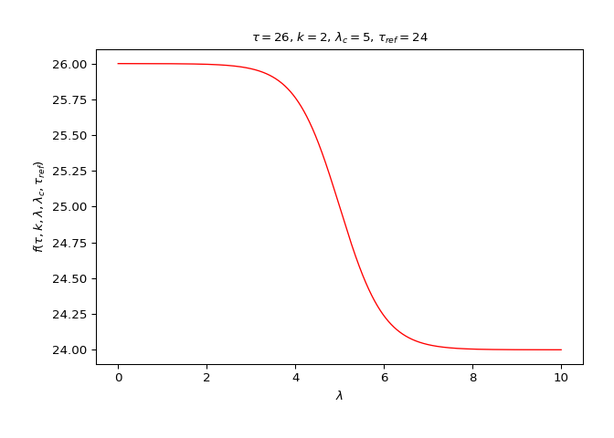
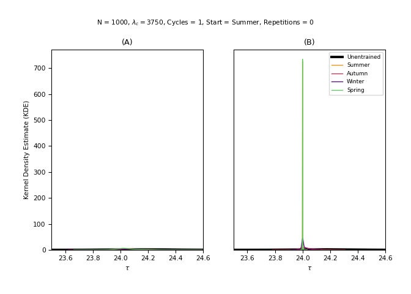

<!-- extra-figures.md is generated from extra-figures.Rmd. Please edit that file -->

# Extra figures

``` python
import entrainment
```

## Model dynamics

``` python
entrainment.plot_model_dynamics()
```



## Limitations

``` python
x = entrainment.run_model(n_cycles = 1, repetitions = 0, plot = False)
y = entrainment.run_model(n_cycles = 10, repetitions = 0, plot = False)
entrainment.plot_model_line_1_2(x, y)
```


