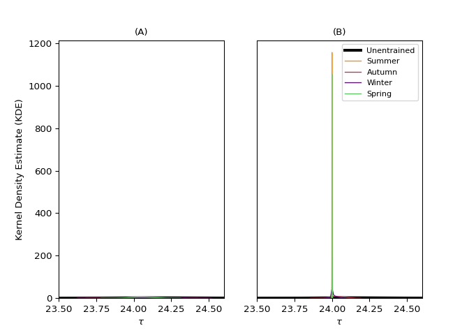

<!-- extra-figures.md is generated from extra-figures.Rmd. Please edit that file -->

# Extra figures

``` python
import entrainment
```

## Limitations

``` python
x = entrainment.run_model(n_cycles = 1, plot = False)
y = entrainment.run_model(n_cycles = 10, plot = False)

entrainment.plot_model_line_1_2(x, y)
```


