<!-- hypothesis-test.md is generated from hypothesis-test.Rmd. Please edit that file -->

``` {toctree}
:maxdepth: 2
:hidden:

hypothesis-test
```

# Latitude hypothesis test

The following topics show the basic steps for testing the latitude
hypothesis using the `entrainment` model.

> Hypothesis statement: Populations residing close to the equator
> (latitude 0°) (i.e., with greater average insolation) have, on
> average, a shorter duration/morning circadian phenotype when compared
> to populations residing near the planet’s poles (i.e., with lower
> average insolation) (Leocadio-Miguel et al., 2017; Roenneberg et al.,
> 2003).

The latitude hypothesis is based on the idea that regions located at
latitudes close to the poles have, on average, a lower incidence of
annual sunlight when compared to regions close to the equator (latitude
0°).

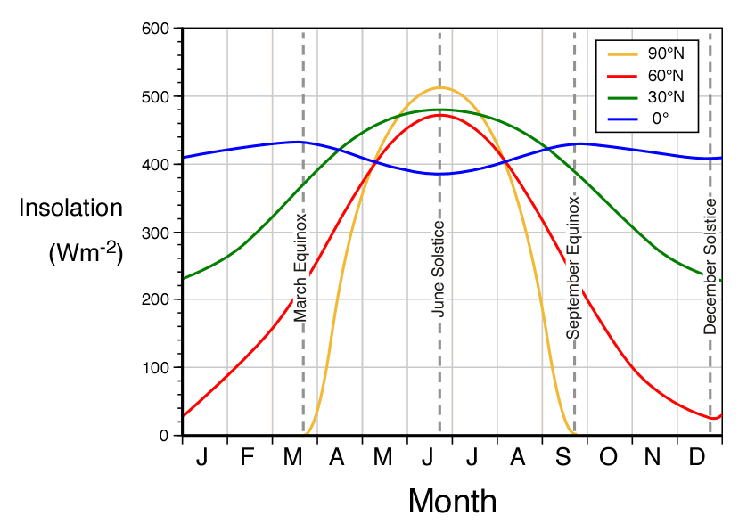

> Figure source: Pidwirny
> ([2019](http://www.physicalgeography.net/fundamentals/6i.html)).

Thus, it is understood by deduction that the regions close to the
equator have a stronger solar
[zeitgeber](https://en.wikipedia.org/wiki/Zeitgeber), which, according
to theory, should generate a greater propensity for synchronizing the
circadian rhythms of these populations to the light-dark cycle, reducing
the amplitude and the diversity of circadian phenotypes. This would also
give these populations a morning characteristic when compared to
populations living far from the equator, in which the opposite would
occur, i.e., a greater amplitude and diversity of circadian phenotypes
and an evening characteristic when compared to populations living near
the equator. ([Roenneberg et al.,
2003](https://doi.org/10.1177/0748730402239679)).

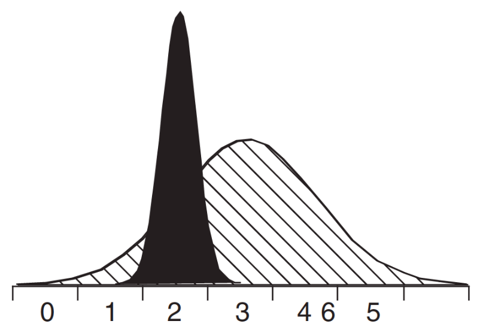

> Figure source: Roenneberg et
> al. ([2003](https://doi.org/10.1177/0748730402239679)).

## 1. Do the initial setup

``` python
import entrainment.hypothesis as hypothesis
import entrainment.labren as labren
import entrainment.model as model
```

## 2. Run the model for both groups

### By season

- North group (Location: Nascente do Rio Ailã) (Latitude: 5.272)

``` python
north_by_season = model.run_model(labren_id = 72272, by = "season")
```

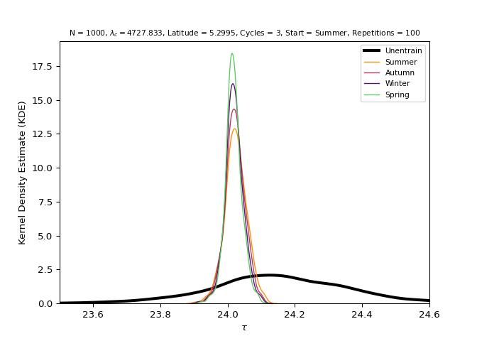

- South group (Location: Arroio Chuí) (Latitude: -33.752)

``` python
south_by_season = model.run_model(labren_id = 1, by = "season")
```

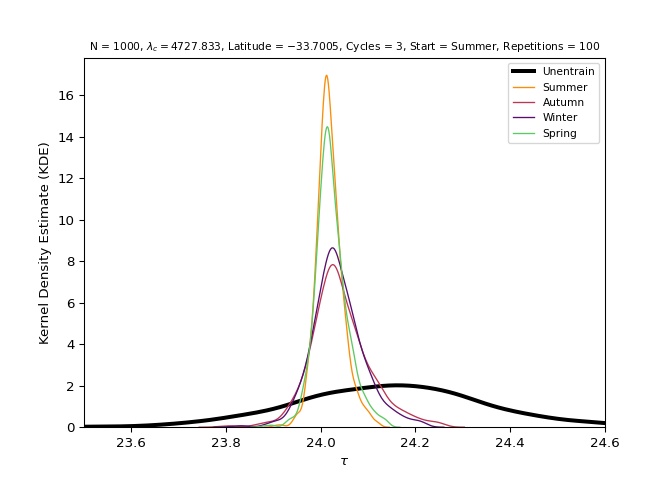

### By year

- North group (Location: Nascente do Rio Ailã) (Latitude: 5.272)

``` python
north_by_year = model.run_model(labren_id = 72272, by = "year")
```


- South group (Location: Arroio Chuí) (Latitude: -33.752)

``` python
south_by_year = model.run_model(labren_id = 1, by = "year")
```

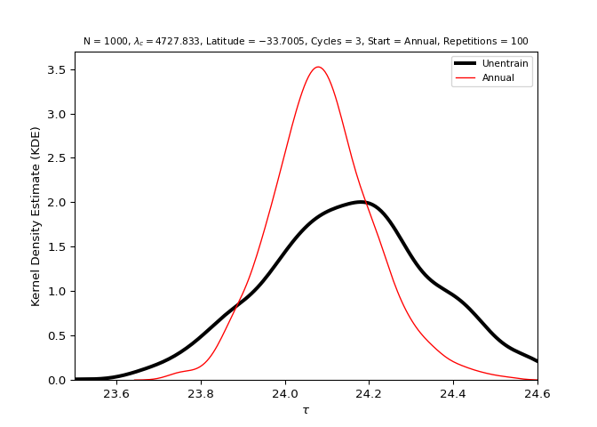

## 3. Analyze the distributions of both groups

For more information about the values presented, see
[`scipy.stats.shapiro()`](https://docs.scipy.org/doc/scipy/reference/generated/scipy.stats.shapiro.html)
and
[`scipy.stats.kstest()`](https://docs.scipy.org/doc/scipy/reference/generated/scipy.stats.kstest.htmll).

### North group (Location: Nascente do Rio Ailã) (Latitude: 5.272)

- Unentrained (Control)

``` python
hypothesis.analyze_data(north_by_season, "unentrain", name)
```

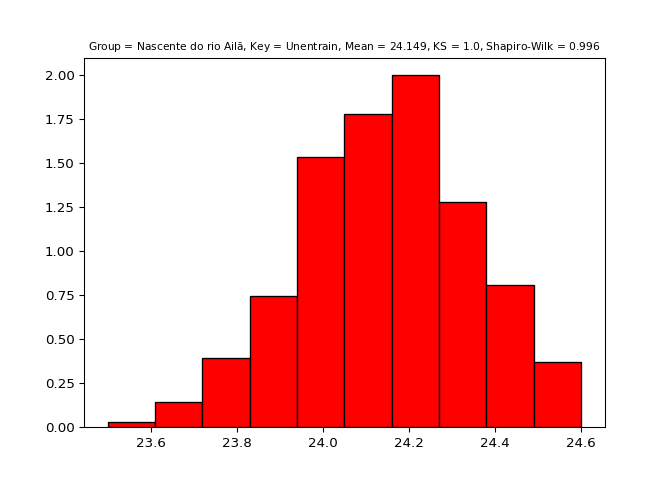

- Summer

``` python
hypothesis.analyze_data(north_by_season, "summer", name)
```

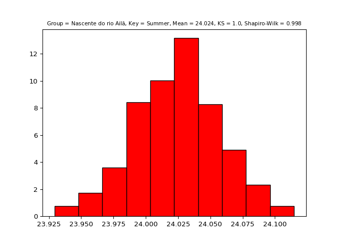

- Autumn

``` python
hypothesis.analyze_data(north_by_season, "autumn", name)
```

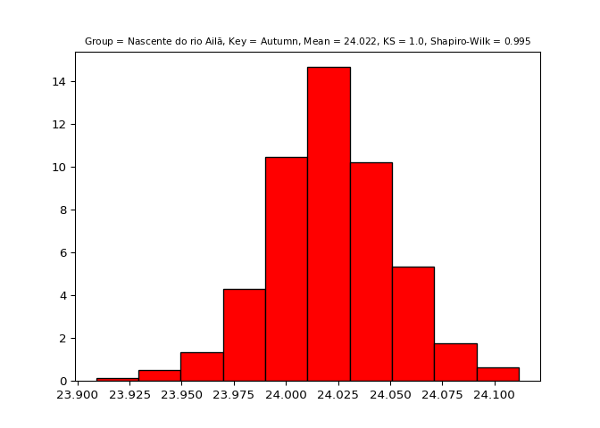

- Winter

``` python
hypothesis.analyze_data(north_by_season, "winter", name)
```

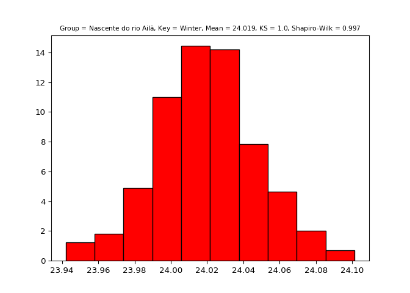

- Spring

``` python
hypothesis.analyze_data(north_by_season, "spring", name)
```

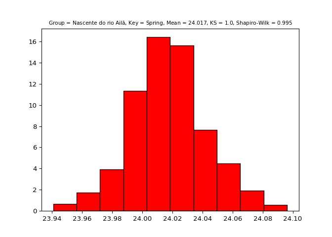

- Annual

``` python
hypothesis.analyze_data(north_by_year, "annual", name)
```

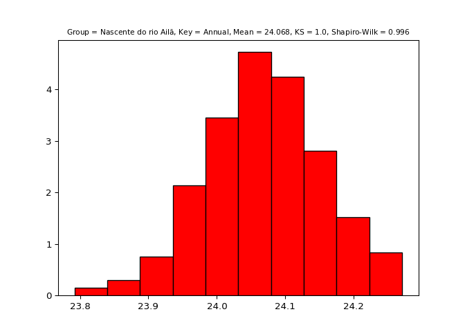

### South group (Location: Arroio Chuí) (Latitude: -33.752)

- Unentrained (Control)

``` python
hypothesis.analyze_data(south_by_season, "unentrain", name)
```

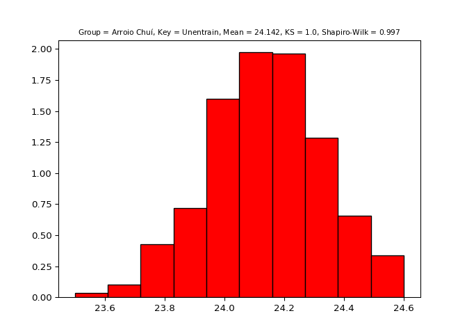

- Summer

``` python
hypothesis.analyze_data(south_by_season, "summer", name)
```

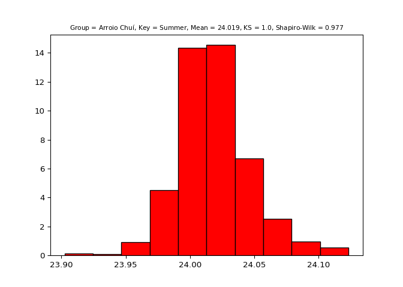

- Autumn

``` python
hypothesis.analyze_data(south_by_season, "autumn", name)
```

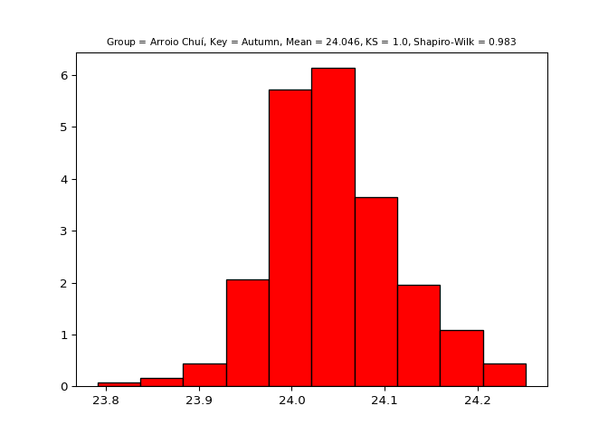

- Winter

``` python
hypothesis.analyze_data(south_by_season, "winter", name)
```

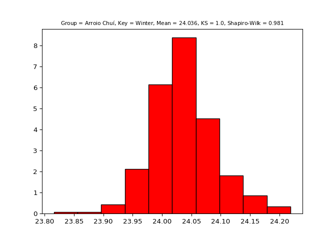

- Spring

``` python
hypothesis.analyze_data(south_by_season, "spring", name)
```

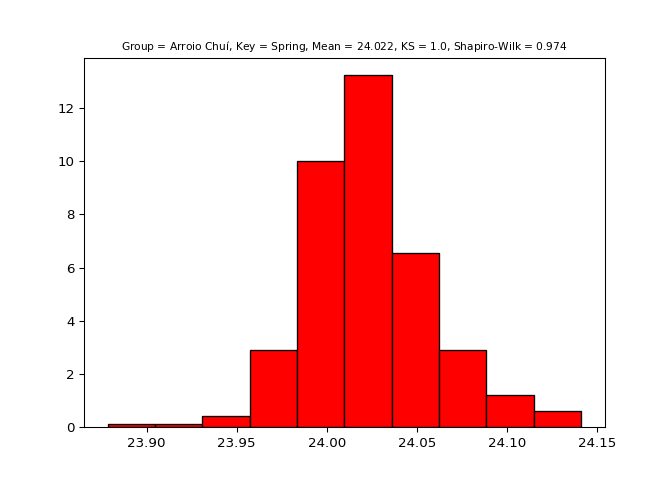

- Annual

``` python
hypothesis.analyze_data(south_by_year, "annual", name)
```

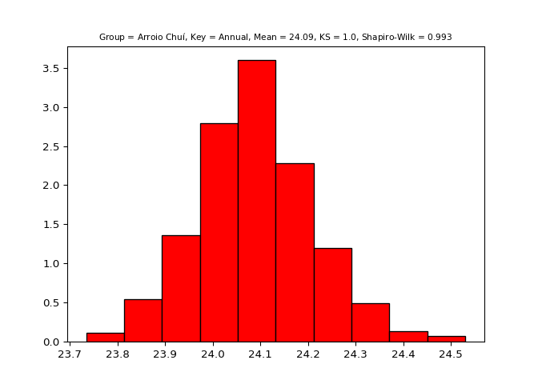

## 4. Test the hypothesis

For more information about the values presented, see
[`scipy.stats.ttest_ind`](https://docs.scipy.org/doc/scipy/reference/generated/scipy.stats.ttest_ind.html).

> Hypothesis statement: Populations residing close to the equator
> (latitude 0°) (i.e., with greater average insolation) have, on
> average, a shorter duration/morning circadian phenotype when compared
> to populations residing near the planet’s poles (i.e., with lower
> average insolation) (Leocadio-Miguel et al., 2017; Roenneberg et al.,
> 2003).

- Unentrained (Control)

``` python
test = hypothesis.test_hypothesis("unentrain", north_by_season, south_by_season)
#> ---------------------------------------------------------
#> 
#> [Groups: Nascente do rio Ailã (Lat.: $5.272$)/Arroio Chuí (Lat.: $- 33.752$) | Key: Unentrain]
#> 
#> Mean = 24.148956622488033, SD = 0.20089022154800826
#> 
#> Mean = 24.142102404602348, SD = 0.19413530109507066
#> 
#> Ttest_indResult(statistic=0.7754735779602957, pvalue=0.43815164486698677)
#> 
#> ---------------------------------------------------------
```

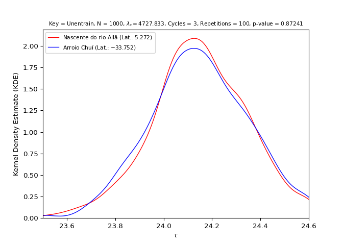

- Summer

  - (S1) Mean Tau North != Mean Tau South (or p-value \< 0.05): **TRUE**
  - (S2) Mean Tau North \< Mean Tau South: **FALSE**
  - Hypothesis: S1 & S2: **FALSE** (**Rejected**)

``` python
test = hypothesis.test_hypothesis("summer", north_by_season, south_by_season)
#> ---------------------------------------------------------
#> 
#> [Groups: Nascente do rio Ailã (Lat.: $5.272$)/Arroio Chuí (Lat.: $- 33.752$) | Key: Summer]
#> 
#> Mean = 24.024107738242076, SD = 0.03308899643913498
#> 
#> Mean = 24.01872757520563, SD = 0.028356273835321695
#> 
#> Ttest_indResult(statistic=3.902296619578766, pvalue=9.844017029565495e-05)
#> 
#> ---------------------------------------------------------
```

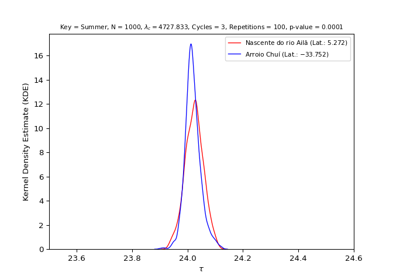

- Autumn

  - (S1) Mean Tau North != Mean Tau South (or p-value \< 0.05): **TRUE**
  - (S2) Mean Tau North \< Mean Tau South: **TRUE**
  - Hypothesis: S1 & S2: **TRUE** (**Confirmed**)

``` python
test = hypothesis.test_hypothesis("autumn", north_by_season, south_by_season)
#> ---------------------------------------------------------
#> 
#> [Groups: Nascente do rio Ailã (Lat.: $5.272$)/Arroio Chuí (Lat.: $- 33.752$) | Key: Autumn]
#> 
#> Mean = 24.021612227284702, SD = 0.029959336278508466
#> 
#> Mean = 24.041320690755814, SD = 0.06308976264690241
#> 
#> Ttest_indResult(statistic=-8.919077870098498, pvalue=1.0368520344800255e-18)
#> 
#> ---------------------------------------------------------
```

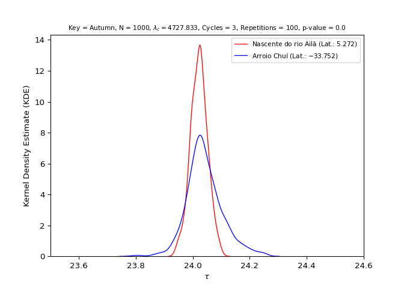

- Winter

  - (S1) Mean Tau North != Mean Tau South (or p-value \< 0.05): **TRUE**
  - (S2) Mean Tau North \< Mean Tau South: **TRUE**
  - Hypothesis: S1 & S2: **TRUE** (**Confirmed**)

``` python
test = hypothesis.test_hypothesis("winter", north_by_season, south_by_season)
#> ---------------------------------------------------------
#> 
#> [Groups: Nascente do rio Ailã (Lat.: $5.272$)/Arroio Chuí (Lat.: $- 33.752$) | Key: Winter]
#> 
#> Mean = 24.01933894161954, SD = 0.02760051071983717
#> 
#> Mean = 24.03641618598445, SD = 0.05437413318704833
#> 
#> Ttest_indResult(statistic=-8.851692244151065, pvalue=1.8576107113985023e-18)
#> 
#> ---------------------------------------------------------
#> 
#> 
#> D:\GitHub\entrainment\src\entrainment\hypothesis\plot_hypothesis.py:20: RuntimeWarning: More than 20 figures have been opened. Figures created through the pyplot interface (`matplotlib.pyplot.figure`) are retained until explicitly closed and may consume too much memory. (To control this warning, see the rcParam `figure.max_open_warning`). Consider using `matplotlib.pyplot.close()`.
#>   fig, ax = plt.subplots()
```

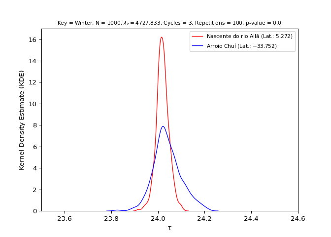

- Spring

  - (S1) Mean Tau North != Mean Tau South (or p-value \< 0.05): **TRUE**
  - (S2) Mean Tau North \< Mean Tau South: **TRUE**
  - Hypothesis: S1 & S2: **TRUE** (**Confirmed**)

``` python
test = hypothesis.test_hypothesis("spring", north_by_season, south_by_season)
#> ---------------------------------------------------------
#> 
#> [Groups: Nascente do rio Ailã (Lat.: $5.272$)/Arroio Chuí (Lat.: $- 33.752$) | Key: Spring]
#> 
#> Mean = 24.01721820276164, SD = 0.025123682129557855
#> 
#> Mean = 24.02241331494933, SD = 0.034288624390522306
#> 
#> Ttest_indResult(statistic=-3.8628648531583276, pvalue=0.00011563529988626542)
#> 
#> ---------------------------------------------------------
```

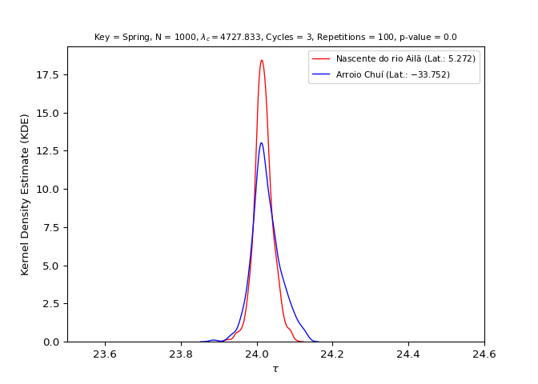

- Annual

  - (S1) Mean Tau North != Mean Tau South (or p-value \< 0.05): **TRUE**
  - (S2) Mean Tau North \< Mean Tau South:**TRUE**
  - Hypothesis: S1 & S2: **TRUE** (**Confirmed**)

``` python
test = hypothesis.test_hypothesis("annual", north_by_year, south_by_year)
#> ---------------------------------------------------------
#> 
#> [Groups: Nascente do rio Ailã (Lat.: $5.272$)/Arroio Chuí (Lat.: $- 33.752$) | Key: Annual]
#> 
#> Mean = 24.06811990250252, SD = 0.08450441162729444
#> 
#> Mean = 24.091486013908767, SD = 0.12117065919361852
#> 
#> Ttest_indResult(statistic=-4.99929465549762, pvalue=6.255975518088075e-07)
#> 
#> ---------------------------------------------------------
```

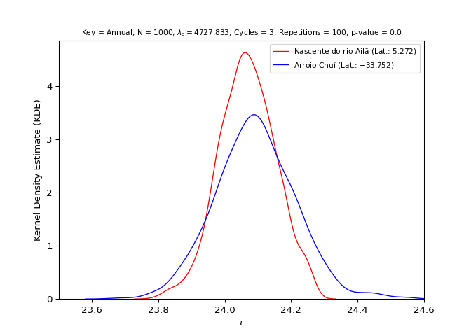
