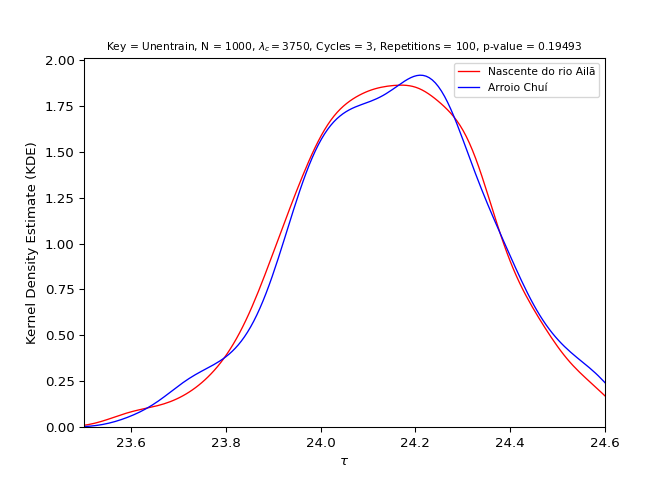
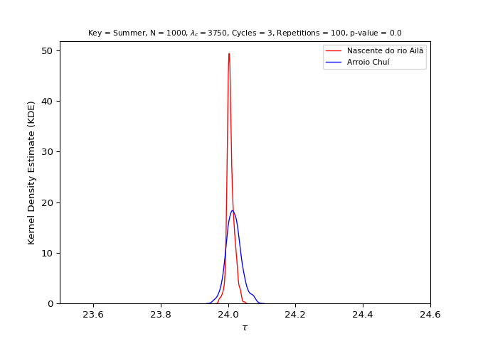
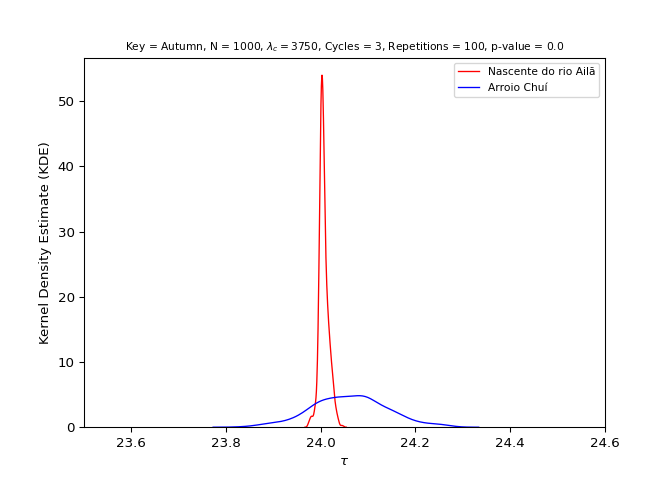
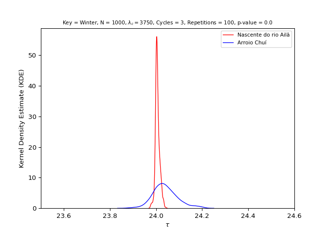
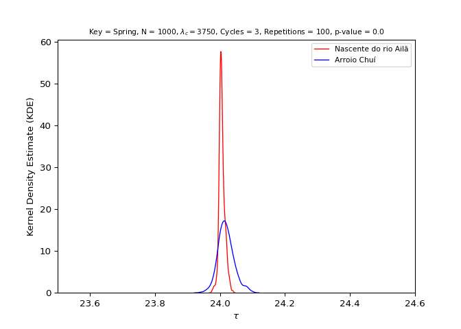
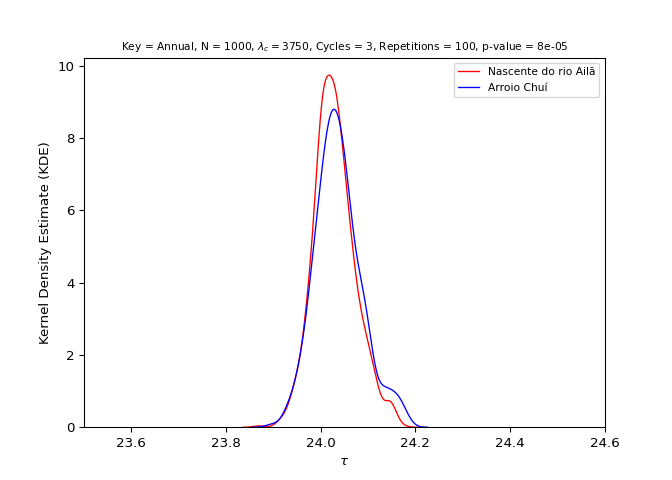

<!-- hypothesis-test.md is generated from hypothesis-test.Rmd. Please edit that file -->

# Latitude hypothesis test

The following topics show the basic steps for testing the latitude
hypothesis using the `entrainment` model.

> Hypothesis statement: Populations residing close to the equator
> (latitude 0°) (i.e., with greater average insolation) have, on
> average, a shorter duration/morning circadian phenotype when compared
> to populations residing near the planet’s poles (i.e., with lower
> average insolation) ([Leocadio-Miguel et al.,
> 2017](https://doi.org/10.1038/s41598-017-05797-w); [Roenneberg et al.,
> 2003](https://doi.org/10.1177/0748730402239679)).

In mathematical terms, this hypothesis can be written as follows:

<!-- $$ -->
<!-- \begin{cases} -->
<!-- H_{0} : \mu_{\text{equator}} \ge \mu_{\text{poles}} \\ -->
<!-- H_{a} : \mu_{\text{equator}} < \mu_{\text{poles}} \\ -->
<!-- \end{cases} -->
<!-- $$ -->


The latitude hypothesis is based on the idea that regions located at
latitudes close to the poles have, on average, a lower incidence of
annual sunlight when compared to regions close to the equator (latitude
0°).

<div class="figure" style="text-align: center">


<p class="caption">
Monthly values of available insolation in Wm-2 for the equator (0°),
30°, 60°, and 90° North.
</p>

</div>

> Figure source: Pidwirny
> ([2019](http://www.physicalgeography.net/fundamentals/6i.html)).

Thus, it is understood by deduction that the regions close to the
equator have a stronger solar
[zeitgeber](https://en.wikipedia.org/wiki/Zeitgeber), which, according
to theory, should generate a greater propensity for synchronizing the
circadian rhythms of these populations to the light-dark cycle, reducing
the amplitude and the diversity of circadian phenotypes. This would also
give these populations a morning characteristic when compared to
populations living far from the equator, in which the opposite would
occur, i.e., a greater amplitude and diversity of circadian phenotypes
and an evening characteristic when compared to populations living near
the equator. ([Roenneberg et al.,
2003](https://doi.org/10.1177/0748730402239679)).

<div class="figure" style="text-align: center">


<p class="caption">
Hypothetical distribution of chronotypes (circadian phenotypes) for
populations exposed to a strong (black) solar zeitgeber and a weak
(striped) zeitgeber based on mid-sleep phase.
</p>

</div>

> Figure source: Roenneberg et
> al. ([2003](https://doi.org/10.1177/0748730402239679)).

## 1. Do the initial setup

``` python
import entrainment
```

## 2. Run the model for both groups

### By season

``` python
n = 10**3
lam_c = 3750
n_cycles = 3
repetitions = 10**2
x_name = "Nascente do rio Ailã"
y_name = "Arroio Chuí"
```

- North group (Location: Nascente do Rio Ailã) (Latitude: 5.272)

``` python
north_by_season = entrainment.run_model(
    n = n, labren_id = 72272, by = "season", lam_c = lam_c, n_cycles = n_cycles,
    repetitions = repetitions
    )
```


- South group (Location: Arroio Chuí) (Latitude: -33.752)

``` python
south_by_season = entrainment.run_model(
    n = n, labren_id = 1, by = "season", lam_c = lam_c, n_cycles = n_cycles,
    repetitions = repetitions
    )
```


### By year

- North group (Location: Nascente do Rio Ailã) (Latitude: 5.272)

``` python
north_by_year = entrainment.run_model(
    n = n, labren_id = 72272, by = "year", lam_c = lam_c, n_cycles = n_cycles,
    repetitions = repetitions
    )
```


- South group (Location: Arroio Chuí) (Latitude: -33.752)

``` python
south_by_year = entrainment.run_model(
    n = n, labren_id = 1, by = "year", lam_c = lam_c, n_cycles = n_cycles,
    repetitions = repetitions
    )
```


## 3. Analyze the distributions of both groups

For more information about the values presented, see
[`scipy.stats.kstest()`](https://docs.scipy.org/doc/scipy/reference/generated/scipy.stats.kstest.html)
and
[`scipy.stats.shapiro()`](https://docs.scipy.org/doc/scipy/reference/generated/scipy.stats.shapiro.html).

### North group (Location: Nascente do Rio Ailã) (Latitude: 5.272)

- Unentrained (Control)

``` python
stats = entrainment.analyze_data(
    x = north_by_season, key = "unentrain", name = x_name
    )
#> ---------------------------------------------------------
#> 
#> [Group: Nascente do rio Ailã | Key: Unentrain]
#> 
#> Mean = 24.14704720256359
#> Var. = 0.03748829697697656
#> SD = 0.19361894787694867
#> 
#> Min. = 23.56903731558274
#> 1st Qu. = 24.01231423139283
#> Median = 24.14799850442318
#> 3rd Qu. = 24.288453705740245
#> Max. = 24.599999999999955
#> 
#> Kurtosis = -0.17533128034481837
#> Skewness = -0.12598726191868775
#> 
#> Kolmogorov-Smirnov test p-value = 0.0
#> Shapiro-Wilks test p-value = 0.017806315794587135
#> 
#> ---------------------------------------------------------
```


- Summer

``` python
stats = entrainment.analyze_data(
    x = north_by_season, key = "summer", name = x_name
    )
#> ---------------------------------------------------------
#> 
#> [Group: Nascente do rio Ailã | Key: Summer]
#> 
#> Mean = 24.00700954464003
#> Var. = 0.00011489984056914227
#> SD = 0.010719134319950575
#> 
#> Min. = 23.972452457000436
#> 1st Qu. = 24.000457010627002
#> Median = 24.00514489867121
#> 3rd Qu. = 24.012513421812876
#> Max. = 24.04851112891797
#> 
#> Kurtosis = 1.1312131167418702
#> Skewness = 0.5427736238107045
#> 
#> Kolmogorov-Smirnov test p-value = 0.0
#> Shapiro-Wilks test p-value = 1.918304950041731e-15
#> 
#> ---------------------------------------------------------
```


- Autumn

``` python
stats = entrainment.analyze_data(
    x = north_by_season, key = "autumn", name = x_name
    )
#> ---------------------------------------------------------
#> 
#> [Group: Nascente do rio Ailã | Key: Autumn]
#> 
#> Mean = 24.006396708014133
#> Var. = 9.675677830671879e-05
#> SD = 0.00983650234111286
#> 
#> Min. = 23.97409962756218
#> 1st Qu. = 24.000409927998646
#> Median = 24.00475812416522
#> 3rd Qu. = 24.01127684135558
#> Max. = 24.04662310739885
#> 
#> Kurtosis = 1.1695138218985912
#> Skewness = 0.5178205319958071
#> 
#> Kolmogorov-Smirnov test p-value = 0.0
#> Shapiro-Wilks test p-value = 1.5513316314129497e-15
#> 
#> ---------------------------------------------------------
```


- Winter

``` python
stats = entrainment.analyze_data(
    x = north_by_season, key = "winter", name = x_name
    )
#> ---------------------------------------------------------
#> 
#> [Group: Nascente do rio Ailã | Key: Winter]
#> 
#> Mean = 24.006123097592713
#> Var. = 8.876958591461833e-05
#> SD = 0.009421761295777892
#> 
#> Min. = 23.974704320169064
#> 1st Qu. = 24.000391134335455
#> Median = 24.004553630030756
#> 3rd Qu. = 24.01081718766094
#> Max. = 24.04281707200233
#> 
#> Kurtosis = 1.1550943806113594
#> Skewness = 0.49147025100116276
#> 
#> Kolmogorov-Smirnov test p-value = 0.0
#> Shapiro-Wilks test p-value = 2.1761186975381274e-15
#> 
#> ---------------------------------------------------------
```


- Spring

``` python
stats = entrainment.analyze_data(
    x = north_by_season, key = "spring", name = x_name
    )
#> ---------------------------------------------------------
#> 
#> [Group: Nascente do rio Ailã | Key: Spring]
#> 
#> Mean = 24.00586639763295
#> Var. = 7.977995281465546e-05
#> SD = 0.008931962427969313
#> 
#> Min. = 23.974603513234847
#> 1st Qu. = 24.00036024793091
#> Median = 24.00446289249023
#> 3rd Qu. = 24.0104180757305
#> Max. = 24.039829145346896
#> 
#> Kurtosis = 1.1690544119641189
#> Skewness = 0.48475208633258343
#> 
#> Kolmogorov-Smirnov test p-value = 0.0
#> Shapiro-Wilks test p-value = 1.0636314691416654e-14
#> 
#> ---------------------------------------------------------
```


- Annual

``` python
stats = entrainment.analyze_data(
    x = north_by_year, key = "annual", name = x_name
    )
#> ---------------------------------------------------------
#> 
#> [Group: Nascente do rio Ailã | Key: Annual]
#> 
#> Mean = 24.028990755607797
#> Var. = 0.0019003344048749446
#> SD = 0.04359282515362987
#> 
#> Min. = 23.868872055605806
#> 1st Qu. = 24.000846302806952
#> Median = 24.025745917018924
#> 3rd Qu. = 24.054437893562714
#> Max. = 24.17141747001398
#> 
#> Kurtosis = 0.40562222831759254
#> Skewness = 0.3526277988837711
#> 
#> Kolmogorov-Smirnov test p-value = 0.0
#> Shapiro-Wilks test p-value = 6.309218179012532e-07
#> 
#> ---------------------------------------------------------
```


### South group (Location: Arroio Chuí) (Latitude: -33.752)

- Unentrained (Control)

``` python
stats = entrainment.analyze_data(
    x = south_by_season, key = "unentrain", name = y_name
    )
#> ---------------------------------------------------------
#> 
#> [Group: Arroio Chuí | Key: Unentrain]
#> 
#> Mean = 24.15457980455192
#> Var. = 0.03913870113736456
#> SD = 0.1978350351615319
#> 
#> Min. = 23.604458865288358
#> 1st Qu. = 24.018527248336277
#> Median = 24.16098379696292
#> 3rd Qu. = 24.284537148874477
#> Max. = 24.599999999999955
#> 
#> Kurtosis = -0.21327490954387818
#> Skewness = -0.08587744555702902
#> 
#> Kolmogorov-Smirnov test p-value = 0.0
#> Shapiro-Wilks test p-value = 0.005564429331570864
#> 
#> ---------------------------------------------------------
```


- Summer

``` python
stats = entrainment.analyze_data(
    x = south_by_season, key = "summer", name = y_name
    )
#> ---------------------------------------------------------
#> 
#> [Group: Arroio Chuí | Key: Summer]
#> 
#> Mean = 24.016739089508278
#> Var. = 0.0004944790566037503
#> SD = 0.022236885047230655
#> 
#> Min. = 23.952750324768385
#> 1st Qu. = 24.001733849898716
#> Median = 24.015216420777726
#> 3rd Qu. = 24.02994412094783
#> Max. = 24.090453834193408
#> 
#> Kurtosis = 0.3580435809348579
#> Skewness = 0.296317517819168
#> 
#> Kolmogorov-Smirnov test p-value = 0.0
#> Shapiro-Wilks test p-value = 1.842415440478362e-05
#> 
#> ---------------------------------------------------------
```


- Autumn

``` python
stats = entrainment.analyze_data(
    x = south_by_season, key = "autumn", name = y_name
    )
#> ---------------------------------------------------------
#> 
#> [Group: Arroio Chuí | Key: Autumn]
#> 
#> Mean = 24.06096934813319
#> Var. = 0.00615002594025793
#> SD = 0.07842210109566007
#> 
#> Min. = 23.831874904465582
#> 1st Qu. = 24.00689032735015
#> Median = 24.060634327823752
#> 3rd Qu. = 24.11218612083314
#> Max. = 24.27451148298365
#> 
#> Kurtosis = -0.0611975791919015
#> Skewness = 0.03353166251795287
#> 
#> Kolmogorov-Smirnov test p-value = 0.0
#> Shapiro-Wilks test p-value = 0.23202677071094513
#> 
#> ---------------------------------------------------------
```


- Winter

``` python
stats = entrainment.analyze_data(
    x = south_by_season, key = "winter", name = y_name
    )
#> ---------------------------------------------------------
#> 
#> [Group: Arroio Chuí | Key: Winter]
#> 
#> Mean = 24.039780795207605
#> Var. = 0.00294194141737317
#> SD = 0.054239666457060465
#> 
#> Min. = 23.873627310425327
#> 1st Qu. = 24.003762668585146
#> Median = 24.034730582316815
#> 3rd Qu. = 24.06948491016064
#> Max. = 24.20996021246266
#> 
#> Kurtosis = 0.5730262744861188
#> Skewness = 0.4407895780499556
#> 
#> Kolmogorov-Smirnov test p-value = 0.0
#> Shapiro-Wilks test p-value = 1.6862540253015368e-09
#> 
#> ---------------------------------------------------------
```


- Spring

``` python
stats = entrainment.analyze_data(
    x = south_by_season, key = "spring", name = y_name
    )
#> ---------------------------------------------------------
#> 
#> [Group: Arroio Chuí | Key: Spring]
#> 
#> Mean = 24.018324423658974
#> Var. = 0.000615459317131769
#> SD = 0.024808452534000765
#> 
#> Min. = 23.93934162452764
#> 1st Qu. = 24.001878566281604
#> Median = 24.015923806337714
#> 3rd Qu. = 24.032280678866197
#> Max. = 24.100637983272293
#> 
#> Kurtosis = 0.5715027604259952
#> Skewness = 0.3955119771703266
#> 
#> Kolmogorov-Smirnov test p-value = 0.0
#> Shapiro-Wilks test p-value = 6.34319334835709e-08
#> 
#> ---------------------------------------------------------
```


- Annual

``` python
stats = entrainment.analyze_data(
    x = south_by_year, key = "annual", name = y_name
    )
#> ---------------------------------------------------------
#> 
#> [Group: Arroio Chuí | Key: Annual]
#> 
#> Mean = 24.036846713773006
#> Var. = 0.0024198669671413914
#> SD = 0.04919214334770738
#> 
#> Min. = 23.891884191140996
#> 1st Qu. = 24.00449573654616
#> Median = 24.03313741030121
#> 3rd Qu. = 24.06399816486675
#> Max. = 24.188625586000416
#> 
#> Kurtosis = 0.34422406751558254
#> Skewness = 0.4325012773595424
#> 
#> Kolmogorov-Smirnov test p-value = 0.0
#> Shapiro-Wilks test p-value = 2.036081347966956e-08
#> 
#> ---------------------------------------------------------
```


## 4. Test the hypothesis

For more information about the values presented, see
[`scipy.stats.ttest_ind`](https://docs.scipy.org/doc/scipy/reference/generated/scipy.stats.ttest_ind.html).

> Hypothesis statement: Populations residing close to the equator
> (latitude 0°) (i.e., with greater average insolation) have, on
> average, a shorter duration/morning circadian phenotype when compared
> to populations residing near the planet’s poles (i.e., with lower
> average insolation) ([Leocadio-Miguel et al.,
> 2017](https://doi.org/10.1038/s41598-017-05797-w); [Roenneberg et al.,
> 2003](https://doi.org/10.1177/0748730402239679)).


- Unentrained (Control)

``` python
test = entrainment.test_hypothesis(
    key = "unentrain", x = north_by_season, y = south_by_season,
    x_name = x_name, y_name = y_name, lam_c = lam_c, n_cycles = n_cycles,
    repetitions = repetitions
    )
#> ---------------------------------------------------------
#> 
#> [Group: Nascente do rio Ailã | Key: Unentrain]
#> 
#> Mean = 24.14704720256359
#> Var. = 0.03748829697697656
#> SD = 0.19361894787694867
#> 
#> ---------------------------------------------------------
#> 
#> [Group: Arroio Chuí | Key: Unentrain]
#> 
#> Mean = 24.15457980455192
#> Var. = 0.03913870113736456
#> SD = 0.1978350351615319
#> 
#> ---------------------------------------------------------
#> 
#> [Groups: Nascente do rio Ailã & Arroio Chuí | Key: Unentrain]
#> 
#> Variance ratio: 0.03913870113736456 / 0.03748829697697656 = 1.0440245168085815
#> Ratio test: 1.0440245168085815 < 2: TRUE
#> 
#> Standard t-test statistic = -0.8600760583618186
#> Standard t-test p-value = 0.19492515230658025
#> Welch’s t-test statistic = -0.8600760583618186
#> Welch’s t-test p-value = 0.19492517623769656
#> 
#> Cohen's d = 0.038483016967609675
#> Coefficient of determination (R squared) = 8.751266874010025e-05
#> 
#> ---------------------------------------------------------
```



- Summer

``` python
test = entrainment.test_hypothesis(
    key = "summer", x = north_by_season, y = south_by_season,
    x_name = x_name, y_name = y_name, lam_c = lam_c, n_cycles = n_cycles,
    repetitions = repetitions
    )
#> ---------------------------------------------------------
#> 
#> [Group: Nascente do rio Ailã | Key: Summer]
#> 
#> Mean = 24.00700954464003
#> Var. = 0.00011489984056914227
#> SD = 0.010719134319950575
#> 
#> ---------------------------------------------------------
#> 
#> [Group: Arroio Chuí | Key: Summer]
#> 
#> Mean = 24.016739089508278
#> Var. = 0.0004944790566037503
#> SD = 0.022236885047230655
#> 
#> ---------------------------------------------------------
#> 
#> [Groups: Nascente do rio Ailã & Arroio Chuí | Key: Summer]
#> 
#> Variance ratio: 0.0004944790566037503 / 0.00011489984056914227 = 4.303566081157371
#> Ratio test: 4.303566081157371 < 2: FALSE
#> 
#> Standard t-test statistic = -12.45751916684652
#> Standard t-test p-value = 1.1603142688131177e-34
#> Welch’s t-test statistic = -12.45751916684652
#> Welch’s t-test p-value = 3.3231409203651288e-34
#> 
#> Cohen's d = 0.5573959614515872
#> Coefficient of determination (R squared) = 0.0008365184085154249
#> 
#> ---------------------------------------------------------
```



> Directional Student’s t-test (Welch’s t-test)
>
> - (H0) Mean Tau North \>= Mean Tau South
> - (Ha) Mean Tau North \< Mean Tau South
>
> **Reject H0 in favour of Ha** (p-value = 0.00000)

- Autumn

``` python
test = entrainment.test_hypothesis(
    key = "autumn", x = north_by_season, y = south_by_season,
    x_name = x_name, y_name = y_name, lam_c = lam_c, n_cycles = n_cycles,
    repetitions = repetitions
    )
#> ---------------------------------------------------------
#> 
#> [Group: Nascente do rio Ailã | Key: Autumn]
#> 
#> Mean = 24.006396708014133
#> Var. = 9.675677830671879e-05
#> SD = 0.00983650234111286
#> 
#> ---------------------------------------------------------
#> 
#> [Group: Arroio Chuí | Key: Autumn]
#> 
#> Mean = 24.06096934813319
#> Var. = 0.00615002594025793
#> SD = 0.07842210109566007
#> 
#> ---------------------------------------------------------
#> 
#> [Groups: Nascente do rio Ailã & Arroio Chuí | Key: Autumn]
#> 
#> Variance ratio: 0.00615002594025793 / 9.675677830671879e-05 = 63.56170645494582
#> Ratio test: 63.56170645494582 < 2: FALSE
#> 
#> Standard t-test statistic = -21.823756566002135
#> Standard t-test p-value = 3.528408320152314e-95
#> Welch’s t-test statistic = -21.823756566002135
#> Welch’s t-test p-value = 2.127335161498276e-87
#> 
#> Cohen's d = 0.9764764244526103
#> Coefficient of determination (R squared) = 0.0002819452962712477
#> 
#> ---------------------------------------------------------
```



> Directional Student’s t-test (Welch’s t-test)
>
> - (H0) Mean Tau North \>= Mean Tau South
> - (Ha) Mean Tau North \< Mean Tau South
>
> **Reject H0 in favour of Ha** (p-value = 0.00000)

- Winter

``` python
test = entrainment.test_hypothesis(
    key = "winter", x = north_by_season, y = south_by_season,
    x_name = x_name, y_name = y_name, lam_c = lam_c, n_cycles = n_cycles,
    repetitions = repetitions
    )
#> ---------------------------------------------------------
#> 
#> [Group: Nascente do rio Ailã | Key: Winter]
#> 
#> Mean = 24.006123097592713
#> Var. = 8.876958591461833e-05
#> SD = 0.009421761295777892
#> 
#> ---------------------------------------------------------
#> 
#> [Group: Arroio Chuí | Key: Winter]
#> 
#> Mean = 24.039780795207605
#> Var. = 0.00294194141737317
#> SD = 0.054239666457060465
#> 
#> ---------------------------------------------------------
#> 
#> [Groups: Nascente do rio Ailã & Arroio Chuí | Key: Winter]
#> 
#> Variance ratio: 0.00294194141737317 / 8.876958591461833e-05 = 33.14132185096404
#> Ratio test: 33.14132185096404 < 2: FALSE
#> 
#> Standard t-test statistic = -19.323904637660508
#> Standard t-test p-value = 1.0314748589354469e-76
#> Welch’s t-test statistic = -19.323904637660508
#> Welch’s t-test p-value = 8.342006740365783e-72
#> 
#> Cohen's d = 0.864623707196281
#> Coefficient of determination (R squared) = 0.0010757461836185505
#> 
#> ---------------------------------------------------------
```



> Directional Student’s t-test (Welch’s t-test)
>
> - (H0) Mean Tau North \>= Mean Tau South
> - (Ha) Mean Tau North \< Mean Tau South
>
> **Reject H0 in favour of Ha** (p-value = 0.00000)

- Spring

``` python
test = entrainment.test_hypothesis(
    key = "spring", x = north_by_season, y = south_by_season,
    x_name = x_name, y_name = y_name, lam_c = lam_c, n_cycles = n_cycles,
    repetitions = repetitions
    )
#> ---------------------------------------------------------
#> 
#> [Group: Nascente do rio Ailã | Key: Spring]
#> 
#> Mean = 24.00586639763295
#> Var. = 7.977995281465546e-05
#> SD = 0.008931962427969313
#> 
#> ---------------------------------------------------------
#> 
#> [Group: Arroio Chuí | Key: Spring]
#> 
#> Mean = 24.018324423658974
#> Var. = 0.000615459317131769
#> SD = 0.024808452534000765
#> 
#> ---------------------------------------------------------
#> 
#> [Groups: Nascente do rio Ailã & Arroio Chuí | Key: Spring]
#> 
#> Variance ratio: 0.000615459317131769 / 7.977995281465546e-05 = 7.714460781414627
#> Ratio test: 7.714460781414627 < 2: FALSE
#> 
#> Standard t-test statistic = -14.93361086731712
#> Standard t-test p-value = 3.452514558031428e-48
#> Welch’s t-test statistic = -14.933610867317118
#> Welch’s t-test p-value = 7.757321739609015e-47
#> 
#> Cohen's d = 0.6681855573206561
#> Coefficient of determination (R squared) = 0.0010787260332865692
#> 
#> ---------------------------------------------------------
```



> Directional Student’s t-test (Welch’s t-test)
>
> - (H0) Mean Tau North \>= Mean Tau South
> - (Ha) Mean Tau North \< Mean Tau South
>
> **Reject H0 in favour of Ha** (p-value = 0.00000)

- Annual

``` python
test = entrainment.test_hypothesis(
    key = "annual", x = north_by_year, y = south_by_year,
    x_name = x_name, y_name = y_name, lam_c = lam_c, n_cycles = n_cycles,
    repetitions = repetitions
    )
#> ---------------------------------------------------------
#> 
#> [Group: Nascente do rio Ailã | Key: Annual]
#> 
#> Mean = 24.028990755607797
#> Var. = 0.0019003344048749446
#> SD = 0.04359282515362987
#> 
#> ---------------------------------------------------------
#> 
#> [Group: Arroio Chuí | Key: Annual]
#> 
#> Mean = 24.036846713773006
#> Var. = 0.0024198669671413914
#> SD = 0.04919214334770738
#> 
#> ---------------------------------------------------------
#> 
#> [Groups: Nascente do rio Ailã & Arroio Chuí | Key: Annual]
#> 
#> Variance ratio: 0.0024198669671413914 / 0.0019003344048749446 = 1.2733900733121946
#> Ratio test: 1.2733900733121946 < 2: TRUE
#> 
#> Standard t-test statistic = -3.777721265884513
#> Standard t-test p-value = 8.145064445046167e-05
#> Welch’s t-test statistic = -3.777721265884513
#> Welch’s t-test p-value = 8.148446711473868e-05
#> 
#> Cohen's d = 0.16902936683394534
#> Coefficient of determination (R squared) = 2.5245476062061554e-05
#> 
#> ---------------------------------------------------------
```



> Directional Student’s t-test (Standard t-test)
>
> - (H0) Mean Tau North \>= Mean Tau South
> - (Ha) Mean Tau North \< Mean Tau South
>
> **Reject H0 in favour of Ha** (p-value = 0.00008)
