<!-- hypothesis-test.md is generated from hypothesis-test.Rmd. Please edit that file -->

# Latitude hypothesis test

The following topics show the basic steps for testing the latitude
hypothesis using the `entrainment` model.

> Hypothesis statement: Populations residing close to the equator
> (latitude 0°) (i.e., with greater average insolation) have, on
> average, a shorter duration/morning circadian phenotype when compared
> to populations residing near the planet’s poles (i.e., with lower
> average insolation) ([Leocadio-Miguel et al.,
> 2017](https://doi.org/10.1038/s41598-017-05797-w); [Roenneberg et al.,
> 2003](https://doi.org/10.1177/0748730402239679)).

The latitude hypothesis is based on the idea that regions located at
latitudes close to the poles have, on average, a lower incidence of
annual sunlight when compared to regions close to the equator (latitude
0°).

<div class="figure">


<p class="caption">
Monthly values of available insolation in Wm-2 for the equator (0°),
30°, 60°, and 90° North.
</p>

</div>

> Figure source: Pidwirny
> ([2019](http://www.physicalgeography.net/fundamentals/6i.html)).

Thus, it is understood by deduction that the regions close to the
equator have a stronger solar
[zeitgeber](https://en.wikipedia.org/wiki/Zeitgeber), which, according
to theory, should generate a greater propensity for synchronizing the
circadian rhythms of these populations to the light-dark cycle, reducing
the amplitude and the diversity of circadian phenotypes. This would also
give these populations a morning characteristic when compared to
populations living far from the equator, in which the opposite would
occur, i.e., a greater amplitude and diversity of circadian phenotypes
and an evening characteristic when compared to populations living near
the equator. ([Roenneberg et al.,
2003](https://doi.org/10.1177/0748730402239679)).

<div class="figure">


<p class="caption">
Hypothetical distribution of chronotypes (circadian phenotypes) for
populations exposed to a strong (black) solar zeitgeber and a weak
(striped) zeitgeber based on mid-sleep phase.
</p>

</div>

> Figure source: Roenneberg et
> al. ([2003](https://doi.org/10.1177/0748730402239679)).

## 1. Do the initial setup

``` python
import entrainment
```

## 2. Run the model for both groups

### By season

``` python
n = 10**3
lam_c = 3750
n_cycles = 3
repetitions = 10**2
x_name = "Nascente do rio Ailã"
y_name = "Arroio Chuí"
```

- North group (Location: Nascente do Rio Ailã) (Latitude: 5.272)

``` python
north_by_season = entrainment.run_model(
    n = n, labren_id = 72272, by = "season", lam_c = lam_c, n_cycles = n_cycles,
    repetitions = repetitions
    )
```

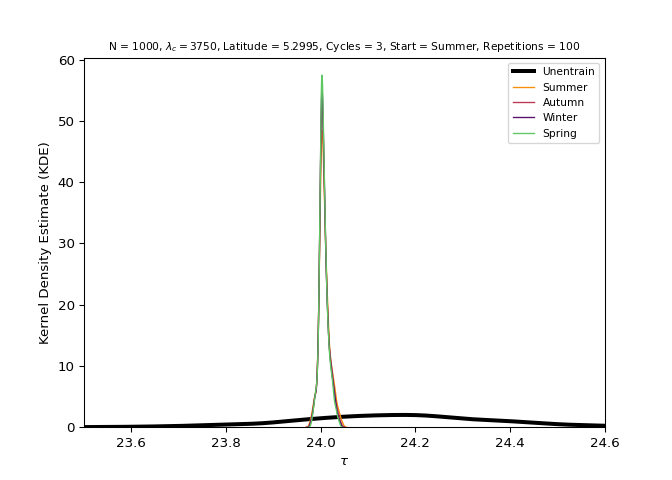

- South group (Location: Arroio Chuí) (Latitude: -33.752)

``` python
south_by_season = entrainment.run_model(
    n = n, labren_id = 1, by = "season", lam_c = lam_c, n_cycles = n_cycles,
    repetitions = repetitions
    )
```


### By year

- North group (Location: Nascente do Rio Ailã) (Latitude: 5.272)

``` python
north_by_year = entrainment.run_model(
    n = n, labren_id = 72272, by = "year", lam_c = lam_c, n_cycles = n_cycles,
    repetitions = repetitions
    )
```

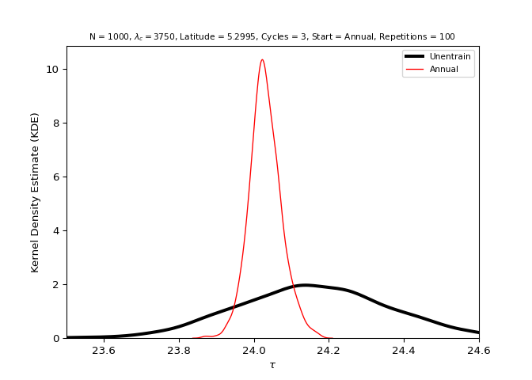

- South group (Location: Arroio Chuí) (Latitude: -33.752)

``` python
south_by_year = entrainment.run_model(
    n = n, labren_id = 1, by = "year", lam_c = lam_c, n_cycles = n_cycles,
    repetitions = repetitions
    )
```

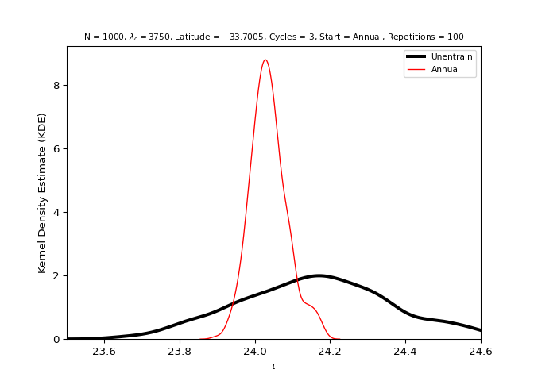

## 3. Analyze the distributions of both groups

For more information about the values presented, see
[`scipy.stats.kstest()`](https://docs.scipy.org/doc/scipy/reference/generated/scipy.stats.kstest.html)
and
[`scipy.stats.shapiro()`](https://docs.scipy.org/doc/scipy/reference/generated/scipy.stats.shapiro.html).

### North group (Location: Nascente do Rio Ailã) (Latitude: 5.272)

- Unentrained (Control)

``` python
stats = entrainment.analyze_data(
    x = north_by_season, key = "unentrain", name = x_name
    )
#> ---------------------------------------------------------
#> 
#> [Group: Nascente do rio Ailã | Key: Unentrain]
#> 
#> Mean = 24.154505800464104
#> Var. = 0.03761669520401661
#> SD = 0.19395023898932584
#> 
#> Min. = 23.524402022644594
#> 1st Qu. = 24.019680479024014
#> Median = 24.15079590236212
#> 3rd Qu. = 24.28857075512041
#> Max. = 24.599999999999955
#> 
#> Kurtosis = -0.20061392412377277
#> Skewness = -0.0820745758743856
#> 
#> Kolmogorov-Smirnov test p-value = 0.0
#> Shapiro-Wilks test p-value = 0.059226516634225845
#> 
#> ---------------------------------------------------------
```

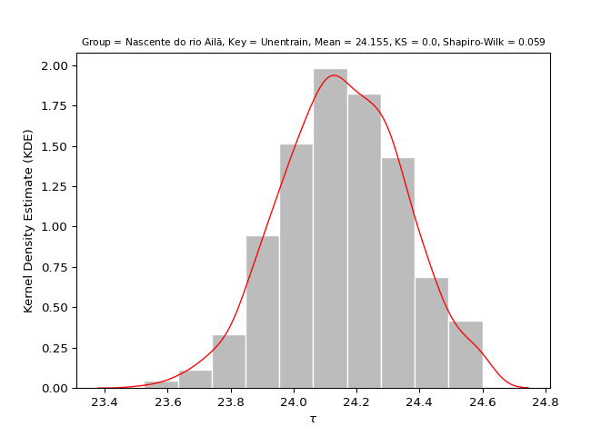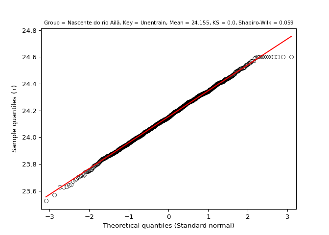

- Summer

``` python
stats = entrainment.analyze_data(
    x = north_by_season, key = "summer", name = x_name
    )
#> ---------------------------------------------------------
#> 
#> [Group: Nascente do rio Ailã | Key: Summer]
#> 
#> Mean = 24.00740532076041
#> Var. = 0.00012314512796345812
#> SD = 0.011097077451449012
#> 
#> Min. = 23.968932124575158
#> 1st Qu. = 24.000639897555786
#> Median = 24.005402162552144
#> 3rd Qu. = 24.01279411074004
#> Max. = 24.050497962465094
#> 
#> Kurtosis = 1.22371469610363
#> Skewness = 0.6959777565527814
#> 
#> Kolmogorov-Smirnov test p-value = 0.0
#> Shapiro-Wilks test p-value = 1.4401119173341646e-16
#> 
#> ---------------------------------------------------------
```

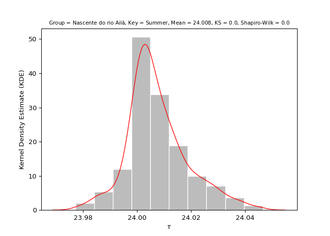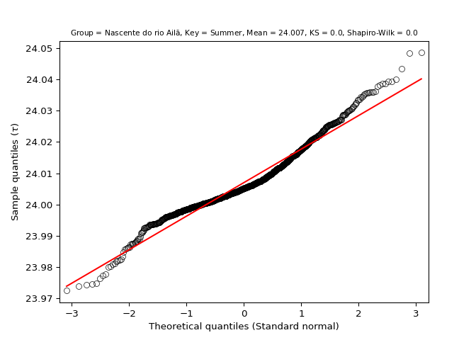

- Autumn

``` python
stats = entrainment.analyze_data(
    x = north_by_season, key = "autumn", name = x_name
    )
#> ---------------------------------------------------------
#> 
#> [Group: Nascente do rio Ailã | Key: Autumn]
#> 
#> Mean = 24.0067779627879
#> Var. = 0.00010552638459691193
#> SD = 0.010272603593875893
#> 
#> Min. = 23.96738320943539
#> 1st Qu. = 24.00062090444882
#> Median = 24.00475900411491
#> 3rd Qu. = 24.01157725875815
#> Max. = 24.048093680417715
#> 
#> Kurtosis = 1.3792768058525278
#> Skewness = 0.6952488688779734
#> 
#> Kolmogorov-Smirnov test p-value = 0.0
#> Shapiro-Wilks test p-value = 2.6730384508042942e-17
#> 
#> ---------------------------------------------------------
```

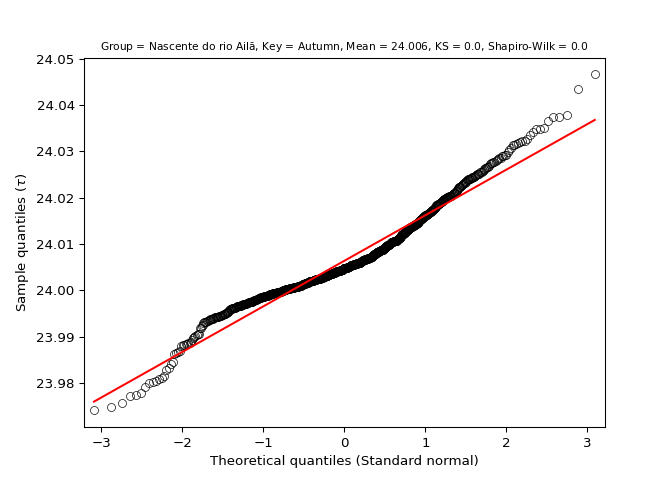

- Winter

``` python
stats = entrainment.analyze_data(
    x = north_by_season, key = "winter", name = x_name
    )
#> ---------------------------------------------------------
#> 
#> [Group: Nascente do rio Ailã | Key: Winter]
#> 
#> Mean = 24.006512119306784
#> Var. = 9.542243179469406e-05
#> SD = 0.009768440601994468
#> 
#> Min. = 23.97081846355716
#> 1st Qu. = 24.000548681255594
#> Median = 24.00478157693386
#> 3rd Qu. = 24.01142887669284
#> Max. = 24.046689143825514
#> 
#> Kurtosis = 1.2416968935500554
#> Skewness = 0.6651751130877731
#> 
#> Kolmogorov-Smirnov test p-value = 0.0
#> Shapiro-Wilks test p-value = 1.799489997404035e-16
#> 
#> ---------------------------------------------------------
```

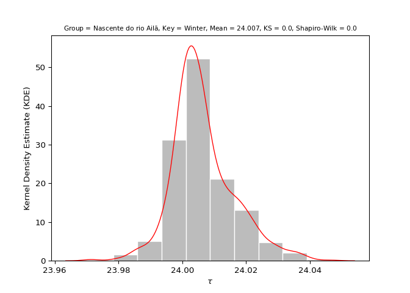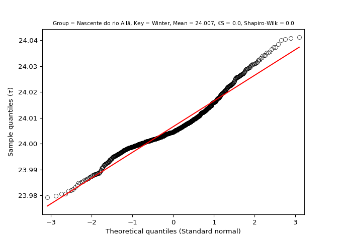

- Spring

``` python
stats = entrainment.analyze_data(
    x = north_by_season, key = "spring", name = x_name
    )
#> ---------------------------------------------------------
#> 
#> [Group: Nascente do rio Ailã | Key: Spring]
#> 
#> Mean = 24.006265300940086
#> Var. = 8.713282304979183e-05
#> SD = 0.009334496400438099
#> 
#> Min. = 23.972868793777987
#> 1st Qu. = 24.000544549687437
#> Median = 24.00462929758823
#> 3rd Qu. = 24.011039818345452
#> Max. = 24.04176280822911
#> 
#> Kurtosis = 1.212510110006808
#> Skewness = 0.6868467225609217
#> 
#> Kolmogorov-Smirnov test p-value = 0.0
#> Shapiro-Wilks test p-value = 2.320138650768592e-16
#> 
#> ---------------------------------------------------------
```

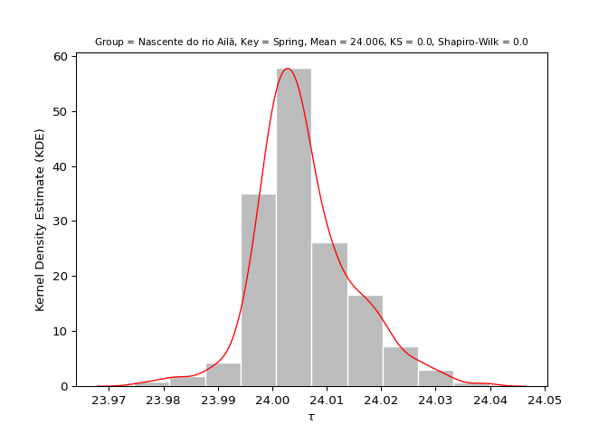

- Annual

``` python
stats = entrainment.analyze_data(
    x = north_by_year, key = "annual", name = x_name
    )
#> ---------------------------------------------------------
#> 
#> [Group: Nascente do rio Ailã | Key: Annual]
#> 
#> Mean = 24.030829408697947
#> Var. = 0.0016894286084883892
#> SD = 0.04110265938462363
#> 
#> Min. = 23.901069200190197
#> 1st Qu. = 24.00461249943942
#> Median = 24.027924459715425
#> 3rd Qu. = 24.05526690985817
#> Max. = 24.172882512090066
#> 
#> Kurtosis = 0.4222460359475768
#> Skewness = 0.22552871489230233
#> 
#> Kolmogorov-Smirnov test p-value = 0.0
#> Shapiro-Wilks test p-value = 0.00014762113278266042
#> 
#> ---------------------------------------------------------
```

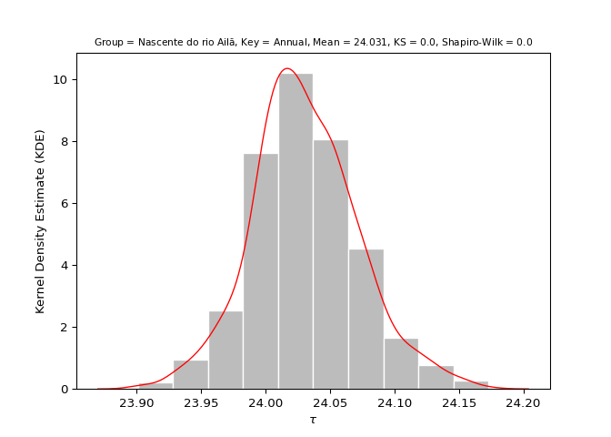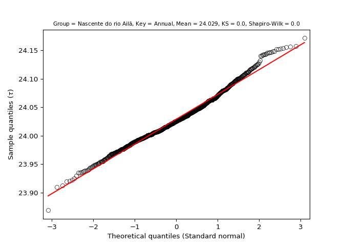

### South group (Location: Arroio Chuí) (Latitude: -33.752)

- Unentrained (Control)

``` python
stats = entrainment.analyze_data(
    x = south_by_season, key = "unentrain", name = y_name
    )
#> ---------------------------------------------------------
#> 
#> [Group: Arroio Chuí | Key: Unentrain]
#> 
#> Mean = 24.148973214245114
#> Var. = 0.03863887103430195
#> SD = 0.1965677263293798
#> 
#> Min. = 23.5
#> 1st Qu. = 24.024096993077716
#> Median = 24.15288032241974
#> 3rd Qu. = 24.28379090091183
#> Max. = 24.599999999999955
#> 
#> Kurtosis = -0.20232423860338322
#> Skewness = -0.1139721388764928
#> 
#> Kolmogorov-Smirnov test p-value = 0.0
#> Shapiro-Wilks test p-value = 0.027147427201271057
#> 
#> ---------------------------------------------------------
```

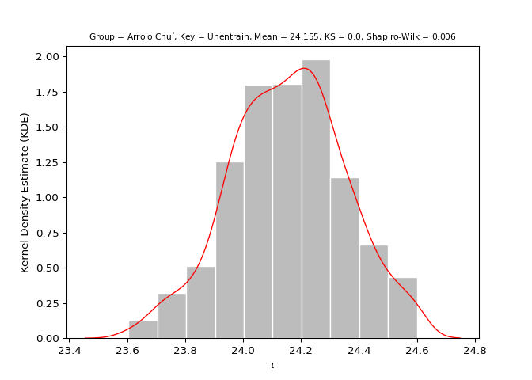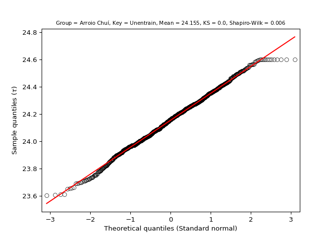

- Summer

``` python
stats = entrainment.analyze_data(
    x = south_by_season, key = "summer", name = y_name
    )
#> ---------------------------------------------------------
#> 
#> [Group: Arroio Chuí | Key: Summer]
#> 
#> Mean = 24.0157770233931
#> Var. = 0.00046006166546071583
#> SD = 0.021449048124817002
#> 
#> Min. = 23.947759842941394
#> 1st Qu. = 24.00220418664828
#> Median = 24.014210464404194
#> 3rd Qu. = 24.029068368305797
#> Max. = 24.079975497962813
#> 
#> Kurtosis = 0.037925721829686676
#> Skewness = 0.1952443272298217
#> 
#> Kolmogorov-Smirnov test p-value = 0.0
#> Shapiro-Wilks test p-value = 0.0037474092096090317
#> 
#> ---------------------------------------------------------
```

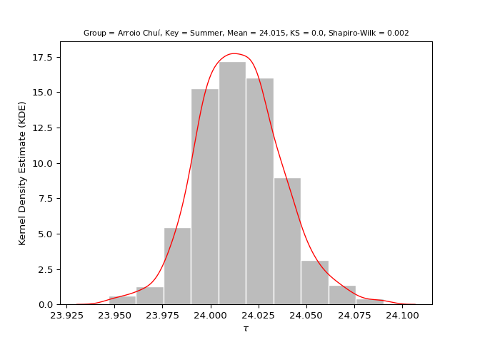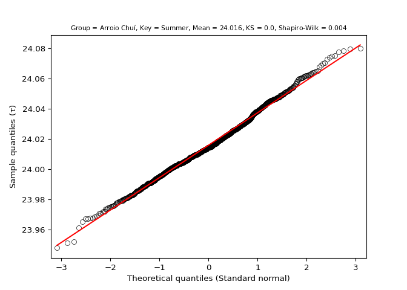

- Autumn

``` python
stats = entrainment.analyze_data(
    x = south_by_season, key = "autumn", name = y_name
    )
#> ---------------------------------------------------------
#> 
#> [Group: Arroio Chuí | Key: Autumn]
#> 
#> Mean = 24.05828590657691
#> Var. = 0.005951026206706464
#> SD = 0.07714289472599835
#> 
#> Min. = 23.81139227243855
#> 1st Qu. = 24.008655122360004
#> Median = 24.05651249174045
#> 3rd Qu. = 24.109058664344985
#> Max. = 24.26012298372559
#> 
#> Kurtosis = -0.215690992540698
#> Skewness = -0.04751501090029335
#> 
#> Kolmogorov-Smirnov test p-value = 0.0
#> Shapiro-Wilks test p-value = 0.1342858076095581
#> 
#> ---------------------------------------------------------
```

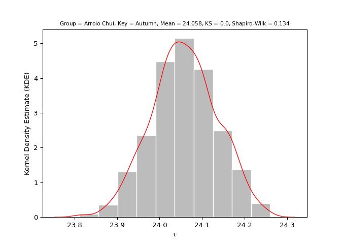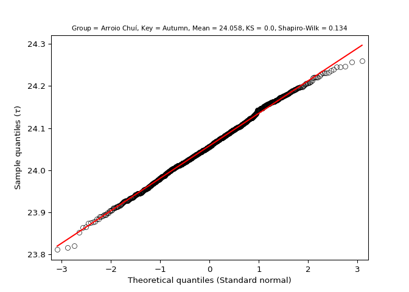

- Winter

``` python
stats = entrainment.analyze_data(
    x = south_by_season, key = "winter", name = y_name
    )
#> ---------------------------------------------------------
#> 
#> [Group: Arroio Chuí | Key: Winter]
#> 
#> Mean = 24.037557582385926
#> Var. = 0.002706928630803384
#> SD = 0.05202815229088367
#> 
#> Min. = 23.87012757312597
#> 1st Qu. = 24.004276550041602
#> Median = 24.032366711768862
#> 3rd Qu. = 24.06958041999065
#> Max. = 24.198872616169783
#> 
#> Kurtosis = 0.18311636987346258
#> Skewness = 0.3248345498530939
#> 
#> Kolmogorov-Smirnov test p-value = 0.0
#> Shapiro-Wilks test p-value = 3.12549241243687e-06
#> 
#> ---------------------------------------------------------
```

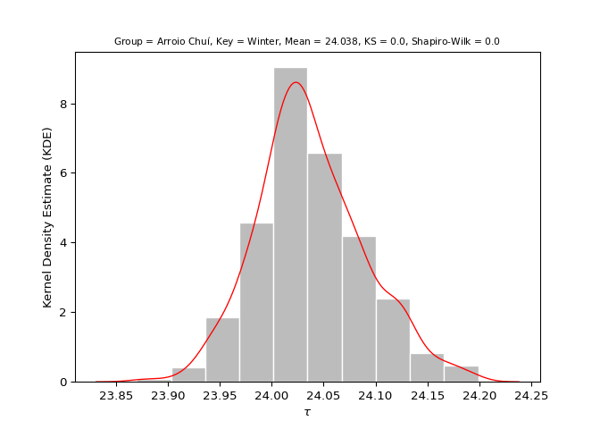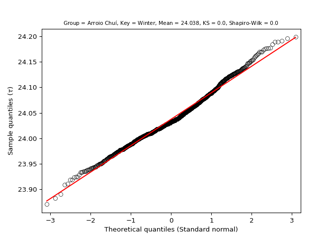

- Spring

``` python
stats = entrainment.analyze_data(
    x = south_by_season, key = "spring", name = y_name
    )
#> ---------------------------------------------------------
#> 
#> [Group: Arroio Chuí | Key: Spring]
#> 
#> Mean = 24.01726202357981
#> Var. = 0.0005676677494118887
#> SD = 0.02382577909349217
#> 
#> Min. = 23.934871812473812
#> 1st Qu. = 24.00218829868047
#> Median = 24.0149803741755
#> 3rd Qu. = 24.03137954891986
#> Max. = 24.09048276144206
#> 
#> Kurtosis = 0.1775933380388337
#> Skewness = 0.2613640514874715
#> 
#> Kolmogorov-Smirnov test p-value = 0.0
#> Shapiro-Wilks test p-value = 4.7572080802638084e-05
#> 
#> ---------------------------------------------------------
```

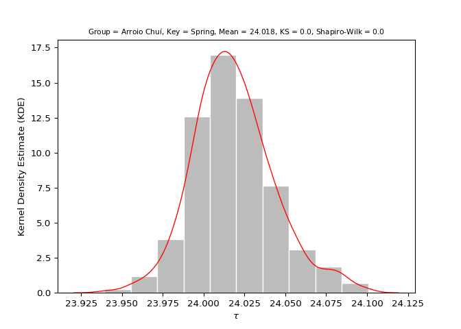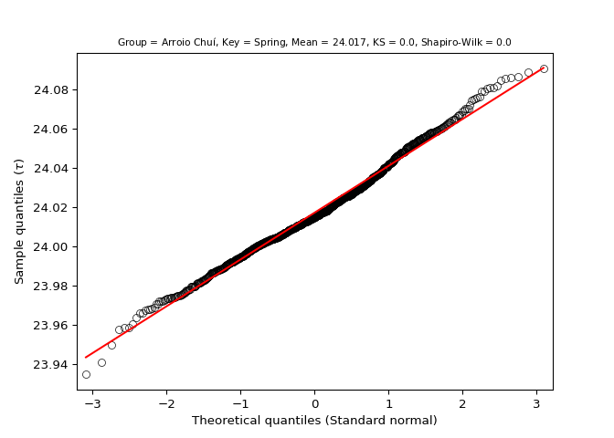

- Annual

``` python
stats = entrainment.analyze_data(
    x = south_by_year, key = "annual", name = y_name
    )
#> ---------------------------------------------------------
#> 
#> [Group: Arroio Chuí | Key: Annual]
#> 
#> Mean = 24.035368985332344
#> Var. = 0.002529064157943286
#> SD = 0.05028980172901148
#> 
#> Min. = 23.871148028502073
#> 1st Qu. = 24.002293041749617
#> Median = 24.031003153756895
#> 3rd Qu. = 24.06200565411423
#> Max. = 24.197939958959232
#> 
#> Kurtosis = 0.5276776867366424
#> Skewness = 0.36044562894907933
#> 
#> Kolmogorov-Smirnov test p-value = 0.0
#> Shapiro-Wilks test p-value = 5.5005273225106066e-08
#> 
#> ---------------------------------------------------------
```

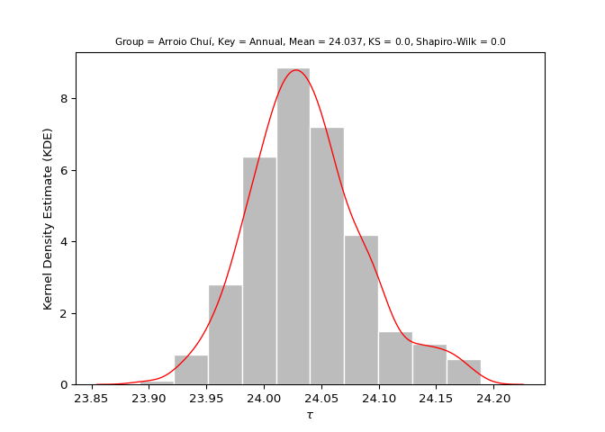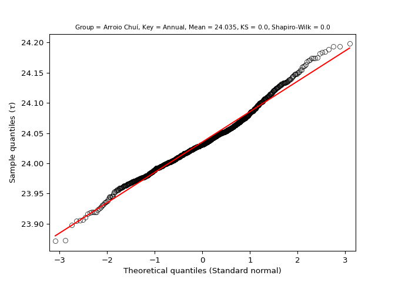

## 4. Test the hypothesis

For more information about the values presented, see
[`scipy.stats.ttest_ind`](https://docs.scipy.org/doc/scipy/reference/generated/scipy.stats.ttest_ind.html).

> Hypothesis statement: Populations residing close to the equator
> (latitude 0°) (i.e., with greater average insolation) have, on
> average, a shorter duration/morning circadian phenotype when compared
> to populations residing near the planet’s poles (i.e., with lower
> average insolation) ([Leocadio-Miguel et al.,
> 2017](https://doi.org/10.1038/s41598-017-05797-w); [Roenneberg et al.,
> 2003](https://doi.org/10.1177/0748730402239679)).

- Unentrained (Control)

``` python
test = entrainment.test_hypothesis(
    key = "unentrain", x = north_by_season, y = south_by_season,
    x_name = x_name, y_name = y_name, lam_c = lam_c, n_cycles = n_cycles,
    repetitions = repetitions
    )
#> ---------------------------------------------------------
#> 
#> [Group: Nascente do rio Ailã | Key: Unentrain]
#> 
#> Mean = 24.154505800464104
#> Var. = 0.03761669520401661
#> SD = 0.19395023898932584
#> 
#> ---------------------------------------------------------
#> 
#> [Group: Arroio Chuí | Key: Unentrain]
#> 
#> Mean = 24.148973214245114
#> Var. = 0.03863887103430195
#> SD = 0.1965677263293798
#> 
#> ---------------------------------------------------------
#> 
#> [Groups: Nascente do rio Ailã & Arroio Chuí | Key: Unentrain]
#> 
#> Variance ratio: 0.03863887103430195 / 0.03761669520401661 = 1.0271734618031036
#> Ratio test: 1.0271734618031036 < 2: TRUE
#> 
#> Standard t-test statistic = 0.6332499433320171
#> Standard t-test p-value = 0.5266429102858982
#> Welch’s t-test statistic = 0.6332499433320171
#> Welch’s t-test p-value = 0.5266429233071774
#> 
#> Cohen's d = 0.02833396892874807
#> Coefficient of determination (R squared) = 0.00012766526997796563
#> 
#> ---------------------------------------------------------
```

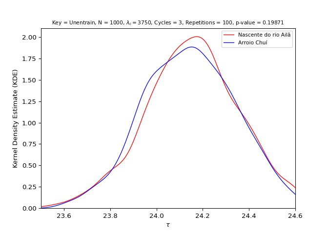

- Summer

``` python
test = entrainment.test_hypothesis(
    key = "summer", x = north_by_season, y = south_by_season,
    x_name = x_name, y_name = y_name, lam_c = lam_c, n_cycles = n_cycles,
    repetitions = repetitions
    )
#> ---------------------------------------------------------
#> 
#> [Group: Nascente do rio Ailã | Key: Summer]
#> 
#> Mean = 24.00740532076041
#> Var. = 0.00012314512796345812
#> SD = 0.011097077451449012
#> 
#> ---------------------------------------------------------
#> 
#> [Group: Arroio Chuí | Key: Summer]
#> 
#> Mean = 24.0157770233931
#> Var. = 0.00046006166546071583
#> SD = 0.021449048124817002
#> 
#> ---------------------------------------------------------
#> 
#> [Groups: Nascente do rio Ailã & Arroio Chuí | Key: Summer]
#> 
#> Variance ratio: 0.00046006166546071583 / 0.00012314512796345812 = 3.735930710935099
#> Ratio test: 3.735930710935099 < 2: FALSE
#> 
#> Standard t-test statistic = -10.956838254032183
#> Standard t-test p-value = 3.593136925565794e-27
#> Welch’s t-test statistic = -10.956838254032185
#> Welch’s t-test p-value = 6.284535823392327e-27
#> 
#> Cohen's d = 0.4902498893462906
#> Coefficient of determination (R squared) = 1.293899572258378e-06
#> 
#> ---------------------------------------------------------
```

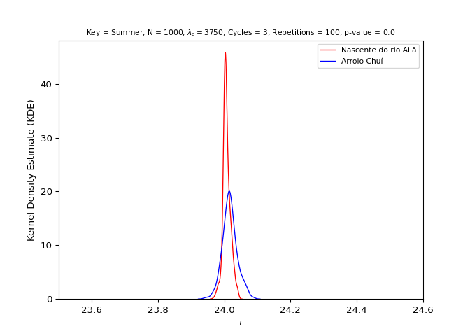

> - (R1) Mean Tau North != Mean Tau South (p-value \< 0.05) (Welch’s
>   t-test): **TRUE**
> - (R2) Mean Tau North \< Mean Tau South: **TRUE**
> - Hypothesis: R1 & R2: **TRUE** (**CONFIRMED**)

- Autumn

``` python
test = entrainment.test_hypothesis(
    key = "autumn", x = north_by_season, y = south_by_season,
    x_name = x_name, y_name = y_name, lam_c = lam_c, n_cycles = n_cycles,
    repetitions = repetitions
    )
#> ---------------------------------------------------------
#> 
#> [Group: Nascente do rio Ailã | Key: Autumn]
#> 
#> Mean = 24.0067779627879
#> Var. = 0.00010552638459691193
#> SD = 0.010272603593875893
#> 
#> ---------------------------------------------------------
#> 
#> [Group: Arroio Chuí | Key: Autumn]
#> 
#> Mean = 24.05828590657691
#> Var. = 0.005951026206706464
#> SD = 0.07714289472599835
#> 
#> ---------------------------------------------------------
#> 
#> [Groups: Nascente do rio Ailã & Arroio Chuí | Key: Autumn]
#> 
#> Variance ratio: 0.005951026206706464 / 0.00010552638459691193 = 56.393727781332636
#> Ratio test: 56.393727781332636 < 2: FALSE
#> 
#> Standard t-test statistic = -20.919158516175976
#> Standard t-test p-value = 4.976191185392721e-88
#> Welch’s t-test statistic = -20.919158516175976
#> Welch’s t-test p-value = 2.570195166678684e-81
#> 
#> Cohen's d = 0.9360013272075687
#> Coefficient of determination (R squared) = 3.987751157045108e-05
#> 
#> ---------------------------------------------------------
```

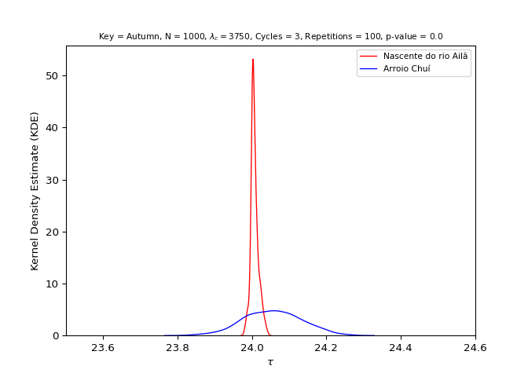

> - (R1) Mean Tau North != Mean Tau South (p-value \< 0.05) (Welch’s
>   t-test): **TRUE**
> - (R2) Mean Tau North \< Mean Tau South: **TRUE**
> - Hypothesis: R1 & R2: **TRUE** (**CONFIRMED**)

- Winter

``` python
test = entrainment.test_hypothesis(
    key = "winter", x = north_by_season, y = south_by_season,
    x_name = x_name, y_name = y_name, lam_c = lam_c, n_cycles = n_cycles,
    repetitions = repetitions
    )
#> ---------------------------------------------------------
#> 
#> [Group: Nascente do rio Ailã | Key: Winter]
#> 
#> Mean = 24.006512119306784
#> Var. = 9.542243179469406e-05
#> SD = 0.009768440601994468
#> 
#> ---------------------------------------------------------
#> 
#> [Group: Arroio Chuí | Key: Winter]
#> 
#> Mean = 24.037557582385926
#> Var. = 0.002706928630803384
#> SD = 0.05202815229088367
#> 
#> ---------------------------------------------------------
#> 
#> [Groups: Nascente do rio Ailã & Arroio Chuí | Key: Winter]
#> 
#> Variance ratio: 0.002706928630803384 / 9.542243179469406e-05 = 28.367843701861116
#> Ratio test: 28.367843701861116 < 2: FALSE
#> 
#> Standard t-test statistic = -18.53615345566007
#> Standard t-test p-value = 6.619155911615602e-71
#> Welch’s t-test statistic = -18.536153455660067
#> Welch’s t-test p-value = 9.897975438093863e-67
#> 
#> Cohen's d = 0.8293767754761744
#> Coefficient of determination (R squared) = 6.6048197514724445e-06
#> 
#> ---------------------------------------------------------
```


> - (R1) Mean Tau North != Mean Tau South (p-value \< 0.05) (Welch’s
>   t-test): **TRUE**
> - (R2) Mean Tau North \< Mean Tau South: **TRUE**
> - Hypothesis: R1 & R2: **TRUE** (**CONFIRMED**)

- Spring

``` python
test = entrainment.test_hypothesis(
    key = "spring", x = north_by_season, y = south_by_season,
    x_name = x_name, y_name = y_name, lam_c = lam_c, n_cycles = n_cycles,
    repetitions = repetitions
    )
#> ---------------------------------------------------------
#> 
#> [Group: Nascente do rio Ailã | Key: Spring]
#> 
#> Mean = 24.006265300940086
#> Var. = 8.713282304979183e-05
#> SD = 0.009334496400438099
#> 
#> ---------------------------------------------------------
#> 
#> [Group: Arroio Chuí | Key: Spring]
#> 
#> Mean = 24.01726202357981
#> Var. = 0.0005676677494118887
#> SD = 0.02382577909349217
#> 
#> ---------------------------------------------------------
#> 
#> [Groups: Nascente do rio Ailã & Arroio Chuí | Key: Spring]
#> 
#> Variance ratio: 0.0005676677494118887 / 8.713282304979183e-05 = 6.5149702436187145
#> Ratio test: 6.5149702436187145 < 2: FALSE
#> 
#> Standard t-test statistic = -13.58286831576456
#> Standard t-test p-value = 2.9273420748365536e-40
#> Welch’s t-test statistic = -13.58286831576456
#> Welch’s t-test p-value = 2.162972064720672e-39
#> 
#> Cohen's d = 0.6077482878200068
#> Coefficient of determination (R squared) = 9.787719569348773e-05
#> 
#> ---------------------------------------------------------
```

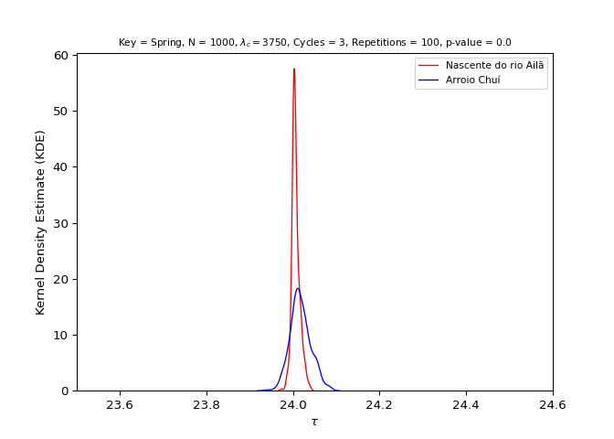

> - (R1) Mean Tau North != Mean Tau South (p-value \< 0.05) (Welch’s
>   t-test): **TRUE**
> - (R2) Mean Tau North \< Mean Tau South: **TRUE**
> - Hypothesis: R1 & R2: **TRUE** (**CONFIRMED**)

- Annual

``` python
test = entrainment.test_hypothesis(
    key = "annual", x = north_by_year, y = south_by_year,
    x_name = x_name, y_name = y_name, lam_c = lam_c, n_cycles = n_cycles,
    repetitions = repetitions
    )
#> ---------------------------------------------------------
#> 
#> [Group: Nascente do rio Ailã | Key: Annual]
#> 
#> Mean = 24.030829408697947
#> Var. = 0.0016894286084883892
#> SD = 0.04110265938462363
#> 
#> ---------------------------------------------------------
#> 
#> [Group: Arroio Chuí | Key: Annual]
#> 
#> Mean = 24.035368985332344
#> Var. = 0.002529064157943286
#> SD = 0.05028980172901148
#> 
#> ---------------------------------------------------------
#> 
#> [Groups: Nascente do rio Ailã & Arroio Chuí | Key: Annual]
#> 
#> Variance ratio: 0.002529064157943286 / 0.0016894286084883892 = 1.496993803251715
#> Ratio test: 1.496993803251715 < 2: TRUE
#> 
#> Standard t-test statistic = -2.209120682769497
#> Standard t-test p-value = 0.0272793341368823
#> Welch’s t-test statistic = -2.209120682769497
#> Welch’s t-test p-value = 0.027283816669099147
#> 
#> Cohen's d = 0.09884431486261917
#> Coefficient of determination (R squared) = 2.0827222699101472e-05
#> 
#> ---------------------------------------------------------
```

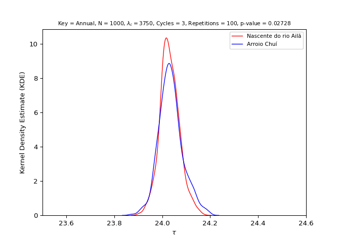

> - (R1) Mean Tau North != Mean Tau South (p-value \< 0.05) (Standard
>   t-test): **TRUE**
> - (R2) Mean Tau North \< Mean Tau South: **TRUE**
> - Hypothesis: R1 & R2: **TRUE** (**CONFIRMED**)
