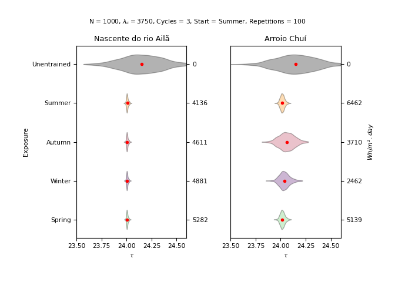
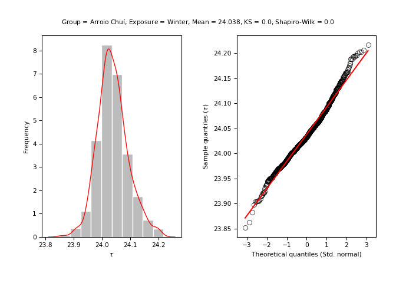
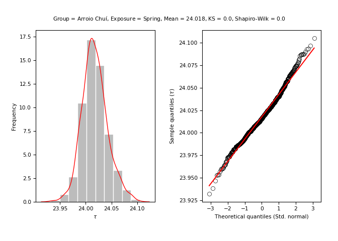
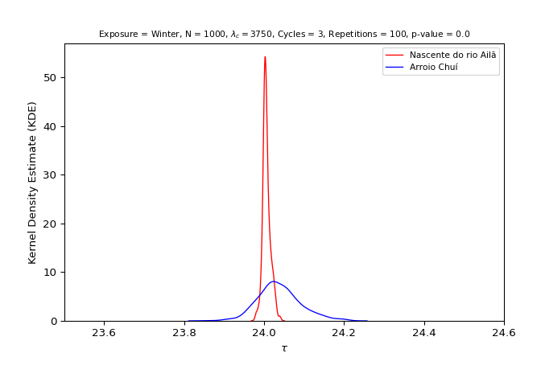

<!-- hypothesis-test.md is generated from hypothesis-test.Rmd. Please edit that file -->

# Latitude hypothesis test

The following topics show the basic steps for testing the latitude
hypothesis using the `entrainment` model.

```{admonition} Hypothesis statement
Populations residing close to the equator (latitude 0°) (i.e., with greater average insolation) have, on average, a shorter duration/morning circadian period when compared to populations residing near the planet's poles (i.e., with lower average insolation) ([Leocadio-Miguel et al., 2017](https://doi.org/10.1038/s41598-017-05797-w); [Roenneberg et al., 2003](https://doi.org/10.1177/0748730402239679)).
```

In mathematical terms, this hypothesis can be written as follows:

```{math}
\begin{cases}
H_{0} : \mu_{\text{equator}} \ge \mu_{\text{poles}} \\
H_{a} : \mu_{\text{equator}} < \mu_{\text{poles}}
\end{cases}
```

The latitude hypothesis is based on the idea that regions located at
latitudes close to the poles have, on average, a lower incidence of
annual sunlight when compared to regions close to the equator (latitude
0°).

<div class="figure" style="text-align: center">


<p class="caption">
Monthly values of available insolation in Wm-2 for the equator (0°),
30°, 60°, and 90° North.
</p>

</div>

> Figure credits: Pidwirny
> ([2019](http://www.physicalgeography.net/fundamentals/6i.html)).

Thus, it is understood by deduction that the regions close to the
equator have a stronger solar
[zeitgeber](https://en.wikipedia.org/wiki/Zeitgeber), which, according
to theory, should generate a greater propensity for synchronizing the
circadian rhythms of these populations to the light-dark cycle, reducing
the amplitude and the diversity of circadian phenotypes. This would also
give these populations a morning characteristic when compared to
populations living far from the equator, in which the opposite would
occur, i.e., a greater amplitude and diversity of circadian phenotypes
and an evening characteristic when compared to populations living near
the equator. ([Roenneberg et al.,
2003](https://doi.org/10.1177/0748730402239679)).

<div class="figure" style="text-align: center">


<p class="caption">
Hypothetical distribution of chronotypes (circadian phenotypes) for
populations exposed to a strong (black) solar zeitgeber and a weak
(striped) zeitgeber based on mid-sleep phase.
</p>

</div>

> Figure credits: Roenneberg et
> al. ([2003](https://doi.org/10.1177/0748730402239679)).

## 1. Do the initial setup

``` python
import entrainment
```

## 2. Run the model for both groups

``` python
n = 10**3
lam_c = 3750
n_cycles = 3
repetitions = 10**2
x_name = "Nascente do rio Ailã"
y_name = "Arroio Chuí"
```

### By season

- North group (Location: Nascente do Rio Ailã) (Latitude: 5.272)

``` python
north_by_season = entrainment.run_model(
    n = n, labren_id = 72272, by = "season", lam_c = lam_c, n_cycles = n_cycles,
    repetitions = repetitions, plot = False, show_progress = False
    )
```

- South group (Location: Arroio Chuí) (Latitude: -33.752)

``` python
south_by_season = entrainment.run_model(
    n = n, labren_id = 1, by = "season", lam_c = lam_c, n_cycles = n_cycles,
    repetitions = repetitions, plot = False, show_progress = False
    )
```

``` python
entrainment.plot_model_line_1_2(
    north_by_season, south_by_season, x_title = x_name, y_title = y_name
    )
```


``` python
entrainment.plot_model_violin_1_2(
    north_by_season, south_by_season, x_title = x_name, y_title = y_name
    )
```



### By year

- North group (Location: Nascente do Rio Ailã) (Latitude: 5.272)

``` python
north_by_year = entrainment.run_model(
    n = n, labren_id = 72272, by = "year", lam_c = lam_c, n_cycles = n_cycles,
    repetitions = repetitions, plot = False, show_progress = False
    )
```

- South group (Location: Arroio Chuí) (Latitude: -33.752)

``` python
south_by_year = entrainment.run_model(
    n = n, labren_id = 1, by = "year", lam_c = lam_c, n_cycles = n_cycles,
    repetitions = repetitions, plot = False, show_progress = False
    )
```

``` python
entrainment.plot_model_line_1_2(
    north_by_year, south_by_year, x_title = x_name, y_title = y_name
    )
```


## 3. Analyze the distributions of both groups

For more information about the values presented, see
[`scipy.stats.kstest()`](https://docs.scipy.org/doc/scipy/reference/generated/scipy.stats.kstest.html)
and
[`scipy.stats.shapiro()`](https://docs.scipy.org/doc/scipy/reference/generated/scipy.stats.shapiro.html).

### North group (Location: Nascente do Rio Ailã) (Latitude: 5.272)

- Unentrained (Control)

``` python
stats = entrainment.analyze_model(
    model = north_by_season, exposure = "unentrained", name = x_name
    )
#> ---------------------------------------------------------
#> 
#> [Group: Nascente do rio Ailã | Exposure: Unentrained]
#> 
#> Mean = 24.148469728740682
#> Var. = 0.04081896119474018
#> SD = 0.20203702926627135
#> 
#> Min. = 23.56882916499755
#> 1st Qu. = 24.01488782294597
#> Median = 24.148234332873688
#> 3rd Qu. = 24.29577424685605
#> Max. = 24.6
#> 
#> Kurtosis = -0.32447057324198303
#> Skewness = -0.06893168079322273
#> 
#> Kolmogorov-Smirnov test p-value = 0.0
#> Shapiro-Wilks test p-value = 0.009946780279278755
#> 
#> ---------------------------------------------------------
```


- Summer

``` python
stats = entrainment.analyze_model(
    model = north_by_season, exposure = "summer", name = x_name
    )
#> ---------------------------------------------------------
#> 
#> [Group: Nascente do rio Ailã | Exposure: Summer]
#> 
#> Mean = 24.006999634122447
#> Var. = 0.00012367951240324957
#> SD = 0.01112112909749948
#> 
#> Min. = 23.971999202966348
#> 1st Qu. = 24.00037498014924
#> Median = 24.005294156727402
#> 3rd Qu. = 24.012480086444633
#> Max. = 24.050759364023435
#> 
#> Kurtosis = 0.954467089729472
#> Skewness = 0.542218351646886
#> 
#> Kolmogorov-Smirnov test p-value = 0.0
#> Shapiro-Wilks test p-value = 2.853525927918113e-14
#> 
#> ---------------------------------------------------------
```


- Autumn

``` python
stats = entrainment.analyze_model(
    model = north_by_season, exposure = "autumn", name = x_name
    )
#> ---------------------------------------------------------
#> 
#> [Group: Nascente do rio Ailã | Exposure: Autumn]
#> 
#> Mean = 24.006421180918203
#> Var. = 0.00010496412004668206
#> SD = 0.01024519985391608
#> 
#> Min. = 23.97441171192965
#> 1st Qu. = 24.00036012524516
#> Median = 24.004706190747772
#> 3rd Qu. = 24.011407636606492
#> Max. = 24.046190020477425
#> 
#> Kurtosis = 1.0022899618902805
#> Skewness = 0.5642171633726051
#> 
#> Kolmogorov-Smirnov test p-value = 0.0
#> Shapiro-Wilks test p-value = 7.410792052448597e-15
#> 
#> ---------------------------------------------------------
```


- Winter

``` python
stats = entrainment.analyze_model(
    model = north_by_season, exposure = "winter", name = x_name
    )
#> ---------------------------------------------------------
#> 
#> [Group: Nascente do rio Ailã | Exposure: Winter]
#> 
#> Mean = 24.006179180043823
#> Var. = 9.583665584921525e-05
#> SD = 0.009789619801055364
#> 
#> Min. = 23.97531283237005
#> 1st Qu. = 24.000383212627224
#> Median = 24.004636268415513
#> 3rd Qu. = 24.011182950769722
#> Max. = 24.04395631085106
#> 
#> Kurtosis = 0.9914111157597341
#> Skewness = 0.5758926553372482
#> 
#> Kolmogorov-Smirnov test p-value = 0.0
#> Shapiro-Wilks test p-value = 8.827903584193459e-15
#> 
#> ---------------------------------------------------------
```


- Spring

``` python
stats = entrainment.analyze_model(
    model = north_by_season, exposure = "spring", name = x_name
    )
#> ---------------------------------------------------------
#> 
#> [Group: Nascente do rio Ailã | Exposure: Spring]
#> 
#> Mean = 24.005914032779206
#> Var. = 8.699382467490699e-05
#> SD = 0.009327048015042434
#> 
#> Min. = 23.97768925022717
#> 1st Qu. = 24.00035523993313
#> Median = 24.00462978028537
#> 3rd Qu. = 24.01054975682405
#> Max. = 24.042608994334554
#> 
#> Kurtosis = 0.9983552057654963
#> Skewness = 0.5463574023628693
#> 
#> Kolmogorov-Smirnov test p-value = 0.0
#> Shapiro-Wilks test p-value = 5.0126478082267514e-14
#> 
#> ---------------------------------------------------------
```


- Annual

``` python
stats = entrainment.analyze_model(
    model = north_by_year, exposure = "annual", name = x_name
    )
#> ---------------------------------------------------------
#> 
#> [Group: Nascente do rio Ailã | Exposure: Annual]
#> 
#> Mean = 24.029673997464037
#> Var. = 0.001781775485573474
#> SD = 0.04221108249705845
#> 
#> Min. = 23.87209663246515
#> 1st Qu. = 24.00268353458175
#> Median = 24.028647842601398
#> 3rd Qu. = 24.05371460537481
#> Max. = 24.158942185902564
#> 
#> Kurtosis = 0.557423923128376
#> Skewness = 0.12169374905078593
#> 
#> Kolmogorov-Smirnov test p-value = 0.0
#> Shapiro-Wilks test p-value = 0.00020785177184734493
#> 
#> ---------------------------------------------------------
```


### South group (Location: Arroio Chuí) (Latitude: -33.752)

- Unentrained (Control)

``` python
stats = entrainment.analyze_model(
    model = south_by_season, exposure = "unentrained", name = y_name
    )
#> ---------------------------------------------------------
#> 
#> [Group: Arroio Chuí | Exposure: Unentrained]
#> 
#> Mean = 24.151103412847707
#> Var. = 0.039084572161572656
#> SD = 0.19769818451764462
#> 
#> Min. = 23.5
#> 1st Qu. = 24.017414375153443
#> Median = 24.14923151925353
#> 3rd Qu. = 24.290143195679494
#> Max. = 24.6
#> 
#> Kurtosis = -0.2662781596078876
#> Skewness = -0.04667181704412612
#> 
#> Kolmogorov-Smirnov test p-value = 0.0
#> Shapiro-Wilks test p-value = 0.02459321916103363
#> 
#> ---------------------------------------------------------
```


- Summer

``` python
stats = entrainment.analyze_model(
    model = south_by_season, exposure = "summer", name = y_name
    )
#> ---------------------------------------------------------
#> 
#> [Group: Arroio Chuí | Exposure: Summer]
#> 
#> Mean = 24.01629854661018
#> Var. = 0.0004917129360020812
#> SD = 0.02217460114640354
#> 
#> Min. = 23.939237898632822
#> 1st Qu. = 24.001478216514602
#> Median = 24.014984627202693
#> 3rd Qu. = 24.029971643550606
#> Max. = 24.100225814299897
#> 
#> Kurtosis = 0.39990146838379914
#> Skewness = 0.28557138948926486
#> 
#> Kolmogorov-Smirnov test p-value = 0.0
#> Shapiro-Wilks test p-value = 0.00014794745948165655
#> 
#> ---------------------------------------------------------
```


- Autumn

``` python
stats = entrainment.analyze_model(
    model = south_by_season, exposure = "autumn", name = y_name
    )
#> ---------------------------------------------------------
#> 
#> [Group: Arroio Chuí | Exposure: Autumn]
#> 
#> Mean = 24.05929683328895
#> Var. = 0.006145459645120493
#> SD = 0.07839298211651662
#> 
#> Min. = 23.811796024070986
#> 1st Qu. = 24.006162585268896
#> Median = 24.057382743803288
#> 3rd Qu. = 24.11123992648173
#> Max. = 24.27454364082857
#> 
#> Kurtosis = -0.12323675651170385
#> Skewness = 0.02800175398604576
#> 
#> Kolmogorov-Smirnov test p-value = 0.0
#> Shapiro-Wilks test p-value = 0.5083744525909424
#> 
#> ---------------------------------------------------------
```


- Winter

``` python
stats = entrainment.analyze_model(
    model = south_by_season, exposure = "winter", name = y_name
    )
#> ---------------------------------------------------------
#> 
#> [Group: Arroio Chuí | Exposure: Winter]
#> 
#> Mean = 24.038179750581207
#> Var. = 0.0029098528246764266
#> SD = 0.05394305168116119
#> 
#> Min. = 23.851850036956012
#> 1st Qu. = 24.003339438897118
#> Median = 24.033182025434385
#> 3rd Qu. = 24.06865858890189
#> Max. = 24.2171437908377
#> 
#> Kurtosis = 0.5440305211695189
#> Skewness = 0.34956426859449286
#> 
#> Kolmogorov-Smirnov test p-value = 0.0
#> Shapiro-Wilks test p-value = 2.987544007737597e-07
#> 
#> ---------------------------------------------------------
```



- Spring

``` python
stats = entrainment.analyze_model(
    model = south_by_season, exposure = "spring", name = y_name
    )
#> ---------------------------------------------------------
#> 
#> [Group: Arroio Chuí | Exposure: Spring]
#> 
#> Mean = 24.01763571236592
#> Var. = 0.0006076399054779642
#> SD = 0.024650353049763086
#> 
#> Min. = 23.932207338966595
#> 1st Qu. = 24.001569417900804
#> Median = 24.015586551801725
#> 3rd Qu. = 24.032190379181696
#> Max. = 24.10501381125711
#> 
#> Kurtosis = 0.49878473675342017
#> Skewness = 0.3112905269202585
#> 
#> Kolmogorov-Smirnov test p-value = 0.0
#> Shapiro-Wilks test p-value = 6.234316515474347e-06
#> 
#> ---------------------------------------------------------
```



- Annual

``` python
stats = entrainment.analyze_model(
    model = south_by_year, exposure = "annual", name = y_name
    )
#> ---------------------------------------------------------
#> 
#> [Group: Arroio Chuí | Exposure: Annual]
#> 
#> Mean = 24.03358038331667
#> Var. = 0.002198528375430825
#> SD = 0.04688846740330531
#> 
#> Min. = 23.869188721776947
#> 1st Qu. = 24.00388076427332
#> Median = 24.031453737390798
#> 3rd Qu. = 24.059085689812864
#> Max. = 24.186916928206053
#> 
#> Kurtosis = 0.626100024394669
#> Skewness = 0.21178546601162576
#> 
#> Kolmogorov-Smirnov test p-value = 0.0
#> Shapiro-Wilks test p-value = 2.19240951082611e-06
#> 
#> ---------------------------------------------------------
```


## 4. Test the hypothesis

For more information about the values presented, see
[`scipy.stats.ttest_ind`](https://docs.scipy.org/doc/scipy/reference/generated/scipy.stats.ttest_ind.html).

```{admonition} Hypothesis statement
Populations residing close to the equator (latitude 0°) (i.e., with greater average insolation) have, on average, a shorter duration/morning circadian period when compared to populations residing near the planet's poles (i.e., with lower average insolation) ([Leocadio-Miguel et al., 2017](https://doi.org/10.1038/s41598-017-05797-w); [Roenneberg et al., 2003](https://doi.org/10.1177/0748730402239679)).
```

- Unentrained (Control)

``` python
test = entrainment.test_hypothesis(
    x = north_by_season, y = south_by_season, exposure = "unentrained",
    x_name = x_name, y_name = y_name
    )
#> ---------------------------------------------------------
#> 
#> [Group: Nascente do rio Ailã | Exposure: Unentrained]
#> 
#> Mean = 24.148469728740682
#> Var. = 0.04081896119474018
#> SD = 0.20203702926627135
#> 
#> ---------------------------------------------------------
#> 
#> [Group: Arroio Chuí | Exposure: Unentrained]
#> 
#> Mean = 24.151103412847707
#> Var. = 0.039084572161572656
#> SD = 0.19769818451764462
#> 
#> ---------------------------------------------------------
#> 
#> [Groups: Nascente do rio Ailã & Arroio Chuí | Exposure: Unentrained]
#> 
#> Variance ratio: 0.04081896119474018 / 0.039084572161572656 = 1.0443752851124402
#> Ratio test: 1.0443752851124402 < 2: TRUE
#> 
#> Standard t-test statistic = -0.29448517401917873
#> Standard t-test p-value = 0.38420889134993497
#> Welch’s t-test statistic = -0.29448517401917873
#> Welch’s t-test p-value = 0.384208898556161
#> 
#> Cohen's d = 0.013176367180915164
#> Coefficient of determination (R squared) = 0.002072050279476478
#> 
#> ---------------------------------------------------------
```


- Summer

``` python
test = entrainment.test_hypothesis(
    x = north_by_season, y = south_by_season, exposure = "summer",
    x_name = x_name, y_name = y_name
    )
#> ---------------------------------------------------------
#> 
#> [Group: Nascente do rio Ailã | Exposure: Summer]
#> 
#> Mean = 24.006999634122447
#> Var. = 0.00012367951240324957
#> SD = 0.01112112909749948
#> 
#> ---------------------------------------------------------
#> 
#> [Group: Arroio Chuí | Exposure: Summer]
#> 
#> Mean = 24.01629854661018
#> Var. = 0.0004917129360020812
#> SD = 0.02217460114640354
#> 
#> ---------------------------------------------------------
#> 
#> [Groups: Nascente do rio Ailã & Arroio Chuí | Exposure: Summer]
#> 
#> Variance ratio: 0.0004917129360020812 / 0.00012367951240324957 = 3.9757024138232446
#> Ratio test: 3.9757024138232446 < 2: FALSE
#> 
#> Standard t-test statistic = -11.8478302547822
#> Standard t-test p-value = 1.2045417316886225e-31
#> Welch’s t-test statistic = -11.8478302547822
#> Welch’s t-test p-value = 2.692513130269752e-31
#> 
#> Cohen's d = 0.5301162011096661
#> Coefficient of determination (R squared) = 0.0011273452492010561
#> 
#> ---------------------------------------------------------
```


````{admonition} Directional Student's t-test (Welch’s t-test)

```{math}
\begin{cases}
H_{0} : \mu_{\text{north}} \ge \mu_{\text{south}} \\
H_{a} : \mu_{\text{north}} < \mu_{\text{south}}
\end{cases}
```

**Reject {math}`H_{0}` in favour of {math}`H_{a}`** ({math}`\text{p-value} = 0.00000`)
````

- Autumn

``` python
test = entrainment.test_hypothesis(
    x = north_by_season, y = south_by_season, exposure = "autumn",
    x_name = x_name, y_name = y_name
    )
#> ---------------------------------------------------------
#> 
#> [Group: Nascente do rio Ailã | Exposure: Autumn]
#> 
#> Mean = 24.006421180918203
#> Var. = 0.00010496412004668206
#> SD = 0.01024519985391608
#> 
#> ---------------------------------------------------------
#> 
#> [Group: Arroio Chuí | Exposure: Autumn]
#> 
#> Mean = 24.05929683328895
#> Var. = 0.006145459645120493
#> SD = 0.07839298211651662
#> 
#> ---------------------------------------------------------
#> 
#> [Groups: Nascente do rio Ailã & Arroio Chuí | Exposure: Autumn]
#> 
#> Variance ratio: 0.006145459645120493 / 0.00010496412004668206 = 58.548193824588274
#> Ratio test: 58.548193824588274 < 2: FALSE
#> 
#> Standard t-test statistic = -21.13896654825122
#> Standard t-test p-value = 5.604139343659317e-90
#> Welch’s t-test statistic = -21.138966548251215
#> Welch’s t-test p-value = 5.198081931292546e-83
#> 
#> Cohen's d = 0.9458363599883669
#> Coefficient of determination (R squared) = 0.0013431191121989533
#> 
#> ---------------------------------------------------------
```


````{admonition} Directional Student's t-test (Welch’s t-test)

```{math}
\begin{cases}
H_{0} : \mu_{\text{north}} \ge \mu_{\text{south}} \\
H_{a} : \mu_{\text{north}} < \mu_{\text{south}}
\end{cases}
```

**Reject {math}`H_{0}` in favour of {math}`H_{a}`** ({math}`\text{p-value} = 0.00000`)
````

- Winter

``` python
test = entrainment.test_hypothesis(
    x = north_by_season, y = south_by_season, exposure = "winter",
    x_name = x_name, y_name = y_name
    )
#> ---------------------------------------------------------
#> 
#> [Group: Nascente do rio Ailã | Exposure: Winter]
#> 
#> Mean = 24.006179180043823
#> Var. = 9.583665584921525e-05
#> SD = 0.009789619801055364
#> 
#> ---------------------------------------------------------
#> 
#> [Group: Arroio Chuí | Exposure: Winter]
#> 
#> Mean = 24.038179750581207
#> Var. = 0.0029098528246764266
#> SD = 0.05394305168116119
#> 
#> ---------------------------------------------------------
#> 
#> [Groups: Nascente do rio Ailã & Arroio Chuí | Exposure: Winter]
#> 
#> Variance ratio: 0.0029098528246764266 / 9.583665584921525e-05 = 30.362628984619914
#> Ratio test: 30.362628984619914 < 2: FALSE
#> 
#> Standard t-test statistic = -18.448812194563214
#> Standard t-test p-value = 1.3196311333268488e-70
#> Welch’s t-test statistic = -18.448812194563214
#> Welch’s t-test p-value = 1.8316243991266496e-66
#> 
#> Cohen's d = 0.8254688010591621
#> Coefficient of determination (R squared) = 0.0009327582812622481
#> 
#> ---------------------------------------------------------
```



````{admonition} Directional Student's t-test (Welch’s t-test)

```{math}
\begin{cases}
H_{0} : \mu_{\text{north}} \ge \mu_{\text{south}} \\
H_{a} : \mu_{\text{north}} < \mu_{\text{south}}
\end{cases}
```

**Reject {math}`H_{0}` in favour of {math}`H_{a}`** ({math}`\text{p-value} = 0.00000`)
````

- Spring

``` python
test = entrainment.test_hypothesis(
    x = north_by_season, y = south_by_season, exposure = "spring",
    x_name = x_name, y_name = y_name
    )
#> ---------------------------------------------------------
#> 
#> [Group: Nascente do rio Ailã | Exposure: Spring]
#> 
#> Mean = 24.005914032779206
#> Var. = 8.699382467490699e-05
#> SD = 0.009327048015042434
#> 
#> ---------------------------------------------------------
#> 
#> [Group: Arroio Chuí | Exposure: Spring]
#> 
#> Mean = 24.01763571236592
#> Var. = 0.0006076399054779642
#> SD = 0.024650353049763086
#> 
#> ---------------------------------------------------------
#> 
#> [Groups: Nascente do rio Ailã & Arroio Chuí | Exposure: Spring]
#> 
#> Variance ratio: 0.0006076399054779642 / 8.699382467490699e-05 = 6.984862520399513
#> Ratio test: 6.984862520399513 < 2: FALSE
#> 
#> Standard t-test statistic = -14.05706509060415
#> Standard t-test p-value = 3.5832554548401634e-43
#> Welch’s t-test statistic = -14.05706509060415
#> Welch’s t-test p-value = 3.8125556712327585e-42
#> 
#> Cohen's d = 0.6289656236064435
#> Coefficient of determination (R squared) = 0.0009828404429039334
#> 
#> ---------------------------------------------------------
```


````{admonition} Directional Student's t-test (Welch’s t-test)

```{math}
\begin{cases}
H_{0} : \mu_{\text{north}} \ge \mu_{\text{south}} \\
H_{a} : \mu_{\text{north}} < \mu_{\text{south}}
\end{cases}
```

**Reject {math}`H_{0}` in favour of {math}`H_{a}`** ({math}`\text{p-value} = 0.00000`)
````

- Annual

``` python
test = entrainment.test_hypothesis(
    x = north_by_year, y = south_by_year, exposure = "annual",
    x_name = x_name, y_name = y_name
    )
#> ---------------------------------------------------------
#> 
#> [Group: Nascente do rio Ailã | Exposure: Annual]
#> 
#> Mean = 24.029673997464037
#> Var. = 0.001781775485573474
#> SD = 0.04221108249705845
#> 
#> ---------------------------------------------------------
#> 
#> [Group: Arroio Chuí | Exposure: Annual]
#> 
#> Mean = 24.03358038331667
#> Var. = 0.002198528375430825
#> SD = 0.04688846740330531
#> 
#> ---------------------------------------------------------
#> 
#> [Groups: Nascente do rio Ailã & Arroio Chuí | Exposure: Annual]
#> 
#> Variance ratio: 0.002198528375430825 / 0.001781775485573474 = 1.2338975326755137
#> Ratio test: 1.2338975326755137 < 2: TRUE
#> 
#> Standard t-test statistic = -1.9570402987776383
#> Standard t-test p-value = 0.02524090110161829
#> Welch’s t-test statistic = -1.9570402987776387
#> Welch’s t-test p-value = 0.02524166355939163
#> 
#> Cohen's d = 0.08756529645483169
#> Coefficient of determination (R squared) = 9.076611746535106e-06
#> 
#> ---------------------------------------------------------
```


````{admonition} Directional Student's t-test (Standard t-test)

```{math}
\begin{cases}
H_{0} : \mu_{\text{north}} \ge \mu_{\text{south}} \\
H_{a} : \mu_{\text{north}} < \mu_{\text{south}}
\end{cases}
```

**Reject {math}`H_{0}` in favour of {math}`H_{a}`** ({math}`\text{p-value} = 0.02524`)
````
