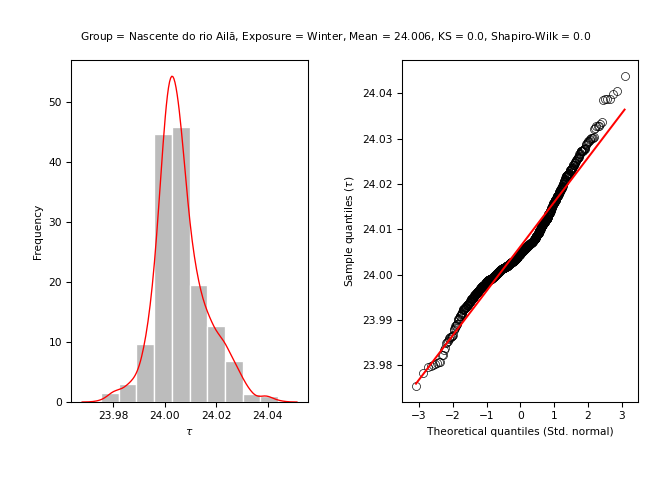
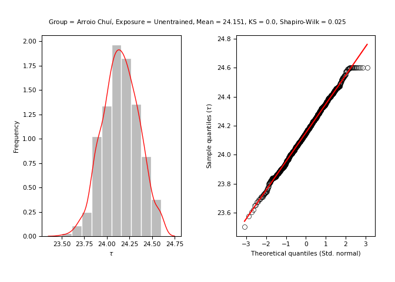
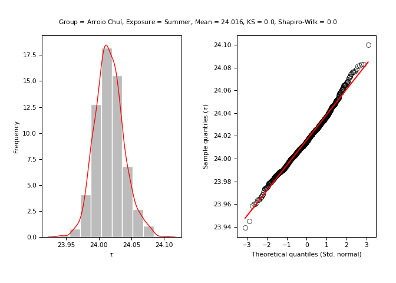
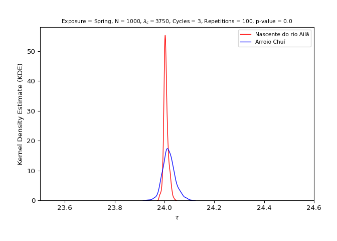

<!-- hypothesis-test.md is generated from hypothesis-test.Rmd. Please edit that file -->

# Latitude hypothesis test

The following topics show the basic steps for testing the latitude
hypothesis using the `entrainment` model.

```{admonition} Hypothesis statement
Populations residing close to the equator (latitude 0°) (i.e., with greater average insolation) have, on average, a shorter duration/morning circadian period when compared to populations residing near the planet's poles (i.e., with lower average insolation) ([Leocadio-Miguel et al., 2017](https://doi.org/10.1038/s41598-017-05797-w); [Roenneberg et al., 2003](https://doi.org/10.1177/0748730402239679)).
```

In mathematical terms, this hypothesis can be written as follows:

```{math}
\begin{cases}
H_{0} : \mu_{\text{equator}} \ge \mu_{\text{poles}} \\
H_{a} : \mu_{\text{equator}} < \mu_{\text{poles}}
\end{cases}
```

The latitude hypothesis is based on the idea that regions located at
latitudes close to the poles have, on average, a lower incidence of
annual sunlight when compared to regions close to the equator (latitude
0°).

<div class="figure" style="text-align: center">


<p class="caption">
Monthly values of available insolation in Wm-2 for the equator (0°),
30°, 60°, and 90° North.
</p>

</div>

> Figure credits: Pidwirny
> ([2019](http://www.physicalgeography.net/fundamentals/6i.html)).

Thus, it is understood by deduction that the regions close to the
equator have a stronger solar
[zeitgeber](https://en.wikipedia.org/wiki/Zeitgeber), which, according
to theory, should generate a greater propensity for synchronizing the
circadian rhythms of these populations to the light-dark cycle, reducing
the amplitude and the diversity of circadian phenotypes. This would also
give these populations a morning characteristic when compared to
populations living far from the equator, in which the opposite would
occur, i.e., a greater amplitude and diversity of circadian phenotypes
and an evening characteristic when compared to populations living near
the equator. ([Roenneberg et al.,
2003](https://doi.org/10.1177/0748730402239679)).

<div class="figure" style="text-align: center">


<p class="caption">
Hypothetical distribution of chronotypes (circadian phenotypes) for
populations exposed to a strong (black) solar zeitgeber and a weak
(striped) zeitgeber based on mid-sleep phase.
</p>

</div>

> Figure credits: Roenneberg et
> al. ([2003](https://doi.org/10.1177/0748730402239679)).

## 1. Do the initial setup

``` python
import entrainment
```

## 2. Run the model for both groups

``` python
n = 10**3
lam_c = 3750
n_cycles = 3
repetitions = 10**2
x_name = "Nascente do rio Ailã"
y_name = "Arroio Chuí"
```

### By season

- North group (Location: Nascente do Rio Ailã) (Latitude: 5.272)

``` python
north_by_season = entrainment.run_model(
    n = n, labren_id = 72272, by = "season", lam_c = lam_c, n_cycles = n_cycles,
    repetitions = repetitions, plot = False
    )
```

- South group (Location: Arroio Chuí) (Latitude: -33.752)

``` python
south_by_season = entrainment.run_model(
    n = n, labren_id = 1, by = "season", lam_c = lam_c, n_cycles = n_cycles,
    repetitions = repetitions, plot = False
    )
```

``` python
entrainment.plot_model_line_1_2(
    north_by_season, south_by_season, x_title = x_name, y_title = y_name
    )
```


``` python
entrainment.plot_model_violin_1_2(
    north_by_season, south_by_season, x_title = x_name, y_title = y_name
    )
```


### By year

- North group (Location: Nascente do Rio Ailã) (Latitude: 5.272)

``` python
north_by_year = entrainment.run_model(
    n = n, labren_id = 72272, by = "year", lam_c = lam_c, n_cycles = n_cycles,
    repetitions = repetitions, plot = False
    )
```

- South group (Location: Arroio Chuí) (Latitude: -33.752)

``` python
south_by_year = entrainment.run_model(
    n = n, labren_id = 1, by = "year", lam_c = lam_c, n_cycles = n_cycles,
    repetitions = repetitions, plot = False
    )
```

``` python
entrainment.plot_model_line_1_2(
    north_by_year, south_by_year, x_title = x_name, y_title = y_name
    )
```


## 3. Analyze the distributions of both groups

For more information about the values presented, see
[`scipy.stats.kstest()`](https://docs.scipy.org/doc/scipy/reference/generated/scipy.stats.kstest.html)
and
[`scipy.stats.shapiro()`](https://docs.scipy.org/doc/scipy/reference/generated/scipy.stats.shapiro.html).

### North group (Location: Nascente do Rio Ailã) (Latitude: 5.272)

- Unentrained (Control)

``` python
stats = entrainment.analyze_model(
    model = north_by_season, key = "unentrained", name = x_name
    )
#> ---------------------------------------------------------
#> 
#> [Group: Nascente do rio Ailã | Key: Unentrained]
#> 
#> Mean = 24.148469728740682
#> Var. = 0.040818961194739246
#> SD = 0.202037029266269
#> 
#> Min. = 23.568829164997585
#> 1st Qu. = 24.014887822945944
#> Median = 24.14823433287365
#> 3rd Qu. = 24.295774246856055
#> Max. = 24.599999999999955
#> 
#> Kurtosis = -0.3244705732420554
#> Skewness = -0.0689316807932809
#> 
#> Kolmogorov-Smirnov test p-value = 0.0
#> Shapiro-Wilks test p-value = 0.009946780279278755
#> 
#> ---------------------------------------------------------
```


- Summer

``` python
stats = entrainment.analyze_model(
    model = north_by_season, key = "summer", name = x_name
    )
#> ---------------------------------------------------------
#> 
#> [Group: Nascente do rio Ailã | Key: Summer]
#> 
#> Mean = 24.006995965050482
#> Var. = 0.0001234271288915939
#> SD = 0.011109776275496907
#> 
#> Min. = 23.971257525111987
#> 1st Qu. = 24.00037154834934
#> Median = 24.00525352529282
#> 3rd Qu. = 24.012539381260158
#> Max. = 24.050329256493637
#> 
#> Kurtosis = 0.9538802011502892
#> Skewness = 0.5351120303123005
#> 
#> Kolmogorov-Smirnov test p-value = 0.0
#> Shapiro-Wilks test p-value = 3.317826699142379e-14
#> 
#> ---------------------------------------------------------
```


- Autumn

``` python
stats = entrainment.analyze_model(
    model = north_by_season, key = "autumn", name = x_name
    )
#> ---------------------------------------------------------
#> 
#> [Group: Nascente do rio Ailã | Key: Autumn]
#> 
#> Mean = 24.0064154810211
#> Var. = 0.00010467715230505737
#> SD = 0.010231185283487801
#> 
#> Min. = 23.97363986774036
#> 1st Qu. = 24.00036055377057
#> Median = 24.00468835116519
#> 3rd Qu. = 24.011513729496713
#> Max. = 24.045825944566282
#> 
#> Kurtosis = 0.9953106392268829
#> Skewness = 0.5554329744519115
#> 
#> Kolmogorov-Smirnov test p-value = 0.0
#> Shapiro-Wilks test p-value = 8.974242925391743e-15
#> 
#> ---------------------------------------------------------
```


- Winter

``` python
stats = entrainment.analyze_model(
    model = north_by_season, key = "winter", name = x_name
    )
#> ---------------------------------------------------------
#> 
#> [Group: Nascente do rio Ailã | Key: Winter]
#> 
#> Mean = 24.00617431989238
#> Var. = 9.574757678018412e-05
#> SD = 0.009785069073858607
#> 
#> Min. = 23.97383642696353
#> 1st Qu. = 24.00038329843497
#> Median = 24.00461954889405
#> 3rd Qu. = 24.01119341652435
#> Max. = 24.04356678006749
#> 
#> Kurtosis = 0.9966881870158679
#> Skewness = 0.5648724503943595
#> 
#> Kolmogorov-Smirnov test p-value = 0.0
#> Shapiro-Wilks test p-value = 1.0411014938875324e-14
#> 
#> ---------------------------------------------------------
```



- Spring

``` python
stats = entrainment.analyze_model(
    model = north_by_season, key = "spring", name = x_name
    )
#> ---------------------------------------------------------
#> 
#> [Group: Nascente do rio Ailã | Key: Spring]
#> 
#> Mean = 24.005911840975
#> Var. = 8.685058474338858e-05
#> SD = 0.009319366112745468
#> 
#> Min. = 23.976282510465744
#> 1st Qu. = 24.000354842709402
#> Median = 24.004664591590412
#> 3rd Qu. = 24.01054831834171
#> Max. = 24.042270666438387
#> 
#> Kurtosis = 0.9999880338095837
#> Skewness = 0.5367843387525771
#> 
#> Kolmogorov-Smirnov test p-value = 0.0
#> Shapiro-Wilks test p-value = 6.150836133825277e-14
#> 
#> ---------------------------------------------------------
```


- Annual

``` python
stats = entrainment.analyze_model(
    model = north_by_year, key = "annual", name = x_name
    )
#> ---------------------------------------------------------
#> 
#> [Group: Nascente do rio Ailã | Key: Annual]
#> 
#> Mean = 24.030234201105507
#> Var. = 0.001909599460644535
#> SD = 0.04369896406832243
#> 
#> Min. = 23.861649150736188
#> 1st Qu. = 24.0013162712693
#> Median = 24.027996977038732
#> 3rd Qu. = 24.05595032071614
#> Max. = 24.170386035139455
#> 
#> Kurtosis = 0.5440819937986716
#> Skewness = 0.25174587159298395
#> 
#> Kolmogorov-Smirnov test p-value = 0.0
#> Shapiro-Wilks test p-value = 1.025050733005628e-05
#> 
#> ---------------------------------------------------------
```


### South group (Location: Arroio Chuí) (Latitude: -33.752)

- Unentrained (Control)

``` python
stats = entrainment.analyze_model(
    model = south_by_season, key = "unentrained", name = y_name
    )
#> ---------------------------------------------------------
#> 
#> [Group: Arroio Chuí | Key: Unentrained]
#> 
#> Mean = 24.140273866805636
#> Var. = 0.037689591881623914
#> SD = 0.19413807427092686
#> 
#> Min. = 23.519294176886472
#> 1st Qu. = 24.002384878676054
#> Median = 24.140140554918542
#> 3rd Qu. = 24.269489700115212
#> Max. = 24.599999999999955
#> 
#> Kurtosis = -0.310118586924363
#> Skewness = -0.007950294324615526
#> 
#> Kolmogorov-Smirnov test p-value = 0.0
#> Shapiro-Wilks test p-value = 0.04520909860730171
#> 
#> ---------------------------------------------------------
```



- Summer

``` python
stats = entrainment.analyze_model(
    model = south_by_season, key = "summer", name = y_name
    )
#> ---------------------------------------------------------
#> 
#> [Group: Arroio Chuí | Key: Summer]
#> 
#> Mean = 24.014613662467003
#> Var. = 0.00045508737258969566
#> SD = 0.021332776954482408
#> 
#> Min. = 23.96122232562166
#> 1st Qu. = 24.000249199451257
#> Median = 24.013659764592724
#> 3rd Qu. = 24.02750512064022
#> Max. = 24.08822024315919
#> 
#> Kurtosis = 0.4592799696305674
#> Skewness = 0.33786937780808246
#> 
#> Kolmogorov-Smirnov test p-value = 0.0
#> Shapiro-Wilks test p-value = 8.680566679686308e-06
#> 
#> ---------------------------------------------------------
```



- Autumn

``` python
stats = entrainment.analyze_model(
    model = south_by_season, key = "autumn", name = y_name
    )
#> ---------------------------------------------------------
#> 
#> [Group: Arroio Chuí | Key: Autumn]
#> 
#> Mean = 24.05448107382895
#> Var. = 0.005801675506208097
#> SD = 0.07616873050148662
#> 
#> Min. = 23.830693988601798
#> 1st Qu. = 24.000959497378975
#> Median = 24.054268026247517
#> 3rd Qu. = 24.107969366389785
#> Max. = 24.271478300476986
#> 
#> Kurtosis = -0.18073782846278652
#> Skewness = 0.07503340864718515
#> 
#> Kolmogorov-Smirnov test p-value = 0.0
#> Shapiro-Wilks test p-value = 0.23703059554100037
#> 
#> ---------------------------------------------------------
```


- Winter

``` python
stats = entrainment.analyze_model(
    model = south_by_season, key = "winter", name = y_name
    )
#> ---------------------------------------------------------
#> 
#> [Group: Arroio Chuí | Key: Winter]
#> 
#> Mean = 24.03444513237023
#> Var. = 0.0026482850031919456
#> SD = 0.051461490487469806
#> 
#> Min. = 23.90250623200703
#> 1st Qu. = 24.00058057379242
#> Median = 24.03090241355089
#> 3rd Qu. = 24.06214931367104
#> Max. = 24.212034829919492
#> 
#> Kurtosis = 0.602181410835974
#> Skewness = 0.44420062481386435
#> 
#> Kolmogorov-Smirnov test p-value = 0.0
#> Shapiro-Wilks test p-value = 1.7472565616571956e-08
#> 
#> ---------------------------------------------------------
```


- Spring

``` python
stats = entrainment.analyze_model(
    model = south_by_season, key = "spring", name = y_name
    )
#> ---------------------------------------------------------
#> 
#> [Group: Arroio Chuí | Key: Spring]
#> 
#> Mean = 24.01591273986558
#> Var. = 0.0005546405024829464
#> SD = 0.023550806832950466
#> 
#> Min. = 23.951319961209837
#> 1st Qu. = 24.000251681867304
#> Median = 24.01441412758797
#> 3rd Qu. = 24.02928835048165
#> Max. = 24.096676560695613
#> 
#> Kurtosis = 0.5768150413929845
#> Skewness = 0.402607827013546
#> 
#> Kolmogorov-Smirnov test p-value = 0.0
#> Shapiro-Wilks test p-value = 2.791364863696799e-07
#> 
#> ---------------------------------------------------------
```


- Annual

``` python
stats = entrainment.analyze_model(
    model = south_by_year, key = "annual", name = y_name
    )
#> ---------------------------------------------------------
#> 
#> [Group: Arroio Chuí | Key: Annual]
#> 
#> Mean = 24.03668436161031
#> Var. = 0.0025144117614447252
#> SD = 0.05014391051209235
#> 
#> Min. = 23.856377882884228
#> 1st Qu. = 24.005248685004304
#> Median = 24.030332159906173
#> 3rd Qu. = 24.064717866093254
#> Max. = 24.20022358294799
#> 
#> Kurtosis = 0.5781916695220324
#> Skewness = 0.32595701632356366
#> 
#> Kolmogorov-Smirnov test p-value = 0.0
#> Shapiro-Wilks test p-value = 5.427308824579313e-09
#> 
#> ---------------------------------------------------------
```


## 4. Test the hypothesis

For more information about the values presented, see
[`scipy.stats.ttest_ind`](https://docs.scipy.org/doc/scipy/reference/generated/scipy.stats.ttest_ind.html).

```{admonition} Hypothesis statement
Populations residing close to the equator (latitude 0°) (i.e., with greater average insolation) have, on average, a shorter duration/morning circadian period when compared to populations residing near the planet's poles (i.e., with lower average insolation) ([Leocadio-Miguel et al., 2017](https://doi.org/10.1038/s41598-017-05797-w); [Roenneberg et al., 2003](https://doi.org/10.1177/0748730402239679)).
```

- Unentrained (Control)

``` python
test = entrainment.test_hypothesis(
    x = north_by_season, y = south_by_season, key = "unentrained",
    x_name = x_name, y_name = y_name
    )
#> ---------------------------------------------------------
#> 
#> [Group: Nascente do rio Ailã | Key: Unentrained]
#> 
#> Mean = 24.148469728740682
#> Var. = 0.040818961194739246
#> SD = 0.202037029266269
#> 
#> ---------------------------------------------------------
#> 
#> [Group: Arroio Chuí | Key: Unentrained]
#> 
#> Mean = 24.140273866805636
#> Var. = 0.037689591881623914
#> SD = 0.19413807427092686
#> 
#> ---------------------------------------------------------
#> 
#> [Groups: Nascente do rio Ailã & Arroio Chuí | Key: Unentrained]
#> 
#> Variance ratio: 0.040818961194739246 / 0.037689591881623914 = 1.083030066309662
#> Ratio test: 1.083030066309662 < 2: TRUE
#> 
#> Standard t-test statistic = 0.9245254936204793
#> Standard t-test p-value = 0.822337786309475
#> Welch’s t-test statistic = 0.9245254936204793
#> Welch’s t-test p-value = 0.822337697628776
#> 
#> Cohen's d = 0.0413667255495413
#> Coefficient of determination (R squared) = 0.0016318660396056571
#> 
#> ---------------------------------------------------------
```


- Summer

``` python
test = entrainment.test_hypothesis(
    x = north_by_season, y = south_by_season, key = "summer",
    x_name = x_name, y_name = y_name
    )
#> ---------------------------------------------------------
#> 
#> [Group: Nascente do rio Ailã | Key: Summer]
#> 
#> Mean = 24.006995965050482
#> Var. = 0.0001234271288915939
#> SD = 0.011109776275496907
#> 
#> ---------------------------------------------------------
#> 
#> [Group: Arroio Chuí | Key: Summer]
#> 
#> Mean = 24.014613662467003
#> Var. = 0.00045508737258969566
#> SD = 0.021332776954482408
#> 
#> ---------------------------------------------------------
#> 
#> [Groups: Nascente do rio Ailã & Arroio Chuí | Key: Summer]
#> 
#> Variance ratio: 0.00045508737258969566 / 0.0001234271288915939 = 3.6870935642471196
#> Ratio test: 3.6870935642471196 < 2: FALSE
#> 
#> Standard t-test statistic = -10.01035172624954
#> Standard t-test p-value = 2.3723670765598562e-23
#> Welch’s t-test statistic = -10.01035172624954
#> Welch’s t-test p-value = 3.505864776935381e-23
#> 
#> Cohen's d = 0.447900545059636
#> Coefficient of determination (R squared) = 0.0031110581280527705
#> 
#> ---------------------------------------------------------
```


````{admonition} Directional Student's t-test (Welch’s t-test)

```{math}
\begin{cases}
H_{0} : \mu_{\text{north}} \ge \mu_{\text{south}} \\
H_{a} : \mu_{\text{north}} < \mu_{\text{south}}
\end{cases}
```

**Reject {math}`H_{0}` in favour of {math}`H_{a}`** ({math}`\text{p-value} = 0.00000`)
````

- Autumn

``` python
test = entrainment.test_hypothesis(
    x = north_by_season, y = south_by_season, key = "autumn",
    x_name = x_name, y_name = y_name
    )
#> ---------------------------------------------------------
#> 
#> [Group: Nascente do rio Ailã | Key: Autumn]
#> 
#> Mean = 24.0064154810211
#> Var. = 0.00010467715230505737
#> SD = 0.010231185283487801
#> 
#> ---------------------------------------------------------
#> 
#> [Group: Arroio Chuí | Key: Autumn]
#> 
#> Mean = 24.05448107382895
#> Var. = 0.005801675506208097
#> SD = 0.07616873050148662
#> 
#> ---------------------------------------------------------
#> 
#> [Groups: Nascente do rio Ailã & Arroio Chuí | Key: Autumn]
#> 
#> Variance ratio: 0.005801675506208097 / 0.00010467715230505737 = 55.42446826696674
#> Ratio test: 55.42446826696674 < 2: FALSE
#> 
#> Standard t-test statistic = -19.767755458075516
#> Standard t-test p-value = 6.956198190137544e-80
#> Welch’s t-test statistic = -19.767755458075516
#> Welch’s t-test p-value = 2.4258983827028553e-74
#> 
#> Cohen's d = 0.8844832515784975
#> Coefficient of determination (R squared) = 0.0022161864233293
#> 
#> ---------------------------------------------------------
```


````{admonition} Directional Student's t-test (Welch’s t-test)

```{math}
\begin{cases}
H_{0} : \mu_{\text{north}} \ge \mu_{\text{south}} \\
H_{a} : \mu_{\text{north}} < \mu_{\text{south}}
\end{cases}
```

**Reject {math}`H_{0}` in favour of {math}`H_{a}`** ({math}`\text{p-value} = 0.00000`)
````

- Winter

``` python
test = entrainment.test_hypothesis(
    x = north_by_season, y = south_by_season, key = "winter",
    x_name = x_name, y_name = y_name
    )
#> ---------------------------------------------------------
#> 
#> [Group: Nascente do rio Ailã | Key: Winter]
#> 
#> Mean = 24.00617431989238
#> Var. = 9.574757678018412e-05
#> SD = 0.009785069073858607
#> 
#> ---------------------------------------------------------
#> 
#> [Group: Arroio Chuí | Key: Winter]
#> 
#> Mean = 24.03444513237023
#> Var. = 0.0026482850031919456
#> SD = 0.051461490487469806
#> 
#> ---------------------------------------------------------
#> 
#> [Groups: Nascente do rio Ailã & Arroio Chuí | Key: Winter]
#> 
#> Variance ratio: 0.0026482850031919456 / 9.574757678018412e-05 = 27.65902900364611
#> Ratio test: 27.65902900364611 < 2: FALSE
#> 
#> Standard t-test statistic = -17.057932922606906
#> Standard t-test p-value = 2.575243332161182e-61
#> Welch’s t-test statistic = -17.057932922606906
#> Welch’s t-test p-value = 3.340259605387855e-58
#> 
#> Cohen's d = 0.7632356646961522
#> Coefficient of determination (R squared) = 0.0032668264346061185
#> 
#> ---------------------------------------------------------
```


````{admonition} Directional Student's t-test (Welch’s t-test)

```{math}
\begin{cases}
H_{0} : \mu_{\text{north}} \ge \mu_{\text{south}} \\
H_{a} : \mu_{\text{north}} < \mu_{\text{south}}
\end{cases}
```

**Reject {math}`H_{0}` in favour of {math}`H_{a}`** ({math}`\text{p-value} = 0.00000`)
````

- Spring

``` python
test = entrainment.test_hypothesis(
    x = north_by_season, y = south_by_season, key = "spring",
    x_name = x_name, y_name = y_name
    )
#> ---------------------------------------------------------
#> 
#> [Group: Nascente do rio Ailã | Key: Spring]
#> 
#> Mean = 24.005911840975
#> Var. = 8.685058474338858e-05
#> SD = 0.009319366112745468
#> 
#> ---------------------------------------------------------
#> 
#> [Group: Arroio Chuí | Key: Spring]
#> 
#> Mean = 24.01591273986558
#> Var. = 0.0005546405024829464
#> SD = 0.023550806832950466
#> 
#> ---------------------------------------------------------
#> 
#> [Groups: Nascente do rio Ailã & Arroio Chuí | Key: Spring]
#> 
#> Variance ratio: 0.0005546405024829464 / 8.685058474338858e-05 = 6.38614586328583
#> Ratio test: 6.38614586328583 < 2: FALSE
#> 
#> Standard t-test statistic = -12.48034144796878
#> Standard t-test p-value = 8.895772961733449e-35
#> Welch’s t-test statistic = -12.480341447968781
#> Welch’s t-test p-value = 3.7630512434594003e-34
#> 
#> Cohen's d = 0.5584171155961875
#> Coefficient of determination (R squared) = 0.003372472617065091
#> 
#> ---------------------------------------------------------
```



````{admonition} Directional Student's t-test (Welch’s t-test)

```{math}
\begin{cases}
H_{0} : \mu_{\text{north}} \ge \mu_{\text{south}} \\
H_{a} : \mu_{\text{north}} < \mu_{\text{south}}
\end{cases}
```

**Reject {math}`H_{0}` in favour of {math}`H_{a}`** ({math}`\text{p-value} = 0.00000`)
````

- Annual

``` python
test = entrainment.test_hypothesis(
    x = north_by_year, y = south_by_year, key = "annual",
    x_name = x_name, y_name = y_name
    )
#> ---------------------------------------------------------
#> 
#> [Group: Nascente do rio Ailã | Key: Annual]
#> 
#> Mean = 24.030234201105507
#> Var. = 0.001909599460644535
#> SD = 0.04369896406832243
#> 
#> ---------------------------------------------------------
#> 
#> [Group: Arroio Chuí | Key: Annual]
#> 
#> Mean = 24.03668436161031
#> Var. = 0.0025144117614447252
#> SD = 0.05014391051209235
#> 
#> ---------------------------------------------------------
#> 
#> [Groups: Nascente do rio Ailã & Arroio Chuí | Key: Annual]
#> 
#> Variance ratio: 0.0025144117614447252 / 0.001909599460644535 = 1.3167220735368514
#> Ratio test: 1.3167220735368514 < 2: TRUE
#> 
#> Standard t-test statistic = -3.0651035833662386
#> Standard t-test p-value = 0.001102528808631697
#> Welch’s t-test statistic = -3.0651035833662386
#> Welch’s t-test p-value = 0.0011028018624218785
#> 
#> Cohen's d = 0.13714418865563033
#> Coefficient of determination (R squared) = 0.0002350714388816278
#> 
#> ---------------------------------------------------------
```


````{admonition} Directional Student's t-test (Standard t-test)

```{math}
\begin{cases}
H_{0} : \mu_{\text{north}} \ge \mu_{\text{south}} \\
H_{a} : \mu_{\text{north}} < \mu_{\text{south}}
\end{cases}
```

**Reject {math}`H_{0}` in favour of {math}`H_{a}`** ({math}`\text{p-value} = 0.00110`)
````
