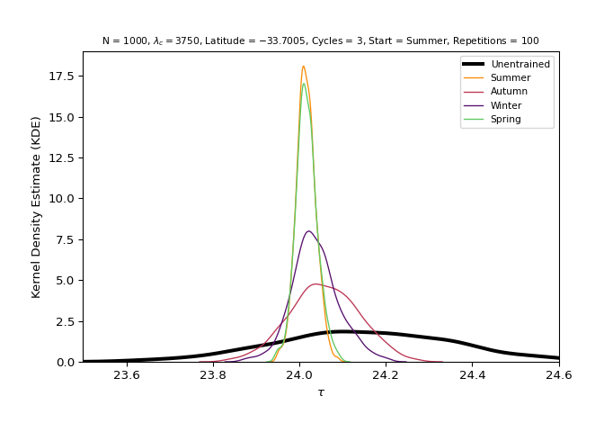
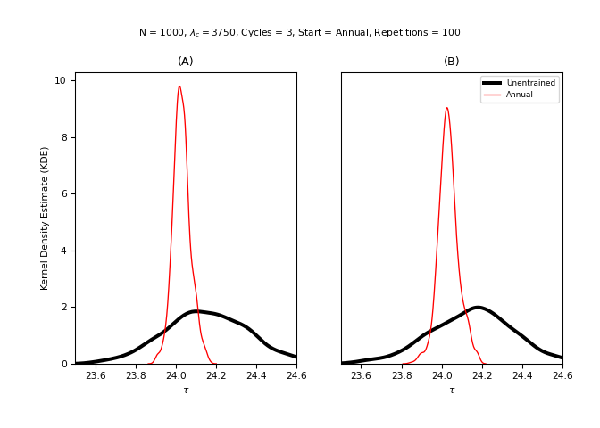
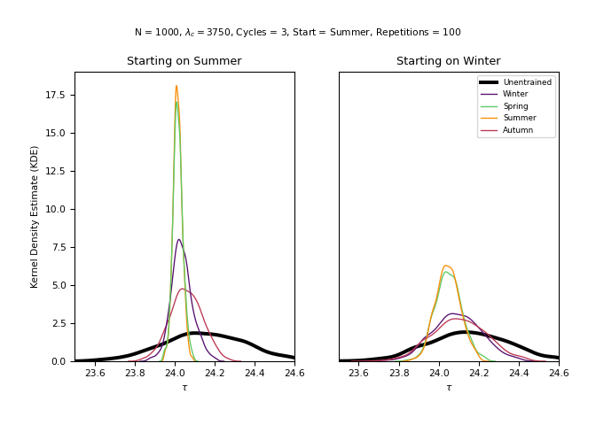

<!-- notable-features.md is generated from notable-features.Rmd. Please edit that file -->

# Notable features

``` python
import entrainment
```

## Seasonal dilation

``` python
turtles = entrainment.run_model(labren_id = 1, by = "season")
```



## Flattening

Due to the axis of rotation and the translational movement of the Earth,
there is a high intensity of solar irradiation in the summer at
latitudes close to the tropics, which causes these populations to adapt
their periods to a greater extent when compared to populations close to
the line from the equator. In terms of the annual average, with the
exception of populations very close to the poles, solar irradiation is
almost the same, since the deficit of solar radiation in winter that
tropical populations may have is compensated by the increase in solar
radiation that these same populations have in summer. This causes them
to differ very little when grouped in this way. Therefore, as shown in
the previous section, that the latitude hypothesis is more present at
certain times of the year and that different resolutions in the analysis
of this phenomenon can bring contrasting results.

``` python
x = entrainment.run_model(labren_id = 72272, by = "year", plot = False)
y = entrainment.run_model(labren_id = 1, by = "year", plot = False)

entrainment.plot_model_line_1_2(x, y)
```



## Graduation

Another notable feature of the model is the gradual adaptation of
periods.

This dynamic is not trivial. The sequence/order of photoperiods appears
to bring about a significant difference in the distribution of circadian
periods at each step. Therefore, even if a population is subjected to a
strong solar zeitgeber at a given moment, the distribution of periods
will always depend on its starting point. In other words, two
populations subjected to the same solar zeitgeber may present different
period distributions due to the exposures to which they were previously
submitted.

This can be observed in the model by subjecting populations with the
same insolation pattern but with cycles ordered differently.

``` python
n = 10**3
lam_c = 3750
labren_id = 1
by = "season"
n_cycles = 3
repetitions = 10**2

x = entrainment.run_model(
    n = n, lam_c = lam_c, labren_id = labren_id, by = by, n_cycles = n_cycles,
    start_at = 0, repetitions = repetitions, plot = False
    )
    
y = entrainment.run_model(
    n = n, lam_c = lam_c, labren_id = labren_id, by = by, n_cycles = n_cycles,
    start_at = 2, repetitions = repetitions, plot = False
    )

entrainment.plot_model_line_1_2(x, y, 0, 2)
```


